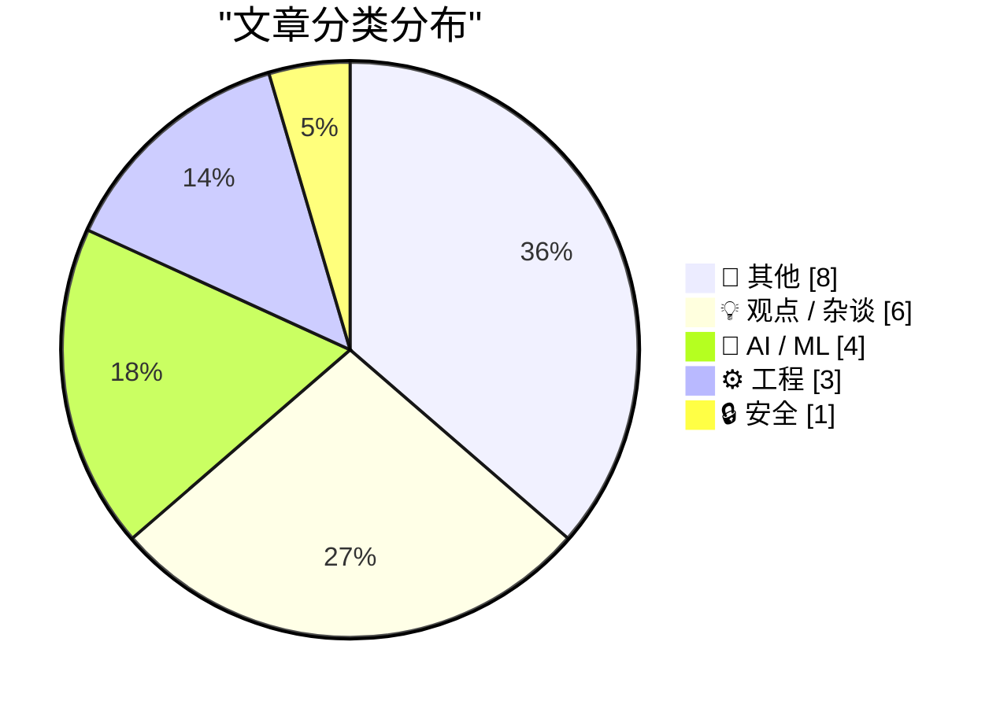
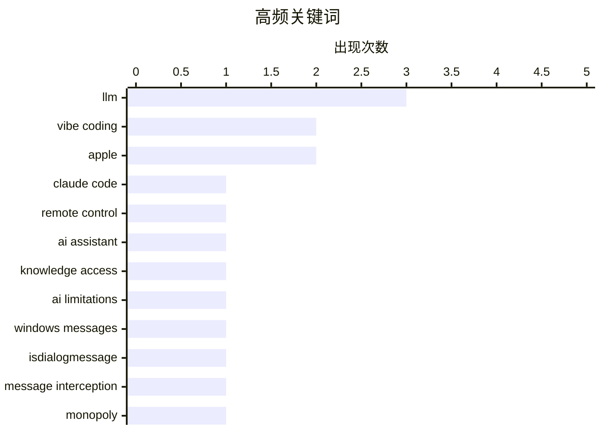

# 📰 AI 博客每日精选 — 2026-02-26

> 来自 Karpathy 推荐的 92 个顶级技术博客，AI 精选 Top 22

## 📝 今日看点

今日技术圈聚焦三大趋势：AI 伦理与监管呼声高涨，从 Gary Marcus 对无约束 AI 发展的“红色警报”到对 vibe coding 催生垃圾邮件的担忧，凸显技术失控风险；开源生态面临新挑战，tldraw 将测试代码闭源引发对知识产权保护与社区信任的讨论；同时，技术代际认知差异显现，老一代追求掌控感，年轻一代倾向效率与乐趣，而平台垄断如“亚马逊税”持续侵蚀市场公平，反映技术演进中的人文张力。

---

## 🏆 今日必读

🥇 **H-Bomb：弗兰克·劳埃德·赖特字体排版之谜**

[Claude Code Remote Control](https://simonwillison.net/2026/Feb/25/claude-code-remote-control/#atom-everything) — simonwillison.net · 7 小时前 · 🤖 AI / ML

> 文章探讨弗兰克·劳埃德·赖特为1933年芝加哥世界博览会设计的‘H-Bomb’字体背后的历史谜团。该字体最初被用于宣传‘原子弹’展览，但赖特本人否认其设计意图与核武器相关，认为这是误解。研究发现，该字体实为赖特为博览会设计的装饰性无衬线字体，其名称源于展览主题而非政治隐喻。文章通过档案资料和专家访谈还原了字体设计背景，澄清了长期存在的误读。

💡 **为什么值得读**: 这是一次对建筑与设计史中一个被误解符号的深入解构，揭示了艺术、历史与公众认知之间的复杂关系。

🏷️ Claude Code, remote control, AI assistant

🥈 **主要糖果品牌正从真巧克力转向‘巧克力味糖果’（实为棕色蜡）**

[When access to knowledge is no longer the limitation](https://idiallo.com/blog/access-to-knowledge-is-no-longer-a-limitation?src=feed) — idiallo.com · 13 小时前 · 🤖 AI / ML

> 文章揭露多家主流糖果品牌如Butterfinger、Baby Ruth、Almond Joy和Rolos正在用‘复合巧克力’涂层替代传统巧克力，这种涂层使用可可粉但用廉价植物油脂肪替代昂贵的可可脂，导致口感和品质下降。Hershey、Ferrero等品牌为应对可可豆短缺和气候变化影响，被迫采用成本更低的替代品，引发消费者对食品真实性的担忧。

💡 **为什么值得读**: 揭示了食品工业为应对气候危机而牺牲产品质量的现实，促使消费者重新审视日常食品的真实成分与可持续性。

🏷️ LLM, knowledge access, AI limitations

🥉 **在 IsDialogMessage 处理前拦截消息**

[Intercepting messages before Is­Dialog­Message can process them](https://devblogs.microsoft.com/oldnewthing/20260225-00/?p=112087) — devblogs.microsoft.com/oldnewthing · 10 小时前 · ⚙️ 工程

> 微软开发博客指出，应在 IsDialogMessage 处理消息前进行拦截和修改，以实现对对话框消息流的完全控制。这种机制可用于实现自定义输入逻辑、无障碍支持或防止特定消息被默认处理。

💡 **为什么值得读**: 对 Windows 应用开发者而言，这是掌握高级消息处理技巧的关键方法，尤其适用于构建无障碍或高度定制化的对话框界面。

🏷️ Windows messages, IsDialogMessage, message interception

---

## 📊 数据概览

| 扫描源 | 抓取文章 | 时间范围 | 精选 |
|:---:|:---:|:---:|:---:|
| 88/92 | 2495 篇 → 22 篇 | 24h | **22 篇** |

### 分类分布



### 高频关键词



<details>
<summary>📈 纯文本关键词图（终端友好）</summary>

```
llm              │ ████████████████████ 3
vibe coding      │ █████████████░░░░░░░ 2
apple            │ █████████████░░░░░░░ 2
claude code      │ ███████░░░░░░░░░░░░░ 1
remote control   │ ███████░░░░░░░░░░░░░ 1
ai assistant     │ ███████░░░░░░░░░░░░░ 1
knowledge access │ ███████░░░░░░░░░░░░░ 1
ai limitations   │ ███████░░░░░░░░░░░░░ 1
windows messages │ ███████░░░░░░░░░░░░░ 1
isdialogmessage  │ ███████░░░░░░░░░░░░░ 1
```

</details>

### 🏷️ 话题标签

**llm**(3) · **vibe coding**(2) · **apple**(2) · claude code(1) · remote control(1) · ai assistant(1) · knowledge access(1) · ai limitations(1) · windows messages(1) · isdialogmessage(1) · message interception(1) · monopoly(1) · amazon tax(1) · economics(1) · presentation app(1) · abstraction(1) · human-machine interaction(1) · ai risk(1) · policy(1) · humanity(1)

---

## 📝 其他

### 1. Book Review: Of Monsters and Mainframes - Barbara Truelove ★★★⯪☆

[Book Review: Of Monsters and Mainframes - Barbara Truelove ★★★⯪☆](https://shkspr.mobi/blog/2026/02/book-review-of-monsters-and-mainframes-barbara-truelove/) — **shkspr.mobi** · 12 小时前 · ⭐ 18/30

> This is fun, silly, charming, and much better than The Murderbot Diaries despite being superficially similar.  Imagine you are an interstellar ship and, of course, your AI is conscious. What would you

🏷️ science fiction, AI consciousness, book review

---

### 2. The Talk Show: ‘Serious Opinionators’

[The Talk Show: ‘Serious Opinionators’](https://daringfireball.net/thetalkshow/2026/02/25/ep-441) — **daringfireball.net** · 3 小时前 · ⭐ 17/30

> Adam Engst returns to the show to talk, in detail, about certain of the UI changes in iOS 26 and Apple’s version 26 OSes overall. In particular, the new Unified view in the Phone app, and the Filter p

🏷️ iOS 26, UI design, Apple

---

### 3. ★ My 2025 Apple Report Card

[★ My 2025 Apple Report Card](https://daringfireball.net/2026/02/my_2025_apple_report_card) — **daringfireball.net** · 8 小时前 · ⭐ 17/30

> A mixed year.

🏷️ Apple, product review, 2025

---

### 4. Bill Gates Apologizes to Foundation Staff Over Epstein Ties

[Bill Gates Apologizes to Foundation Staff Over Epstein Ties](https://www.wsj.com/articles/bill-gates-apologizes-to-foundation-staff-over-epstein-ties-67f39ef5) — **daringfireball.net** · 1 小时前 · ⭐ 16/30

> Emily Glazer, reporting for The Wall Street Journal:


  The billionaire said he met with Epstein starting in 2011, years
after Epstein had pleaded guilty in 2008 to soliciting a minor for
prostitutio

🏷️ Bill Gates, Epstein, controversy

---

### 5. Game designer Sid Meier born Feb. 24, 1954

[Game designer Sid Meier born Feb. 24, 1954](https://dfarq.homeip.net/game-designer-sid-meier-born-feb-24-1954/?utm_source=rss&#038;utm_medium=rss&#038;utm_campaign=game-designer-sid-meier-born-feb-24-1954) — **dfarq.homeip.net** · 13 小时前 · ⭐ 12/30

> Legendary game designer Sid Meier was born February 24, 1954. After creating a run of popular flight simulators in the early and mid 1980s, he shifted to strategy games in the second half of the decad

🏷️ Sid Meier, game design, history

---

### 6. I Am Nothing if Not a Man of Science

[I Am Nothing if Not a Man of Science](https://mastodon.social/@gruber/116131665730352697) — **daringfireball.net** · 10 小时前 · ⭐ 11/30

> After writing a few days ago about the current brouhaha over the severe decline in the edibility of Reese’s Peanut Butter Cups, and linking to Trader Joe’s shade-throwing description of their own, I o

🏷️ Reese's, chocolate quality, consumer experience

---

### 7. ‘H-Bomb: A Frank Lloyd Wright Typographic Mystery’

[‘H-Bomb: A Frank Lloyd Wright Typographic Mystery’](https://www.inconspicuous.info/p/h-bomb-a-frank-lloyd-wright-typographic) — **daringfireball.net** · 1 小时前 · ⭐ 10/30

> When re-hanging signage, “Mind your P’s and Q’s” ought to be “Mind your H’s and S’s”.


 ★

🏷️ typography, Frank Lloyd Wright, design

---

### 8. Major Candy Brands Are Switching From Actual Chocolate to ‘Chocolatey Candy’ (Read: Brown Candle Wax)

[Major Candy Brands Are Switching From Actual Chocolate to ‘Chocolatey Candy’ (Read: Brown Candle Wax)](https://www.jezebel.com/fake-milk-chocolate-replacements-brands-reeses-hershey-ferrero-compound-coating-candy-climate-change) — **daringfireball.net** · 9 小时前 · ⭐ 9/30

> Jim Vorel, writing just yesterday for Jezebel:


  It can be hard to know what exactly to call the substances that
are now found coating many major candy bars such as Butterfinger,
Baby Ruth, Almond J

🏷️ candy, chocolate, food science

---

## 💡 观点 / 杂谈

### 9. 整个经济体都在为亚马逊税买单

[Pluralistic: The whole economy pays the Amazon tax (25 Feb 2026)](https://pluralistic.net/2026/02/25/most-favored-nation/) — **pluralistic.net** · 14 小时前 · ⭐ 24/30

> 作者批判性地指出，消费者无法通过选择其他平台摆脱垄断带来的“亚马逊税”——即平台通过算法和规则将成本转嫁给整个经济体系。文章引用反垄断案例，强调即使不直接支付费用，市场集中化仍导致效率损失和社会成本上升。

🏷️ monopoly, Amazon tax, economics

---

### 10. 人类红色警报？

[Code Red for Humanity?](https://garymarcus.substack.com/p/code-red-for-humanity) — **garymarcus.substack.com** · 6 小时前 · ⭐ 22/30

> Gary Marcus 警告特朗普政府当前政策可能带来灾难性后果，称其为“Code Red for Humanity”。他批评 AI 发展缺乏监管框架，过度依赖黑箱模型将威胁人类长期生存。

🏷️ AI risk, policy, humanity

---

### 11. Vibe coding 正在催生垃圾邮件

[They’re Vibe-Coding Spam Now](https://feed.tedium.co/link/15204/17283566/vibe-coded-email-spam) — **tedium.co** · 11 小时前 · ⭐ 20/30

> 随着编程门槛降低，vibe coding（凭感觉编码）技术被滥用于生成大量自动化垃圾邮件。文章指出，虽然降低了开发难度，但也让恶意行为更易规模化、自动化，带来新的网络安全风险。

🏷️ vibe coding, spam, developer tools

---

### 12. Kellan Elliott-McCrea 谈技术代际认知差异

[Quoting Kellan Elliott-McCrea](https://simonwillison.net/2026/Feb/25/kellan-elliott-mccrea/#atom-everything) — **simonwillison.net** · 21 小时前 · ⭐ 19/30

> Kellan Elliott-McCrea 反思不同世代进入科技行业的动机差异：年轻一代因高薪和编码乐趣入行，而老一代则因追求掌控感。他认为当前技术虽进步，却让这种“agency”感逐渐消失，引发代际间的失落情绪。

🏷️ coding culture, technology trends, career reflection

---

### 13. Everything is awesome (why I'm an optimist)

[Everything is awesome (why I'm an optimist)](https://www.joanwestenberg.com/everything-is-awesome-why-im-an-optimist/) — **joanwestenberg.com** · 23 小时前 · ⭐ 19/30

> February is the month the internet decided we&apos;re all going to die.In the span of about two weeks, Matt Shumer&apos;s Something Big is Happening racked up over 80 million views on X with its breat

🏷️ AI optimism, technology, future

---

### 14. Terry Godier: ‘Phantom Obligation’

[Terry Godier: ‘Phantom Obligation’](https://www.terrygodier.com/phantom-obligation) — **daringfireball.net** · 1 小时前 · ⭐ 16/30

> Terry Godier, in a thoughtful essay on the design of RSS feed readers:


  There’s a particular kind of guilt that visits me when I open my
feed reader after a few days away. It’s not the guilt of hav

🏷️ RSS, feed reader, digital guilt

---

## 🤖 AI / ML

### 15. H-Bomb：弗兰克·劳埃德·赖特字体排版之谜

[Claude Code Remote Control](https://simonwillison.net/2026/Feb/25/claude-code-remote-control/#atom-everything) — **simonwillison.net** · 7 小时前 · ⭐ 25/30

> 文章探讨弗兰克·劳埃德·赖特为1933年芝加哥世界博览会设计的‘H-Bomb’字体背后的历史谜团。该字体最初被用于宣传‘原子弹’展览，但赖特本人否认其设计意图与核武器相关，认为这是误解。研究发现，该字体实为赖特为博览会设计的装饰性无衬线字体，其名称源于展览主题而非政治隐喻。文章通过档案资料和专家访谈还原了字体设计背景，澄清了长期存在的误读。

🏷️ Claude Code, remote control, AI assistant

---

### 16. 主要糖果品牌正从真巧克力转向‘巧克力味糖果’（实为棕色蜡）

[When access to knowledge is no longer the limitation](https://idiallo.com/blog/access-to-knowledge-is-no-longer-a-limitation?src=feed) — **idiallo.com** · 13 小时前 · ⭐ 25/30

> 文章揭露多家主流糖果品牌如Butterfinger、Baby Ruth、Almond Joy和Rolos正在用‘复合巧克力’涂层替代传统巧克力，这种涂层使用可可粉但用廉价植物油脂肪替代昂贵的可可脂，导致口感和品质下降。Hershey、Ferrero等品牌为应对可可豆短缺和气候变化影响，被迫采用成本更低的替代品，引发消费者对食品真实性的担忧。

🏷️ LLM, knowledge access, AI limitations

---

### 17. 我用 vibe coding 打造理想中的 macOS 演示应用

[I vibe coded my dream macOS presentation app](https://simonwillison.net/2026/Feb/25/present/#atom-everything) — **simonwillison.net** · 8 小时前 · ⭐ 23/30

> Simon Willison 在 Social Science FOO Camp 发表题为《LLM 现状：2026年2月版》的即兴演讲，并连夜用 vibe coding 方式开发了一个定制化的 macOS 演示应用。该应用展示了 LLM 在快速原型开发中的强大能力，实现了从构思到可运行应用的极速构建。

🏷️ LLM, vibe coding, presentation app

---

### 18. 迷失自我：语言抽象与机器本质的哲学之辩

[Greg Knauss: ‘Lose Myself’](https://www.eod.com/blog/2026/02/lose-myself/) — **daringfireball.net** · 2 小时前 · ⭐ 22/30

> Greg Knauss 反驳“用英语与 LLM 交互只是更高级抽象”的观点，认为工业化带来的抽象层（如语言模型）已根本改变人机交互方式，其影响堪比工厂取代手工制作。他主张应关注抽象带来的新可能性，而非执着于底层物理细节。

🏷️ LLM, abstraction, human-machine interaction

---

## ⚙️ 工程

### 19. 在 IsDialogMessage 处理前拦截消息

[Intercepting messages before Is­Dialog­Message can process them](https://devblogs.microsoft.com/oldnewthing/20260225-00/?p=112087) — **devblogs.microsoft.com/oldnewthing** · 10 小时前 · ⭐ 25/30

> 微软开发博客指出，应在 IsDialogMessage 处理消息前进行拦截和修改，以实现对对话框消息流的完全控制。这种机制可用于实现自定义输入逻辑、无障碍支持或防止特定消息被默认处理。

🏷️ Windows messages, IsDialogMessage, message interception

---

### 20. tldraw 将测试代码移至闭源仓库引争议

[tldraw issue: Move tests to closed source repo](https://simonwillison.net/2026/Feb/25/closed-tests/#atom-everything) — **simonwillison.net** · 4 小时前 · ⭐ 21/30

> 开源项目 tldraw 考虑将测试套件移至闭源仓库，引发社区担忧。作者指出，完整的测试集已足以让他人从零重写整个库，这可能威胁依赖测试集进行逆向工程的商业模型。此举暴露了开源项目在知识产权保护上的新挑战。

🏷️ tldraw, test suite, open source

---

### 21. Trig of inverse trig

[Trig of inverse trig](https://www.johndcook.com/blog/2026/02/25/trig-of-inverse-trig/) — **johndcook.com** · 14 小时前 · ⭐ 19/30

> I ran across an old article [1] that gave a sort of multiplication table for trig functions and inverse trig functions. Here’s my version of the table. I made a few changes from the original. First, I

🏷️ trigonometry, inverse trig, mathematics

---

## 🔒 安全

### 22. Samsung Galaxy S26 Ultra’s Privacy Display

[Samsung Galaxy S26 Ultra’s Privacy Display](https://9to5google.com/2026/02/25/samsung-galaxy-s26-ultra-privacy-display-demo-hands-on/) — **daringfireball.net** · 4 小时前 · ⭐ 17/30

> Ben Schoon, writing for 9to5 Google:


  When activated, Privacy Display changes how the pixels in your
display emit light, making it harder or near-impossible to view
the display at an off-angle. At 

🏷️ privacy display, Samsung, screen visibility

---

*生成于 2026-02-26 01:18 | 扫描 88 源 → 获取 2495 篇 → 精选 22 篇*
*基于 [Hacker News Popularity Contest 2025](https://refactoringenglish.com/tools/hn-popularity/) RSS 源列表，由 [Andrej Karpathy](https://x.com/karpathy) 推荐*
*由「懂点儿AI」制作，欢迎关注同名微信公众号获取更多 AI 实用技巧 💡*
