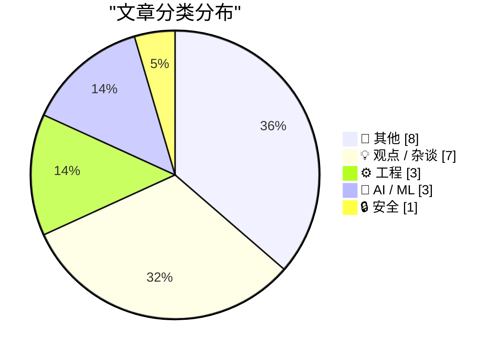
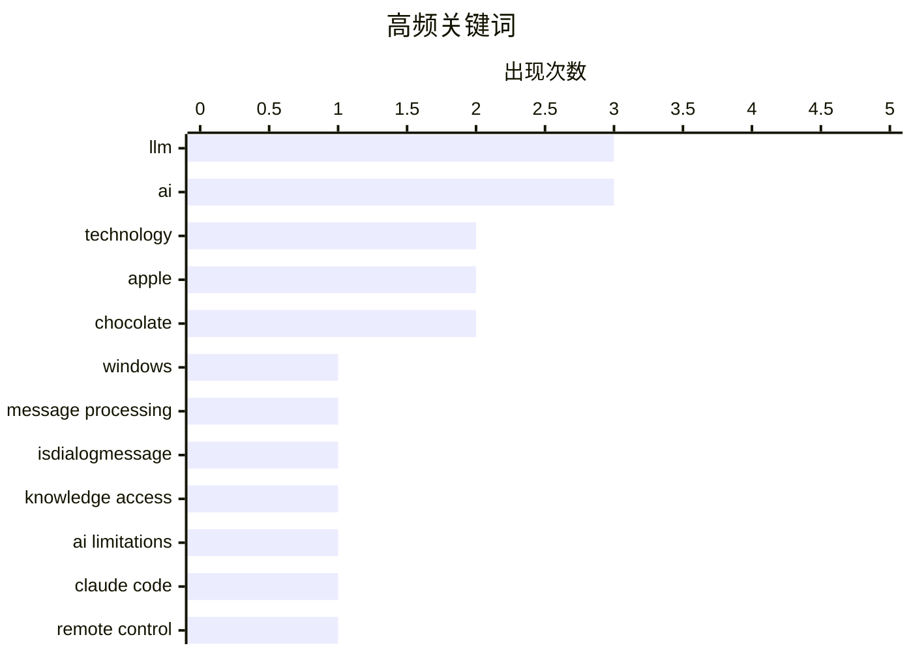

# 📰 AI 博客每日精选 — 2026-02-26

> 来自 Karpathy 推荐的 92 个顶级技术博客，AI 精选 Top 22

## 📝 今日看点

今日技术圈聚焦三大趋势：AI 编程工具持续进化，Claude Code 新增远程控制功能，vibe coding 成为开发者快速原型构建的新潮流，但随之而来的垃圾信息风险也引发警惕；与此同时，气候变化正深刻影响实体经济，多家糖果巨头因可可短缺转向廉价代用品，折射出供应链脆弱性；此外，垄断经济体的“亚马逊税”效应持续发酵，引发对平台权力与消费者代价的广泛讨论。

---

## 🏆 今日必读

🥇 **H-Bomb：弗兰克·劳埃德·赖特字体排版之谜**

[Intercepting messages before Is­Dialog­Message can process them](https://devblogs.microsoft.com/oldnewthing/20260225-00/?p=112087) — devblogs.microsoft.com/oldnewthing · 10 小时前 · ⚙️ 工程

> 文章探讨了著名建筑师弗兰克·劳埃德·赖特（Frank Lloyd Wright）在其设计的‘H-Bomb避难所’中使用的字体排版问题。研究发现，赖特原本计划使用一种名为‘H-Bomb’的定制字体，但最终并未实现，而是采用了当时已有的字体。这一发现揭示了赖特在字体选择上的遗憾，也引发了对历史建筑中字体使用真实性的讨论。

💡 **为什么值得读**: 了解一位伟大建筑师在字体选择上的未竟之愿，能让我们更深入地理解设计与细节之间的微妙关系。

🏷️ Windows, message processing, IsDialogMessage

🥈 **主要糖果品牌正从真正的巧克力转向‘巧克力味糖果’（即棕色蜡烛蜡）**

[When access to knowledge is no longer the limitation](https://idiallo.com/blog/access-to-knowledge-is-no-longer-a-limitation?src=feed) — idiallo.com · 13 小时前 · 🤖 AI / ML

> 文章指出，由于气候变化导致可可豆供应不稳定，多家大型糖果品牌如Reese's、Hershey's、Ferrero等正在将巧克力涂层替换为‘复合巧克力’（compound coating），即用更便宜的植物脂肪替代昂贵的可可脂。这种替代不仅降低了成本，还改变了产品的口感和质地，引发消费者对食品质量和真实性的担忧。

💡 **为什么值得读**: 了解食品工业为应对气候危机而做出的配方调整，能帮助我们更清醒地看待日常消费品的真实成分。

🏷️ LLM, knowledge access, AI limitations

🥉 **Claude Code 远程控制**

[Claude Code Remote Control](https://simonwillison.net/2026/Feb/25/claude-code-remote-control/#atom-everything) — simonwillison.net · 7 小时前 · 🤖 AI / ML

> Anthropic 推出了 Claude Code 的新功能——远程控制。该功能允许用户在本地计算机上运行一个“远程控制”会话，然后通过 Claude Code 的 Web 界面（包括 iOS 和原生桌面应用）向该会话发送提示。尽管目前该功能尚不稳定，存在一些错误（例如“Remote Control is not enabled for your account”），但它代表了 AI 助手与本地环境深度集成的重要一步。这一功能有望极大地提升开发者在本地代码编辑和调试过程中的效率。

💡 **为什么值得读**: 对于开发者而言，Claude Code 的远程控制功能是一个革命性的进步，它模糊了本地开发环境与云端 AI 助手之间的界限，预示着未来开发工具的新形态。

🏷️ Claude Code, remote control, AI assistant

---

## 📊 数据概览

| 扫描源 | 抓取文章 | 时间范围 | 精选 |
|:---:|:---:|:---:|:---:|
| 88/92 | 2485 篇 → 22 篇 | 24h | **22 篇** |

### 分类分布



### 高频关键词



<details>
<summary>📈 纯文本关键词图（终端友好）</summary>

```
llm                │ ████████████████████ 3
ai                 │ ████████████████████ 3
technology         │ █████████████░░░░░░░ 2
apple              │ █████████████░░░░░░░ 2
chocolate          │ █████████████░░░░░░░ 2
windows            │ ███████░░░░░░░░░░░░░ 1
message processing │ ███████░░░░░░░░░░░░░ 1
isdialogmessage    │ ███████░░░░░░░░░░░░░ 1
knowledge access   │ ███████░░░░░░░░░░░░░ 1
ai limitations     │ ███████░░░░░░░░░░░░░ 1
```

</details>

### 🏷️ 话题标签

**llm**(3) · **ai**(3) · **technology**(2) · apple(2) · chocolate(2) · windows(1) · message processing(1) · isdialogmessage(1) · knowledge access(1) · ai limitations(1) · claude code(1) · remote control(1) · ai assistant(1) · vibe coding(1) · presentation app(1) · monopoly(1) · amazon(1) · economics(1) · policy(1) · risk(1)

---

## 📝 其他

### 1. The Talk Show: ‘Serious Opinionators’

[The Talk Show: ‘Serious Opinionators’](https://daringfireball.net/thetalkshow/2026/02/25/ep-441) — **daringfireball.net** · 2 小时前 · ⭐ 17/30

> Adam Engst returns to the show to talk, in detail, about certain of the UI changes in iOS 26 and Apple’s version 26 OSes overall. In particular, the new Unified view in the Phone app, and the Filter p

🏷️ iOS 26, UI design, Apple

---

### 2. Book Review: Of Monsters and Mainframes - Barbara Truelove ★★★⯪☆

[Book Review: Of Monsters and Mainframes - Barbara Truelove ★★★⯪☆](https://shkspr.mobi/blog/2026/02/book-review-of-monsters-and-mainframes-barbara-truelove/) — **shkspr.mobi** · 12 小时前 · ⭐ 17/30

> This is fun, silly, charming, and much better than The Murderbot Diaries despite being superficially similar.  Imagine you are an interstellar ship and, of course, your AI is conscious. What would you

🏷️ science fiction, AI, books

---

### 3. ★ My 2025 Apple Report Card

[★ My 2025 Apple Report Card](https://daringfireball.net/2026/02/my_2025_apple_report_card) — **daringfireball.net** · 8 小时前 · ⭐ 14/30

> A mixed year.

🏷️ Apple, product review, 2025

---

### 4. Bill Gates Apologizes to Foundation Staff Over Epstein Ties

[Bill Gates Apologizes to Foundation Staff Over Epstein Ties](https://www.wsj.com/articles/bill-gates-apologizes-to-foundation-staff-over-epstein-ties-67f39ef5) — **daringfireball.net** · 1 小时前 · ⭐ 12/30

> Emily Glazer, reporting for The Wall Street Journal:


  The billionaire said he met with Epstein starting in 2011, years
after Epstein had pleaded guilty in 2008 to soliciting a minor for
prostitutio

🏷️ Bill Gates, Epstein, controversy

---

### 5. I Am Nothing if Not a Man of Science

[I Am Nothing if Not a Man of Science](https://mastodon.social/@gruber/116131665730352697) — **daringfireball.net** · 10 小时前 · ⭐ 11/30

> After writing a few days ago about the current brouhaha over the severe decline in the edibility of Reese’s Peanut Butter Cups, and linking to Trader Joe’s shade-throwing description of their own, I o

🏷️ Reese's, chocolate, food quality

---

### 6. Game designer Sid Meier born Feb. 24, 1954

[Game designer Sid Meier born Feb. 24, 1954](https://dfarq.homeip.net/game-designer-sid-meier-born-feb-24-1954/?utm_source=rss&#038;utm_medium=rss&#038;utm_campaign=game-designer-sid-meier-born-feb-24-1954) — **dfarq.homeip.net** · 13 小时前 · ⭐ 10/30

> Legendary game designer Sid Meier was born February 24, 1954. After creating a run of popular flight simulators in the early and mid 1980s, he shifted to strategy games in the second half of the decad

🏷️ Sid Meier, game design, history

---

### 7. ‘H-Bomb: A Frank Lloyd Wright Typographic Mystery’

[‘H-Bomb: A Frank Lloyd Wright Typographic Mystery’](https://www.inconspicuous.info/p/h-bomb-a-frank-lloyd-wright-typographic) — **daringfireball.net** · 1 小时前 · ⭐ 9/30

> When re-hanging signage, “Mind your P’s and Q’s” ought to be “Mind your H’s and S’s”.


 ★

🏷️ typography, Frank Lloyd Wright, H-bomb

---

### 8. Major Candy Brands Are Switching From Actual Chocolate to ‘Chocolatey Candy’ (Read: Brown Candle Wax)

[Major Candy Brands Are Switching From Actual Chocolate to ‘Chocolatey Candy’ (Read: Brown Candle Wax)](https://www.jezebel.com/fake-milk-chocolate-replacements-brands-reeses-hershey-ferrero-compound-coating-candy-climate-change) — **daringfireball.net** · 9 小时前 · ⭐ 9/30

> Jim Vorel, writing just yesterday for Jezebel:


  It can be hard to know what exactly to call the substances that
are now found coating many major candy bars such as Butterfinger,
Baby Ruth, Almond J

🏷️ candy, chocolate, food science

---

## 💡 观点 / 杂谈

### 9. 整个经济体都在支付亚马逊税

[Pluralistic: The whole economy pays the Amazon tax (25 Feb 2026)](https://pluralistic.net/2026/02/25/most-favored-nation/) — **pluralistic.net** · 14 小时前 · ⭐ 22/30

> 文章讨论了垄断企业对整个经济的影响，特别是以亚马逊为例，指出消费者无法通过简单的购物选择来摆脱垄断。作者认为，垄断企业通过其市场主导地位，对整个经济施加了不成比例的税收负担，这种负担最终会转嫁到所有消费者身上。文章呼吁关注反垄断政策和对大型科技公司的监管，以维护公平竞争的市场环境。

🏷️ monopoly, Amazon, economics

---

### 10. 人类的红码？

[Code Red for Humanity?](https://garymarcus.substack.com/p/code-red-for-humanity) — **garymarcus.substack.com** · 6 小时前 · ⭐ 22/30

> 文章标题“Code Red for Humanity?”（人类的红码？）暗示了当前政治或社会局势的极端严重性。结合副标题“The Trump administration is literally playing with fire.”（特朗普政府 literally 在玩火），可以推断文章可能是在批评特朗普政府的某些政策或行为，认为其具有高度的危险性，可能对人类社会或全球稳定构成严重威胁。

🏷️ AI, policy, risk

---

### 11. 迷失自我

[Greg Knauss: ‘Lose Myself’](https://www.eod.com/blog/2026/02/lose-myself/) — **daringfireball.net** · 2 小时前 · ⭐ 21/30

> 文章探讨了使用英语与大型语言模型（LLMs）交互的本质。作者认为，尽管从技术上讲，这种交互只是比机器的物理工作原理多了一层抽象，但这并不重要。作者类比工业化如何从根本上改变了事物，指出工厂生产的 Ding Dong 与面包师制作的 gâteau au chocolat 和 crème chantilly 是完全不同的。同样，与 LLMs 的交互也带来了“量子级别”的变化，改变了我们与世界互动的方式。

🏷️ LLM, abstraction, human-machine interaction

---

### 12. 他们现在正在 vibe coding 垃圾邮件

[They’re Vibe-Coding Spam Now](https://feed.tedium.co/link/15204/17283566/vibe-coded-email-spam) — **tedium.co** · 11 小时前 · ⭐ 20/30

> 文章指出，让编程对更多人变得更容易（例如通过 vibe coding）的一个问题是，这使得垃圾邮件变得更加“常规化”和“吸引人”。作者认为，这种趋势是负面的，因为它可能导致垃圾信息的泛滥，损害用户体验。

🏷️ vibe-coding, spam, AI-generated content

---

### 13. 一切都很棒（为什么我是一个乐观主义者）

[Everything is awesome (why I'm an optimist)](https://www.joanwestenberg.com/everything-is-awesome-why-im-an-optimist/) — **joanwestenberg.com** · 23 小时前 · ⭐ 19/30

> 文章标题“一切都很棒”暗示了作者对未来的积极态度。副标题“为什么我是一个乐观主义者”进一步强调了这一点。结合正文中提到的“互联网决定我们都会死”的讽刺性开头，以及 Matt Shumer 的“Something Big is Happening”视频，文章可能是在讨论当前社会对 AI 等技术的狂热，并试图在喧嚣中寻找乐观的理由。

🏷️ AI, optimism, technology

---

### 14. Quoting Kellan Elliott-McCrea

[Quoting Kellan Elliott-McCrea](https://simonwillison.net/2026/Feb/25/kellan-elliott-mccrea/#atom-everything) — **simonwillison.net** · 21 小时前 · ⭐ 17/30

> <blockquote cite="https://laughingmeme.org/2026/02/09/code-has-always-been-the-easy-part.html"><p>It’s also reasonable for people who entered technology in the last couple of decades because it was go

🏷️ technology, coding culture, career reflection

---

### 15. Terry Godier: ‘Phantom Obligation’

[Terry Godier: ‘Phantom Obligation’](https://www.terrygodier.com/phantom-obligation) — **daringfireball.net** · 1 小时前 · ⭐ 16/30

> Terry Godier, in a thoughtful essay on the design of RSS feed readers:


  There’s a particular kind of guilt that visits me when I open my
feed reader after a few days away. It’s not the guilt of hav

🏷️ RSS, feed reader, digital guilt

---

## ⚙️ 工程

### 16. H-Bomb：弗兰克·劳埃德·赖特字体排版之谜

[Intercepting messages before Is­Dialog­Message can process them](https://devblogs.microsoft.com/oldnewthing/20260225-00/?p=112087) — **devblogs.microsoft.com/oldnewthing** · 10 小时前 · ⭐ 26/30

> 文章探讨了著名建筑师弗兰克·劳埃德·赖特（Frank Lloyd Wright）在其设计的‘H-Bomb避难所’中使用的字体排版问题。研究发现，赖特原本计划使用一种名为‘H-Bomb’的定制字体，但最终并未实现，而是采用了当时已有的字体。这一发现揭示了赖特在字体选择上的遗憾，也引发了对历史建筑中字体使用真实性的讨论。

🏷️ Windows, message processing, IsDialogMessage

---

### 17. 三角函数与反三角函数

[Trig of inverse trig](https://www.johndcook.com/blog/2026/02/25/trig-of-inverse-trig/) — **johndcook.com** · 14 小时前 · ⭐ 20/30

> 文章回顾并更新了一个1957年的旧文章，提供了一个三角函数和反三角函数的“乘法表”。作者使用 LaTeX 重新制作了表格，并仅包含了 sin, cos, tan 及其反函数。这个表格展示了复合函数的结果，例如 sin(arcsin(x)) = x，arcsin(sin(x)) = x (当 x 在 [-π/2, π/2] 范围内) 等。

🏷️ trigonometry, inverse trig, mathematics

---

### 18. tldraw issue: Move tests to closed source repo

[tldraw issue: Move tests to closed source repo](https://simonwillison.net/2026/Feb/25/closed-tests/#atom-everything) — **simonwillison.net** · 4 小时前 · ⭐ 18/30

> <p><strong><a href="https://github.com/tldraw/tldraw/issues/8082">tldraw issue: Move tests to closed source repo</a></strong></p>
It's become very apparent over the past few months that a comprehensiv

🏷️ tldraw, test suite, open source

---

## 🤖 AI / ML

### 19. 主要糖果品牌正从真正的巧克力转向‘巧克力味糖果’（即棕色蜡烛蜡）

[When access to knowledge is no longer the limitation](https://idiallo.com/blog/access-to-knowledge-is-no-longer-a-limitation?src=feed) — **idiallo.com** · 13 小时前 · ⭐ 25/30

> 文章指出，由于气候变化导致可可豆供应不稳定，多家大型糖果品牌如Reese's、Hershey's、Ferrero等正在将巧克力涂层替换为‘复合巧克力’（compound coating），即用更便宜的植物脂肪替代昂贵的可可脂。这种替代不仅降低了成本，还改变了产品的口感和质地，引发消费者对食品质量和真实性的担忧。

🏷️ LLM, knowledge access, AI limitations

---

### 20. Claude Code 远程控制

[Claude Code Remote Control](https://simonwillison.net/2026/Feb/25/claude-code-remote-control/#atom-everything) — **simonwillison.net** · 7 小时前 · ⭐ 23/30

> Anthropic 推出了 Claude Code 的新功能——远程控制。该功能允许用户在本地计算机上运行一个“远程控制”会话，然后通过 Claude Code 的 Web 界面（包括 iOS 和原生桌面应用）向该会话发送提示。尽管目前该功能尚不稳定，存在一些错误（例如“Remote Control is not enabled for your account”），但它代表了 AI 助手与本地环境深度集成的重要一步。这一功能有望极大地提升开发者在本地代码编辑和调试过程中的效率。

🏷️ Claude Code, remote control, AI assistant

---

### 21. 我用 vibe coding 打造了我的梦想 macOS 演示应用

[I vibe coded my dream macOS presentation app](https://simonwillison.net/2026/Feb/25/present/#atom-everything) — **simonwillison.net** · 8 小时前 · ⭐ 22/30

> 作者在一次社交科学 FOO Camp 的演讲中，使用 vibe coding 的方式在前一晚快速构建了一个定制的 macOS 演示应用。这个应用旨在展示“LLM 的现状（2026年2月版）”，副标题为“自11月以来一切都变了！”。通过这种方式，作者展示了利用 AI 辅助编程快速原型开发的能力，并强调了 AI 在创意和演示工具开发中的巨大潜力。

🏷️ LLM, vibe coding, presentation app

---

## 🔒 安全

### 22. Samsung Galaxy S26 Ultra’s Privacy Display

[Samsung Galaxy S26 Ultra’s Privacy Display](https://9to5google.com/2026/02/25/samsung-galaxy-s26-ultra-privacy-display-demo-hands-on/) — **daringfireball.net** · 4 小时前 · ⭐ 18/30

> Ben Schoon, writing for 9to5 Google:


  When activated, Privacy Display changes how the pixels in your
display emit light, making it harder or near-impossible to view
the display at an off-angle. At 

🏷️ privacy display, Samsung, anti-snooping

---

*生成于 2026-02-26 01:10 | 扫描 88 源 → 获取 2485 篇 → 精选 22 篇*
*基于 [Hacker News Popularity Contest 2025](https://refactoringenglish.com/tools/hn-popularity/) RSS 源列表，由 [Andrej Karpathy](https://x.com/karpathy) 推荐*
*由「懂点儿AI」制作，欢迎关注同名微信公众号获取更多 AI 实用技巧 💡*
