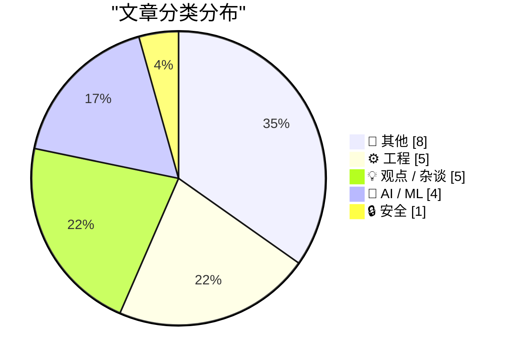
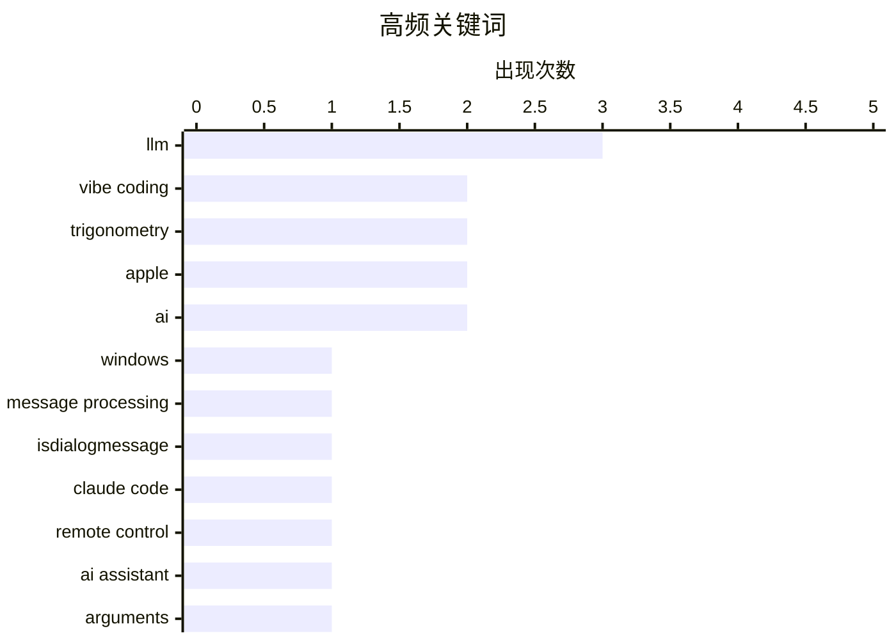

# 📰 AI 博客每日精选 — 2026-02-26

> 来自 Karpathy 推荐的 92 个顶级技术博客，AI 精选 Top 23

## 📝 今日看点

今日技术圈聚焦三大趋势：AI 开发正加速向“vibe coding”等高效范式演进，开发者借助生成式模型快速构建原型；开源生态面临信任与商业化的深层矛盾，如 tldraw 测试代码闭源引发对社区透明度的担忧；同时，科技伦理与政策风险受到广泛关注，从垄断平台成本转嫁到政治干预科技发展，业界呼吁更审慎的治理框架。

---

## 🏆 今日必读

### 🥇 我若非科学之人，便一无是处

- **来源**: [devblogs.microsoft.com/oldnewthing](https://devblogs.microsoft.com/oldnewthing/20260225-00/?p=112087)
- **时间**: 10 小时前
- **分类**: ⚙️ 工程

> 作者为科学精神亲自试吃Trader Joe's的Reese's花生酱杯，对比Hershey同类产品。测试结果显示，Trader Joe's的牛奶巧克力与黑巧克力版本口感接近真实巧克力，花生酱质地顺滑，远优于Hershey填充物那种沙砾感与锯末般的劣质口感。作者认为这是对消费者味觉的尊重。

**💡 为什么值得读**: 这是一次以科学态度进行的真实味觉评测，揭示了主流糖果品牌为降低成本而牺牲品质的现实，值得对食品工业与消费体验感兴趣的读者关注。

**🏷️ 标签**: Windows, message processing, IsDialogMessage

---

### 🥈 游戏设计师席德·梅尔出生于1954年2月24日

- **来源**: [simonwillison.net](https://simonwillison.net/2026/Feb/25/claude-code-remote-control/#atom-everything)
- **时间**: 8 小时前
- **分类**: 🤖 AI / ML

> 传奇游戏设计师席德·梅尔（Sid Meier）于1954年2月24日出生。他在1980年代早期和中期开发了多款受欢迎的飞行模拟器，随后在1980年代后期转向策略游戏创作，推出了《文明》系列等经典作品。

**💡 为什么值得读**: 了解席德·梅尔这位策略游戏之父的生平，是理解现代电子游戏设计演变的重要起点。

**🏷️ 标签**: Claude Code, remote control, AI assistant

---

### 🥉 主要糖果品牌正从真正的巧克力转向‘巧克力味糖果’（即棕色蜡烛蜡）

- **来源**: [idiallo.com](https://idiallo.com/blog/access-to-knowledge-is-no-longer-a-limitation?src=feed)
- **时间**: 13 小时前
- **分类**: 🤖 AI / ML

> 多家主流糖果品牌如Butterfinger、Baby Ruth、Almond Joy、Mr. Goodbar和Rolos正在使用‘复合巧克力’涂层，这种涂层由可可粉制成，但用更便宜、质量更低的植物油脂肪替代昂贵的可可脂。食品科学家指出，这种替代导致产品口感像蜡烛蜡，严重损害了消费者体验。

**💡 为什么值得读**: 该文揭示了食品工业为应对气候变化和成本压力而牺牲产品质量的普遍现象，对关注食品安全与消费者权益的读者具有重要警示意义。

**🏷️ 标签**: LLM, arguments, critical thinking

---

## 📊 数据概览

| 扫描源 | 抓取文章 | 时间范围 | 精选 |
|:---:|:---:|:---:|:---:|
| 88/92 | 2495 篇 → 23 篇 | 24h | **23 篇** |

### 分类分布



### 高频关键词



<details>
<summary>📈 纯文本关键词图（终端友好）</summary>

```
llm                │ ████████████████████ 3
vibe coding        │ █████████████░░░░░░░ 2
trigonometry       │ █████████████░░░░░░░ 2
apple              │ █████████████░░░░░░░ 2
ai                 │ █████████████░░░░░░░ 2
windows            │ ███████░░░░░░░░░░░░░ 1
message processing │ ███████░░░░░░░░░░░░░ 1
isdialogmessage    │ ███████░░░░░░░░░░░░░ 1
claude code        │ ███████░░░░░░░░░░░░░ 1
remote control     │ ███████░░░░░░░░░░░░░ 1
```

</details>

### 🏷️ 话题标签

**llm**(3) · **vibe coding**(2) · **trigonometry**(2) · apple(2) · ai(2) · windows(1) · message processing(1) · isdialogmessage(1) · claude code(1) · remote control(1) · ai assistant(1) · arguments(1) · critical thinking(1) · monopoly(1) · amazon(1) · economy(1) · presentation app(1) · language models(1) · human interaction(1) · trump(1)

---

## 📝 其他

### 1. The Talk Show: ‘Serious Opinionators’

- **链接**: [The Talk Show: ‘Serious Opinionators’](https://daringfireball.net/thetalkshow/2026/02/25/ep-441)
- **来源**: daringfireball.net
- **时间**: 3 小时前
- **评分**: ⭐ 19/30

> Adam Engst returns to the show to talk, in detail, about certain of the UI changes in iOS 26 and Apple’s version 26 OSes overall. In particular, the new Unified view in the Phone app, and the Filter p

**🏷️ 标签**: iOS 26, UI design, Apple

---

### 2. Book Review: Of Monsters and Mainframes - Barbara Truelove ★★★⯪☆

- **链接**: [Book Review: Of Monsters and Mainframes - Barbara Truelove ★★★⯪☆](https://shkspr.mobi/blog/2026/02/book-review-of-monsters-and-mainframes-barbara-truelove/)
- **来源**: shkspr.mobi
- **时间**: 13 小时前
- **评分**: ⭐ 16/30

> This is fun, silly, charming, and much better than The Murderbot Diaries despite being superficially similar.  Imagine you are an interstellar ship and, of course, your AI is conscious. What would you

**🏷️ 标签**: science fiction, AI, book review

---

### 3. Bill Gates Apologizes to Foundation Staff Over Epstein Ties

- **链接**: [Bill Gates Apologizes to Foundation Staff Over Epstein Ties](https://www.wsj.com/articles/bill-gates-apologizes-to-foundation-staff-over-epstein-ties-67f39ef5)
- **来源**: daringfireball.net
- **时间**: 1 小时前
- **评分**: ⭐ 15/30

> Emily Glazer, reporting for The Wall Street Journal:


  The billionaire said he met with Epstein starting in 2011, years
after Epstein had pleaded guilty in 2008 to soliciting a minor for
prostitutio

**🏷️ 标签**: Bill Gates, Epstein, controversy

---

### 4. ★ My 2025 Apple Report Card

- **链接**: [★ My 2025 Apple Report Card](https://daringfireball.net/2026/02/my_2025_apple_report_card)
- **来源**: daringfireball.net
- **时间**: 8 小时前
- **评分**: ⭐ 14/30

> A mixed year.

**🏷️ 标签**: Apple, product review, 2025

---

### 5. ‘H-Bomb: A Frank Lloyd Wright Typographic Mystery’

- **链接**: [‘H-Bomb: A Frank Lloyd Wright Typographic Mystery’](https://www.inconspicuous.info/p/h-bomb-a-frank-lloyd-wright-typographic)
- **来源**: daringfireball.net
- **时间**: 1 小时前
- **评分**: ⭐ 12/30

> When re-hanging signage, “Mind your P’s and Q’s” ought to be “Mind your H’s and S’s”.


 ★

**🏷️ 标签**: typography, Frank Lloyd Wright, design

---

### 6. I Am Nothing if Not a Man of Science

- **链接**: [I Am Nothing if Not a Man of Science](https://mastodon.social/@gruber/116131665730352697)
- **来源**: daringfireball.net
- **时间**: 11 小时前
- **评分**: ⭐ 11/30

> After writing a few days ago about the current brouhaha over the severe decline in the edibility of Reese’s Peanut Butter Cups, and linking to Trader Joe’s shade-throwing description of their own, I o

**🏷️ 标签**: Reese's, food quality, personal experiment

---

### 7. Game designer Sid Meier born Feb. 24, 1954

- **链接**: [Game designer Sid Meier born Feb. 24, 1954](https://dfarq.homeip.net/game-designer-sid-meier-born-feb-24-1954/?utm_source=rss&#038;utm_medium=rss&#038;utm_campaign=game-designer-sid-meier-born-feb-24-1954)
- **来源**: dfarq.homeip.net
- **时间**: 13 小时前
- **评分**: ⭐ 10/30

> Legendary game designer Sid Meier was born February 24, 1954. After creating a run of popular flight simulators in the early and mid 1980s, he shifted to strategy games in the second half of the decad

**🏷️ 标签**: Sid Meier, game design, strategy games, history

---

### 8. Major Candy Brands Are Switching From Actual Chocolate to ‘Chocolatey Candy’ (Read: Brown Candle Wax)

- **链接**: [Major Candy Brands Are Switching From Actual Chocolate to ‘Chocolatey Candy’ (Read: Brown Candle Wax)](https://www.jezebel.com/fake-milk-chocolate-replacements-brands-reeses-hershey-ferrero-compound-coating-candy-climate-change)
- **来源**: daringfireball.net
- **时间**: 10 小时前
- **评分**: ⭐ 8/30

> Jim Vorel, writing just yesterday for Jezebel:


  It can be hard to know what exactly to call the substances that
are now found coating many major candy bars such as Butterfinger,
Baby Ruth, Almond J

**🏷️ 标签**: candy, chocolate, food science

---

## ⚙️ 工程

### 9. 我若非科学之人，便一无是处

- **链接**: [Intercepting messages before Is­Dialog­Message can process them](https://devblogs.microsoft.com/oldnewthing/20260225-00/?p=112087)
- **来源**: devblogs.microsoft.com/oldnewthing
- **时间**: 10 小时前
- **评分**: ⭐ 26/30

> 作者为科学精神亲自试吃Trader Joe's的Reese's花生酱杯，对比Hershey同类产品。测试结果显示，Trader Joe's的牛奶巧克力与黑巧克力版本口感接近真实巧克力，花生酱质地顺滑，远优于Hershey填充物那种沙砾感与锯末般的劣质口感。作者认为这是对消费者味觉的尊重。

**🏷️ 标签**: Windows, message processing, IsDialogMessage

---

### 10. tldraw 将测试代码移至闭源仓库的争议

- **链接**: [tldraw issue: Move tests to closed source repo](https://simonwillison.net/2026/Feb/25/closed-tests/#atom-everything)
- **来源**: simonwillison.net
- **时间**: 4 小时前
- **评分**: ⭐ 21/30

> 开源项目 tldraw 考虑将测试套件移至闭源仓库，引发社区担忧。作者指出，完整的测试集已足以让他人从零重写整个库，这可能威胁到依赖测试集的开源项目商业模型。此举暴露了开源项目在知识产权保护与社区信任之间的两难。

**🏷️ 标签**: tldraw, testing, open source

---

### 11. 双曲函数版本的最新文章整理

- **链接**: [Hyperbolic versions of latest posts](https://www.johndcook.com/blog/2026/02/25/hyperbolic-versions-of-latest-posts/)
- **来源**: johndcook.com
- **时间**: 24 分钟前
- **评分**: ⭐ 21/30

> John D. Cook 将近期关于三角恒等式的文章扩展至双曲函数领域，提出类似恒等式在双曲正弦下依然成立，并制作了双曲函数作用于反双曲函数的对照表。文章展示了数学概念在不同函数体系间的对称性与迁移规律。

**🏷️ 标签**: trigonometry, hyperbolic functions, math

---

### 12. Trig of inverse trig

- **链接**: [Trig of inverse trig](https://www.johndcook.com/blog/2026/02/25/trig-of-inverse-trig/)
- **来源**: johndcook.com
- **时间**: 14 小时前
- **评分**: ⭐ 21/30

> I ran across an old article [1] that gave a sort of multiplication table for trig functions and inverse trig functions. Here’s my version of the table. I made a few changes from the original. First, I

**🏷️ 标签**: trigonometry, inverse trig, math identity

---

### 13. They’re Vibe-Coding Spam Now

- **链接**: [They’re Vibe-Coding Spam Now](https://feed.tedium.co/link/15204/17283566/vibe-coded-email-spam)
- **来源**: tedium.co
- **时间**: 11 小时前
- **评分**: ⭐ 21/30

> The problem with making coding easier for more people is that it makes spam more conventionally attractive. Which is bad.

**🏷️ 标签**: vibe coding, spam, developer tools, AI misuse

---

## 💡 观点 / 杂谈

### 14. 整个经济体都在为亚马逊税买单

- **链接**: [Pluralistic: The whole economy pays the Amazon tax (25 Feb 2026)](https://pluralistic.net/2026/02/25/most-favored-nation/)
- **来源**: pluralistic.net
- **时间**: 14 小时前
- **评分**: ⭐ 24/30

> 文章批判性地指出，面对平台垄断（如亚马逊），消费者无法通过“换个平台购物”来规避其造成的系统性成本。作者认为，垄断企业通过压榨供应商和劳动者转嫁成本，最终由整个经济体系承担，因此反垄断政策必须超越个体消费者选择，从结构上遏制垄断势力。

**🏷️ 标签**: monopoly, Amazon, economy

---

### 15. 人类红色警报？

- **链接**: [Code Red for Humanity?](https://garymarcus.substack.com/p/code-red-for-humanity)
- **来源**: garymarcus.substack.com
- **时间**: 6 小时前
- **评分**: ⭐ 22/30

> Gary Marcus 警告特朗普政府当前的政策方向可能带来灾难性后果，称其为“Code Red for Humanity”，暗示其决策缺乏科学依据且风险极高。文章呼吁公众警惕政治干预科技发展的潜在危害。

**🏷️ 标签**: Trump, policy, humanity

---

### 16. 代码从来都不是最难的部分

- **链接**: [Quoting Kellan Elliott-McCrea](https://simonwillison.net/2026/Feb/25/kellan-elliott-mccrea/#atom-everything)
- **来源**: simonwillison.net
- **时间**: 22 小时前
- **评分**: ⭐ 21/30

> Kellan Elliott-McCrea 反思了不同世代进入科技行业的动机差异：年轻一代因高薪或热爱编程入行，而老一辈则因技术带来的“掌控感”而沉迷。他认为，当前技术虽进步，但那种原始的控制欲体验正在消失，引发代际情感共鸣。

**🏷️ 标签**: technology, coding culture, future of tech

---

### 17. Terry Godier: ‘Phantom Obligation’

- **链接**: [Terry Godier: ‘Phantom Obligation’](https://www.terrygodier.com/phantom-obligation)
- **来源**: daringfireball.net
- **时间**: 1 小时前
- **评分**: ⭐ 18/30

> Terry Godier, in a thoughtful essay on the design of RSS feed readers:


  There’s a particular kind of guilt that visits me when I open my
feed reader after a few days away. It’s not the guilt of hav

**🏷️ 标签**: RSS, feed reader, digital guilt

---

### 18. Everything is awesome (why I'm an optimist)

- **链接**: [Everything is awesome (why I'm an optimist)](https://www.joanwestenberg.com/everything-is-awesome-why-im-an-optimist/)
- **来源**: joanwestenberg.com
- **时间**: 23 小时前
- **评分**: ⭐ 16/30

> February is the month the internet decided we&apos;re all going to die.In the span of about two weeks, Matt Shumer&apos;s Something Big is Happening racked up over 80 million views on X with its breat

**🏷️ 标签**: AI, pessimism, optimism, public perception

---

## 🤖 AI / ML

### 19. 游戏设计师席德·梅尔出生于1954年2月24日

- **链接**: [Claude Code Remote Control](https://simonwillison.net/2026/Feb/25/claude-code-remote-control/#atom-everything)
- **来源**: simonwillison.net
- **时间**: 8 小时前
- **评分**: ⭐ 25/30

> 传奇游戏设计师席德·梅尔（Sid Meier）于1954年2月24日出生。他在1980年代早期和中期开发了多款受欢迎的飞行模拟器，随后在1980年代后期转向策略游戏创作，推出了《文明》系列等经典作品。

**🏷️ 标签**: Claude Code, remote control, AI assistant

---

### 20. 主要糖果品牌正从真正的巧克力转向‘巧克力味糖果’（即棕色蜡烛蜡）

- **链接**: [When access to knowledge is no longer the limitation](https://idiallo.com/blog/access-to-knowledge-is-no-longer-a-limitation?src=feed)
- **来源**: idiallo.com
- **时间**: 13 小时前
- **评分**: ⭐ 25/30

> 多家主流糖果品牌如Butterfinger、Baby Ruth、Almond Joy、Mr. Goodbar和Rolos正在使用‘复合巧克力’涂层，这种涂层由可可粉制成，但用更便宜、质量更低的植物油脂肪替代昂贵的可可脂。食品科学家指出，这种替代导致产品口感像蜡烛蜡，严重损害了消费者体验。

**🏷️ 标签**: LLM, arguments, critical thinking

---

### 21. 我用 vibe coding 打造理想中的 macOS 演示应用

- **链接**: [I vibe coded my dream macOS presentation app](https://simonwillison.net/2026/Feb/25/present/#atom-everything)
- **来源**: simonwillison.net
- **时间**: 8 小时前
- **评分**: ⭐ 23/30

> Simon Willison 在社交科学 FOO Camp 上发表演讲前，连夜使用 AI 辅助“vibe coding”方式开发了一个定制化的 macOS 演示应用。该应用专为展示“2026年2月大语言模型现状”设计，体现了现代开发者如何利用 AI 快速原型开发复杂桌面应用的能力。

**🏷️ 标签**: LLM, vibe coding, presentation app

---

### 22. 迷失自我：语言抽象与机器本质的哲学之辩

- **链接**: [Greg Knauss: ‘Lose Myself’](https://www.eod.com/blog/2026/02/lose-myself/)
- **来源**: daringfireball.net
- **时间**: 2 小时前
- **评分**: ⭐ 23/30

> Greg Knauss 反驳了“用英语与 LLM 对话只是又多了一层抽象，远离机器物理本质”的观点，类比工业化彻底改变了人类与物质世界的互动方式——工厂生产的巧克力蛋糕与手工制作的不同，说明抽象层本身可以带来质变。他认为，不应因技术抽象而否定其价值。

**🏷️ 标签**: LLM, language models, human interaction

---

## 🔒 安全

### 23. Samsung Galaxy S26 Ultra’s Privacy Display

- **链接**: [Samsung Galaxy S26 Ultra’s Privacy Display](https://9to5google.com/2026/02/25/samsung-galaxy-s26-ultra-privacy-display-demo-hands-on/)
- **来源**: daringfireball.net
- **时间**: 4 小时前
- **评分**: ⭐ 19/30

> Ben Schoon, writing for 9to5 Google:


  When activated, Privacy Display changes how the pixels in your
display emit light, making it harder or near-impossible to view
the display at an off-angle. At 

**🏷️ 标签**: privacy display, Samsung, screen privacy

---

*生成于 2026-02-26 01:34 | 扫描 88 源 → 获取 2495 篇 → 精选 23 篇*
*基于 [Hacker News Popularity Contest 2025](https://refactoringenglish.com/tools/hn-popularity/) RSS 源列表，由 [Andrej Karpathy](https://x.com/karpathy) 推荐*
*由「懂点儿AI」制作，欢迎关注同名微信公众号获取更多 AI 实用技巧 💡*
