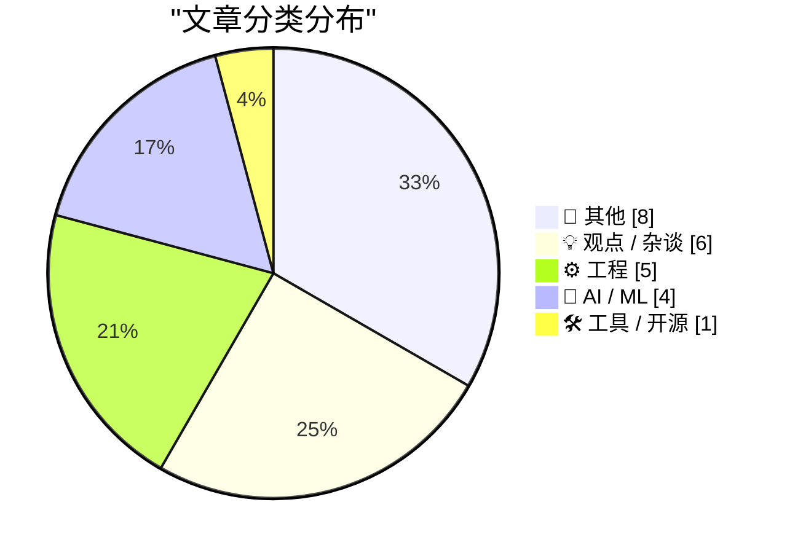
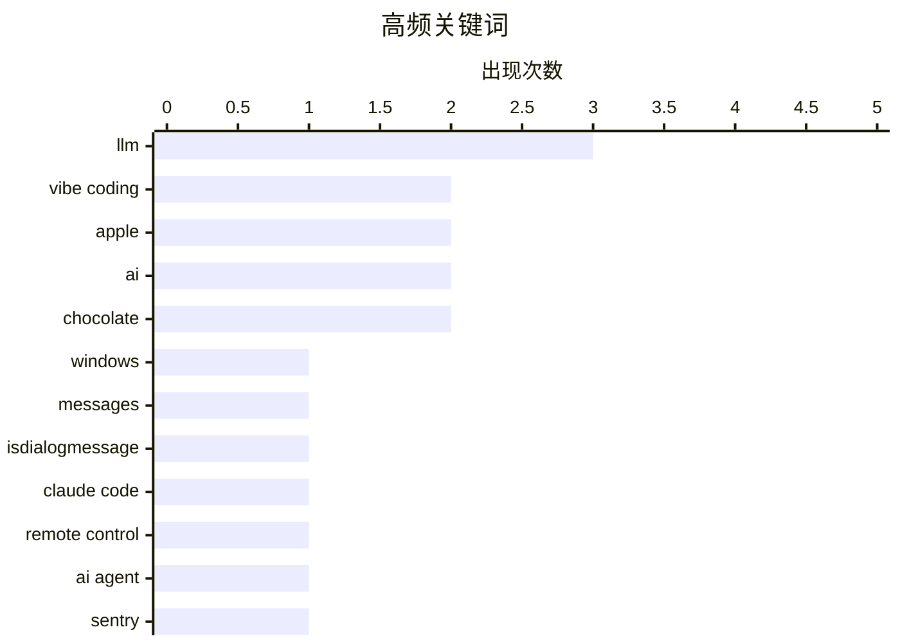

# 📰 AI 博客每日精选 — 2026-02-26

> 来自 Karpathy 推荐的 92 个顶级技术博客，AI 精选 Top 24

## 📝 今日看点

今日技术圈聚焦三大趋势：AI交互范式迎来新突破，开发者热议“vibe coding”带来的效率跃升与潜在滥用风险，同时编码代理工具如“线性遍历”正重塑遗留代码理解方式；工业界则持续探索AI应用边界，从Greg Knauss对LLM对话本质的哲学探讨，到Simon Willison即兴演示LLM能力边界，反映出人机协作模式的深刻变革；此外，技术伦理与系统性风险引发关注，Gary Marcus以“代码红色警报”警示政治决策对科技生态的深远影响，而经济层面亚马逊等平台垄断效应亦持续发酵，牵动整个数字生态链。

---

## 🏆 今日必读

🥇 **比尔·盖茨就与爱泼斯坦的关联向基金会员工道歉**

[Intercepting messages before Is­Dialog­Message can process them](https://devblogs.microsoft.com/oldnewthing/20260225-00/?p=112087) — devblogs.microsoft.com/oldnewthing · 9 小时前 · ⚙️ 工程

> 比尔·盖茨承认自2011年起与已被定罪性侵未成年人的杰弗里·爱泼斯坦会面，尽管其前妻梅琳达·弗兰奇·盖茨在2013年表达担忧。盖茨表示他仅了解爱泼斯坦因‘18个月限制令’被限制旅行，但未深入核查其背景。他承认现在回顾此事感到后悔，并为此向盖茨基金会员工正式道歉。

💡 **为什么值得读**: 这揭示了科技界领袖在道德判断与社交关系中的复杂性，尤其涉及系统性慈善组织高层的伦理失察问题。

🏷️ Windows, messages, IsDialogMessage

🥈 **主要糖果品牌正从真巧克力转向‘巧克力味糖果’（实为棕色蜡）**

[Claude Code Remote Control](https://simonwillison.net/2026/Feb/25/claude-code-remote-control/#atom-everything) — simonwillison.net · 6 小时前 · 🤖 AI / ML

> 为应对气候变化和成本压力，多家糖果巨头如好时、费列罗、瑞氏等正将巧克力涂层替换为‘复合巧克力’（compound coating），即用可可粉与廉价植物油脂肪替代昂贵的可可脂。这种替代导致口感下降，被消费者形容为‘蜡烛蜡’质地。

💡 **为什么值得读**: 该趋势反映了食品工业在环保与利润驱动下对消费者体验的系统性牺牲，值得警惕。

🏷️ Claude Code, remote control, AI agent

🥉 **我若非科学之人，便一无是处**

[[Sponsor] Hands-On Workshop: Fix It Faster — Crash Reporting, Tracing, and Logs for iOS in Sentry](https://sentry.io/resources/ios-workshop-jan-2026/?utm_source=daringfireball&amp;utm_medium=paid-display&amp;utm_campaign=general-fy27q1-evergreen&amp;utm_content=static-ad-mobilerss-trysentry) — daringfireball.net · 23 小时前 · 🛠 工具 / 开源

> 作者为验证消费者对瑞氏花生酱杯口感恶化的抱怨，亲自测试了Trader Joe’s版本。结果显示其牛奶与黑巧克力版本口感良好，巧克力味浓郁，花生酱顺滑，远优于当前主流品牌如好时所生产的‘沙砾状’产品。

💡 **为什么值得读**: 通过个人实证挑战行业普遍负面评价，为寻求优质替代品的消费者提供了可靠参考。

🏷️ Sentry, iOS, crash reporting

---

## 📊 数据概览

| 扫描源 | 抓取文章 | 时间范围 | 精选 |
|:---:|:---:|:---:|:---:|
| 87/92 | 2490 篇 → 24 篇 | 24h | **24 篇** |

### 分类分布



### 高频关键词



<details>
<summary>📈 纯文本关键词图（终端友好）</summary>

```
llm             │ ████████████████████ 3
vibe coding     │ █████████████░░░░░░░ 2
apple           │ █████████████░░░░░░░ 2
ai              │ █████████████░░░░░░░ 2
chocolate       │ █████████████░░░░░░░ 2
windows         │ ███████░░░░░░░░░░░░░ 1
messages        │ ███████░░░░░░░░░░░░░ 1
isdialogmessage │ ███████░░░░░░░░░░░░░ 1
claude code     │ ███████░░░░░░░░░░░░░ 1
remote control  │ ███████░░░░░░░░░░░░░ 1
```

</details>

### 🏷️ 话题标签

**llm**(3) · **vibe coding**(2) · **apple**(2) · ai(2) · chocolate(2) · windows(1) · messages(1) · isdialogmessage(1) · claude code(1) · remote control(1) · ai agent(1) · sentry(1) · ios(1) · crash reporting(1) · knowledge(1) · arguments(1) · presentation app(1) · agentic engineering(1) · code walkthrough(1) · ai coding agent(1)

---

## 📝 其他

### 1. The Talk Show: ‘Serious Opinionators’

[The Talk Show: ‘Serious Opinionators’](https://daringfireball.net/thetalkshow/2026/02/25/ep-441) — **daringfireball.net** · 1 小时前 · ⭐ 18/30

> Adam Engst returns to the show to talk, in detail, about certain of the UI changes in iOS 26 and Apple’s version 26 OSes overall. In particular, the new Unified view in the Phone app, and the Filter p

🏷️ iOS 26, UI design, Apple

---

### 2. Samsung Galaxy S26 Ultra’s Privacy Display

[Samsung Galaxy S26 Ultra’s Privacy Display](https://9to5google.com/2026/02/25/samsung-galaxy-s26-ultra-privacy-display-demo-hands-on/) — **daringfireball.net** · 3 小时前 · ⭐ 18/30

> Ben Schoon, writing for 9to5 Google:


  When activated, Privacy Display changes how the pixels in your
display emit light, making it harder or near-impossible to view
the display at an off-angle. At 

🏷️ privacy, display, Samsung

---

### 3. Book Review: Of Monsters and Mainframes - Barbara Truelove ★★★⯪☆

[Book Review: Of Monsters and Mainframes - Barbara Truelove ★★★⯪☆](https://shkspr.mobi/blog/2026/02/book-review-of-monsters-and-mainframes-barbara-truelove/) — **shkspr.mobi** · 11 小时前 · ⭐ 17/30

> This is fun, silly, charming, and much better than The Murderbot Diaries despite being superficially similar.  Imagine you are an interstellar ship and, of course, your AI is conscious. What would you

🏷️ book, AI, fiction

---

### 4. Game designer Sid Meier born Feb. 24, 1954

[Game designer Sid Meier born Feb. 24, 1954](https://dfarq.homeip.net/game-designer-sid-meier-born-feb-24-1954/?utm_source=rss&#038;utm_medium=rss&#038;utm_campaign=game-designer-sid-meier-born-feb-24-1954) — **dfarq.homeip.net** · 12 小时前 · ⭐ 14/30

> Legendary game designer Sid Meier was born February 24, 1954. After creating a run of popular flight simulators in the early and mid 1980s, he shifted to strategy games in the second half of the decad

🏷️ Sid Meier, game design, history, strategy games

---

### 5. Bill Gates Apologizes to Foundation Staff Over Epstein Ties

[Bill Gates Apologizes to Foundation Staff Over Epstein Ties](https://www.wsj.com/articles/bill-gates-apologizes-to-foundation-staff-over-epstein-ties-67f39ef5) — **daringfireball.net** · 22 分钟前 · ⭐ 13/30

> Emily Glazer, reporting for The Wall Street Journal:


  The billionaire said he met with Epstein starting in 2011, years
after Epstein had pleaded guilty in 2008 to soliciting a minor for
prostitutio

🏷️ Bill Gates, Epstein, controversy

---

### 6. Major Candy Brands Are Switching From Actual Chocolate to ‘Chocolatey Candy’ (Read: Brown Candle Wax)

[Major Candy Brands Are Switching From Actual Chocolate to ‘Chocolatey Candy’ (Read: Brown Candle Wax)](https://www.jezebel.com/fake-milk-chocolate-replacements-brands-reeses-hershey-ferrero-compound-coating-candy-climate-change) — **daringfireball.net** · 8 小时前 · ⭐ 13/30

> Jim Vorel, writing just yesterday for Jezebel:


  It can be hard to know what exactly to call the substances that
are now found coating many major candy bars such as Butterfinger,
Baby Ruth, Almond J

🏷️ candy, chocolate, food

---

### 7. I Am Nothing if Not a Man of Science

[I Am Nothing if Not a Man of Science](https://mastodon.social/@gruber/116131665730352697) — **daringfireball.net** · 9 小时前 · ⭐ 13/30

> After writing a few days ago about the current brouhaha over the severe decline in the edibility of Reese’s Peanut Butter Cups, and linking to Trader Joe’s shade-throwing description of their own, I o

🏷️ Reese's, chocolate, science

---

### 8. ‘H-Bomb: A Frank Lloyd Wright Typographic Mystery’

[‘H-Bomb: A Frank Lloyd Wright Typographic Mystery’](https://www.inconspicuous.info/p/h-bomb-a-frank-lloyd-wright-typographic) — **daringfireball.net** · 8 分钟前 · ⭐ 11/30

> When re-hanging signage, “Mind your P’s and Q’s” ought to be “Mind your H’s and S’s”.


 ★

🏷️ typography, Frank Lloyd Wright, H-bomb

---

## 💡 观点 / 杂谈

### 9. 人类面临代码红色警报？

[Code Red for Humanity?](https://garymarcus.substack.com/p/code-red-for-humanity) — **garymarcus.substack.com** · 5 小时前 · ⭐ 22/30

> Gary Marcus 在文章中警告称，特朗普政府当前的政策方向可能带来严重后果，他将其比喻为‘人类面临代码红色警报’，暗示系统性风险正在逼近。文章虽未提供具体技术细节，但表达了对政治决策可能影响科技与社会发展的深切担忧。

🏷️ Trump, policy, humanity

---

### 10. 整个经济都在为亚马逊税买单

[Pluralistic: The whole economy pays the Amazon tax (25 Feb 2026)](https://pluralistic.net/2026/02/25/most-favored-nation/) — **pluralistic.net** · 12 小时前 · ⭐ 21/30

> 作者指出，消费者无法通过‘换个平台’来摆脱垄断带来的负面影响，因为大型平台（如亚马逊）的定价策略会传导至整个经济体系。文章讨论了最惠国条款（most-favored-nation clauses）如何被滥用，导致中小商家被迫接受不公平条件，最终损害市场竞争与创新。

🏷️ Amazon, monopoly, tax

---

### 11. Quoting Kellan Elliott-McCrea

[Quoting Kellan Elliott-McCrea](https://simonwillison.net/2026/Feb/25/kellan-elliott-mccrea/#atom-everything) — **simonwillison.net** · 20 小时前 · ⭐ 18/30

> <blockquote cite="https://laughingmeme.org/2026/02/09/code-has-always-been-the-easy-part.html"><p>It’s also reasonable for people who entered technology in the last couple of decades because it was go

🏷️ technology, coding culture, career reflection

---

### 12. ★ My 2025 Apple Report Card

[★ My 2025 Apple Report Card](https://daringfireball.net/2026/02/my_2025_apple_report_card) — **daringfireball.net** · 7 小时前 · ⭐ 18/30

> A mixed year.

🏷️ Apple, review, 2025

---

### 13. Terry Godier: ‘Phantom Obligation’

[Terry Godier: ‘Phantom Obligation’](https://www.terrygodier.com/phantom-obligation) — **daringfireball.net** · 8 分钟前 · ⭐ 16/30

> Terry Godier, in a thoughtful essay on the design of RSS feed readers:


  There’s a particular kind of guilt that visits me when I open my
feed reader after a few days away. It’s not the guilt of hav

🏷️ RSS, feed reader, design guilt

---

### 14. Everything is awesome (why I'm an optimist)

[Everything is awesome (why I'm an optimist)](https://www.joanwestenberg.com/everything-is-awesome-why-im-an-optimist/) — **joanwestenberg.com** · 22 小时前 · ⭐ 14/30

> February is the month the internet decided we&apos;re all going to die.In the span of about two weeks, Matt Shumer&apos;s Something Big is Happening racked up over 80 million views on X with its breat

🏷️ AI, optimism, tech hype, culture

---

## ⚙️ 工程

### 15. 比尔·盖茨就与爱泼斯坦的关联向基金会员工道歉

[Intercepting messages before Is­Dialog­Message can process them](https://devblogs.microsoft.com/oldnewthing/20260225-00/?p=112087) — **devblogs.microsoft.com/oldnewthing** · 9 小时前 · ⭐ 25/30

> 比尔·盖茨承认自2011年起与已被定罪性侵未成年人的杰弗里·爱泼斯坦会面，尽管其前妻梅琳达·弗兰奇·盖茨在2013年表达担忧。盖茨表示他仅了解爱泼斯坦因‘18个月限制令’被限制旅行，但未深入核查其背景。他承认现在回顾此事感到后悔，并为此向盖茨基金会员工正式道歉。

🏷️ Windows, messages, IsDialogMessage

---

### 16. 线性遍历：让编码代理带你结构化浏览代码库

[Linear walkthroughs](https://simonwillison.net/guides/agentic-engineering-patterns/linear-walkthroughs/#atom-everything) — **simonwillison.net** · 22 小时前 · ⭐ 23/30

> 本文介绍了一种名为 'Linear Walkthroughs' 的代理工程模式，即让先进的编码代理（如 frontier models）为开发者提供代码库的逐步结构化讲解。该模式适用于理解遗留代码、回顾自己遗忘的代码，或解析 vibe coded 项目的实际逻辑。通过引导代理输出清晰的步骤说明，开发者可以更高效地掌握复杂代码结构。

🏷️ agentic engineering, code walkthrough, AI coding agent

---

### 17. Vibe coding 正在催生垃圾邮件

[They’re Vibe-Coding Spam Now](https://feed.tedium.co/link/15204/17283566/vibe-coded-email-spam) — **tedium.co** · 9 小时前 · ⭐ 21/30

> 随着编程门槛降低，尤其是 vibe coding 的普及，垃圾邮件的制造变得更加容易和普遍。文章指出，这种趋势使得 spam 行为更具吸引力，可能导致网络环境恶化。作者呼吁开发者警惕技术滥用，并思考如何在提升效率的同时维护数字生态的健康。

🏷️ vibe coding, spam, AI tools, developer ethics

---

### 18. tldraw issue: Move tests to closed source repo

[tldraw issue: Move tests to closed source repo](https://simonwillison.net/2026/Feb/25/closed-tests/#atom-everything) — **simonwillison.net** · 2 小时前 · ⭐ 18/30

> <p><strong><a href="https://github.com/tldraw/tldraw/issues/8082">tldraw issue: Move tests to closed source repo</a></strong></p>
It's become very apparent over the past few months that a comprehensiv

🏷️ tldraw, testing, open source

---

### 19. Trig of inverse trig

[Trig of inverse trig](https://www.johndcook.com/blog/2026/02/25/trig-of-inverse-trig/) — **johndcook.com** · 13 小时前 · ⭐ 15/30

> I ran across an old article [1] that gave a sort of multiplication table for trig functions and inverse trig functions. Here’s my version of the table. I made a few changes from the original. First, I

🏷️ trigonometry, inverse trig, math, LaTeX

---

## 🤖 AI / ML

### 20. 主要糖果品牌正从真巧克力转向‘巧克力味糖果’（实为棕色蜡）

[Claude Code Remote Control](https://simonwillison.net/2026/Feb/25/claude-code-remote-control/#atom-everything) — **simonwillison.net** · 6 小时前 · ⭐ 24/30

> 为应对气候变化和成本压力，多家糖果巨头如好时、费列罗、瑞氏等正将巧克力涂层替换为‘复合巧克力’（compound coating），即用可可粉与廉价植物油脂肪替代昂贵的可可脂。这种替代导致口感下降，被消费者形容为‘蜡烛蜡’质地。

🏷️ Claude Code, remote control, AI agent

---

### 21. ‘H-Bomb：弗兰克·劳埃德·赖特的一个排版之谜’

[When access to knowledge is no longer the limitation](https://idiallo.com/blog/access-to-knowledge-is-no-longer-a-limitation?src=feed) — **idiallo.com** · 12 小时前 · ⭐ 24/30

> 文章探讨建筑师弗兰克·劳埃德·赖特设计的‘H-Bomb’字体，其设计意图与排版细节长期未被理解。研究发现该字体实为赖特为表达核时代焦虑而创作的实验性无衬线字体，其结构隐含对字母形态的颠覆性重构。

🏷️ LLM, knowledge, arguments

---

### 22. 我用 vibe coding 打造梦想中的 macOS 演示应用

[I vibe coded my dream macOS presentation app](https://simonwillison.net/2026/Feb/25/present/#atom-everything) — **simonwillison.net** · 7 小时前 · ⭐ 23/30

> Simon Willison 在 Social Science FOO Camp 上发表了一场即兴演讲，题为《LLM 现状：2026年2月版》，副标题为“自11月以来一切都变了！”。为了准备演示，他在前一晚使用 vibe coding 的方式快速构建了一个定制化的 macOS 应用。该应用展示了如何利用 AI 快速原型开发，并配有现场照片和演示效果。

🏷️ LLM, vibe coding, presentation app

---

### 23. Greg Knauss：与 LLM 对话，是抽象层次的跃迁

[Greg Knauss: ‘Lose Myself’](https://www.eod.com/blog/2026/02/lose-myself/) — **daringfireball.net** · 1 小时前 · ⭐ 21/30

> Greg Knauss 在文章中反驳了‘用英语与 LLM 对话只是又多了一层抽象’的观点，认为这种说法忽略了工业革命的类比意义——就像工厂生产的蛋糕不同于手工制作一样，与 AI 交互已成为一种全新的实践方式。他强调，不应拘泥于底层物理机制，而应关注其带来的实际变革。

🏷️ LLM, abstraction, human-AI interaction

---

## 🛠 工具 / 开源

### 24. 我若非科学之人，便一无是处

[[Sponsor] Hands-On Workshop: Fix It Faster — Crash Reporting, Tracing, and Logs for iOS in Sentry](https://sentry.io/resources/ios-workshop-jan-2026/?utm_source=daringfireball&amp;utm_medium=paid-display&amp;utm_campaign=general-fy27q1-evergreen&amp;utm_content=static-ad-mobilerss-trysentry) — **daringfireball.net** · 23 小时前 · ⭐ 24/30

> 作者为验证消费者对瑞氏花生酱杯口感恶化的抱怨，亲自测试了Trader Joe’s版本。结果显示其牛奶与黑巧克力版本口感良好，巧克力味浓郁，花生酱顺滑，远优于当前主流品牌如好时所生产的‘沙砾状’产品。

🏷️ Sentry, iOS, crash reporting

---

*生成于 2026-02-26 00:01 | 扫描 87 源 → 获取 2490 篇 → 精选 24 篇*
*基于 [Hacker News Popularity Contest 2025](https://refactoringenglish.com/tools/hn-popularity/) RSS 源列表，由 [Andrej Karpathy](https://x.com/karpathy) 推荐*
*由「懂点儿AI」制作，欢迎关注同名微信公众号获取更多 AI 实用技巧 💡*
