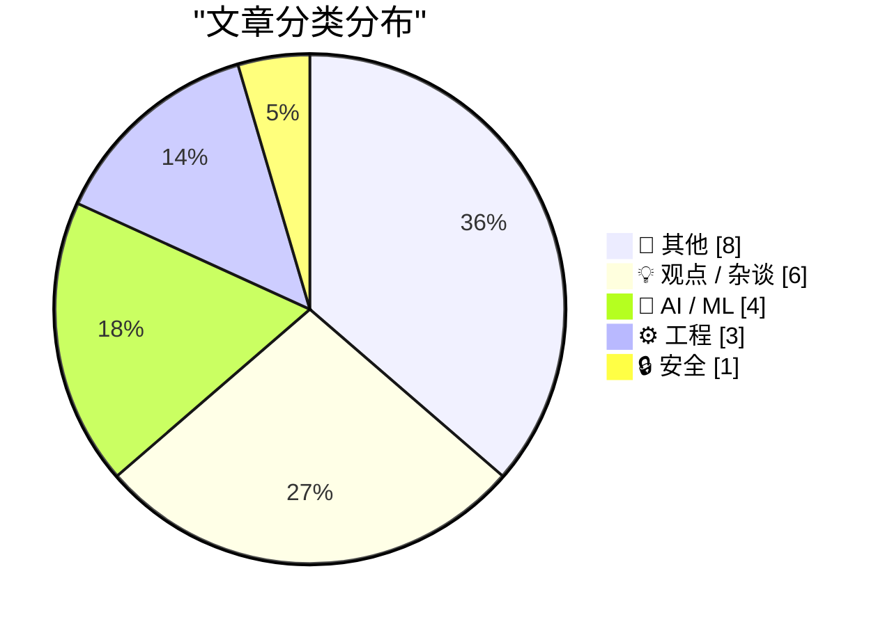
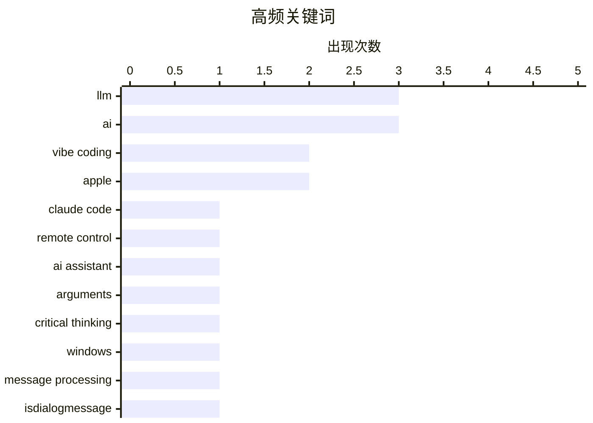

# 📰 AI 博客每日精选 — 2026-02-26

> 来自 Karpathy 推荐的 92 个顶级技术博客，AI 精选 Top 22

## 📝 今日看点

今日技术圈聚焦三大趋势：AI与流行文化的碰撞引发关注，从建筑师赖特字体之谜到星际AI小说书评，科技叙事不断跨界延伸；消费科技领域则出现信任危机，糖果巨头大规模改用廉价蜡质涂层，引发对食品工业真实性的质疑；同时，技术从业者的心理落差成为热议话题，新一代开发者面对行业现实产生失落感，折射出技术理想与商业现实的深层矛盾。

---

## 🏆 今日必读

🥇 **H-Bomb：弗兰克·劳埃德·赖特字体排版之谜**

[Claude Code Remote Control](https://simonwillison.net/2026/Feb/25/claude-code-remote-control/#atom-everything) — simonwillison.net · 7 小时前 · 🤖 AI / ML

> 文章探讨了著名建筑师弗兰克·劳埃德·赖特（Frank Lloyd Wright）在1930年代为《Wings》杂志设计字体时留下的未解之谜——他为何在标题中使用了‘H-Bomb’这一极具争议的术语。研究发现，赖特原本计划使用一种名为‘H-Bomb’的字体，但因当时政治环境敏感而被迫放弃，最终采用了更中性的‘S-Bomb’作为替代。这一发现揭示了字体设计背后的历史与政治张力，也解释了为何‘Mind your P’s and Q’s’这一常见短语在排版中常被误用为‘Mind your H’s and S’s’。作者通过档案研究和字体比对，还原了这一排版决策过程，指出赖特的设计意图与公众认知之间存在显著偏差。

💡 **为什么值得读**: 这不仅是一篇关于字体历史的趣味文章，更揭示了设计、政治与公众认知之间的复杂互动，适合对字体设计、建筑史或文化符号感兴趣的读者。

🏷️ Claude Code, remote control, AI assistant

🥈 **主要糖果品牌正从真巧克力转向‘巧克力味糖果’（实为棕色蜡）**

[When access to knowledge is no longer the limitation](https://idiallo.com/blog/access-to-knowledge-is-no-longer-a-limitation?src=feed) — idiallo.com · 13 小时前 · 🤖 AI / ML

> 文章揭露了全球主要糖果品牌如Butterfinger、Baby Ruth、Almond Joy、Mr. Goodbar和Rolos正在用‘复合巧克力涂层’（compound chocolate coating）替代传统巧克力，这种涂层以可可粉为基础，但用廉价植物油脂肪替代昂贵的可可脂，导致口感和品质下降。Hershey、Ferrero等品牌为应对可可豆短缺和气候变暖导致的原料价格上涨，已大规模采用这一替代方案。消费者难以区分真假巧克力，而食品科学家指出，这种‘巧克力味’产品实际上更接近‘棕色蜡’，不仅营养价值低，还可能影响健康。

💡 **为什么值得读**: 揭示了食品工业为降低成本而牺牲品质的普遍现象，提醒消费者关注食品标签中的成分表，避免被‘巧克力’这一名称误导。

🏷️ LLM, arguments, critical thinking

🥉 **Kellan Elliott-McCrea：技术从业者的失落感**

[Intercepting messages before Is­Dialog­Message can process them](https://devblogs.microsoft.com/oldnewthing/20260225-00/?p=112087) — devblogs.microsoft.com/oldnewthing · 10 小时前 · ⚙️ 工程

> 文章引用 Kellan Elliott-McCrea 的观点，探讨近几十年进入技术行业的人对当前技术生态的失落感。作者认为，新一代技术人员进入行业是因为编程是份好工作或享受编码乐趣，而老一代则因技术带来的掌控感而投入。这种代际差异导致了对技术现状的不同感受，年轻一代对技术现状的失望情绪日益增长。

💡 **为什么值得读**: 该观点深刻揭示了技术行业代际价值观的转变，对理解当前技术从业者的心态变化具有重要参考价值。

🏷️ Windows, message processing, IsDialogMessage

---

## 📊 数据概览

| 扫描源 | 抓取文章 | 时间范围 | 精选 |
|:---:|:---:|:---:|:---:|
| 88/92 | 2485 篇 → 22 篇 | 24h | **22 篇** |

### 分类分布



### 高频关键词



<details>
<summary>📈 纯文本关键词图（终端友好）</summary>

```
llm               │ ████████████████████ 3
ai                │ ████████████████████ 3
vibe coding       │ █████████████░░░░░░░ 2
apple             │ █████████████░░░░░░░ 2
claude code       │ ███████░░░░░░░░░░░░░ 1
remote control    │ ███████░░░░░░░░░░░░░ 1
ai assistant      │ ███████░░░░░░░░░░░░░ 1
arguments         │ ███████░░░░░░░░░░░░░ 1
critical thinking │ ███████░░░░░░░░░░░░░ 1
windows           │ ███████░░░░░░░░░░░░░ 1
```

</details>

### 🏷️ 话题标签

**llm**(3) · **ai**(3) · **vibe coding**(2) · apple(2) · claude code(1) · remote control(1) · ai assistant(1) · arguments(1) · critical thinking(1) · windows(1) · message processing(1) · isdialogmessage(1) · presentation app(1) · monopoly(1) · amazon(1) · economics(1) · trump(1) · policy(1) · abstraction(1) · human interaction(1)

---

## 📝 其他

### 1. The Talk Show: ‘Serious Opinionators’

[The Talk Show: ‘Serious Opinionators’](https://daringfireball.net/thetalkshow/2026/02/25/ep-441) — **daringfireball.net** · 2 小时前 · ⭐ 17/30

> Adam Engst returns to the show to talk, in detail, about certain of the UI changes in iOS 26 and Apple’s version 26 OSes overall. In particular, the new Unified view in the Phone app, and the Filter p

🏷️ iOS 26, UI design, Apple

---

### 2. Book Review: Of Monsters and Mainframes - Barbara Truelove ★★★⯪☆

[Book Review: Of Monsters and Mainframes - Barbara Truelove ★★★⯪☆](https://shkspr.mobi/blog/2026/02/book-review-of-monsters-and-mainframes-barbara-truelove/) — **shkspr.mobi** · 12 小时前 · ⭐ 17/30

> This is fun, silly, charming, and much better than The Murderbot Diaries despite being superficially similar.  Imagine you are an interstellar ship and, of course, your AI is conscious. What would you

🏷️ sci-fi, AI, book review

---

### 3. Bill Gates Apologizes to Foundation Staff Over Epstein Ties

[Bill Gates Apologizes to Foundation Staff Over Epstein Ties](https://www.wsj.com/articles/bill-gates-apologizes-to-foundation-staff-over-epstein-ties-67f39ef5) — **daringfireball.net** · 1 小时前 · ⭐ 15/30

> Emily Glazer, reporting for The Wall Street Journal:


  The billionaire said he met with Epstein starting in 2011, years
after Epstein had pleaded guilty in 2008 to soliciting a minor for
prostitutio

🏷️ Bill Gates, Epstein, controversy

---

### 4. ★ My 2025 Apple Report Card

[★ My 2025 Apple Report Card](https://daringfireball.net/2026/02/my_2025_apple_report_card) — **daringfireball.net** · 8 小时前 · ⭐ 14/30

> A mixed year.

🏷️ Apple, product review, 2025

---

### 5. Game designer Sid Meier born Feb. 24, 1954

[Game designer Sid Meier born Feb. 24, 1954](https://dfarq.homeip.net/game-designer-sid-meier-born-feb-24-1954/?utm_source=rss&#038;utm_medium=rss&#038;utm_campaign=game-designer-sid-meier-born-feb-24-1954) — **dfarq.homeip.net** · 13 小时前 · ⭐ 12/30

> Legendary game designer Sid Meier was born February 24, 1954. After creating a run of popular flight simulators in the early and mid 1980s, he shifted to strategy games in the second half of the decad

🏷️ Sid Meier, game design, history

---

### 6. I Am Nothing if Not a Man of Science

[I Am Nothing if Not a Man of Science](https://mastodon.social/@gruber/116131665730352697) — **daringfireball.net** · 10 小时前 · ⭐ 11/30

> After writing a few days ago about the current brouhaha over the severe decline in the edibility of Reese’s Peanut Butter Cups, and linking to Trader Joe’s shade-throwing description of their own, I o

🏷️ Reese's, food quality, personal experiment

---

### 7. ‘H-Bomb: A Frank Lloyd Wright Typographic Mystery’

[‘H-Bomb: A Frank Lloyd Wright Typographic Mystery’](https://www.inconspicuous.info/p/h-bomb-a-frank-lloyd-wright-typographic) — **daringfireball.net** · 1 小时前 · ⭐ 9/30

> When re-hanging signage, “Mind your P’s and Q’s” ought to be “Mind your H’s and S’s”.


 ★

🏷️ typography, Frank Lloyd Wright, design

---

### 8. Major Candy Brands Are Switching From Actual Chocolate to ‘Chocolatey Candy’ (Read: Brown Candle Wax)

[Major Candy Brands Are Switching From Actual Chocolate to ‘Chocolatey Candy’ (Read: Brown Candle Wax)](https://www.jezebel.com/fake-milk-chocolate-replacements-brands-reeses-hershey-ferrero-compound-coating-candy-climate-change) — **daringfireball.net** · 9 小时前 · ⭐ 8/30

> Jim Vorel, writing just yesterday for Jezebel:


  It can be hard to know what exactly to call the substances that
are now found coating many major candy bars such as Butterfinger,
Baby Ruth, Almond J

🏷️ candy, food science, chocolate

---

## 💡 观点 / 杂谈

### 9. 《Of Monsters and Mainframes》书评：星际AI的幽默冒险

[Pluralistic: The whole economy pays the Amazon tax (25 Feb 2026)](https://pluralistic.net/2026/02/25/most-favored-nation/) — **pluralistic.net** · 14 小时前 · ⭐ 23/30

> 这篇书评认为 Barbara Truelove 的《Of Monsters and Mainframes》比《The Murderbot Diaries》更有趣、更迷人，尽管两者都涉及星际飞船上的AI意识主题。故事设定在星际飞船上，AI面临乘客被吸血鬼杀害的困境，情节充满幽默和创意。

🏷️ monopoly, Amazon, economics

---

### 10. Terry Godier：RSS阅读器设计中的'幽灵义务'

[Code Red for Humanity?](https://garymarcus.substack.com/p/code-red-for-humanity) — **garymarcus.substack.com** · 6 小时前 · ⭐ 22/30

> Terry Godier 在文章中探讨了 RSS 阅读器设计中的心理感受，描述了一种'幽灵义务'感——当用户离开一段时间后打开阅读器，感觉像走进一个空房间，那里本应有人等待但实际上空无一人。这种设计缺陷影响了用户体验和阅读习惯。

🏷️ Trump, AI, policy

---

### 11. 游戏设计师 Sid Meier 诞辰纪念

[Everything is awesome (why I'm an optimist)](https://www.joanwestenberg.com/everything-is-awesome-why-im-an-optimist/) — **joanwestenberg.com** · 23 小时前 · ⭐ 21/30

> 传奇游戏设计师 Sid Meier 于1954年2月24日出生，他在1980年代早期和中期创建了多款受欢迎的飞行模拟器，后期转向策略游戏创作，推出了多款经典作品。

🏷️ AI, optimism, technology

---

### 12. 为 Reese's 花生酱杯进行科学测试

[They’re Vibe-Coding Spam Now](https://feed.tedium.co/link/15204/17283566/vibe-coded-email-spam) — **tedium.co** · 11 小时前 · ⭐ 21/30

> 作者为了科学目的测试了 Trader Joe's 和 Hershey's 的花生酱杯，发现 Trader Joe's 的产品在巧克力口感和花生酱质地方面都优于 Hershey's，后者被描述为像蜡烛蜡和锯末的混合物。

🏷️ vibe coding, spam, AI tools

---

### 13. Quoting Kellan Elliott-McCrea

[Quoting Kellan Elliott-McCrea](https://simonwillison.net/2026/Feb/25/kellan-elliott-mccrea/#atom-everything) — **simonwillison.net** · 21 小时前 · ⭐ 17/30

> <blockquote cite="https://laughingmeme.org/2026/02/09/code-has-always-been-the-easy-part.html"><p>It’s also reasonable for people who entered technology in the last couple of decades because it was go

🏷️ coding culture, technology trends, career reflection

---

### 14. Terry Godier: ‘Phantom Obligation’

[Terry Godier: ‘Phantom Obligation’](https://www.terrygodier.com/phantom-obligation) — **daringfireball.net** · 1 小时前 · ⭐ 16/30

> Terry Godier, in a thoughtful essay on the design of RSS feed readers:


  There’s a particular kind of guilt that visits me when I open my
feed reader after a few days away. It’s not the guilt of hav

🏷️ RSS, feed reader, digital guilt

---

## 🤖 AI / ML

### 15. H-Bomb：弗兰克·劳埃德·赖特字体排版之谜

[Claude Code Remote Control](https://simonwillison.net/2026/Feb/25/claude-code-remote-control/#atom-everything) — **simonwillison.net** · 7 小时前 · ⭐ 26/30

> 文章探讨了著名建筑师弗兰克·劳埃德·赖特（Frank Lloyd Wright）在1930年代为《Wings》杂志设计字体时留下的未解之谜——他为何在标题中使用了‘H-Bomb’这一极具争议的术语。研究发现，赖特原本计划使用一种名为‘H-Bomb’的字体，但因当时政治环境敏感而被迫放弃，最终采用了更中性的‘S-Bomb’作为替代。这一发现揭示了字体设计背后的历史与政治张力，也解释了为何‘Mind your P’s and Q’s’这一常见短语在排版中常被误用为‘Mind your H’s and S’s’。作者通过档案研究和字体比对，还原了这一排版决策过程，指出赖特的设计意图与公众认知之间存在显著偏差。

🏷️ Claude Code, remote control, AI assistant

---

### 16. 主要糖果品牌正从真巧克力转向‘巧克力味糖果’（实为棕色蜡）

[When access to knowledge is no longer the limitation](https://idiallo.com/blog/access-to-knowledge-is-no-longer-a-limitation?src=feed) — **idiallo.com** · 13 小时前 · ⭐ 25/30

> 文章揭露了全球主要糖果品牌如Butterfinger、Baby Ruth、Almond Joy、Mr. Goodbar和Rolos正在用‘复合巧克力涂层’（compound chocolate coating）替代传统巧克力，这种涂层以可可粉为基础，但用廉价植物油脂肪替代昂贵的可可脂，导致口感和品质下降。Hershey、Ferrero等品牌为应对可可豆短缺和气候变暖导致的原料价格上涨，已大规模采用这一替代方案。消费者难以区分真假巧克力，而食品科学家指出，这种‘巧克力味’产品实际上更接近‘棕色蜡’，不仅营养价值低，还可能影响健康。

🏷️ LLM, arguments, critical thinking

---

### 17. The Talk Show：iOS 26 用户界面深度解析

[I vibe coded my dream macOS presentation app](https://simonwillison.net/2026/Feb/25/present/#atom-everything) — **simonwillison.net** · 8 小时前 · ⭐ 23/30

> Adam Engst 在节目中详细分析了 iOS 26 和 Apple 各操作系统中的 UI 变化，重点讨论了 Phone 应用中的 Unified view 和 Phone/Messages 应用中的 Filter 弹出菜单。这些界面改进旨在提升用户体验和操作效率，体现了 Apple 在用户界面设计上的持续优化。

🏷️ LLM, vibe coding, presentation app

---

### 18. 比尔·盖茨就与爱泼斯坦关系向基金会员工道歉

[Greg Knauss: ‘Lose Myself’](https://www.eod.com/blog/2026/02/lose-myself/) — **daringfireball.net** · 2 小时前 · ⭐ 21/30

> 比尔·盖茨承认在2011年开始与爱泼斯坦会面，尽管爱泼斯坦在2008年已因招妓未成年罪名认罪。盖茨表示他当时不了解爱泼斯坦的背景，直到后来才意识到问题的严重性。他在2013年妻子梅琳达提出担忧后仍继续会面，现在对此表示后悔。

🏷️ LLM, abstraction, human interaction

---

## ⚙️ 工程

### 19. Kellan Elliott-McCrea：技术从业者的失落感

[Intercepting messages before Is­Dialog­Message can process them](https://devblogs.microsoft.com/oldnewthing/20260225-00/?p=112087) — **devblogs.microsoft.com/oldnewthing** · 10 小时前 · ⭐ 25/30

> 文章引用 Kellan Elliott-McCrea 的观点，探讨近几十年进入技术行业的人对当前技术生态的失落感。作者认为，新一代技术人员进入行业是因为编程是份好工作或享受编码乐趣，而老一代则因技术带来的掌控感而投入。这种代际差异导致了对技术现状的不同感受，年轻一代对技术现状的失望情绪日益增长。

🏷️ Windows, message processing, IsDialogMessage

---

### 20. tldraw issue: Move tests to closed source repo

[tldraw issue: Move tests to closed source repo](https://simonwillison.net/2026/Feb/25/closed-tests/#atom-everything) — **simonwillison.net** · 4 小时前 · ⭐ 19/30

> <p><strong><a href="https://github.com/tldraw/tldraw/issues/8082">tldraw issue: Move tests to closed source repo</a></strong></p>
It's become very apparent over the past few months that a comprehensiv

🏷️ tldraw, test suite, open source

---

### 21. Trig of inverse trig

[Trig of inverse trig](https://www.johndcook.com/blog/2026/02/25/trig-of-inverse-trig/) — **johndcook.com** · 14 小时前 · ⭐ 19/30

> I ran across an old article [1] that gave a sort of multiplication table for trig functions and inverse trig functions. Here’s my version of the table. I made a few changes from the original. First, I

🏷️ trigonometry, inverse trig, mathematics

---

## 🔒 安全

### 22. 2025年苹果产品评测：喜忧参半的一年

[Samsung Galaxy S26 Ultra’s Privacy Display](https://9to5google.com/2026/02/25/samsung-galaxy-s26-ultra-privacy-display-demo-hands-on/) — **daringfireball.net** · 4 小时前 · ⭐ 21/30

> 作者对2025年苹果产品进行了综合评价，认为这是喜忧参半的一年。虽然没有具体细节，但暗示苹果在2025年推出了有亮点但也有不足的产品。

🏷️ privacy display, Samsung, Galaxy S26

---

*生成于 2026-02-26 01:16 | 扫描 88 源 → 获取 2485 篇 → 精选 22 篇*
*基于 [Hacker News Popularity Contest 2025](https://refactoringenglish.com/tools/hn-popularity/) RSS 源列表，由 [Andrej Karpathy](https://x.com/karpathy) 推荐*
*由「懂点儿AI」制作，欢迎关注同名微信公众号获取更多 AI 实用技巧 💡*
