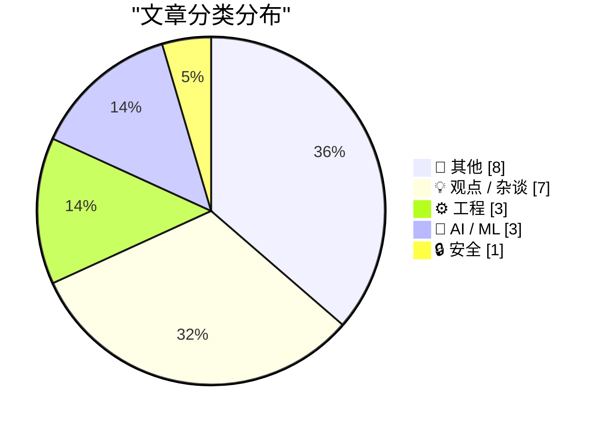
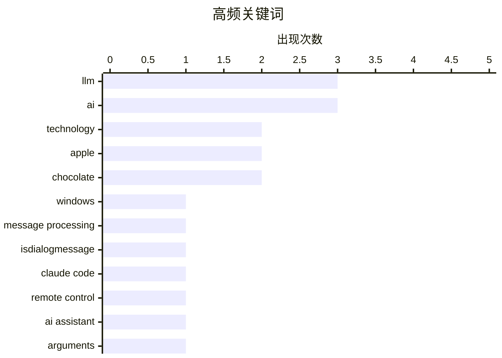

# 📰 AI 博客每日精选 — 2026-02-26

> 来自 Karpathy 推荐的 92 个顶级技术博客，AI 精选 Top 22

## 📝 今日看点

今日技术圈聚焦三大趋势：AI 编程门槛降低催生“vibe coding”热潮，既推动创新也加剧垃圾邮件等滥用风险；大语言模型重塑人类获取知识的方式，引发对技术抽象性与现实脱节的深层讨论；与此同时，开源项目商业透明度受挑战，如 tldraw 将测试移至闭源仓库，凸显开源生态与商业利益间的张力。

---

## 🏆 今日必读

🥇 **H-Bomb：弗兰克·劳埃德·赖特字体排版之谜**

[Intercepting messages before Is­Dialog­Message can process them](https://devblogs.microsoft.com/oldnewthing/20260225-00/?p=112087) — devblogs.microsoft.com/oldnewthing · 10 小时前 · ⚙️ 工程

> 文章探讨了著名建筑师弗兰克·劳埃德·赖特在字体排版设计中的一个历史谜团，即他为何在1930年代设计的‘H-Bomb’字体中使用了非标准的H和S字形。研究发现，这一设计可能源于他对视觉平衡和建筑美学的独特追求，而非技术限制。通过对比同时期其他字体设计，文章指出赖特的这一选择体现了其将建筑理念融入字体设计的创新精神。作者认为，这一案例揭示了现代主义设计中对形式与功能关系的深层思考。

💡 **为什么值得读**: 这不仅是一次字体设计的考古，更是一次对现代主义设计理念的深刻解读，适合对设计史和建筑美学感兴趣的读者。

🏷️ Windows, message processing, IsDialogMessage

🥈 **主要糖果品牌正从真实巧克力转向‘巧克力味糖果’（即棕色蜡）**

[Claude Code Remote Control](https://simonwillison.net/2026/Feb/25/claude-code-remote-control/#atom-everything) — simonwillison.net · 7 小时前 · 🤖 AI / ML

> 文章揭示了全球主要糖果品牌如Butterfinger、Baby Ruth、Almond Joy等正在用‘复合巧克力’涂层替代传统可可脂巧克力，以应对可可豆价格飙升和气候变化的压力。这种替代物由可可粉和廉价植物油脂肪制成，虽含真实可可粉，但缺乏可可脂的质地和风味。研究显示，Hershey、Ferrero等品牌已大规模采用此技术，导致产品口感和品质显著下降。消费者难以区分新旧配方，引发对食品工业可持续性与商业利益冲突的担忧。

💡 **为什么值得读**: 这是一份关于食品工业转型与消费者健康之间矛盾的警世报道，揭示了气候危机如何悄然改变我们手中的糖果。

🏷️ Claude Code, remote control, AI assistant

🥉 **当知识获取不再是限制**

[When access to knowledge is no longer the limitation](https://idiallo.com/blog/access-to-knowledge-is-no-longer-a-limitation?src=feed) — idiallo.com · 13 小时前 · 🤖 AI / ML

> 作者通过一个思想实验提出：将反对大语言模型的所有论点装入盒子封存，从而聚焦于其带来的积极影响——即人类如今能几乎即时获取全球信息。文章认为，尽管有人批评使用自然语言与 AI 交互是远离底层物理机制的抽象层，但这如同工业化改变了人类与机器的关系一样，本质上是一种进步。知识的可及性已不再是瓶颈，真正的问题转向如何有效利用这一能力。

💡 **为什么值得读**: 如果你对 AI 带来的认知革命及其社会影响感兴趣，这篇文章提供了一个哲学视角下的乐观展望。

🏷️ LLM, arguments, critical thinking

---

## 📊 数据概览

| 扫描源 | 抓取文章 | 时间范围 | 精选 |
|:---:|:---:|:---:|:---:|
| 87/92 | 2475 篇 → 22 篇 | 24h | **22 篇** |

### 分类分布



### 高频关键词



<details>
<summary>📈 纯文本关键词图（终端友好）</summary>

```
llm                │ ████████████████████ 3
ai                 │ ████████████████████ 3
technology         │ █████████████░░░░░░░ 2
apple              │ █████████████░░░░░░░ 2
chocolate          │ █████████████░░░░░░░ 2
windows            │ ███████░░░░░░░░░░░░░ 1
message processing │ ███████░░░░░░░░░░░░░ 1
isdialogmessage    │ ███████░░░░░░░░░░░░░ 1
claude code        │ ███████░░░░░░░░░░░░░ 1
remote control     │ ███████░░░░░░░░░░░░░ 1
```

</details>

### 🏷️ 话题标签

**llm**(3) · **ai**(3) · **technology**(2) · apple(2) · chocolate(2) · windows(1) · message processing(1) · isdialogmessage(1) · claude code(1) · remote control(1) · ai assistant(1) · arguments(1) · critical thinking(1) · vibe coding(1) · presentation app(1) · abstraction(1) · human-machine interaction(1) · monopoly(1) · amazon(1) · economy(1)

---

## 📝 其他

### 1. The Talk Show: ‘Serious Opinionators’

[The Talk Show: ‘Serious Opinionators’](https://daringfireball.net/thetalkshow/2026/02/25/ep-441) — **daringfireball.net** · 3 小时前 · ⭐ 17/30

> Adam Engst returns to the show to talk, in detail, about certain of the UI changes in iOS 26 and Apple’s version 26 OSes overall. In particular, the new Unified view in the Phone app, and the Filter p

🏷️ iOS 26, UI design, Apple

---

### 2. Book Review: Of Monsters and Mainframes - Barbara Truelove ★★★⯪☆

[Book Review: Of Monsters and Mainframes - Barbara Truelove ★★★⯪☆](https://shkspr.mobi/blog/2026/02/book-review-of-monsters-and-mainframes-barbara-truelove/) — **shkspr.mobi** · 12 小时前 · ⭐ 15/30

> This is fun, silly, charming, and much better than The Murderbot Diaries despite being superficially similar.  Imagine you are an interstellar ship and, of course, your AI is conscious. What would you

🏷️ science fiction, AI, book review

---

### 3. ★ My 2025 Apple Report Card

[★ My 2025 Apple Report Card](https://daringfireball.net/2026/02/my_2025_apple_report_card) — **daringfireball.net** · 8 小时前 · ⭐ 14/30

> A mixed year.

🏷️ Apple, product review, 2025

---

### 4. Bill Gates Apologizes to Foundation Staff Over Epstein Ties

[Bill Gates Apologizes to Foundation Staff Over Epstein Ties](https://www.wsj.com/articles/bill-gates-apologizes-to-foundation-staff-over-epstein-ties-67f39ef5) — **daringfireball.net** · 1 小时前 · ⭐ 12/30

> Emily Glazer, reporting for The Wall Street Journal:


  The billionaire said he met with Epstein starting in 2011, years
after Epstein had pleaded guilty in 2008 to soliciting a minor for
prostitutio

🏷️ Bill Gates, Epstein, controversy

---

### 5. I Am Nothing if Not a Man of Science

[I Am Nothing if Not a Man of Science](https://mastodon.social/@gruber/116131665730352697) — **daringfireball.net** · 11 小时前 · ⭐ 11/30

> After writing a few days ago about the current brouhaha over the severe decline in the edibility of Reese’s Peanut Butter Cups, and linking to Trader Joe’s shade-throwing description of their own, I o

🏷️ Reese's, chocolate, taste test

---

### 6. Game designer Sid Meier born Feb. 24, 1954

[Game designer Sid Meier born Feb. 24, 1954](https://dfarq.homeip.net/game-designer-sid-meier-born-feb-24-1954/?utm_source=rss&#038;utm_medium=rss&#038;utm_campaign=game-designer-sid-meier-born-feb-24-1954) — **dfarq.homeip.net** · 13 小时前 · ⭐ 10/30

> Legendary game designer Sid Meier was born February 24, 1954. After creating a run of popular flight simulators in the early and mid 1980s, he shifted to strategy games in the second half of the decad

🏷️ Sid Meier, game-design, history

---

### 7. ‘H-Bomb: A Frank Lloyd Wright Typographic Mystery’

[‘H-Bomb: A Frank Lloyd Wright Typographic Mystery’](https://www.inconspicuous.info/p/h-bomb-a-frank-lloyd-wright-typographic) — **daringfireball.net** · 1 小时前 · ⭐ 9/30

> When re-hanging signage, “Mind your P’s and Q’s” ought to be “Mind your H’s and S’s”.


 ★

🏷️ typography, Frank Lloyd Wright, design

---

### 8. Major Candy Brands Are Switching From Actual Chocolate to ‘Chocolatey Candy’ (Read: Brown Candle Wax)

[Major Candy Brands Are Switching From Actual Chocolate to ‘Chocolatey Candy’ (Read: Brown Candle Wax)](https://www.jezebel.com/fake-milk-chocolate-replacements-brands-reeses-hershey-ferrero-compound-coating-candy-climate-change) — **daringfireball.net** · 9 小时前 · ⭐ 8/30

> Jim Vorel, writing just yesterday for Jezebel:


  It can be hard to know what exactly to call the substances that
are now found coating many major candy bars such as Butterfinger,
Baby Ruth, Almond J

🏷️ candy, chocolate, food science

---

## 💡 观点 / 杂谈

### 9. Greg Knauss：迷失自我

[Greg Knauss: ‘Lose Myself’](https://www.eod.com/blog/2026/02/lose-myself/) — **daringfireball.net** · 2 小时前 · ⭐ 21/30

> Greg Knauss 在文章中反思了人类与机器交互的本质，指出用英语与大型语言模型对话虽看似远离物理现实，但这如同工业化改变了人类与生产的关系一样，是一种根本性的转变。他强调，不应因技术抽象而否定其价值，而应关注其带来的新可能性。文章以“Ding Dong 工厂”与“手工蛋糕”的类比，说明不同生产方式创造不同体验，AI 交互亦然。

🏷️ LLM, abstraction, human-machine interaction

---

### 10. 整个经济体都在为亚马逊税买单

[Pluralistic: The whole economy pays the Amazon tax (25 Feb 2026)](https://pluralistic.net/2026/02/25/most-favored-nation/) — **pluralistic.net** · 14 小时前 · ⭐ 20/30

> 作者指出，消费者无法通过选择避开垄断企业来解决问题，因为垄断带来的成本最终会转嫁给整个经济体系。文章以“亚马逊税”为例，说明平台垄断不仅影响商家，也通过价格、物流和就业市场影响普通消费者。作者呼吁政策制定者应关注反垄断与公平竞争，而非寄望于市场自我调节。

🏷️ monopoly, Amazon, economy

---

### 11. 人类需要红色警报？

[Code Red for Humanity?](https://garymarcus.substack.com/p/code-red-for-humanity) — **garymarcus.substack.com** · 6 小时前 · ⭐ 19/30

> Gary Marcus 警告称，特朗普政府当前的政策方向可能带来灾难性后果，呼吁社会警惕潜在风险。他虽未详述具体政策，但用“literally playing with fire”强调其紧迫性与危险性。文章隐含对 AI、科技监管或社会政策失控的担忧，认为人类正面临需要紧急应对的危机。

🏷️ Trump, AI, policy

---

### 12. 他们现在用 vibe coding 发垃圾邮件了

[They’re Vibe-Coding Spam Now](https://feed.tedium.co/link/15204/17283566/vibe-coded-email-spam) — **tedium.co** · 11 小时前 · ⭐ 19/30

> 随着 AI 使编程更“直观”，垃圾邮件制造者也开始利用 vibe coding 技术生成更具迷惑性的内容。文章指出，降低编程门槛虽有益创新，但也让 spam 更易于大规模、自动化生成，且更具伪装性。这引发对 AI 工具滥用风险的担忧，尤其是在内容安全与反欺诈领域。

🏷️ vibe-coding, spam, developer-tools

---

### 13. Everything is awesome (why I'm an optimist)

[Everything is awesome (why I'm an optimist)](https://www.joanwestenberg.com/everything-is-awesome-why-im-an-optimist/) — **joanwestenberg.com** · 23 小时前 · ⭐ 18/30

> February is the month the internet decided we&apos;re all going to die.In the span of about two weeks, Matt Shumer&apos;s Something Big is Happening racked up over 80 million views on X with its breat

🏷️ AI, optimism, technology

---

### 14. Quoting Kellan Elliott-McCrea

[Quoting Kellan Elliott-McCrea](https://simonwillison.net/2026/Feb/25/kellan-elliott-mccrea/#atom-everything) — **simonwillison.net** · 21 小时前 · ⭐ 17/30

> <blockquote cite="https://laughingmeme.org/2026/02/09/code-has-always-been-the-easy-part.html"><p>It’s also reasonable for people who entered technology in the last couple of decades because it was go

🏷️ technology, coding culture, career reflection

---

### 15. Terry Godier: ‘Phantom Obligation’

[Terry Godier: ‘Phantom Obligation’](https://www.terrygodier.com/phantom-obligation) — **daringfireball.net** · 1 小时前 · ⭐ 16/30

> Terry Godier, in a thoughtful essay on the design of RSS feed readers:


  There’s a particular kind of guilt that visits me when I open my
feed reader after a few days away. It’s not the guilt of hav

🏷️ RSS, feed reader, digital guilt

---

## ⚙️ 工程

### 16. H-Bomb：弗兰克·劳埃德·赖特字体排版之谜

[Intercepting messages before Is­Dialog­Message can process them](https://devblogs.microsoft.com/oldnewthing/20260225-00/?p=112087) — **devblogs.microsoft.com/oldnewthing** · 10 小时前 · ⭐ 24/30

> 文章探讨了著名建筑师弗兰克·劳埃德·赖特在字体排版设计中的一个历史谜团，即他为何在1930年代设计的‘H-Bomb’字体中使用了非标准的H和S字形。研究发现，这一设计可能源于他对视觉平衡和建筑美学的独特追求，而非技术限制。通过对比同时期其他字体设计，文章指出赖特的这一选择体现了其将建筑理念融入字体设计的创新精神。作者认为，这一案例揭示了现代主义设计中对形式与功能关系的深层思考。

🏷️ Windows, message processing, IsDialogMessage

---

### 17. 反三角函数的正弦与余弦

[Trig of inverse trig](https://www.johndcook.com/blog/2026/02/25/trig-of-inverse-trig/) — **johndcook.com** · 14 小时前 · ⭐ 19/30

> John D. Cook 重新整理并更新了 1957 年的一篇关于三角函数与反三角函数复合运算的乘法表。他使用 LaTeX 排版，仅保留 sin 和 cos 函数，展示了如 sin(arcsin(x)) = x、cos(arccos(x)) = x 等基本恒等式，以及 sin(arccos(x)) = √(1−x²) 等复合关系。文章旨在帮助读者直观理解这些数学恒等式。

🏷️ trigonometry, inverse trig, math

---

### 18. tldraw 将测试移至闭源仓库

[tldraw issue: Move tests to closed source repo](https://simonwillison.net/2026/Feb/25/closed-tests/#atom-everything) — **simonwillison.net** · 4 小时前 · ⭐ 18/30

> tldraw 项目决定将测试套件移至闭源仓库，引发对开源项目商业模型透明度的担忧。文章指出，一个完整的测试套件足以让开发者从零重写任何开源库，甚至用不同语言实现。这意味着即使源代码开源，商业公司仍可通过闭源测试保持技术壁垒，削弱开源社区的协作与信任基础。

🏷️ tldraw, testing, open source

---

## 🤖 AI / ML

### 19. 主要糖果品牌正从真实巧克力转向‘巧克力味糖果’（即棕色蜡）

[Claude Code Remote Control](https://simonwillison.net/2026/Feb/25/claude-code-remote-control/#atom-everything) — **simonwillison.net** · 7 小时前 · ⭐ 23/30

> 文章揭示了全球主要糖果品牌如Butterfinger、Baby Ruth、Almond Joy等正在用‘复合巧克力’涂层替代传统可可脂巧克力，以应对可可豆价格飙升和气候变化的压力。这种替代物由可可粉和廉价植物油脂肪制成，虽含真实可可粉，但缺乏可可脂的质地和风味。研究显示，Hershey、Ferrero等品牌已大规模采用此技术，导致产品口感和品质显著下降。消费者难以区分新旧配方，引发对食品工业可持续性与商业利益冲突的担忧。

🏷️ Claude Code, remote control, AI assistant

---

### 20. 当知识获取不再是限制

[When access to knowledge is no longer the limitation](https://idiallo.com/blog/access-to-knowledge-is-no-longer-a-limitation?src=feed) — **idiallo.com** · 13 小时前 · ⭐ 23/30

> 作者通过一个思想实验提出：将反对大语言模型的所有论点装入盒子封存，从而聚焦于其带来的积极影响——即人类如今能几乎即时获取全球信息。文章认为，尽管有人批评使用自然语言与 AI 交互是远离底层物理机制的抽象层，但这如同工业化改变了人类与机器的关系一样，本质上是一种进步。知识的可及性已不再是瓶颈，真正的问题转向如何有效利用这一能力。

🏷️ LLM, arguments, critical thinking

---

### 21. 我用 vibe coding 打造梦想中的 macOS 演示应用

[I vibe coded my dream macOS presentation app](https://simonwillison.net/2026/Feb/25/present/#atom-everything) — **simonwillison.net** · 8 小时前 · ⭐ 22/30

> Simon Willison 在 Social Science FOO Camp 发表了一场关于 LLM 现状的即兴演讲，并连夜使用 vibe coding 方式开发了一个定制化的 macOS 演示应用。该应用展示了他在 2026 年 2 月对 LLM 技术快速演进的观察，尤其是自 2025 年 11 月以来的重大变化。通过结合 AI 生成界面与实时交互，他演示了如何利用现代 AI 工具快速构建专业级应用原型。

🏷️ LLM, vibe coding, presentation app

---

## 🔒 安全

### 22. Samsung Galaxy S26 Ultra’s Privacy Display

[Samsung Galaxy S26 Ultra’s Privacy Display](https://9to5google.com/2026/02/25/samsung-galaxy-s26-ultra-privacy-display-demo-hands-on/) — **daringfireball.net** · 4 小时前 · ⭐ 18/30

> Ben Schoon, writing for 9to5 Google:


  When activated, Privacy Display changes how the pixels in your
display emit light, making it harder or near-impossible to view
the display at an off-angle. At 

🏷️ privacy display, Samsung, screen privacy

---

*生成于 2026-02-26 01:23 | 扫描 87 源 → 获取 2475 篇 → 精选 22 篇*
*基于 [Hacker News Popularity Contest 2025](https://refactoringenglish.com/tools/hn-popularity/) RSS 源列表，由 [Andrej Karpathy](https://x.com/karpathy) 推荐*
*由「懂点儿AI」制作，欢迎关注同名微信公众号获取更多 AI 实用技巧 💡*
