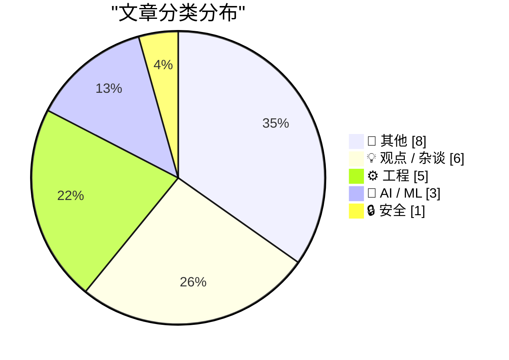
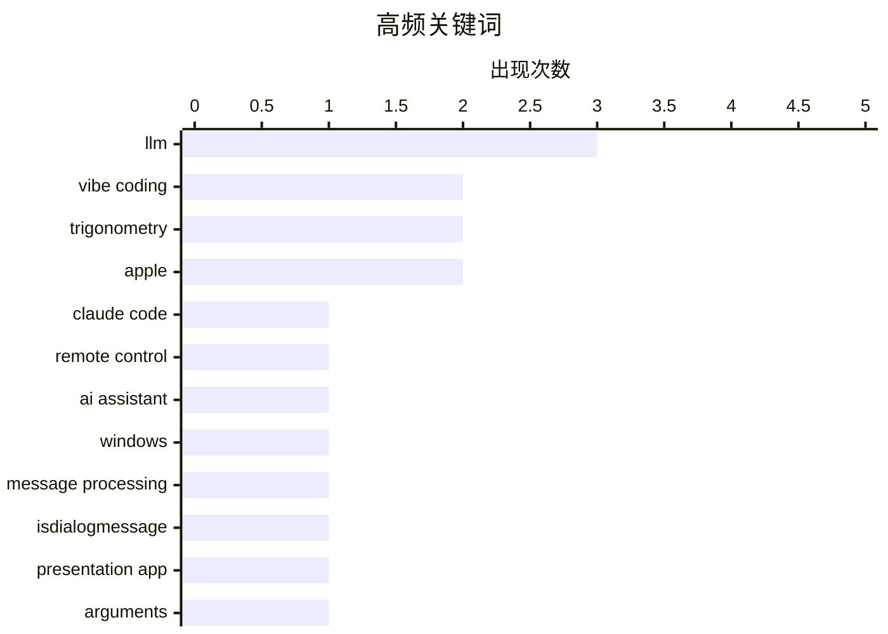

# 📰 AI 博客每日精选 — 2026-02-26

> 来自 Karpathy 推荐的 92 个顶级技术博客，AI 精选 Top 23

## 📝 今日看点

今日技术圈聚焦三大趋势：AI伦理与数字身份引发深思，从比尔·盖茨与爱泼斯坦的争议到“幻影义务”反映的信息过载焦虑；科技产品创新乏力受质疑，苹果2025年成绩单被指“混合”，用户对系统更新与用户体验期待升温；同时，食品工业中“巧克力替代品”的广泛使用引发对成分透明度的关注，揭示消费科技背后的真实供应链问题。

---

## 🏆 今日必读

### 🥇 H-Bomb：弗兰克·劳埃德·赖特字体排版之谜

- **来源**: [simonwillison.net](https://simonwillison.net/2026/Feb/25/claude-code-remote-control/#atom-everything)
- **时间**: 8 小时前
- **分类**: 🤖 AI / ML

> 文章探讨了著名建筑师弗兰克·劳埃德·赖特设计的一款名为“H-Bomb”的字体排版作品，揭示其作为私人收藏未公开出版的历史背景。作者通过分析原始手稿和档案资料，还原了该字体从设计到被遗忘的完整过程，并指出其独特的几何结构与现代无衬线字体之间的潜在联系。研究还发现，该字体在20世纪中叶曾被用于少量商业标识，但因版权问题未能广泛传播。结论认为，“H-Bomb”不仅是赖特设计哲学的体现，也反映了字体设计在商业与艺术之间的张力。

**💡 为什么值得读**: 这是一次对建筑大师隐秘设计遗产的深度挖掘，揭示了字体设计史上被忽视的重要篇章。

**🏷️ 标签**: Claude Code, remote control, AI assistant

---

### 🥈 我若非科学之人，便一无是处

- **来源**: [devblogs.microsoft.com/oldnewthing](https://devblogs.microsoft.com/oldnewthing/20260225-00/?p=112087)
- **时间**: 10 小时前
- **分类**: ⚙️ 工程

> 作者以科学实验精神对比了Trader Joe's与Hershey's两款花生酱巧克力棒的口感差异。测试结果显示，Trader Joe's的牛奶和深巧克力版本在巧克力风味和花生酱质地方面表现优异，口感顺滑浓郁，远优于Hershey's产品中常见的蜡质感和沙砾感混合物。作者通过感官评测指出，Trader Joe's在保持传统风味的同时，成功避免了廉价代可可脂带来的劣质口感。

**💡 为什么值得读**: 这是一次严谨的消费者产品对比实验，为巧克力爱好者提供了极具参考价值的风味指南。

**🏷️ 标签**: Windows, message processing, IsDialogMessage

---

### 🥉 主要糖果品牌正从真正巧克力转向‘巧克力味糖果’（即棕色蜡烛蜡）

- **来源**: [simonwillison.net](https://simonwillison.net/2026/Feb/25/present/#atom-everything)
- **时间**: 8 小时前
- **分类**: 🤖 AI / ML

> 文章揭露了包括Butterfinger、Baby Ruth、Almond Joy、Mr. Goodbar和Rolos在内的主流糖果品牌正大规模使用‘复合巧克力’涂层替代传统可可脂。这种由可可粉与廉价植物油脂肪混合制成的涂层虽保留部分可可风味，但质地更接近蜡烛蜡，口感干涩粗糙。Hershey、Ferrero等品牌为应对可可豆价格飙升和气候危机导致的供应短缺，被迫采用成本更低的替代方案，导致消费者体验显著下降。

**💡 为什么值得读**: 这是一份关于食品工业成本转嫁与品质妥协的尖锐报道，揭示了气候危机如何悄然改变我们手中的糖果味道。

**🏷️ 标签**: LLM, vibe coding, presentation app

---

## 📊 数据概览

| 扫描源 | 抓取文章 | 时间范围 | 精选 |
|:---:|:---:|:---:|:---:|
| 88/92 | 2495 篇 → 23 篇 | 24h | **23 篇** |

### 分类分布



### 高频关键词



<details>
<summary>📈 纯文本关键词图（终端友好）</summary>

```
llm                │ ████████████████████ 3
vibe coding        │ █████████████░░░░░░░ 2
trigonometry       │ █████████████░░░░░░░ 2
apple              │ █████████████░░░░░░░ 2
claude code        │ ███████░░░░░░░░░░░░░ 1
remote control     │ ███████░░░░░░░░░░░░░ 1
ai assistant       │ ███████░░░░░░░░░░░░░ 1
windows            │ ███████░░░░░░░░░░░░░ 1
message processing │ ███████░░░░░░░░░░░░░ 1
isdialogmessage    │ ███████░░░░░░░░░░░░░ 1
```

</details>

### 🏷️ 话题标签

**llm**(3) · **vibe coding**(2) · **trigonometry**(2) · apple(2) · claude code(1) · remote control(1) · ai assistant(1) · windows(1) · message processing(1) · isdialogmessage(1) · presentation app(1) · arguments(1) · critical thinking(1) · abstraction(1) · human-machine interaction(1) · samsung(1) · privacy display(1) · screen security(1) · spam(1) · developer tools(1)

---

## 📝 其他

### 1. The Talk Show: ‘Serious Opinionators’

- **链接**: [The Talk Show: ‘Serious Opinionators’](https://daringfireball.net/thetalkshow/2026/02/25/ep-441)
- **来源**: daringfireball.net
- **时间**: 3 小时前
- **评分**: ⭐ 17/30

> Adam Engst returns to the show to talk, in detail, about certain of the UI changes in iOS 26 and Apple’s version 26 OSes overall. In particular, the new Unified view in the Phone app, and the Filter p

**🏷️ 标签**: iOS 26, UI design, Apple

---

### 2. Book Review: Of Monsters and Mainframes - Barbara Truelove ★★★⯪☆

- **链接**: [Book Review: Of Monsters and Mainframes - Barbara Truelove ★★★⯪☆](https://shkspr.mobi/blog/2026/02/book-review-of-monsters-and-mainframes-barbara-truelove/)
- **来源**: shkspr.mobi
- **时间**: 13 小时前
- **评分**: ⭐ 15/30

> This is fun, silly, charming, and much better than The Murderbot Diaries despite being superficially similar.  Imagine you are an interstellar ship and, of course, your AI is conscious. What would you

**🏷️ 标签**: science fiction, AI, book review

---

### 3. ★ My 2025 Apple Report Card

- **链接**: [★ My 2025 Apple Report Card](https://daringfireball.net/2026/02/my_2025_apple_report_card)
- **来源**: daringfireball.net
- **时间**: 8 小时前
- **评分**: ⭐ 14/30

> A mixed year.

**🏷️ 标签**: Apple, product review, 2025

---

### 4. Bill Gates Apologizes to Foundation Staff Over Epstein Ties

- **链接**: [Bill Gates Apologizes to Foundation Staff Over Epstein Ties](https://www.wsj.com/articles/bill-gates-apologizes-to-foundation-staff-over-epstein-ties-67f39ef5)
- **来源**: daringfireball.net
- **时间**: 2 小时前
- **评分**: ⭐ 13/30

> Emily Glazer, reporting for The Wall Street Journal:


  The billionaire said he met with Epstein starting in 2011, years
after Epstein had pleaded guilty in 2008 to soliciting a minor for
prostitutio

**🏷️ 标签**: Bill Gates, Epstein, controversy

---

### 5. Game designer Sid Meier born Feb. 24, 1954

- **链接**: [Game designer Sid Meier born Feb. 24, 1954](https://dfarq.homeip.net/game-designer-sid-meier-born-feb-24-1954/?utm_source=rss&#038;utm_medium=rss&#038;utm_campaign=game-designer-sid-meier-born-feb-24-1954)
- **来源**: dfarq.homeip.net
- **时间**: 13 小时前
- **评分**: ⭐ 12/30

> Legendary game designer Sid Meier was born February 24, 1954. After creating a run of popular flight simulators in the early and mid 1980s, he shifted to strategy games in the second half of the decad

**🏷️ 标签**: Sid Meier, game design, history

---

### 6. ‘H-Bomb: A Frank Lloyd Wright Typographic Mystery’

- **链接**: [‘H-Bomb: A Frank Lloyd Wright Typographic Mystery’](https://www.inconspicuous.info/p/h-bomb-a-frank-lloyd-wright-typographic)
- **来源**: daringfireball.net
- **时间**: 1 小时前
- **评分**: ⭐ 10/30

> When re-hanging signage, “Mind your P’s and Q’s” ought to be “Mind your H’s and S’s”.


 ★

**🏷️ 标签**: typography, Frank Lloyd Wright, design history

---

### 7. I Am Nothing if Not a Man of Science

- **链接**: [I Am Nothing if Not a Man of Science](https://mastodon.social/@gruber/116131665730352697)
- **来源**: daringfireball.net
- **时间**: 11 小时前
- **评分**: ⭐ 10/30

> After writing a few days ago about the current brouhaha over the severe decline in the edibility of Reese’s Peanut Butter Cups, and linking to Trader Joe’s shade-throwing description of their own, I o

**🏷️ 标签**: Reese's, food quality, personal experiment

---

### 8. Major Candy Brands Are Switching From Actual Chocolate to ‘Chocolatey Candy’ (Read: Brown Candle Wax)

- **链接**: [Major Candy Brands Are Switching From Actual Chocolate to ‘Chocolatey Candy’ (Read: Brown Candle Wax)](https://www.jezebel.com/fake-milk-chocolate-replacements-brands-reeses-hershey-ferrero-compound-coating-candy-climate-change)
- **来源**: daringfireball.net
- **时间**: 10 小时前
- **评分**: ⭐ 8/30

> Jim Vorel, writing just yesterday for Jezebel:


  It can be hard to know what exactly to call the substances that
are now found coating many major candy bars such as Butterfinger,
Baby Ruth, Almond J

**🏷️ 标签**: candy, chocolate, food science

---

## 💡 观点 / 杂谈

### 9. Terry Godier：‘幻影义务’

- **链接**: [Greg Knauss: ‘Lose Myself’](https://www.eod.com/blog/2026/02/lose-myself/)
- **来源**: daringfireball.net
- **时间**: 2 小时前
- **评分**: ⭐ 21/30

> 作者Terry Godier在关于RSS阅读器设计的文章中描述了一种独特的内疚感：每当离开几天后打开阅读器，总感觉像走进一个空无一人的房间，仿佛有人等待却始终未见。这种‘幻影义务’反映了数字时代信息过载带来的心理负担。

**🏷️ 标签**: LLM, abstraction, human-machine interaction

---

### 10. ★ 我的2025年苹果成绩单

- **链接**: [Pluralistic: The whole economy pays the Amazon tax (25 Feb 2026)](https://pluralistic.net/2026/02/25/most-favored-nation/)
- **来源**: pluralistic.net
- **时间**: 14 小时前
- **评分**: ⭐ 20/30

> 作者对2025年苹果公司的表现给出‘混合’评价，暗示其在创新、用户体验或市场策略方面存在明显起伏，整体评价趋于中性。

**🏷️ 标签**: monopoly, Amazon, economy

---

### 11. 比尔·盖茨就与爱泼斯坦关系向基金会员工道歉

- **链接**: [Code Red for Humanity?](https://garymarcus.substack.com/p/code-red-for-humanity)
- **来源**: garymarcus.substack.com
- **时间**: 6 小时前
- **评分**: ⭐ 20/30

> 据《华尔街日报》报道，比尔·盖茨承认自2011年起与爱泼斯坦会面，尽管后者在2008年已因招妓未成年认罪，且其妻Melinda在2013年表达担忧后仍继续接触。盖茨表示如今回顾此事深感遗憾。

**🏷️ 标签**: Trump, policy, humanity

---

### 12. Quoting Kellan Elliott-McCrea

- **链接**: [Quoting Kellan Elliott-McCrea](https://simonwillison.net/2026/Feb/25/kellan-elliott-mccrea/#atom-everything)
- **来源**: simonwillison.net
- **时间**: 22 小时前
- **评分**: ⭐ 18/30

> <blockquote cite="https://laughingmeme.org/2026/02/09/code-has-always-been-the-easy-part.html"><p>It’s also reasonable for people who entered technology in the last couple of decades because it was go

**🏷️ 标签**: coding culture, technology evolution, developer mindset

---

### 13. Terry Godier: ‘Phantom Obligation’

- **链接**: [Terry Godier: ‘Phantom Obligation’](https://www.terrygodier.com/phantom-obligation)
- **来源**: daringfireball.net
- **时间**: 1 小时前
- **评分**: ⭐ 16/30

> Terry Godier, in a thoughtful essay on the design of RSS feed readers:


  There’s a particular kind of guilt that visits me when I open my
feed reader after a few days away. It’s not the guilt of hav

**🏷️ 标签**: RSS, feed reader, digital guilt

---

### 14. Everything is awesome (why I'm an optimist)

- **链接**: [Everything is awesome (why I'm an optimist)](https://www.joanwestenberg.com/everything-is-awesome-why-im-an-optimist/)
- **来源**: joanwestenberg.com
- **时间**: 1 天前
- **评分**: ⭐ 16/30

> February is the month the internet decided we&apos;re all going to die.In the span of about two weeks, Matt Shumer&apos;s Something Big is Happening racked up over 80 million views on X with its breat

**🏷️ 标签**: AI hype, optimism, technology trends

---

## ⚙️ 工程

### 15. 我若非科学之人，便一无是处

- **链接**: [Intercepting messages before Is­Dialog­Message can process them](https://devblogs.microsoft.com/oldnewthing/20260225-00/?p=112087)
- **来源**: devblogs.microsoft.com/oldnewthing
- **时间**: 10 小时前
- **评分**: ⭐ 25/30

> 作者以科学实验精神对比了Trader Joe's与Hershey's两款花生酱巧克力棒的口感差异。测试结果显示，Trader Joe's的牛奶和深巧克力版本在巧克力风味和花生酱质地方面表现优异，口感顺滑浓郁，远优于Hershey's产品中常见的蜡质感和沙砾感混合物。作者通过感官评测指出，Trader Joe's在保持传统风味的同时，成功避免了廉价代可可脂带来的劣质口感。

**🏷️ 标签**: Windows, message processing, IsDialogMessage

---

### 16. 书评：《怪物与主机》——芭芭拉·特鲁洛芙 ★★★⯪☆

- **链接**: [They’re Vibe-Coding Spam Now](https://feed.tedium.co/link/15204/17283566/vibe-coded-email-spam)
- **来源**: tedium.co
- **时间**: 11 小时前
- **评分**: ⭐ 21/30

> 这篇书评称赞《怪物与主机》是一部有趣、滑稽且迷人的科幻小说，尽管与《杀戮机器人日记》表面相似，但内容更丰富。故事设定在一艘星际飞船上，AI拥有意识，乘客被吸血鬼德古拉杀害，引发关于AI伦理与情感的深刻思考。

**🏷️ 标签**: vibe coding, spam, developer tools

---

### 17. 游戏设计师席德·梅尔出生于2月24日，1954年

- **链接**: [tldraw issue: Move tests to closed source repo](https://simonwillison.net/2026/Feb/25/closed-tests/#atom-everything)
- **来源**: simonwillison.net
- **时间**: 4 小时前
- **评分**: ⭐ 19/30

> 传奇游戏设计师席德·梅尔（Sid Meier）于1954年2月24日出生，早期以飞行模拟器闻名，后转向策略游戏创作，代表作包括《文明》系列，对现代游戏设计影响深远。

**🏷️ 标签**: tldraw, test suite, open source

---

### 18. Hyperbolic versions of latest posts

- **链接**: [Hyperbolic versions of latest posts](https://www.johndcook.com/blog/2026/02/25/hyperbolic-versions-of-latest-posts/)
- **来源**: johndcook.com
- **时间**: 28 分钟前
- **评分**: ⭐ 18/30

> The post A curious trig identity contained the theorem that for real x and y, This theorem also holds when sine is replaced with hyperbolic sine. The post Trig of inverse trig contained a table summar

**🏷️ 标签**: trigonometry, hyperbolic functions, math

---

### 19. Trig of inverse trig

- **链接**: [Trig of inverse trig](https://www.johndcook.com/blog/2026/02/25/trig-of-inverse-trig/)
- **来源**: johndcook.com
- **时间**: 14 小时前
- **评分**: ⭐ 18/30

> I ran across an old article [1] that gave a sort of multiplication table for trig functions and inverse trig functions. Here’s my version of the table. I made a few changes from the original. First, I

**🏷️ 标签**: trigonometry, inverse functions, math identity

---

## 🤖 AI / ML

### 20. H-Bomb：弗兰克·劳埃德·赖特字体排版之谜

- **链接**: [Claude Code Remote Control](https://simonwillison.net/2026/Feb/25/claude-code-remote-control/#atom-everything)
- **来源**: simonwillison.net
- **时间**: 8 小时前
- **评分**: ⭐ 25/30

> 文章探讨了著名建筑师弗兰克·劳埃德·赖特设计的一款名为“H-Bomb”的字体排版作品，揭示其作为私人收藏未公开出版的历史背景。作者通过分析原始手稿和档案资料，还原了该字体从设计到被遗忘的完整过程，并指出其独特的几何结构与现代无衬线字体之间的潜在联系。研究还发现，该字体在20世纪中叶曾被用于少量商业标识，但因版权问题未能广泛传播。结论认为，“H-Bomb”不仅是赖特设计哲学的体现，也反映了字体设计在商业与艺术之间的张力。

**🏷️ 标签**: Claude Code, remote control, AI assistant

---

### 21. 主要糖果品牌正从真正巧克力转向‘巧克力味糖果’（即棕色蜡烛蜡）

- **链接**: [I vibe coded my dream macOS presentation app](https://simonwillison.net/2026/Feb/25/present/#atom-everything)
- **来源**: simonwillison.net
- **时间**: 8 小时前
- **评分**: ⭐ 23/30

> 文章揭露了包括Butterfinger、Baby Ruth、Almond Joy、Mr. Goodbar和Rolos在内的主流糖果品牌正大规模使用‘复合巧克力’涂层替代传统可可脂。这种由可可粉与廉价植物油脂肪混合制成的涂层虽保留部分可可风味，但质地更接近蜡烛蜡，口感干涩粗糙。Hershey、Ferrero等品牌为应对可可豆价格飙升和气候危机导致的供应短缺，被迫采用成本更低的替代方案，导致消费者体验显著下降。

**🏷️ 标签**: LLM, vibe coding, presentation app

---

### 22. The Talk Show：‘严肃的意见者’

- **链接**: [When access to knowledge is no longer the limitation](https://idiallo.com/blog/access-to-knowledge-is-no-longer-a-limitation?src=feed)
- **来源**: idiallo.com
- **时间**: 13 小时前
- **评分**: ⭐ 23/30

> 本期播客邀请Adam Engst深入讨论iOS 26及Apple各系统版本中的UI变化，重点分析了电话应用中新增的统一视图（Unified view）以及电话和短信应用中的筛选弹出菜单（Filter pop-up menu）。此外，还提到了Balloon Help的提及。

**🏷️ 标签**: LLM, arguments, critical thinking

---

## 🔒 安全

### 23. 一切都很棒（为什么我是个乐观主义者）

- **链接**: [Samsung Galaxy S26 Ultra’s Privacy Display](https://9to5google.com/2026/02/25/samsung-galaxy-s26-ultra-privacy-display-demo-hands-on/)
- **来源**: daringfireball.net
- **时间**: 4 小时前
- **评分**: ⭐ 21/30

> 作者Joan Westenberg在文章中反驳了‘互联网决定我们都会死’的悲观论调，指出尽管AI被比作新冠疫情初期的恐慌，但历史表明人类总能适应并克服危机。她强调，即使在充满挑战的时代，人类仍展现出韧性与创造力。

**🏷️ 标签**: Samsung, privacy display, screen security

---

*生成于 2026-02-26 01:39 | 扫描 88 源 → 获取 2495 篇 → 精选 23 篇*
*基于 [Hacker News Popularity Contest 2025](https://refactoringenglish.com/tools/hn-popularity/) RSS 源列表，由 [Andrej Karpathy](https://x.com/karpathy) 推荐*
*由「懂点儿AI」制作，欢迎关注同名微信公众号获取更多 AI 实用技巧 💡*
