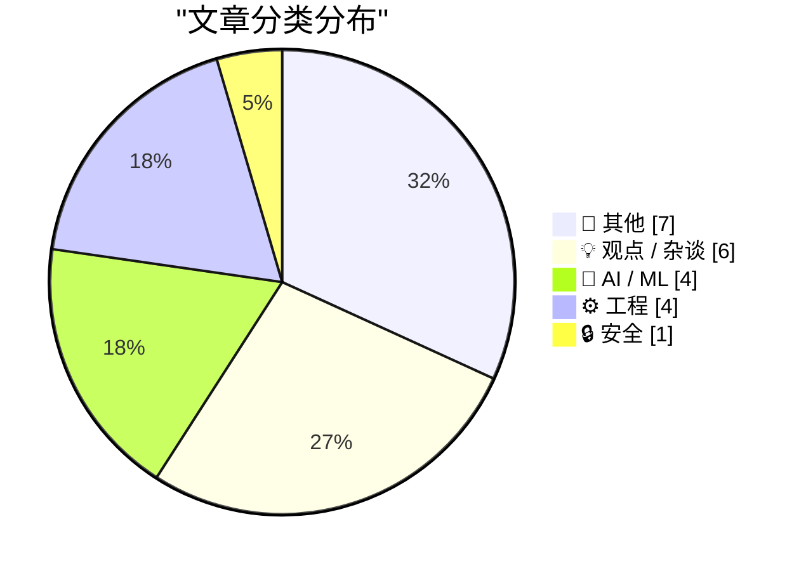
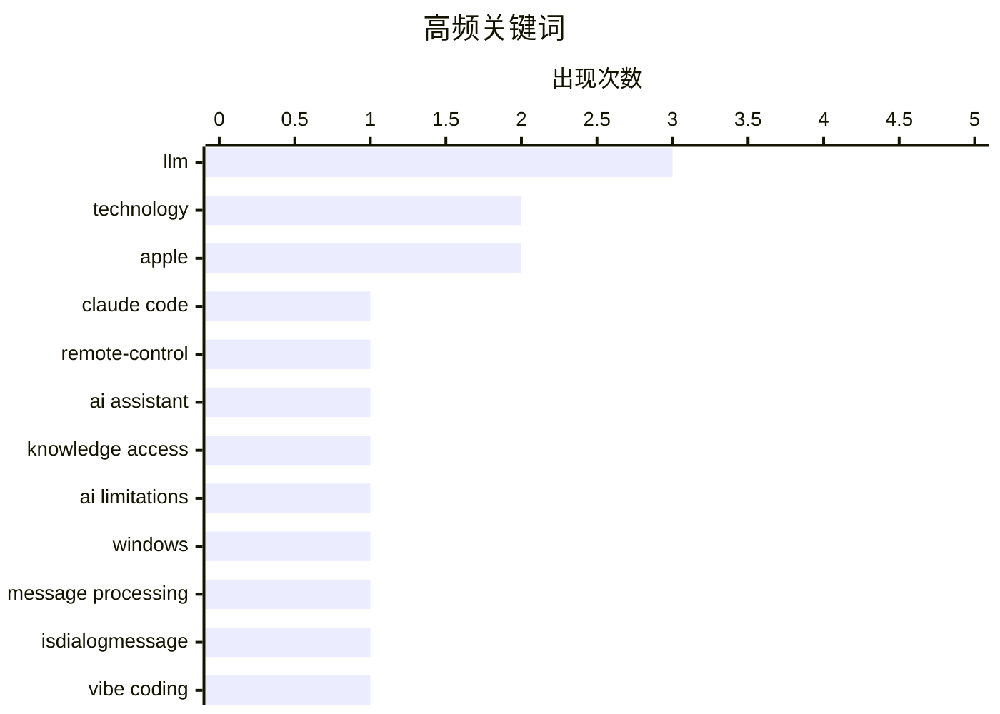

# 📰 AI 博客每日精选 — 2026-02-26

> 来自 Karpathy 推荐的 92 个顶级技术博客，AI 精选 Top 22

## 📝 今日看点

今日技术圈聚焦三大趋势：AI 伦理与认知变革引发热议，从 Reese's 巧克力实验到“vibe coding”实践，公众开始反思人机交互的本质；工程安全成焦点，tldraw 测试代码闭源暴露开源项目被复制的风险，三星则通过硬件级隐私显示技术回应数据窥探担忧；同时，垄断经济与政治动荡持续冲击技术生态，亚马逊“税负转嫁”与特朗普政策风险警示技术从业者需关注宏观环境变化。

---

## 🏆 今日必读

🥇 **我若非科学之人，便一无是处**

[Claude Code Remote Control](https://simonwillison.net/2026/Feb/25/claude-code-remote-control/#atom-everything) — simonwillison.net · 7 小时前 · 🤖 AI / ML

> 作者为验证 Reese's Peanut Butter Cups 巧克力品质下降的争议，以科学之名购买了 Trader Joe's 品牌的牛奶巧克力和黑巧克力版本进行对比测试。测试结果显示，Trader Joe's 的两种巧克力均口感出色，巧克力风味浓郁，不含蜡质感，花生酱部分则顺滑细腻，明显优于 Hershey 等品牌使用的劣质填充物。作者认为 Trader Joe's 的产品在口感上实现了对行业标准的超越。

💡 **为什么值得读**: 这是一次以科学精神进行的食品品质实证检验，揭示了主流巧克力品牌与精品超市品牌在原料和工艺上的显著差距。

🏷️ Claude Code, remote-control, AI assistant

🥈 **游戏设计师席德·梅尔出生于2月24日**

[When access to knowledge is no longer the limitation](https://idiallo.com/blog/access-to-knowledge-is-no-longer-a-limitation?src=feed) — idiallo.com · 13 小时前 · 🤖 AI / ML

> 传奇游戏设计师席德·梅尔（Sid Meier）于1954年2月24日出生，是《文明》系列等经典策略游戏的创作者。他在1980年代初期开发了多款受欢迎的飞行模拟器，随后在1980年代后期转向策略游戏开发，奠定了现代策略游戏的设计基础。

💡 **为什么值得读**: 了解席德·梅尔这位策略游戏之父的生平，有助于理解现代电子游戏设计的发展历程。

🏷️ LLM, knowledge access, AI limitations

🥉 **在 IsDialogMessage 处理前拦截消息**

[Intercepting messages before Is­Dialog­Message can process them](https://devblogs.microsoft.com/oldnewthing/20260225-00/?p=112087) — devblogs.microsoft.com/oldnewthing · 10 小时前 · ⚙️ 工程

> 该文讨论 Windows 消息处理机制中，如何通过拦截消息在 IsDialogMessage 处理前对其进行预处理。作者指出，若希望在对话框消息被标准化处理前干预其行为，必须在 IsDialogMessage 调用前捕获并修改消息。

💡 **为什么值得读**: 对于需要深度定制 Windows 对话框行为的高级开发者而言，这是理解底层消息流的关键技术点。

🏷️ Windows, message processing, IsDialogMessage

---

## 📊 数据概览

| 扫描源 | 抓取文章 | 时间范围 | 精选 |
|:---:|:---:|:---:|:---:|
| 87/92 | 2475 篇 → 22 篇 | 24h | **22 篇** |

### 分类分布



### 高频关键词



<details>
<summary>📈 纯文本关键词图（终端友好）</summary>

```
llm                │ ████████████████████ 3
technology         │ █████████████░░░░░░░ 2
apple              │ █████████████░░░░░░░ 2
claude code        │ ███████░░░░░░░░░░░░░ 1
remote-control     │ ███████░░░░░░░░░░░░░ 1
ai assistant       │ ███████░░░░░░░░░░░░░ 1
knowledge access   │ ███████░░░░░░░░░░░░░ 1
ai limitations     │ ███████░░░░░░░░░░░░░ 1
windows            │ ███████░░░░░░░░░░░░░ 1
message processing │ ███████░░░░░░░░░░░░░ 1
```

</details>

### 🏷️ 话题标签

**llm**(3) · **technology**(2) · **apple**(2) · claude code(1) · remote-control(1) · ai assistant(1) · knowledge access(1) · ai limitations(1) · windows(1) · message processing(1) · isdialogmessage(1) · vibe coding(1) · presentation(1) · monopoly(1) · amazon(1) · economic policy(1) · ai optimism(1) · future(1) · abstraction(1) · human-machine interaction(1)

---

## 📝 其他

### 1. Book Review: Of Monsters and Mainframes - Barbara Truelove ★★★⯪☆

[Book Review: Of Monsters and Mainframes - Barbara Truelove ★★★⯪☆](https://shkspr.mobi/blog/2026/02/book-review-of-monsters-and-mainframes-barbara-truelove/) — **shkspr.mobi** · 12 小时前 · ⭐ 18/30

> This is fun, silly, charming, and much better than The Murderbot Diaries despite being superficially similar.  Imagine you are an interstellar ship and, of course, your AI is conscious. What would you

🏷️ science fiction, AI consciousness, book review

---

### 2. ★ My 2025 Apple Report Card

[★ My 2025 Apple Report Card](https://daringfireball.net/2026/02/my_2025_apple_report_card) — **daringfireball.net** · 8 小时前 · ⭐ 17/30

> A mixed year.

🏷️ Apple, product review, 2025

---

### 3. Bill Gates Apologizes to Foundation Staff Over Epstein Ties

[Bill Gates Apologizes to Foundation Staff Over Epstein Ties](https://www.wsj.com/articles/bill-gates-apologizes-to-foundation-staff-over-epstein-ties-67f39ef5) — **daringfireball.net** · 1 小时前 · ⭐ 15/30

> Emily Glazer, reporting for The Wall Street Journal:


  The billionaire said he met with Epstein starting in 2011, years
after Epstein had pleaded guilty in 2008 to soliciting a minor for
prostitutio

🏷️ Bill Gates, Epstein, controversy

---

### 4. ‘H-Bomb: A Frank Lloyd Wright Typographic Mystery’

[‘H-Bomb: A Frank Lloyd Wright Typographic Mystery’](https://www.inconspicuous.info/p/h-bomb-a-frank-lloyd-wright-typographic) — **daringfireball.net** · 1 小时前 · ⭐ 12/30

> When re-hanging signage, “Mind your P’s and Q’s” ought to be “Mind your H’s and S’s”.


 ★

🏷️ typography, Frank Lloyd Wright, H-bomb

---

### 5. Major Candy Brands Are Switching From Actual Chocolate to ‘Chocolatey Candy’ (Read: Brown Candle Wax)

[Major Candy Brands Are Switching From Actual Chocolate to ‘Chocolatey Candy’ (Read: Brown Candle Wax)](https://www.jezebel.com/fake-milk-chocolate-replacements-brands-reeses-hershey-ferrero-compound-coating-candy-climate-change) — **daringfireball.net** · 9 小时前 · ⭐ 11/30

> Jim Vorel, writing just yesterday for Jezebel:


  It can be hard to know what exactly to call the substances that
are now found coating many major candy bars such as Butterfinger,
Baby Ruth, Almond J

🏷️ candy, chocolate, food science

---

### 6. I Am Nothing if Not a Man of Science

[I Am Nothing if Not a Man of Science](https://mastodon.social/@gruber/116131665730352697) — **daringfireball.net** · 10 小时前 · ⭐ 11/30

> After writing a few days ago about the current brouhaha over the severe decline in the edibility of Reese’s Peanut Butter Cups, and linking to Trader Joe’s shade-throwing description of their own, I o

🏷️ Reese's, food quality, personal experiment

---

### 7. Game designer Sid Meier born Feb. 24, 1954

[Game designer Sid Meier born Feb. 24, 1954](https://dfarq.homeip.net/game-designer-sid-meier-born-feb-24-1954/?utm_source=rss&#038;utm_medium=rss&#038;utm_campaign=game-designer-sid-meier-born-feb-24-1954) — **dfarq.homeip.net** · 13 小时前 · ⭐ 10/30

> Legendary game designer Sid Meier was born February 24, 1954. After creating a run of popular flight simulators in the early and mid 1980s, he shifted to strategy games in the second half of the decad

🏷️ Sid Meier, game design, history

---

## 💡 观点 / 杂谈

### 8. 整个经济体都在为亚马逊税买单

[Pluralistic: The whole economy pays the Amazon tax (25 Feb 2026)](https://pluralistic.net/2026/02/25/most-favored-nation/) — **pluralistic.net** · 13 小时前 · ⭐ 24/30

> 文章批判性地指出，消费者无法通过选择其他平台来摆脱垄断带来的负面影响，所谓的“用脚投票”并不能解决根本问题。作者认为，亚马逊等平台通过规模效应和排他性协议构建的垄断结构，最终会让整个经济体系为其承担成本。

🏷️ monopoly, Amazon, economic policy

---

### 9. 一切都很棒（为什么我是个乐观主义者）

[Everything is awesome (why I'm an optimist)](https://www.joanwestenberg.com/everything-is-awesome-why-im-an-optimist/) — **joanwestenberg.com** · 23 小时前 · ⭐ 24/30

> 作者指出，尽管二月份网络上充斥着对 AI 的末日预言（如 Matt Rumer 的“Something Big is Happening”视频在 X 平台获得超 8000 万观看），但作者仍保持乐观。他认为，尽管存在争议，AI 带来的积极变革远大于其潜在风险。

🏷️ AI optimism, technology, future

---

### 10. 人类的红灯警报？

[Code Red for Humanity?](https://garymarcus.substack.com/p/code-red-for-humanity) — **garymarcus.substack.com** · 6 小时前 · ⭐ 22/30

> 文章警告称，特朗普政府正在‘玩火’，暗示其政策可能对全球稳定构成严重威胁。作者认为当前的政治局势已接近临界点，需要引起高度警惕。

🏷️ AI risk, policy, humanity

---

### 11. Quoting Kellan Elliott-McCrea

[Quoting Kellan Elliott-McCrea](https://simonwillison.net/2026/Feb/25/kellan-elliott-mccrea/#atom-everything) — **simonwillison.net** · 21 小时前 · ⭐ 20/30

> <blockquote cite="https://laughingmeme.org/2026/02/09/code-has-always-been-the-easy-part.html"><p>It’s also reasonable for people who entered technology in the last couple of decades because it was go

🏷️ technology, coding culture, career reflection

---

### 12. They’re Vibe-Coding Spam Now

[They’re Vibe-Coding Spam Now](https://feed.tedium.co/link/15204/17283566/vibe-coded-email-spam) — **tedium.co** · 11 小时前 · ⭐ 19/30

> The problem with making coding easier for more people is that it makes spam more conventionally attractive. Which is bad.

🏷️ vibe-coding, spam, AI-generated content

---

### 13. Terry Godier: ‘Phantom Obligation’

[Terry Godier: ‘Phantom Obligation’](https://www.terrygodier.com/phantom-obligation) — **daringfireball.net** · 1 小时前 · ⭐ 18/30

> Terry Godier, in a thoughtful essay on the design of RSS feed readers:


  There’s a particular kind of guilt that visits me when I open my
feed reader after a few days away. It’s not the guilt of hav

🏷️ RSS, feed reader, digital guilt

---

## 🤖 AI / ML

### 14. 我若非科学之人，便一无是处

[Claude Code Remote Control](https://simonwillison.net/2026/Feb/25/claude-code-remote-control/#atom-everything) — **simonwillison.net** · 7 小时前 · ⭐ 25/30

> 作者为验证 Reese's Peanut Butter Cups 巧克力品质下降的争议，以科学之名购买了 Trader Joe's 品牌的牛奶巧克力和黑巧克力版本进行对比测试。测试结果显示，Trader Joe's 的两种巧克力均口感出色，巧克力风味浓郁，不含蜡质感，花生酱部分则顺滑细腻，明显优于 Hershey 等品牌使用的劣质填充物。作者认为 Trader Joe's 的产品在口感上实现了对行业标准的超越。

🏷️ Claude Code, remote-control, AI assistant

---

### 15. 游戏设计师席德·梅尔出生于2月24日

[When access to knowledge is no longer the limitation](https://idiallo.com/blog/access-to-knowledge-is-no-longer-a-limitation?src=feed) — **idiallo.com** · 13 小时前 · ⭐ 25/30

> 传奇游戏设计师席德·梅尔（Sid Meier）于1954年2月24日出生，是《文明》系列等经典策略游戏的创作者。他在1980年代初期开发了多款受欢迎的飞行模拟器，随后在1980年代后期转向策略游戏开发，奠定了现代策略游戏的设计基础。

🏷️ LLM, knowledge access, AI limitations

---

### 16. 我用 vibe coding 打造了我的理想 macOS 演示应用

[I vibe coded my dream macOS presentation app](https://simonwillison.net/2026/Feb/25/present/#atom-everything) — **simonwillison.net** · 8 小时前 · ⭐ 24/30

> Simon Willison 在 Social Science FOO Camp 发表了一场题为《LLM 现状：2026 年 2 月版》的即兴演讲，副标题为“自 11 月以来一切都变了！”。他在演讲前一晚使用 vibe coding 方式快速开发了一款定制化的 macOS 演示应用，展示了 AI 辅助开发的强大能力。

🏷️ LLM, vibe coding, presentation

---

### 17. 迷失自我

[Greg Knauss: ‘Lose Myself’](https://www.eod.com/blog/2026/02/lose-myself/) — **daringfireball.net** · 2 小时前 · ⭐ 23/30

> Greg Knauss 认为，用英语与大型语言模型交流虽然看似远离了机器的物理本质，但这就像工业化改变了人类与食物的关系一样，是一种根本性的转变。他主张，不应因抽象层级而否定其价值，而应关注其带来的新可能性。

🏷️ LLM, abstraction, human-machine interaction

---

## ⚙️ 工程

### 18. 在 IsDialogMessage 处理前拦截消息

[Intercepting messages before Is­Dialog­Message can process them](https://devblogs.microsoft.com/oldnewthing/20260225-00/?p=112087) — **devblogs.microsoft.com/oldnewthing** · 10 小时前 · ⭐ 25/30

> 该文讨论 Windows 消息处理机制中，如何通过拦截消息在 IsDialogMessage 处理前对其进行预处理。作者指出，若希望在对话框消息被标准化处理前干预其行为，必须在 IsDialogMessage 调用前捕获并修改消息。

🏷️ Windows, message processing, IsDialogMessage

---

### 19. tldraw 问题：将测试移至闭源仓库

[tldraw issue: Move tests to closed source repo](https://simonwillison.net/2026/Feb/25/closed-tests/#atom-everything) — **simonwillison.net** · 4 小时前 · ⭐ 21/30

> tldraw 团队发现，一个全面的测试套件足以让开发者从零开始用不同语言重新实现整个开源库。这引发了关于商业开源项目安全性的担忧，因为测试代码若公开，可能被竞争对手利用来快速复刻产品。

🏷️ tldraw, test-suite, open-source

---

### 20. The Talk Show: ‘Serious Opinionators’

[The Talk Show: ‘Serious Opinionators’](https://daringfireball.net/thetalkshow/2026/02/25/ep-441) — **daringfireball.net** · 2 小时前 · ⭐ 19/30

> Adam Engst returns to the show to talk, in detail, about certain of the UI changes in iOS 26 and Apple’s version 26 OSes overall. In particular, the new Unified view in the Phone app, and the Filter p

🏷️ iOS 26, UI design, Apple

---

### 21. Trig of inverse trig

[Trig of inverse trig](https://www.johndcook.com/blog/2026/02/25/trig-of-inverse-trig/) — **johndcook.com** · 14 小时前 · ⭐ 19/30

> I ran across an old article [1] that gave a sort of multiplication table for trig functions and inverse trig functions. Here’s my version of the table. I made a few changes from the original. First, I

🏷️ trigonometry, inverse trig, mathematics

---

## 🔒 安全

### 22. 三星 Galaxy S26 Ultra 隐私显示功能

[Samsung Galaxy S26 Ultra’s Privacy Display](https://9to5google.com/2026/02/25/samsung-galaxy-s26-ultra-privacy-display-demo-hands-on/) — **daringfireball.net** · 4 小时前 · ⭐ 21/30

> 三星 Galaxy S26 Ultra 引入了新的隐私显示功能，通过改变像素发光方式，使屏幕在侧视角度下更难被他人窥屏。该功能包含默认和‘最大’两种设置，后者进一步缩小可视范围，增强隐私保护。

🏷️ privacy display, Samsung, Galaxy S26

---

*生成于 2026-02-26 01:07 | 扫描 87 源 → 获取 2475 篇 → 精选 22 篇*
*基于 [Hacker News Popularity Contest 2025](https://refactoringenglish.com/tools/hn-popularity/) RSS 源列表，由 [Andrej Karpathy](https://x.com/karpathy) 推荐*
*由「懂点儿AI」制作，欢迎关注同名微信公众号获取更多 AI 实用技巧 💡*
