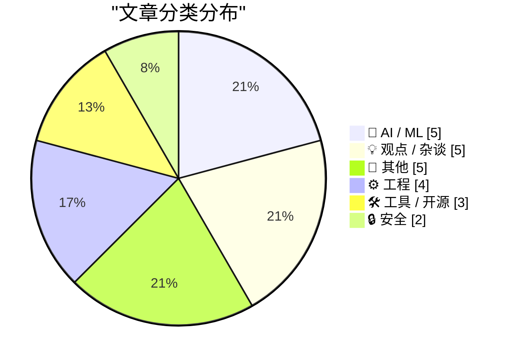
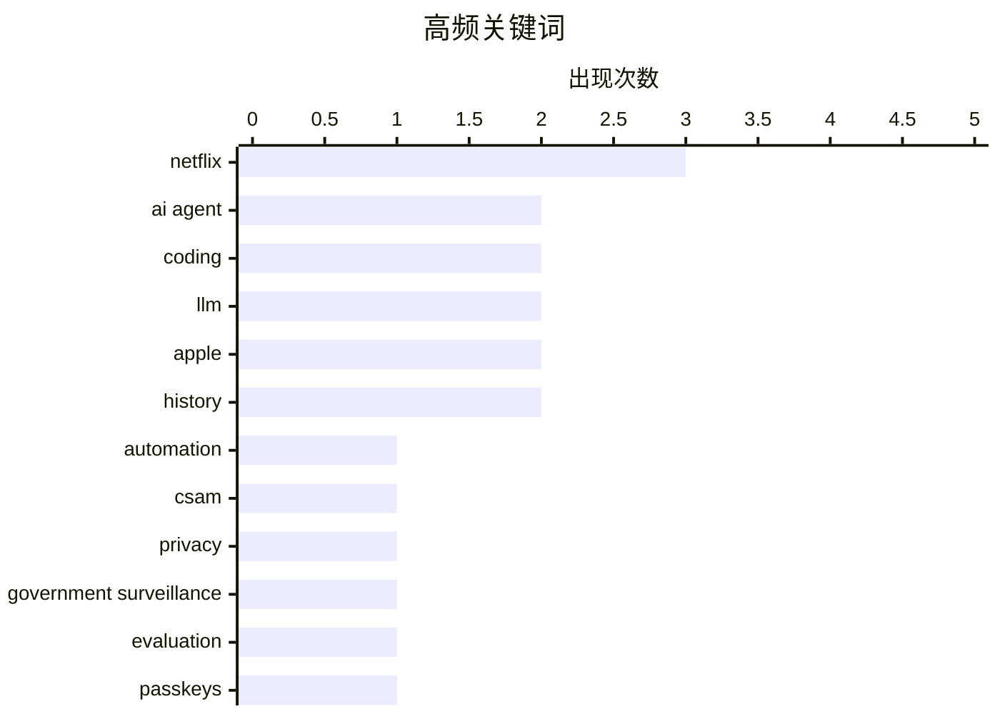

# 📰 AI 博客每日精选 — 2026-02-28

> 来自 Karpathy 推荐的 92 个顶级技术博客，AI 精选 Top 24

## 📝 今日看点

今日技术圈聚焦三大趋势：AI 商业化争议升温，OpenAI 融资遭质疑，而 Anthropic 则推出面向开源维护者的免费 Claude Max 计划，推动 AI 工具普惠；科技巨头战略调整频繁，Block 大规模裁员引发关注，苹果则借 F1 赛事与 Netflix 达成内容合作，探索娱乐与科技融合新路径；同时，技术社区持续深耕底层创新，从 Windows 消息机制优化到 Unicode 探索工具，展现工程细节与效率提升的双重追求。

---

## 🏆 今日必读

### 🥇 苹果公布F1转播详情，并宣布与Netflix达成意外合作

- **来源**: [simonwillison.net](https://simonwillison.net/2026/Feb/27/ai-agent-coding-in-excessive-detail/#atom-everything)
- **时间**: 3 小时前
- **分类**: 🤖 AI / ML

> 苹果与Netflix宣布达成内容互换协议，打破双方在视频内容领域的冷淡关系。此次合作围绕F1赛事展开，Netflix热门纪录片《极速求生》的成功推动了F1在美国的人气上升。最新一季《极速求生》将于周五同步在Netflix和苹果平台首播。这一合作被视为苹果拓展体育内容生态的重要一步。

**💡 为什么值得读**: 揭示了苹果如何通过非传统内容合作强化其媒体战略，尤其在与Netflix的罕见联动中展现跨平台整合能力。

**🏷️ 标签**: AI agent, coding, LLM, automation

---

### 🥈 《私募股权的仇恨者指南》

- **来源**: [daringfireball.net](https://www.techdirt.com/2026/02/25/west-virginias-anti-apple-csam-lawsuit-would-help-child-predators-walk-free/)
- **时间**: 4 小时前
- **分类**: 🔒 安全

> 文章批判当前全球情报危机，指出大量专业人士在金融分析中表现出严重认知偏差。以Citrini Research发布的《2028全球情报危机》报告为例，该报告充满煽动性恐慌内容，缺乏基本事实依据。作者认为这种‘伪深度分析’正在误导公众对金融体系的理解。

**💡 为什么值得读**: 揭示了私募股权行业如何通过制造虚假危机叙事来操控市场情绪，对投资者具有重要警示意义。

**🏷️ 标签**: CSAM, Apple, privacy, government surveillance

---

### 🥉 《模拟古董商》第14章：对话

- **来源**: [minimaxir.com](https://minimaxir.com/2026/02/ai-agent-coding/)
- **时间**: 6 小时前
- **分类**: 🤖 AI / ML

> 本期《模拟古董商》聚焦于早期计算机系统中的人机交互设计。文章深入探讨了1960年代PDP-1计算机上运行的TECO文本编辑器如何通过简单的命令实现复杂文本处理，展示了早期程序员如何通过极简界面创造强大功能。

**💡 为什么值得读**: 通过历史案例揭示现代计算界面设计的基本逻辑，为理解当前交互范式提供重要历史视角。

**🏷️ 标签**: AI agent, coding, LLM, evaluation

---

## 📊 数据概览

| 扫描源 | 抓取文章 | 时间范围 | 精选 |
|:---:|:---:|:---:|:---:|
| 89/92 | 2508 篇 → 24 篇 | 24h | **24 篇** |

### 分类分布



### 高频关键词



<details>
<summary>📈 纯文本关键词图（终端友好）</summary>

```
netflix                 │ ████████████████████ 3
ai agent                │ █████████████░░░░░░░ 2
coding                  │ █████████████░░░░░░░ 2
llm                     │ █████████████░░░░░░░ 2
apple                   │ █████████████░░░░░░░ 2
history                 │ █████████████░░░░░░░ 2
automation              │ ███████░░░░░░░░░░░░░ 1
csam                    │ ███████░░░░░░░░░░░░░ 1
privacy                 │ ███████░░░░░░░░░░░░░ 1
government surveillance │ ███████░░░░░░░░░░░░░ 1
```

</details>

### 🏷️ 话题标签

**netflix**(3) · **ai agent**(2) · **coding**(2) · llm(2) · apple(2) · history(2) · automation(1) · csam(1) · privacy(1) · government surveillance(1) · evaluation(1) · passkeys(1) · encryption(1) · user data(1) · security risk(1) · claude max(1) · open source(1) · ai tools(1) · anthropic(1) · windows(1)

---

## 🤖 AI / ML

### 1. 苹果公布F1转播详情，并宣布与Netflix达成意外合作

- **链接**: [An AI agent coding skeptic tries AI agent coding, in excessive detail](https://simonwillison.net/2026/Feb/27/ai-agent-coding-in-excessive-detail/#atom-everything)
- **来源**: simonwillison.net
- **时间**: 3 小时前
- **评分**: ⭐ 27/30

> 苹果与Netflix宣布达成内容互换协议，打破双方在视频内容领域的冷淡关系。此次合作围绕F1赛事展开，Netflix热门纪录片《极速求生》的成功推动了F1在美国的人气上升。最新一季《极速求生》将于周五同步在Netflix和苹果平台首播。这一合作被视为苹果拓展体育内容生态的重要一步。

**🏷️ 标签**: AI agent, coding, LLM, automation

---

### 2. 《模拟古董商》第14章：对话

- **链接**: [An AI agent coding skeptic tries AI agent coding, in excessive detail](https://minimaxir.com/2026/02/ai-agent-coding/)
- **来源**: minimaxir.com
- **时间**: 6 小时前
- **评分**: ⭐ 26/30

> 本期《模拟古董商》聚焦于早期计算机系统中的人机交互设计。文章深入探讨了1960年代PDP-1计算机上运行的TECO文本编辑器如何通过简单的命令实现复杂文本处理，展示了早期程序员如何通过极简界面创造强大功能。

**🏷️ 标签**: AI agent, coding, LLM, evaluation

---

### 3. 免费 Claude Max 计划面向开源项目维护者开放六个月

- **链接**: [Free Claude Max for (large project) open source maintainers](https://simonwillison.net/2026/Feb/27/claude-max-oss-six-months/#atom-everything)
- **来源**: simonwillison.net
- **时间**: 5 小时前
- **评分**: ⭐ 23/30

> Anthropic 推出为期六个月的免费 Claude Max 20x 计划，面向 GitHub 星标数超过 5,000 或 NPM 月下载量达 100 万的开源项目核心维护者。该计划每月价值 200 美元，旨在支持大型开源项目的技术发展。符合条件的维护者可通过 Claude.com 申请。

**🏷️ 标签**: Claude Max, open source, AI tools, Anthropic

---

### 4. OpenAI 新融资是否合理？

- **链接**: [Does OpenAI’s new financing make sense?](https://garymarcus.substack.com/p/does-openais-new-financing-make-sense)
- **来源**: garymarcus.substack.com
- **时间**: 4 小时前
- **评分**: ⭐ 22/30

> Gary Marcus 对 OpenAI 的最新融资提出质疑，认为其估值过高且缺乏明确的盈利模式。他指出，尽管 OpenAI 在技术上取得进展，但商业化路径仍不清晰。作者担心过度融资可能导致公司偏离技术初心。

**🏷️ 标签**: OpenAI, funding, valuation

---

### 5. Energym：2036 年对马斯克、贝佐斯和奥特曼的采访

- **链接**: [Energym](https://www.aicandy.be/giorgio-1)
- **来源**: daringfireball.net
- **时间**: 23 小时前
- **评分**: ⭐ 21/30

> AI Candy 发布了一段虚构的 2036 年采访视频，由 Elon Musk、Jeff Bezos 和 Sam Altman 参与。该视频展示了 AI 视频生成技术的成熟度，实现了高度逼真的虚拟人物对话。

**🏷️ 标签**: AI video generation, future tech, deepfake

---

## 💡 观点 / 杂谈

### 6. Block 裁员 4,000 人，股价飙升 24%

- **链接**: [Block Lays Off 4,000 (of 10,000) Employees](https://www.cnbc.com/2026/02/26/block-laying-off-about-4000-employees-nearly-half-of-its-workforce.html)
- **来源**: daringfireball.net
- **时间**: 8 小时前
- **评分**: ⭐ 22/30

> Block 宣布裁员约 4,000 人，占其 10,000 名员工的近一半，CEO Jack Dorsey 表示这是公司结构调整的必要举措。消息公布后，Block 股价在盘后交易中一度上涨 24%。此次裁员旨在提高运营效率并应对市场变化。

**🏷️ 标签**: Block, layoffs, Jack Dorsey, company restructuring

---

### 7. TUDUMB

- **链接**: [TUDUMB](https://spyglass.org/netflix-warner-bros-paramount-deal/)
- **来源**: daringfireball.net
- **时间**: 7 小时前
- **评分**: ⭐ 20/30

> MG Siegler, writing at Spyglass:


  Of course, Netflix could have absorbed such a cost. It’s a $400B
company (well, before this deal, anyway) — double Disney!
Paramount Skydance? They’re worth $11B. 

**🏷️ 标签**: Netflix, Warner Bros, Paramount, M&A

---

### 8. Computers and the Internet: A Two-Edged Sword

- **链接**: [Computers and the Internet: A Two-Edged Sword](https://blog.jim-nielsen.com/2026/two-edged-sword-of-computers-and-internet/)
- **来源**: blog.jim-nielsen.com
- **时间**: 5 小时前
- **评分**: ⭐ 19/30

> <p>Dave Rupert articulated something in <a href="https://daverupert.com/2026/02/computers-were-a-mistake-for-me/" >“Priority of idle hands”</a> that’s been growing in my subconscious for years:</p>
<b

**🏷️ 标签**: computers, internet, human impact, digital well-being

---

### 9. Did Trump just overplay his hand?

- **链接**: [Did Trump just overplay his hand?](https://garymarcus.substack.com/p/did-trump-just-overplay-his-hand)
- **来源**: garymarcus.substack.com
- **时间**: 1 小时前
- **评分**: ⭐ 16/30

> We will learn a lot about Silicon Valley in the upcoming days

**🏷️ 标签**: Silicon Valley, politics, Trump

---

### 10. Premium: The Hater's Guide to Private Equity

- **链接**: [Premium: The Hater's Guide to Private Equity](https://www.wheresyoured.at/hatersguide-pe/)
- **来源**: wheresyoured.at
- **时间**: 6 小时前
- **评分**: ⭐ 11/30

> We have a global intelligence crisis, in that a lot of people are being really fucking stupid.As I discussed in this week&#x2019;s free piece, alleged financial analyst Citrini Research put out a trul

**🏷️ 标签**: private equity, finance, criticism

---

## 📝 其他

### 11. Netflix Backs Out of Bid for Warner Bros., Paving Way for Paramount Takeover

- **链接**: [Netflix Backs Out of Bid for Warner Bros., Paving Way for Paramount Takeover](https://www.nytimes.com/2026/02/26/business/warner-bros-discovery-paramount-deal-netflix.html?unlocked_article_code=1.PVA.3639.2yWKES49z8Os)
- **来源**: daringfireball.net
- **时间**: 23 小时前
- **评分**: ⭐ 17/30

> The New York Times:


  Netflix said on Thursday that it had backed away from its deal to
acquire Warner Bros. Discovery, a stunning development that paves
the way for the storied Hollywood media gian

**🏷️ 标签**: Netflix, Warner Bros., media acquisition

---

### 12. ★ A Sometimes-Hidden Setting Controls What Happens When You Tap a Call in the iOS 26 Phone App

- **链接**: [★ A Sometimes-Hidden Setting Controls What Happens When You Tap a Call in the iOS 26 Phone App](https://daringfireball.net/2026/02/sometimes_hidden_setting_phone_app)
- **来源**: daringfireball.net
- **时间**: 5 小时前
- **评分**: ⭐ 16/30

> Apple’s solution to this dilemma — to show the “Tap Recents to Call” in Settings if, and only if, Unified is the current view option in the Phone app — is lazy. And as a result, it’s quite confusing.

**🏷️ 标签**: iOS, Phone app, settings, user interface

---

### 13. Apple Announces F1 Broadcast Details, and a Surprising Netflix Partnership

- **链接**: [Apple Announces F1 Broadcast Details, and a Surprising Netflix Partnership](https://sixcolors.com/post/2026/02/apple-announces-f1-details-and-a-surprising-netflix-partnership/)
- **来源**: daringfireball.net
- **时间**: 22 小时前
- **评分**: ⭐ 14/30

> Jason Snell, writing at Six Colors:


  Perhaps the most surprising announcement on Thursday was that
Apple and Netflix, which have had a rather stand-offish
relationship when it comes to video progra

**🏷️ 标签**: Apple, Netflix, Formula One

---

### 14. This Week on The Analog Antiquarian

- **链接**: [This Week on The Analog Antiquarian](https://www.filfre.net/2026/02/this-week-on-the-analog-antiquarian/)
- **来源**: filfre.net
- **时间**: 7 小时前
- **评分**: ⭐ 10/30

> Chapter 14: The Dialogue

**🏷️ 标签**: analog, antiquarian, history

---

### 15. Book Review: Weird Things Customers Say in Bookshops by Jen Campbell ★★☆☆☆

- **链接**: [Book Review: Weird Things Customers Say in Bookshops by Jen Campbell ★★☆☆☆](https://shkspr.mobi/blog/2026/02/book-review-weird-things-customers-say-in-bookshops-by-jen-campbell/)
- **来源**: shkspr.mobi
- **时间**: 11 小时前
- **评分**: ⭐ 6/30

> Remember back in the early 2010s when any moderately popular Twitter account could become a book (or even a TV series)?  This is a collection of Tweet-sized "overheard in" stories. All set in book sho

**🏷️ 标签**: bookstore, customer behavior, humor

---

## ⚙️ 工程

### 16. 在 IsDialogMessage 中拦截消息并微调消息过滤器

- **链接**: [Intercepting messages inside Is­Dialog­Message, fine-tuning the message filter](https://devblogs.microsoft.com/oldnewthing/20260227-00/?p=112094)
- **来源**: devblogs.microsoft.com/oldnewthing
- **时间**: 9 小时前
- **评分**: ⭐ 23/30

> Raymond Chen 深入探讨了如何在 Windows 消息循环中拦截 IsDialogMessage 函数，通过精细调整消息过滤器实现更精准的消息处理。文章详细说明了消息过滤器的配置方法，以及如何确保消息在正确时机触发而不产生干扰。

**🏷️ 标签**: Windows, message filter, IsDialogMessage

---

### 17. Upgrading my Open Source Pi Surveillance Server with Frigate

- **链接**: [Upgrading my Open Source Pi Surveillance Server with Frigate](https://www.jeffgeerling.com/blog/2026/upgrading-my-open-source-pi-surveillance-server-frigate/)
- **来源**: jeffgeerling.com
- **时间**: 9 小时前
- **评分**: ⭐ 18/30

> <p>In 2024 I built a <a href="https://www.jeffgeerling.com/blog/2024/building-pi-frigate-nvr-axzezs-interceptor-1u-case/">Pi Frigate NVR with Axzez's Interceptor 1U Case</a>, and installed it in my 19

**🏷️ 标签**: Frigate, Raspberry Pi, Coral TPU, surveillance

---

### 18. We Need Process, But Process Gets in the Way

- **链接**: [We Need Process, But Process Gets in the Way](https://idiallo.com/blog/when-process-get-in-the-way?src=feed)
- **来源**: idiallo.com
- **时间**: 12 小时前
- **评分**: ⭐ 17/30

> How do you manage a company with 50,000 employees? You need processes that give you visibility and control across every function such as technology, logistics, operations, and more. But the moment you

**🏷️ 标签**: process management, large-scale operations, organizational design

---

### 19. What happened to GEM?

- **链接**: [What happened to GEM?](https://dfarq.homeip.net/whatever-happened-to-gem/?utm_source=rss&#038;utm_medium=rss&#038;utm_campaign=whatever-happened-to-gem)
- **来源**: dfarq.homeip.net
- **时间**: 12 小时前
- **评分**: ⭐ 15/30

> GEM was an early GUI for the IBM PC and compatibles and, later, the Atari ST, developed by Digital Research, the developers of CP/M and, later, DR-DOS. (Digital Equipment Corporation was a different c

**🏷️ 标签**: GEM, GUI, history, Digital Research

---

## 🛠 工具 / 开源

### 20. 使用 HTTP 范围请求和二分搜索的 Unicode 探索器

- **链接**: [Unicode Explorer using binary search over fetch() HTTP range requests](https://simonwillison.net/2026/Feb/27/unicode-explorer/#atom-everything)
- **来源**: simonwillison.net
- **时间**: 6 小时前
- **评分**: ⭐ 21/30

> Simon Willison 开发了一个原型工具，利用 HTTP 范围请求和二分搜索技术快速定位 Unicode 字符。该工具通过 fetch() API 实现高效的数据检索，展示了如何利用 LLM 满足技术好奇心。原型支持快速查询字符属性，显著提升了探索效率。

**🏷️ 标签**: Unicode, HTTP range requests, binary search, web tool

---

### 21. xkcd 2347

- **链接**: [xkcd 2347](https://nesbitt.io/2026/02/27/xkcd-2347.html)
- **来源**: nesbitt.io
- **时间**: 14 小时前
- **评分**: ⭐ 16/30

> An interactive version of the dependency comic.

**🏷️ 标签**: xkcd, dependency, interactive comic

---

### 22. How to Block the ‘Upgrade to Tahoe’ Alerts and System Settings Indicator

- **链接**: [How to Block the ‘Upgrade to Tahoe’ Alerts and System Settings Indicator](https://robservatory.com/block-the-upgrade-to-tahoe-alerts-and-system-settings-indicator/)
- **来源**: daringfireball.net
- **时间**: 5 小时前
- **评分**: ⭐ 15/30

> Rob Griffiths, writing at The Robservatory:


  So I have macOS Tahoe on my laptop, but I’m keeping my desktop
Mac on macOS Sequoia for now. Which means I have the joy of
seeing things like this wonde

**🏷️ 标签**: macOS, Tahoe, system settings, notification blocking

---

## 🔒 安全

### 23. 《私募股权的仇恨者指南》

- **链接**: [West Virginia’s Anti-Apple CSAM Lawsuit Would Help Child Predators Walk Free](https://www.techdirt.com/2026/02/25/west-virginias-anti-apple-csam-lawsuit-would-help-child-predators-walk-free/)
- **来源**: daringfireball.net
- **时间**: 4 小时前
- **评分**: ⭐ 26/30

> 文章批判当前全球情报危机，指出大量专业人士在金融分析中表现出严重认知偏差。以Citrini Research发布的《2028全球情报危机》报告为例，该报告充满煽动性恐慌内容，缺乏基本事实依据。作者认为这种‘伪深度分析’正在误导公众对金融体系的理解。

**🏷️ 标签**: CSAM, Apple, privacy, government surveillance

---

### 24. 书评：《书店里顾客说的奇怪话》

- **链接**: [Please, please, please stop using passkeys for encrypting user data](https://simonwillison.net/2026/Feb/27/passkeys/#atom-everything)
- **来源**: simonwillison.net
- **时间**: 1 小时前
- **评分**: ⭐ 24/30

> 本书收录了大量在书店中‘ overheard ’的顾客对话片段，以幽默方式展现公众对书籍运作机制的无知。作者Jen Campbell通过短小精悍的故事，讽刺性地揭示了读者对出版流程、书籍分类等基本知识的缺乏。

**🏷️ 标签**: passkeys, encryption, user data, security risk

---

*生成于 2026-02-28 00:01 | 扫描 89 源 → 获取 2508 篇 → 精选 24 篇*
*基于 [Hacker News Popularity Contest 2025](https://refactoringenglish.com/tools/hn-popularity/) RSS 源列表，由 [Andrej Karpathy](https://x.com/karpathy) 推荐*
*由「懂点儿AI」制作，欢迎关注同名微信公众号获取更多 AI 实用技巧 💡*
