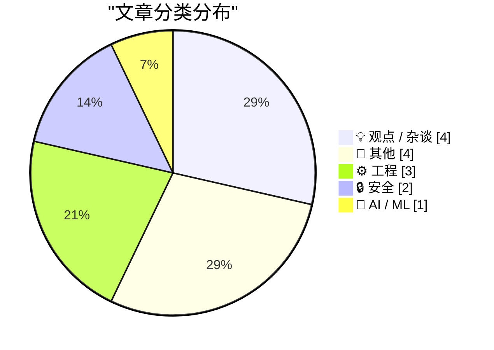
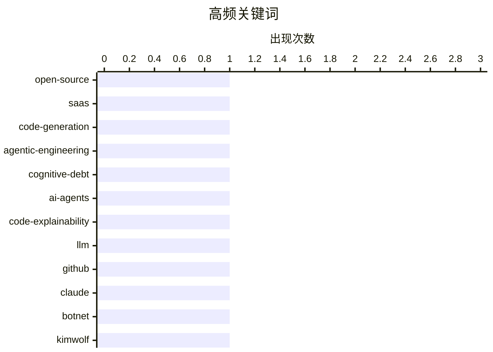

# 📰 AI 博客每日精选 — 2026-03-01

> 来自 Karpathy 推荐的 92 个顶级技术博客，AI 精选 Top 14

## 📝 今日看点

今日技术圈聚焦三大趋势：AI 编码代理的普及引发对“认知债务”与系统失控的担忧，开发者正面临代码透明度与长期维护风险的双重挑战；与此同时，开源生态在无限代码生成背景下遭遇信任危机，技术债务与滥用问题日益凸显；安全领域则持续关注僵尸网络等新型威胁，Dort 对研究员的报复性攻击暴露了漏洞披露背后的激烈冲突，凸显网络安全生态的脆弱性。

---

## 🏆 今日必读

### 🥇 开源、SaaS 与无限代码生成后的沉默

- **来源**: [worksonmymachine.substack.com](https://worksonmymachine.ai/p/open-source-saas-and-the-silence)
- **时间**: 9 小时前
- **分类**: 💡 观点 / 杂谈

> 文章探讨了开源软件与 SaaS 模式在 AI 驱动下如何被滥用，尤其是在无限代码生成导致开发者失去对系统行为的控制后，出现的技术债务与信任危机。作者指出，当系统行为变得不可预测且缺乏透明度时，企业将面临安全与合规风险。解决方案包括引入可解释性机制、建立代码审计流程以及推动开源社区的协作治理。核心观点是：在 AI 自动化编码时代，必须重建人类对技术系统的监督与控制能力。

**💡 为什么值得读**: 这篇文章揭示了 AI 编码工具普及背后隐藏的系统性风险，为技术管理者提供了亟需的前瞻性警示。

**🏷️ 标签**: open-source, SaaS, code-generation

---

### 🥈 交互式解释

- **来源**: [simonwillison.net](https://simonwillison.net/guides/agentic-engineering-patterns/interactive-explanations/#atom-everything)
- **时间**: 52 分钟前
- **分类**: ⚙️ 工程

> 文章讨论了在代理（agent）编写代码时，人类开发者可能因缺乏对代码逻辑的理解而积累‘认知债务’的问题。作者强调，当无法追踪代理生成代码的工作原理时，即使功能看似正常，也会带来长期维护风险。解决方案是引入交互式解释机制，让代理在生成代码时同步提供可理解的推理过程。该模式属于代理工程（agentic engineering）中的一种关键实践，旨在提升代码透明度和可解释性。

**💡 为什么值得读**: 这是理解 AI 代理协作中可解释性挑战与应对策略的必读指南，尤其适合从事 AI 工程与系统设计的开发者。

**🏷️ 标签**: agentic-engineering, cognitive-debt, AI-agents, code-explainability

---

### 🥉 Python 源码中的 LLM 使用

- **来源**: [miguelgrinberg.com](https://blog.miguelgrinberg.com/post/llm-use-in-the-python-source-code)
- **时间**: 8 小时前
- **分类**: 🤖 AI / ML

> 文章通过观察 GitHub 上 Claude Code 用户的提交记录，发现越来越多的项目开始依赖 AI 编码代理。作者指出，一个识别项目是否使用 LLM 辅助开发的方法是屏蔽特定用户（如 claude），从而快速发现其参与的项目。例如，在 cpython 仓库中发现了由 Claude Code 生成的提交，揭示了主流开源项目正逐步接纳 AI 工具。

**💡 为什么值得读**: 为开发者提供了一种快速识别项目是否使用 AI 编码代理的实用技巧，有助于评估代码来源与潜在风险。

**🏷️ 标签**: LLM, GitHub, Claude

---

## 📊 数据概览

| 扫描源 | 抓取文章 | 时间范围 | 精选 |
|:---:|:---:|:---:|:---:|
| 88/92 | 2498 篇 → 14 篇 | 24h | **14 篇** |

### 分类分布



### 高频关键词



<details>
<summary>📈 纯文本关键词图（终端友好）</summary>

```
open-source         │ ████████████████████ 1
saas                │ ████████████████████ 1
code-generation     │ ████████████████████ 1
agentic-engineering │ ████████████████████ 1
cognitive-debt      │ ████████████████████ 1
ai-agents           │ ████████████████████ 1
code-explainability │ ████████████████████ 1
llm                 │ ████████████████████ 1
github              │ ████████████████████ 1
claude              │ ████████████████████ 1
```

</details>

### 🏷️ 话题标签

**open-source**(1) · **saas**(1) · **code-generation**(1) · agentic-engineering(1) · cognitive-debt(1) · ai-agents(1) · code-explainability(1) · llm(1) · github(1) · claude(1) · botnet(1) · kimwolf(1) · dort(1) · vulnerability-disclosure(1) · mathematics(1) · approximation(1) · dirichlet(1) · number-theory(1) · chatgpt(1) · dow(1)

---

## 💡 观点 / 杂谈

### 1. 开源、SaaS 与无限代码生成后的沉默

- **链接**: [Open Source, SaaS, and the Silence After Unlimited Code Generation](https://worksonmymachine.ai/p/open-source-saas-and-the-silence)
- **来源**: worksonmymachine.substack.com
- **时间**: 9 小时前
- **评分**: ⭐ 25/30

> 文章探讨了开源软件与 SaaS 模式在 AI 驱动下如何被滥用，尤其是在无限代码生成导致开发者失去对系统行为的控制后，出现的技术债务与信任危机。作者指出，当系统行为变得不可预测且缺乏透明度时，企业将面临安全与合规风险。解决方案包括引入可解释性机制、建立代码审计流程以及推动开源社区的协作治理。核心观点是：在 AI 自动化编码时代，必须重建人类对技术系统的监督与控制能力。

**🏷️ 标签**: open-source, SaaS, code-generation

---

### 2. 我取消了我的 ChatGPT 账户

- **链接**: [That's it, I'm cancelling my ChatGPT](https://idiallo.com/byte-size/im-cancelling-my-chatgpt-openai-account?src=feed)
- **来源**: idiallo.com
- **时间**: 6 小时前
- **评分**: ⭐ 19/30

> 作者因 Sam Altman 宣布 ChatGPT 将接入美国国防部（DoD）机密网络而决定注销账户。他认为这是大规模监控与武器化 AI 的开端，并指出已有监控基础设施，此次是‘赋能者’的出现。Anthropic 也公开拒绝参与 DoD 项目，进一步印证了技术伦理的危机。

**🏷️ 标签**: ChatGPT, DoW, surveillance, AI-ethics

---

### 3. Pluralistic：加州可以阻止拉里·埃里森收购华纳兄弟

- **链接**: [Pluralistic: California can stop Larry Ellison from buying Warners (28 Feb 2026)](https://pluralistic.net/2026/02/28/golden-mean/)
- **来源**: pluralistic.net
- **时间**: 12 小时前
- **评分**: ⭐ 18/30

> 文章主张加州应阻止拉里·埃里森收购华纳兄弟，强调州权在遏制资本滥用中的关键作用。作者列举了多个案例，包括 Octavia Butler 遗产争议、韩国《Little Brother》审查事件等，论证‘隐私不是财产’、‘权力伴随责任’等理念。核心观点是：必须通过法律与制度限制科技巨头的权力扩张。

**🏷️ 标签**: Larry-Ellison, Warner-Bros, media-regulation, antitrust

---

### 4. 整件事都是一场骗局

- **链接**: [The whole thing was a scam](https://garymarcus.substack.com/p/the-whole-thing-was-scam)
- **来源**: garymarcus.substack.com
- **时间**: 7 小时前
- **评分**: ⭐ 15/30

> 文章声称某项目（可能指 Dario 相关事件）从一开始就是骗局，Dario 从未真正掌握控制权。作者暗示项目存在预谋的虚假叙事，旨在误导公众或获取利益。该观点挑战了此前对项目真实性的普遍认知，引发对技术项目中信任与透明度的质疑。

**🏷️ 标签**: AI-scam, Dario-Amodei, OpenAI, research-integrity

---

## 📝 其他

### 5. Reading List 02/28/26

- **链接**: [Reading List 02/28/26](https://www.construction-physics.com/p/reading-list-022826)
- **来源**: construction-physics.com
- **时间**: 10 小时前
- **评分**: ⭐ 15/30

> LA permitting costs, trickle-down housing, Panasonic stops making TVs, robotaxi remote operators, geothermal progress.

**🏷️ 标签**: housing, robotaxi, geothermal

---

### 6. 30 months to 3MWh - some more home battery stats

- **链接**: [30 months to 3MWh - some more home battery stats](https://shkspr.mobi/blog/2026/02/30-months-to-3mwh-some-more-home-battery-stats/)
- **来源**: shkspr.mobi
- **时间**: 11 小时前
- **评分**: ⭐ 12/30

> Back in August 2023, we installed a Moixa 4.8kWh Solar Battery to pair with our solar panels. For the last year and a half it has chugged away slurping up electrons and sending them back as needed. It

**🏷️ 标签**: home-battery, solar, energy-storage, Moixa

---

### 7. Trump’s Enormous Gamble on Regime Change in Iran

- **链接**: [Trump’s Enormous Gamble on Regime Change in Iran](https://www.theatlantic.com/ideas/2026/02/trumps-iran-regime-change-attack-gamble/686190/?gift=aQyUJR7AIw1mJWdQ6Ed6yOWB4bfod1kQqCyz2RXbHaY)
- **来源**: daringfireball.net
- **时间**: 7 小时前
- **评分**: ⭐ 11/30

> Tom Nichols, writing for The Atlantic:


  When the 2003 war with Iraq ended, U.S. Ambassador Barbara Bodine said that when American diplomats embarked on reconstruction, they ruefully joked that “the

**🏷️ 标签**: Iran, regime-change, foreign-policy

---

### 8. The Most Important Micros

- **链接**: [The Most Important Micros](https://www.abortretry.fail/p/the-most-important-micros)
- **来源**: abortretry.fail
- **时间**: 5 小时前
- **评分**: ⭐ 10/30

> That is, for what they represent

**🏷️ 标签**: micros, hardware, retro

---

## ⚙️ 工程

### 9. 交互式解释

- **链接**: [Interactive explanations](https://simonwillison.net/guides/agentic-engineering-patterns/interactive-explanations/#atom-everything)
- **来源**: simonwillison.net
- **时间**: 52 分钟前
- **评分**: ⭐ 24/30

> 文章讨论了在代理（agent）编写代码时，人类开发者可能因缺乏对代码逻辑的理解而积累‘认知债务’的问题。作者强调，当无法追踪代理生成代码的工作原理时，即使功能看似正常，也会带来长期维护风险。解决方案是引入交互式解释机制，让代理在生成代码时同步提供可理解的推理过程。该模式属于代理工程（agentic engineering）中的一种关键实践，旨在提升代码透明度和可解释性。

**🏷️ 标签**: agentic-engineering, cognitive-debt, AI-agents, code-explainability

---

### 10. 近似游戏

- **链接**: [Approximation game](https://lcamtuf.substack.com/p/approximation-game)
- **来源**: lcamtuf.substack.com
- **时间**: 21 小时前
- **评分**: ⭐ 21/30

> 文章以 22/7 和 Dirichlet 鸽群为例，探讨数学中的近似理论。22/7 是 π 的一个经典有理近似，而 Dirichlet 的鸽群定理展示了如何通过离散对象逼近连续现象。作者借此引出数学中‘近似’的本质：在有限信息下寻找最优表达，这一思想在算法设计、机器学习与科学建模中具有广泛应用。

**🏷️ 标签**: mathematics, approximation, Dirichlet, number-theory

---

### 11. 在 bash 脚本中处理文件扩展名

- **链接**: [Working with file extensions in bash scripts](https://www.johndcook.com/blog/2026/02/28/file-extensions-bash/)
- **来源**: johndcook.com
- **时间**: 5 小时前
- **评分**: ⭐ 18/30

> 文章介绍了在 bash 脚本中处理文件扩展名的常用技巧，如使用 `${filename##*.}` 提取扩展名，或 `${filename%.*}` 去除扩展名。作者承认自己更偏好 Python，但承认某些 shell 脚本因其简洁性而不可替代。这些技巧适用于批量文件处理、自动化脚本等场景。

**🏷️ 标签**: bash, file-extensions, shell-scripting, Unix

---

## 🔒 安全

### 12. Kimwolf 僵尸网络幕后黑手“Dort”是谁？

- **链接**: [Who is the Kimwolf Botmaster “Dort”?](https://krebsonsecurity.com/2026/02/who-is-the-kimwolf-botmaster-dort/)
- **来源**: krebsonsecurity.com
- **时间**: 11 小时前
- **评分**: ⭐ 21/30

> 文章深入调查了 Kimwolf 僵尸网络的运营者“Dort”，该网络是 2026 年初全球最大的 DDoS 攻击源。Dort 在安全研究员披露其漏洞利用方式后，对研究员和作者发起大规模报复性攻击，包括 DDoS、人肉搜索和邮件轰炸，甚至导致 SWAT 团队上门。作者试图揭示 Dort 的真实身份与动机，探讨网络攻击中的报复循环与执法困境。

**🏷️ 标签**: botnet, Kimwolf, Dort, vulnerability-disclosure

---

### 13. npm 数据主体访问请求回应

- **链接**: [npm Data Subject Access Request](https://nesbitt.io/2026/02/28/npm-data-subject-access-request.html)
- **来源**: nesbitt.io
- **时间**: 14 小时前
- **评分**: ⭐ 19/30

> 作者回应了依据 GDPR 提出的数据主体访问请求，披露了 npm 平台如何处理用户数据。内容包括数据收集范围、存储位置、第三方共享情况及用户权利行使方式。回应强调 npm 作为美国公司需遵守欧盟法规，并展示了开源社区对数据隐私的重视。

**🏷️ 标签**: GDPR, DSAR, npm, data-privacy

---

## 🤖 AI / ML

### 14. Python 源码中的 LLM 使用

- **链接**: [LLM Use in the Python Source Code](https://blog.miguelgrinberg.com/post/llm-use-in-the-python-source-code)
- **来源**: miguelgrinberg.com
- **时间**: 8 小时前
- **评分**: ⭐ 22/30

> 文章通过观察 GitHub 上 Claude Code 用户的提交记录，发现越来越多的项目开始依赖 AI 编码代理。作者指出，一个识别项目是否使用 LLM 辅助开发的方法是屏蔽特定用户（如 claude），从而快速发现其参与的项目。例如，在 cpython 仓库中发现了由 Claude Code 生成的提交，揭示了主流开源项目正逐步接纳 AI 工具。

**🏷️ 标签**: LLM, GitHub, Claude

---

*生成于 2026-03-01 00:01 | 扫描 88 源 → 获取 2498 篇 → 精选 14 篇*
*基于 [Hacker News Popularity Contest 2025](https://refactoringenglish.com/tools/hn-popularity/) RSS 源列表，由 [Andrej Karpathy](https://x.com/karpathy) 推荐*
*由「懂点儿AI」制作，欢迎关注同名微信公众号获取更多 AI 实用技巧 💡*
