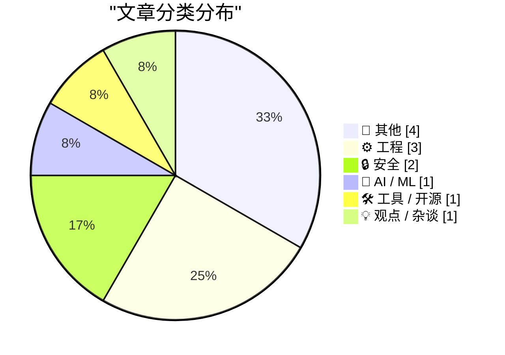
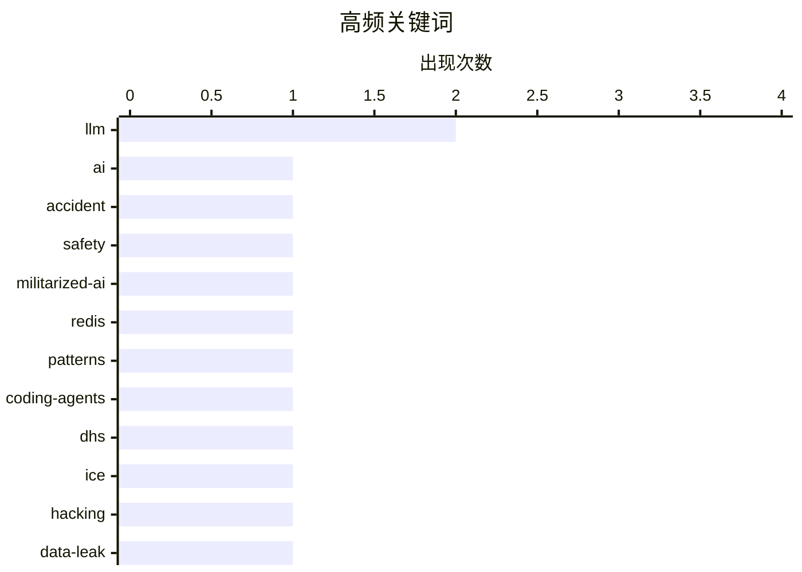

# 📰 AI 博客每日精选

**日期**: 2026-03-02 &nbsp;|&nbsp; **精选**: 12 篇 &nbsp;|&nbsp; **时间范围**: 24 小时

> 📚 来自 Karpathy 推荐的 **92** 个顶级技术博客，经 AI 智能评分筛选

## 📑 目录

- [📝 今日看点](#-今日看点)
- [🏆 今日必读](#-今日必读)
- [📊 数据概览](#-数据概览)
- [📝 其他](#-其他) (4篇)
- [⚙️ 工程](#-工程) (3篇)
- [🔒 安全](#-安全) (2篇)
- [🤖 AI / ML](#-ai---ml) (1篇)
- [🛠 工具 / 开源](#-工具---开源) (1篇)
- [💡 观点 / 杂谈](#-观点---杂谈) (1篇)

---

## 📝 今日看点

<div style="background: linear-gradient(135deg, #667eea 0%, #764ba2 100%); padding: 16px 20px; border-radius: 12px; color: white; margin: 20px 0;">

今日技术圈聚焦三大趋势：AI可靠性引发安全担忧，多起事件暴露关键决策中AI系统的潜在风险；开发者工具持续进化，Redis编程指南和Sentry iOS工作坊等实践资源涌现，提升工程效率；同时，隐私与监管议题升温，加州新法强制操作系统收集用户年龄，而Claude开放数据导出功能则凸显用户对数据主权的关注。

</div>

---

## 🏆 今日必读

### 🥇 [AI是否已经意外杀人？](https://garymarcus.substack.com/p/is-ai-already-killing-people-by-accident)

<div style="display: flex; gap: 16px; flex-wrap: wrap; margin: 12px 0; font-size: 14px; color: #666;">
<span>📁 🤖 AI / ML</span>
<span>⏰ 5 小时前</span>
<span>⭐ 评分 27/30</span>
</div>

<div style="background: #f8f9fa; border-left: 4px solid #667eea; padding: 16px 20px; border-radius: 8px; margin: 16px 0;">

文章探讨了一起导致近150名伊朗学童死亡的误击事件是否可能与AI系统有关。作者Tyler Austin Harper引用了Gary Marcus的观点，质疑当前AI系统在关键决策中的可靠性。文章指出，此类事件暴露了AI在现实世界应用中的潜在风险，尤其是在生命安全相关的场景中。作者认为，AI的自主决策能力尚未达到可安全部署于高风险领域的水平。

</div>

**💡 为什么值得读**: 该文揭示了AI在现实世界中的致命风险，引发对AI安全性和监管的深刻思考，值得所有关注AI伦理与安全的读者阅读。

**🏷️ 标签**: <span style="display:inline-block;background:#e3f2fd;color:#1976D2;padding:4px 12px;border-radius:16px;font-size:12px;margin-right:6px;">AI</span><span style="display:inline-block;background:#e3f2fd;color:#1976D2;padding:4px 12px;border-radius:16px;font-size:12px;margin-right:6px;">accident</span><span style="display:inline-block;background:#e3f2fd;color:#1976D2;padding:4px 12px;border-radius:16px;font-size:12px;margin-right:6px;">safety</span><span style="display:inline-block;background:#e3f2fd;color:#1976D2;padding:4px 12px;border-radius:16px;font-size:12px;margin-right:6px;">militarized-AI</span>

---

### 🥈 [Redis编程模式](http://antirez.com/news/161)

<div style="display: flex; gap: 16px; flex-wrap: wrap; margin: 12px 0; font-size: 14px; color: #666;">
<span>📁 ⚙️ 工程</span>
<span>⏰ 14 小时前</span>
<span>⭐ 评分 25/30</span>
</div>

<div style="background: #f8f9fa; border-left: 4px solid #667eea; padding: 16px 20px; border-radius: 8px; margin: 16px 0;">

Antirez发布了一份详尽的Redis文档，涵盖命令、数据类型、常用模式、配置提示和可实现的算法。该资源专为LLM和编程代理设计，旨在提升开发效率。文档内容经过优化，便于搜索引擎索引，并声称对实际开发者也有实用价值。

</div>

**💡 为什么值得读**: 这份由Redis作者亲自维护的文档是学习和使用Redis的权威指南，尤其适合需要高效集成Redis的开发者。

**🏷️ 标签**: <span style="display:inline-block;background:#e3f2fd;color:#1976D2;padding:4px 12px;border-radius:16px;font-size:12px;margin-right:6px;">Redis</span><span style="display:inline-block;background:#e3f2fd;color:#1976D2;padding:4px 12px;border-radius:16px;font-size:12px;margin-right:6px;">patterns</span><span style="display:inline-block;background:#e3f2fd;color:#1976D2;padding:4px 12px;border-radius:16px;font-size:12px;margin-right:6px;">LLM</span><span style="display:inline-block;background:#e3f2fd;color:#1976D2;padding:4px 12px;border-radius:16px;font-size:12px;margin-right:6px;">coding-agents</span>

---

### 🥉 [为何要黑进DHS？](https://micahflee.com/why-hack-the-dhs-i-can-think-of-a-couple-pretti-good-reasons/)

<div style="display: flex; gap: 16px; flex-wrap: wrap; margin: 12px 0; font-size: 14px; color: #666;">
<span>📁 🔒 安全</span>
<span>⏰ 2 小时前</span>
<span>⭐ 评分 24/30</span>
</div>

<div style="background: #f8f9fa; border-left: 4px solid #667eea; padding: 16px 20px; border-radius: 8px; margin: 16px 0;">

黑客组织Department of Peace发布声明，解释了他们入侵美国国土安全部（DHS）办公室以获取ICE合同数据的原因。声明中列出了他们认为正当的理由，并指出DHS的行为造成了伤害。该组织通过DDoSecrets发布了这些数据。

</div>

**💡 为什么值得读**: 该事件揭示了政府合同中的敏感信息泄露，以及黑客行动主义在推动透明度和问责制方面的作用。

**🏷️ 标签**: <span style="display:inline-block;background:#e3f2fd;color:#1976D2;padding:4px 12px;border-radius:16px;font-size:12px;margin-right:6px;">DHS</span><span style="display:inline-block;background:#e3f2fd;color:#1976D2;padding:4px 12px;border-radius:16px;font-size:12px;margin-right:6px;">ICE</span><span style="display:inline-block;background:#e3f2fd;color:#1976D2;padding:4px 12px;border-radius:16px;font-size:12px;margin-right:6px;">hacking</span><span style="display:inline-block;background:#e3f2fd;color:#1976D2;padding:4px 12px;border-radius:16px;font-size:12px;margin-right:6px;">data-leak</span>

---

## 📊 数据概览

<div style="display: grid; grid-template-columns: repeat(auto-fit, minmax(120px, 1fr)); gap: 12px; margin: 20px 0;">
<div style="background: #e8f4f8; padding: 16px; border-radius: 10px; text-align: center;">
<div style="font-size: 24px; font-weight: bold; color: #2196F3;">87/92</div>
<div style="font-size: 13px; color: #666; margin-top: 4px;">扫描源</div>
</div>
<div style="background: #fff3e0; padding: 16px; border-radius: 10px; text-align: center;">
<div style="font-size: 24px; font-weight: bold; color: #FF9800;">2475</div>
<div style="font-size: 13px; color: #666; margin-top: 4px;">抓取文章</div>
</div>
<div style="background: #f3e5f5; padding: 16px; border-radius: 10px; text-align: center;">
<div style="font-size: 24px; font-weight: bold; color: #9C27B0;">12</div>
<div style="font-size: 13px; color: #666; margin-top: 4px;">时间范围内</div>
</div>
<div style="background: #e8f5e9; padding: 16px; border-radius: 10px; text-align: center;">
<div style="font-size: 24px; font-weight: bold; color: #4CAF50;">12</div>
<div style="font-size: 13px; color: #666; margin-top: 4px;">AI 精选</div>
</div>
</div>

### 🥧 分类分布



### 📈 高频关键词



<details style="margin: 16px 0; padding: 12px; background: #f5f5f5; border-radius: 8px;">
<summary style="cursor: pointer; font-weight: 500;">📊 纯文本关键词图（终端友好）</summary>

```
llm            │ ████████████████████ 2
ai             │ ██████████░░░░░░░░░░ 1
accident       │ ██████████░░░░░░░░░░ 1
safety         │ ██████████░░░░░░░░░░ 1
militarized-ai │ ██████████░░░░░░░░░░ 1
redis          │ ██████████░░░░░░░░░░ 1
patterns       │ ██████████░░░░░░░░░░ 1
coding-agents  │ ██████████░░░░░░░░░░ 1
dhs            │ ██████████░░░░░░░░░░ 1
ice            │ ██████████░░░░░░░░░░ 1
```

</details>

### 🏷️ 话题标签

<div style="line-height: 2; margin: 16px 0;">
**llm**(2) · **ai**(1) · **accident**(1) · safety(1) · militarized-ai(1) · redis(1) · patterns(1) · coding-agents(1) · dhs(1) · ice(1) · hacking(1) · data-leak(1) · sentry(1) · ios(1) · crash-reporting(1) · california(1) · ab-1043(1) · os(1) · age-verification(1) · bash(1)
</div>

---

<a id="-其他"></a>
## 📝 其他 <span style="background: #e0e0e0; padding: 2px 10px; border-radius: 12px; font-size: 13px; margin-left: 8px;">4篇</span>

### 1. [Claude.com/import-memory](https://simonwillison.net/2026/Mar/1/claude-import-memory/#atom-everything)

<div style="margin: 10px 0;">
<div style="display: flex; justify-content: space-between; font-size: 13px; margin-bottom: 4px;">
<span>⭐ 综合评分</span>
<span style="font-weight: bold; color: #FF9800;">18/30</span>
</div>
<div style="background: #e0e0e0; height: 8px; border-radius: 4px; overflow: hidden;">
<div style="background: #FF9800; width: 60%; height: 100%; border-radius: 4px;"></div>
</div>
</div>

<div style="display: flex; gap: 12px; flex-wrap: wrap; font-size: 13px; color: #666; margin: 12px 0;">
<span>📁 simonwillison.net</span>
<span>⏰ 12 小时前</span>
<span>🔖 R:6 Q:5 T:7</span>
</div>

<div style="background: #fafafa; border-radius: 8px; padding: 16px; margin: 12px 0; line-height: 1.7;">
Simon Willison引用了Claude.com/import-memory页面，该页面允许用户导出其存储的所有关于用户的数据和上下文。导出格式为代码块，每条记录包含日期和内容，旨在帮助用户迁移到其他服务。
</div>

<div style="margin: 12px 0;">
<span style="display: inline-block; background: #e3f2fd; color: #1976D2; padding: 4px 12px; border-radius: 16px; font-size: 12px; margin-right: 6px; margin-bottom: 4px;">claude</span><span style="display: inline-block; background: #e3f2fd; color: #1976D2; padding: 4px 12px; border-radius: 16px; font-size: 12px; margin-right: 6px; margin-bottom: 4px;">import-memory</span><span style="display: inline-block; background: #e3f2fd; color: #1976D2; padding: 4px 12px; border-radius: 16px; font-size: 12px; margin-right: 6px; margin-bottom: 4px;">data-export</span>
</div>

---

### 2. [The Talk Show: 'Bad Dates'](https://daringfireball.net/thetalkshow/2026/02/28/ep-442)

<div style="margin: 10px 0;">
<div style="display: flex; justify-content: space-between; font-size: 13px; margin-bottom: 4px;">
<span>⭐ 综合评分</span>
<span style="font-weight: bold; color: #f44336;">16/30</span>
</div>
<div style="background: #e0e0e0; height: 8px; border-radius: 4px; overflow: hidden;">
<div style="background: #f44336; width: 53%; height: 100%; border-radius: 4px;"></div>
</div>
</div>

<div style="display: flex; gap: 12px; flex-wrap: wrap; font-size: 13px; color: #666; margin: 12px 0;">
<span>📁 daringfireball.net</span>
<span>⏰ 8 小时前</span>
<span>🔖 R:5 Q:5 T:6</span>
</div>

<div style="background: #fafafa; border-radius: 8px; padding: 16px; margin: 12px 0; line-height: 1.7;">
Jason Snell回归节目，讨论了2025年Six Colors Apple报告卡、MacOS 26 Tahoe、Apple Creator Studio，以及下周苹果产品发布会的预期。节目由Notion、Squarespace和Sentry赞助。
</div>

<div style="margin: 12px 0;">
<span style="display: inline-block; background: #e3f2fd; color: #1976D2; padding: 4px 12px; border-radius: 16px; font-size: 12px; margin-right: 6px; margin-bottom: 4px;">Apple</span><span style="display: inline-block; background: #e3f2fd; color: #1976D2; padding: 4px 12px; border-radius: 16px; font-size: 12px; margin-right: 6px; margin-bottom: 4px;">Six Colors</span><span style="display: inline-block; background: #e3f2fd; color: #1976D2; padding: 4px 12px; border-radius: 16px; font-size: 12px; margin-right: 6px; margin-bottom: 4px;">product-announcements</span>
</div>

---

### 3. [Book Review: Under Fire - Black Britain in Wartime by Stephen Bourne ★★★★☆](https://shkspr.mobi/blog/2026/03/book-review-under-fire-black-britain-in-wartime-by-stephen-bourne/)

<div style="margin: 10px 0;">
<div style="display: flex; justify-content: space-between; font-size: 13px; margin-bottom: 4px;">
<span>⭐ 综合评分</span>
<span style="font-weight: bold; color: #f44336;">12/30</span>
</div>
<div style="background: #e0e0e0; height: 8px; border-radius: 4px; overflow: hidden;">
<div style="background: #f44336; width: 40%; height: 100%; border-radius: 4px;"></div>
</div>
</div>

<div style="display: flex; gap: 12px; flex-wrap: wrap; font-size: 13px; color: #666; margin: 12px 0;">
<span>📁 shkspr.mobi</span>
<span>⏰ 11 小时前</span>
<span>🔖 R:2 Q:7 T:3</span>
</div>

<div style="background: #fafafa; border-radius: 8px; padding: 16px; margin: 12px 0; line-height: 1.7;">
Everyone knows that Black people didn't exist in the UK until recently, right? Despite mountains of evidence of everything from Black Tudors and Victorian actors, some myths perniciously persist.  Wha
</div>

<div style="margin: 12px 0;">
<span style="display: inline-block; background: #e3f2fd; color: #1976D2; padding: 4px 12px; border-radius: 16px; font-size: 12px; margin-right: 6px; margin-bottom: 4px;">history</span><span style="display: inline-block; background: #e3f2fd; color: #1976D2; padding: 4px 12px; border-radius: 16px; font-size: 12px; margin-right: 6px; margin-bottom: 4px;">Black-Britain</span><span style="display: inline-block; background: #e3f2fd; color: #1976D2; padding: 4px 12px; border-radius: 16px; font-size: 12px; margin-right: 6px; margin-bottom: 4px;">WWII</span>
</div>

---

### 4. [Praatjes](https://berthub.eu/articles/praatjes/)

<div style="margin: 10px 0;">
<div style="display: flex; justify-content: space-between; font-size: 13px; margin-bottom: 4px;">
<span>⭐ 综合评分</span>
<span style="font-weight: bold; color: #f44336;">12/30</span>
</div>
<div style="background: #e0e0e0; height: 8px; border-radius: 4px; overflow: hidden;">
<div style="background: #f44336; width: 40%; height: 100%; border-radius: 4px;"></div>
</div>
</div>

<div style="display: flex; gap: 12px; flex-wrap: wrap; font-size: 13px; color: #666; margin: 12px 0;">
<span>📁 berthub.eu</span>
<span>⏰ 13 小时前</span>
<span>🔖 R:4 Q:5 T:3</span>
</div>

<div style="background: #fafafa; border-radius: 8px; padding: 16px; margin: 12px 0; line-height: 1.7;">
Publieke of in ieder geval breed aangekondigde praatjes. Tenzij anders vermeld was het onderwerp minstens deels digitale autonomie, soevereiniteit, of cloudafhankelijkheid.
De lijst is nog niet comple
</div>

<div style="margin: 12px 0;">
<span style="display: inline-block; background: #e3f2fd; color: #1976D2; padding: 4px 12px; border-radius: 16px; font-size: 12px; margin-right: 6px; margin-bottom: 4px;">speeches</span><span style="display: inline-block; background: #e3f2fd; color: #1976D2; padding: 4px 12px; border-radius: 16px; font-size: 12px; margin-right: 6px; margin-bottom: 4px;">digital autonomy</span><span style="display: inline-block; background: #e3f2fd; color: #1976D2; padding: 4px 12px; border-radius: 16px; font-size: 12px; margin-right: 6px; margin-bottom: 4px;">sovereignty</span><span style="display: inline-block; background: #e3f2fd; color: #1976D2; padding: 4px 12px; border-radius: 16px; font-size: 12px; margin-right: 6px; margin-bottom: 4px;">cloud dependency</span>
</div>

---

<a id="-工程"></a>
## ⚙️ 工程 <span style="background: #e0e0e0; padding: 2px 10px; border-radius: 12px; font-size: 13px; margin-left: 8px;">3篇</span>

### 5. [Redis编程模式](http://antirez.com/news/161)

<div style="margin: 10px 0;">
<div style="display: flex; justify-content: space-between; font-size: 13px; margin-bottom: 4px;">
<span>⭐ 综合评分</span>
<span style="font-weight: bold; color: #4CAF50;">25/30</span>
</div>
<div style="background: #e0e0e0; height: 8px; border-radius: 4px; overflow: hidden;">
<div style="background: #4CAF50; width: 83%; height: 100%; border-radius: 4px;"></div>
</div>
</div>

<div style="display: flex; gap: 12px; flex-wrap: wrap; font-size: 13px; color: #666; margin: 12px 0;">
<span>📁 antirez.com</span>
<span>⏰ 14 小时前</span>
<span>🔖 R:8 Q:8 T:9</span>
</div>

<div style="background: #fafafa; border-radius: 8px; padding: 16px; margin: 12px 0; line-height: 1.7;">
Antirez发布了一份详尽的Redis文档，涵盖命令、数据类型、常用模式、配置提示和可实现的算法。该资源专为LLM和编程代理设计，旨在提升开发效率。文档内容经过优化，便于搜索引擎索引，并声称对实际开发者也有实用价值。
</div>

<div style="margin: 12px 0;">
<span style="display: inline-block; background: #e3f2fd; color: #1976D2; padding: 4px 12px; border-radius: 16px; font-size: 12px; margin-right: 6px; margin-bottom: 4px;">Redis</span><span style="display: inline-block; background: #e3f2fd; color: #1976D2; padding: 4px 12px; border-radius: 16px; font-size: 12px; margin-right: 6px; margin-bottom: 4px;">patterns</span><span style="display: inline-block; background: #e3f2fd; color: #1976D2; padding: 4px 12px; border-radius: 16px; font-size: 12px; margin-right: 6px; margin-bottom: 4px;">LLM</span><span style="display: inline-block; background: #e3f2fd; color: #1976D2; padding: 4px 12px; border-radius: 16px; font-size: 12px; margin-right: 6px; margin-bottom: 4px;">coding-agents</span>
</div>

---

### 6. [Shell变量~-](https://www.johndcook.com/blog/2026/03/01/tilde-dash/)

<div style="margin: 10px 0;">
<div style="display: flex; justify-content: space-between; font-size: 13px; margin-bottom: 4px;">
<span>⭐ 综合评分</span>
<span style="font-weight: bold; color: #FF9800;">20/30</span>
</div>
<div style="background: #e0e0e0; height: 8px; border-radius: 4px; overflow: hidden;">
<div style="background: #FF9800; width: 67%; height: 100%; border-radius: 4px;"></div>
</div>
</div>

<div style="display: flex; gap: 12px; flex-wrap: wrap; font-size: 13px; color: #666; margin: 12px 0;">
<span>📁 johndcook.com</span>
<span>⏰ 5 小时前</span>
<span>🔖 R:7 Q:7 T:6</span>
</div>

<div style="background: #fafafa; border-radius: 8px; padding: 16px; margin: 12px 0; line-height: 1.7;">
John D. Cook介绍了一个Bash shell中的实用特性：`~-`。这个快捷方式用于访问存储在`$OLDPWD`环境变量中的前一个工作目录路径，与`cd -`命令功能相同。
</div>

<div style="margin: 12px 0;">
<span style="display: inline-block; background: #e3f2fd; color: #1976D2; padding: 4px 12px; border-radius: 16px; font-size: 12px; margin-right: 6px; margin-bottom: 4px;">bash</span><span style="display: inline-block; background: #e3f2fd; color: #1976D2; padding: 4px 12px; border-radius: 16px; font-size: 12px; margin-right: 6px; margin-bottom: 4px;">shell</span><span style="display: inline-block; background: #e3f2fd; color: #1976D2; padding: 4px 12px; border-radius: 16px; font-size: 12px; margin-right: 6px; margin-bottom: 4px;">OLDPWD</span><span style="display: inline-block; background: #e3f2fd; color: #1976D2; padding: 4px 12px; border-radius: 16px; font-size: 12px; margin-right: 6px; margin-bottom: 4px;">cd</span>
</div>

---

### 7. [拉格朗日插值多项式笔记](https://eli.thegreenplace.net/2026/notes-on-lagrange-interpolating-polynomials/)

<div style="margin: 10px 0;">
<div style="display: flex; justify-content: space-between; font-size: 13px; margin-bottom: 4px;">
<span>⭐ 综合评分</span>
<span style="font-weight: bold; color: #FF9800;">19/30</span>
</div>
<div style="background: #e0e0e0; height: 8px; border-radius: 4px; overflow: hidden;">
<div style="background: #FF9800; width: 63%; height: 100%; border-radius: 4px;"></div>
</div>
</div>

<div style="display: flex; gap: 12px; flex-wrap: wrap; font-size: 13px; color: #666; margin: 12px 0;">
<span>📁 eli.thegreenplace.net</span>
<span>⏰ 21 小时前</span>
<span>🔖 R:6 Q:8 T:5</span>
</div>

<div style="background: #fafafa; border-radius: 8px; padding: 16px; margin: 12px 0; line-height: 1.7;">
Eli Bendersky撰写了一篇关于拉格朗日插值多项式的详细笔记。该笔记解释了多项式插值的概念，即找到一个多项式函数，使其完美拟合给定的n+1个不同数据点。
</div>

<div style="margin: 12px 0;">
<span style="display: inline-block; background: #e3f2fd; color: #1976D2; padding: 4px 12px; border-radius: 16px; font-size: 12px; margin-right: 6px; margin-bottom: 4px;">polynomial</span><span style="display: inline-block; background: #e3f2fd; color: #1976D2; padding: 4px 12px; border-radius: 16px; font-size: 12px; margin-right: 6px; margin-bottom: 4px;">interpolation</span><span style="display: inline-block; background: #e3f2fd; color: #1976D2; padding: 4px 12px; border-radius: 16px; font-size: 12px; margin-right: 6px; margin-bottom: 4px;">mathematics</span><span style="display: inline-block; background: #e3f2fd; color: #1976D2; padding: 4px 12px; border-radius: 16px; font-size: 12px; margin-right: 6px; margin-bottom: 4px;">numerical methods</span>
</div>

---

<a id="-安全"></a>
## 🔒 安全 <span style="background: #e0e0e0; padding: 2px 10px; border-radius: 12px; font-size: 13px; margin-left: 8px;">2篇</span>

### 8. [为何要黑进DHS？](https://micahflee.com/why-hack-the-dhs-i-can-think-of-a-couple-pretti-good-reasons/)

<div style="margin: 10px 0;">
<div style="display: flex; justify-content: space-between; font-size: 13px; margin-bottom: 4px;">
<span>⭐ 综合评分</span>
<span style="font-weight: bold; color: #4CAF50;">24/30</span>
</div>
<div style="background: #e0e0e0; height: 8px; border-radius: 4px; overflow: hidden;">
<div style="background: #4CAF50; width: 80%; height: 100%; border-radius: 4px;"></div>
</div>
</div>

<div style="display: flex; gap: 12px; flex-wrap: wrap; font-size: 13px; color: #666; margin: 12px 0;">
<span>📁 micahflee.com</span>
<span>⏰ 2 小时前</span>
<span>🔖 R:8 Q:7 T:9</span>
</div>

<div style="background: #fafafa; border-radius: 8px; padding: 16px; margin: 12px 0; line-height: 1.7;">
黑客组织Department of Peace发布声明，解释了他们入侵美国国土安全部（DHS）办公室以获取ICE合同数据的原因。声明中列出了他们认为正当的理由，并指出DHS的行为造成了伤害。该组织通过DDoSecrets发布了这些数据。
</div>

<div style="margin: 12px 0;">
<span style="display: inline-block; background: #e3f2fd; color: #1976D2; padding: 4px 12px; border-radius: 16px; font-size: 12px; margin-right: 6px; margin-bottom: 4px;">DHS</span><span style="display: inline-block; background: #e3f2fd; color: #1976D2; padding: 4px 12px; border-radius: 16px; font-size: 12px; margin-right: 6px; margin-bottom: 4px;">ICE</span><span style="display: inline-block; background: #e3f2fd; color: #1976D2; padding: 4px 12px; border-radius: 16px; font-size: 12px; margin-right: 6px; margin-bottom: 4px;">hacking</span><span style="display: inline-block; background: #e3f2fd; color: #1976D2; padding: 4px 12px; border-radius: 16px; font-size: 12px; margin-right: 6px; margin-bottom: 4px;">data-leak</span>
</div>

---

### 9. [操作系统如何询问年龄？](https://idiallo.com/byte-size/how-old-are-you-asked-the-os?src=feed)

<div style="margin: 10px 0;">
<div style="display: flex; justify-content: space-between; font-size: 13px; margin-bottom: 4px;">
<span>⭐ 综合评分</span>
<span style="font-weight: bold; color: #FF9800;">20/30</span>
</div>
<div style="background: #e0e0e0; height: 8px; border-radius: 4px; overflow: hidden;">
<div style="background: #FF9800; width: 67%; height: 100%; border-radius: 4px;"></div>
</div>
</div>

<div style="display: flex; gap: 12px; flex-wrap: wrap; font-size: 13px; color: #666; margin: 12px 0;">
<span>📁 idiallo.com</span>
<span>⏰ 22 小时前</span>
<span>🔖 R:6 Q:6 T:8</span>
</div>

<div style="background: #fafafa; border-radius: 8px; padding: 16px; margin: 12px 0; line-height: 1.7;">
加州新法律AB-1043要求所有操作系统在账户创建时收集用户年龄。文章探讨了这项法律的实施细节，包括其适用范围（如离线系统）、潜在的法律后果（如提供错误年龄），以及家长如何管理孩子使用设备的问题。作者认为，由于缺乏执行机制，该法律的真正目的可能并非强制执行。
</div>

<div style="margin: 12px 0;">
<span style="display: inline-block; background: #e3f2fd; color: #1976D2; padding: 4px 12px; border-radius: 16px; font-size: 12px; margin-right: 6px; margin-bottom: 4px;">California</span><span style="display: inline-block; background: #e3f2fd; color: #1976D2; padding: 4px 12px; border-radius: 16px; font-size: 12px; margin-right: 6px; margin-bottom: 4px;">AB-1043</span><span style="display: inline-block; background: #e3f2fd; color: #1976D2; padding: 4px 12px; border-radius: 16px; font-size: 12px; margin-right: 6px; margin-bottom: 4px;">OS</span><span style="display: inline-block; background: #e3f2fd; color: #1976D2; padding: 4px 12px; border-radius: 16px; font-size: 12px; margin-right: 6px; margin-bottom: 4px;">age-verification</span>
</div>

---

<a id="-ai---ml"></a>
## 🤖 AI / ML <span style="background: #e0e0e0; padding: 2px 10px; border-radius: 12px; font-size: 13px; margin-left: 8px;">1篇</span>

### 10. [AI是否已经意外杀人？](https://garymarcus.substack.com/p/is-ai-already-killing-people-by-accident)

<div style="margin: 10px 0;">
<div style="display: flex; justify-content: space-between; font-size: 13px; margin-bottom: 4px;">
<span>⭐ 综合评分</span>
<span style="font-weight: bold; color: #4CAF50;">27/30</span>
</div>
<div style="background: #e0e0e0; height: 8px; border-radius: 4px; overflow: hidden;">
<div style="background: #4CAF50; width: 90%; height: 100%; border-radius: 4px;"></div>
</div>
</div>

<div style="display: flex; gap: 12px; flex-wrap: wrap; font-size: 13px; color: #666; margin: 12px 0;">
<span>📁 garymarcus.substack.com</span>
<span>⏰ 5 小时前</span>
<span>🔖 R:9 Q:8 T:10</span>
</div>

<div style="background: #fafafa; border-radius: 8px; padding: 16px; margin: 12px 0; line-height: 1.7;">
文章探讨了一起导致近150名伊朗学童死亡的误击事件是否可能与AI系统有关。作者Tyler Austin Harper引用了Gary Marcus的观点，质疑当前AI系统在关键决策中的可靠性。文章指出，此类事件暴露了AI在现实世界应用中的潜在风险，尤其是在生命安全相关的场景中。作者认为，AI的自主决策能力尚未达到可安全部署于高风险领域的水平。
</div>

<div style="margin: 12px 0;">
<span style="display: inline-block; background: #e3f2fd; color: #1976D2; padding: 4px 12px; border-radius: 16px; font-size: 12px; margin-right: 6px; margin-bottom: 4px;">AI</span><span style="display: inline-block; background: #e3f2fd; color: #1976D2; padding: 4px 12px; border-radius: 16px; font-size: 12px; margin-right: 6px; margin-bottom: 4px;">accident</span><span style="display: inline-block; background: #e3f2fd; color: #1976D2; padding: 4px 12px; border-radius: 16px; font-size: 12px; margin-right: 6px; margin-bottom: 4px;">safety</span><span style="display: inline-block; background: #e3f2fd; color: #1976D2; padding: 4px 12px; border-radius: 16px; font-size: 12px; margin-right: 6px; margin-bottom: 4px;">militarized-AI</span>
</div>

---

<a id="-工具---开源"></a>
## 🛠 工具 / 开源 <span style="background: #e0e0e0; padding: 2px 10px; border-radius: 12px; font-size: 13px; margin-left: 8px;">1篇</span>

### 11. [Sentry iOS工作坊](https://sentry.io/resources/ios-workshop-jan-2026/?utm_source=daringfireball&amp;utm_medium=paid-display&amp;utm_campaign=general-fy27q1-evergreen&amp;utm_content=static-ad-mobilerss-trysentry)

<div style="margin: 10px 0;">
<div style="display: flex; justify-content: space-between; font-size: 13px; margin-bottom: 4px;">
<span>⭐ 综合评分</span>
<span style="font-weight: bold; color: #FF9800;">21/30</span>
</div>
<div style="background: #e0e0e0; height: 8px; border-radius: 4px; overflow: hidden;">
<div style="background: #FF9800; width: 70%; height: 100%; border-radius: 4px;"></div>
</div>
</div>

<div style="display: flex; gap: 12px; flex-wrap: wrap; font-size: 13px; color: #666; margin: 12px 0;">
<span>📁 daringfireball.net</span>
<span>⏰ 8 小时前</span>
<span>🔖 R:7 Q:6 T:8</span>
</div>

<div style="background: #fafafa; border-radius: 8px; padding: 16px; margin: 12px 0; line-height: 1.7;">
Sentry举办了一场关于iOS应用崩溃报告、追踪和日志的在线工作坊。参与者将学习如何设置Sentry以识别高优先级问题，避免警报疲劳，并使用日志和面包屑重建崩溃场景。工作坊还将指导如何定位性能瓶颈。
</div>

<div style="margin: 12px 0;">
<span style="display: inline-block; background: #e3f2fd; color: #1976D2; padding: 4px 12px; border-radius: 16px; font-size: 12px; margin-right: 6px; margin-bottom: 4px;">Sentry</span><span style="display: inline-block; background: #e3f2fd; color: #1976D2; padding: 4px 12px; border-radius: 16px; font-size: 12px; margin-right: 6px; margin-bottom: 4px;">iOS</span><span style="display: inline-block; background: #e3f2fd; color: #1976D2; padding: 4px 12px; border-radius: 16px; font-size: 12px; margin-right: 6px; margin-bottom: 4px;">crash-reporting</span>
</div>

---

<a id="-观点---杂谈"></a>
## 💡 观点 / 杂谈 <span style="background: #e0e0e0; padding: 2px 10px; border-radius: 12px; font-size: 13px; margin-left: 8px;">1篇</span>

### 12. [专家新手和独行侠将主导LLM时代](https://www.jeffgeerling.com/blog/2026/expert-beginners-and-lone-wolves-dominate-llm-era/)

<div style="margin: 10px 0;">
<div style="display: flex; justify-content: space-between; font-size: 13px; margin-bottom: 4px;">
<span>⭐ 综合评分</span>
<span style="font-weight: bold; color: #f44336;">15/30</span>
</div>
<div style="background: #e0e0e0; height: 8px; border-radius: 4px; overflow: hidden;">
<div style="background: #f44336; width: 50%; height: 100%; border-radius: 4px;"></div>
</div>
</div>

<div style="display: flex; gap: 12px; flex-wrap: wrap; font-size: 13px; color: #666; margin: 12px 0;">
<span>📁 jeffgeerling.com</span>
<span>⏰ 2 小时前</span>
<span>🔖 R:4 Q:6 T:5</span>
</div>

<div style="background: #fafafa; border-radius: 8px; padding: 16px; margin: 12px 0; line-height: 1.7;">
Jeff Geerling在博客中讨论了在LLM时代，拥有深厚技术背景的专家和独立开发者（Lone Wolves）将比新手更具优势。他认为，尽管LLM降低了编程门槛，但解决复杂问题仍需深厚的专业知识。
</div>

<div style="margin: 12px 0;">
<span style="display: inline-block; background: #e3f2fd; color: #1976D2; padding: 4px 12px; border-radius: 16px; font-size: 12px; margin-right: 6px; margin-bottom: 4px;">LLM</span><span style="display: inline-block; background: #e3f2fd; color: #1976D2; padding: 4px 12px; border-radius: 16px; font-size: 12px; margin-right: 6px; margin-bottom: 4px;">beginners</span><span style="display: inline-block; background: #e3f2fd; color: #1976D2; padding: 4px 12px; border-radius: 16px; font-size: 12px; margin-right: 6px; margin-bottom: 4px;">early-adoption</span>
</div>

---


<div style="text-align: center; color: #888; font-size: 13px; padding: 20px; border-top: 1px solid #e0e0e0; margin-top: 30px;">
生成于 2026-03-02 00:06 | 扫描 <strong>87</strong> 源 → 获取 <strong>2475</strong> 篇 → 精选 <strong>12</strong> 篇
<br>
基于 <a href="https://refactoringenglish.com/tools/hn-popularity/" style="color: #667eea;">Hacker News Popularity Contest 2025</a> RSS 源列表，由 <a href="https://x.com/karpathy" style="color: #667eea;">Andrej Karpathy</a> 推荐
<br>
由「懂点儿 AI」制作，欢迎关注同名微信公众号获取更多 AI 实用技巧 💡
</div>
