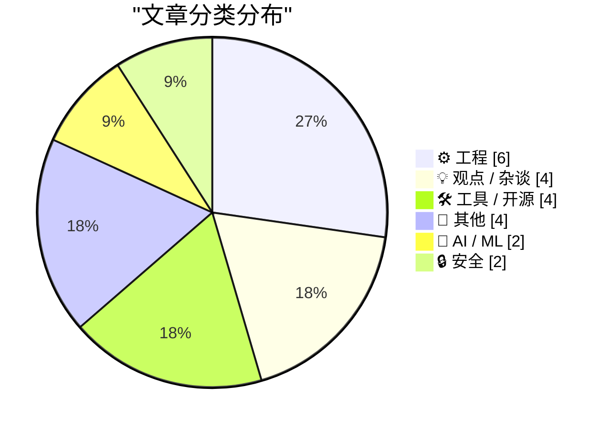
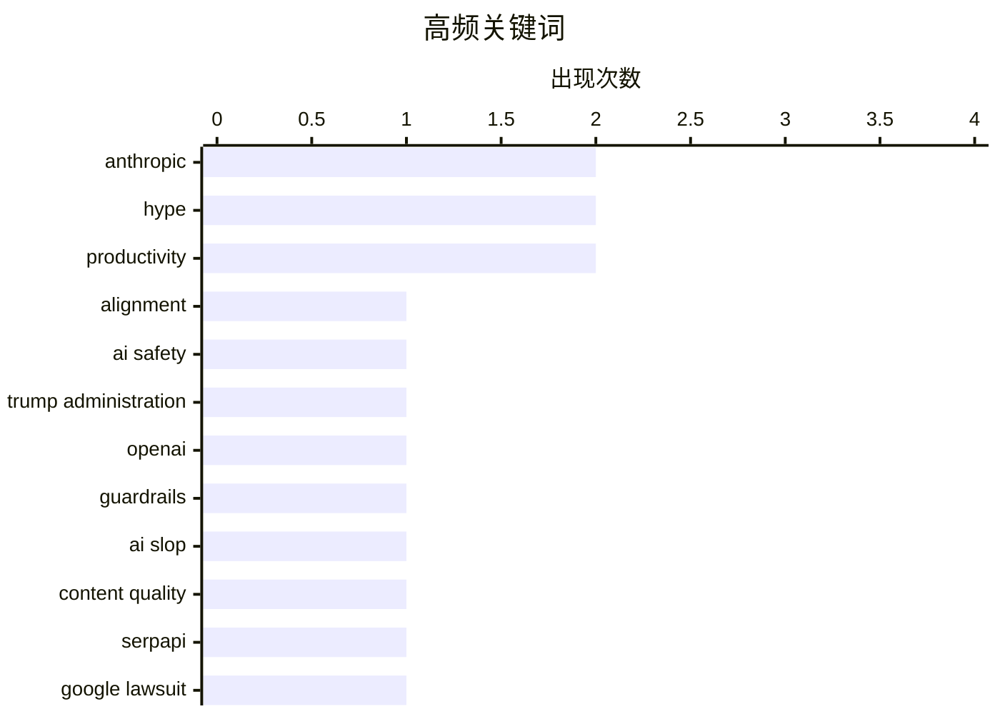

# 📰 AI 博客每日精选

**日期**: 2026-03-03 &nbsp;|&nbsp; **精选**: 22 篇 &nbsp;|&nbsp; **时间范围**: 24 小时

> 📚 来自 Karpathy 推荐的 **92** 个顶级技术博客，经 AI 智能评分筛选

## 📑 目录

- [📝 今日看点](#-今日看点)
- [🏆 今日必读](#-今日必读)
- [📊 数据概览](#-数据概览)
- [⚙️ 工程](#-工程) (6篇)
- [💡 观点 / 杂谈](#-观点---杂谈) (4篇)
- [🛠 工具 / 开源](#-工具---开源) (4篇)
- [📝 其他](#-其他) (4篇)
- [🤖 AI / ML](#-ai---ml) (2篇)
- [🔒 安全](#-安全) (2篇)

---

## 📝 今日看点

<div style="background: linear-gradient(135deg, #667eea 0%, #764ba2 100%); padding: 16px 20px; border-radius: 12px; color: white; margin: 20px 0;">

今日技术圈聚焦三大趋势：AI 领域持续深化，Simon Willison 推动 Agentic Engineering 项目并探索新型开发范式；消费电子方面，苹果发布 iPhone 17e 并更新配件生态，强调性能与实用性的平衡；同时，开发者社区对工具效率与内容质量的讨论升温，从 HazeOver 的界面优化到对 LLM 生成内容的批判，反映出对深度工作与原创价值的回归。

</div>

---

## 🏆 今日必读

### 🥇 [Index 20：仅限赞助者的二月通讯](https://stratechery.com/2026/anthropic-and-alignment/)

<div style="display: flex; gap: 16px; flex-wrap: wrap; margin: 12px 0; font-size: 14px; color: #666;">
<span>📁 🤖 AI / ML</span>
<span>⏰ 5 小时前</span>
<span>⭐ 评分 27/30</span>
</div>

<div style="background: #f8f9fa; border-left: 4px solid #667eea; padding: 16px 20px; border-radius: 8px; margin: 16px 0;">

Simon Willison 发布了他的月度赞助者专属通讯，内容包括 OpenClaw 和 Claws 相关进展、一个关于 Agentic Engineering 的非正式书籍项目启动，以及 StrongDM、Showboat 和 Rodney 的技术更新。他还提到了 Kākāpō 鸟的繁殖计划，展示了他在自然保护和科技交叉领域的兴趣。该通讯仅限 GitHub 赞助者访问，内容聚焦于开源工具、AI 工程实践和跨领域创新项目。

</div>

**💡 为什么值得读**: 如果你对 Agentic AI 开发、开源工具生态以及科技与自然保护的融合感兴趣，这份通讯提供了 Simon Willison 第一手的深度洞察和项目动态。

**🏷️ 标签**: <span style="display:inline-block;background:#e3f2fd;color:#1976D2;padding:4px 12px;border-radius:16px;font-size:12px;margin-right:6px;">Anthropic</span><span style="display:inline-block;background:#e3f2fd;color:#1976D2;padding:4px 12px;border-radius:16px;font-size:12px;margin-right:6px;">alignment</span><span style="display:inline-block;background:#e3f2fd;color:#1976D2;padding:4px 12px;border-radius:16px;font-size:12px;margin-right:6px;">AI safety</span>

---

### 🥈 [苹果推出 iPhone 保护壳和 Apple Watch 表带季节性新配色](https://www.wsj.com/tech/ai/trump-will-end-government-use-of-anthropics-ai-models-ff3550d9)

<div style="display: flex; gap: 16px; flex-wrap: wrap; margin: 12px 0; font-size: 14px; color: #666;">
<span>📁 🤖 AI / ML</span>
<span>⏰ 6 小时前</span>
<span>⭐ 评分 27/30</span>
</div>

<div style="background: #f8f9fa; border-left: 4px solid #667eea; padding: 16px 20px; border-radius: 8px; margin: 16px 0;">

苹果今日更新了多款配件的季节性配色，包括 iPhone 保护壳、Apple Watch 表带和 Crossbody Strap，所有新品即日起在 Apple.com 开放订购。此次更新延续了苹果每年春季推出新配色的传统，旨在为用户提供更多个性化选择。

</div>

**💡 为什么值得读**: 对于关注苹果产品设计和配件趋势的用户来说，这是了解即将上市新品和配色趋势的重要信息。

**🏷️ 标签**: <span style="display:inline-block;background:#e3f2fd;color:#1976D2;padding:4px 12px;border-radius:16px;font-size:12px;margin-right:6px;">Trump administration</span><span style="display:inline-block;background:#e3f2fd;color:#1976D2;padding:4px 12px;border-radius:16px;font-size:12px;margin-right:6px;">OpenAI</span><span style="display:inline-block;background:#e3f2fd;color:#1976D2;padding:4px 12px;border-radius:16px;font-size:12px;margin-right:6px;">Anthropic</span><span style="display:inline-block;background:#e3f2fd;color:#1976D2;padding:4px 12px;border-radius:16px;font-size:12px;margin-right:6px;">guardrails</span>

---

### 🥉 [鲜为人知的英雄：Flickr 的 URL 设计](https://pluralistic.net/2026/03/02/nonconsensual-slopping/)

<div style="display: flex; gap: 16px; flex-wrap: wrap; margin: 12px 0; font-size: 14px; color: #666;">
<span>📁 💡 观点 / 杂谈</span>
<span>⏰ 14 小时前</span>
<span>⭐ 评分 26/30</span>
</div>

<div style="background: #f8f9fa; border-left: 4px solid #667eea; padding: 16px 20px; border-radius: 8px; margin: 16px 0;">

文章回顾了 Flickr 在 2000 年代末开创性的 URL 设计，其简洁的路径结构（如 /photos/username/favorites、/photos/username/sets/72177720330077904）摒弃了冗余的 'www'，直接通过 URL 语义传达页面内容，极大地提升了用户体验。这种设计对现代 URL 架构和用户界面设计产生了深远影响，是 URL 作为信息架构典范的杰出代表。

</div>

**💡 为什么值得读**: 这篇文章是理解现代网站 URL 设计哲学的必读之作，展示了如何通过简洁的 URL 结构提升用户体验，对设计师和开发者极具启发意义。

**🏷️ 标签**: <span style="display:inline-block;background:#e3f2fd;color:#1976D2;padding:4px 12px;border-radius:16px;font-size:12px;margin-right:6px;">AI slop</span><span style="display:inline-block;background:#e3f2fd;color:#1976D2;padding:4px 12px;border-radius:16px;font-size:12px;margin-right:6px;">content quality</span><span style="display:inline-block;background:#e3f2fd;color:#1976D2;padding:4px 12px;border-radius:16px;font-size:12px;margin-right:6px;">hype</span>

---

## 📊 数据概览

<div style="display: grid; grid-template-columns: repeat(auto-fit, minmax(120px, 1fr)); gap: 12px; margin: 20px 0;">
<div style="background: #e8f4f8; padding: 16px; border-radius: 10px; text-align: center;">
<div style="font-size: 24px; font-weight: bold; color: #2196F3;">87/92</div>
<div style="font-size: 13px; color: #666; margin-top: 4px;">扫描源</div>
</div>
<div style="background: #fff3e0; padding: 16px; border-radius: 10px; text-align: center;">
<div style="font-size: 24px; font-weight: bold; color: #FF9800;">2485</div>
<div style="font-size: 13px; color: #666; margin-top: 4px;">抓取文章</div>
</div>
<div style="background: #f3e5f5; padding: 16px; border-radius: 10px; text-align: center;">
<div style="font-size: 24px; font-weight: bold; color: #9C27B0;">22</div>
<div style="font-size: 13px; color: #666; margin-top: 4px;">时间范围内</div>
</div>
<div style="background: #e8f5e9; padding: 16px; border-radius: 10px; text-align: center;">
<div style="font-size: 24px; font-weight: bold; color: #4CAF50;">22</div>
<div style="font-size: 13px; color: #666; margin-top: 4px;">AI 精选</div>
</div>
</div>

### 🥧 分类分布



### 📈 高频关键词



<details style="margin: 16px 0; padding: 12px; background: #f5f5f5; border-radius: 8px;">
<summary style="cursor: pointer; font-weight: 500;">📊 纯文本关键词图（终端友好）</summary>

```
anthropic            │ ████████████████████ 2
hype                 │ ████████████████████ 2
productivity         │ ████████████████████ 2
alignment            │ ██████████░░░░░░░░░░ 1
ai safety            │ ██████████░░░░░░░░░░ 1
trump administration │ ██████████░░░░░░░░░░ 1
openai               │ ██████████░░░░░░░░░░ 1
guardrails           │ ██████████░░░░░░░░░░ 1
ai slop              │ ██████████░░░░░░░░░░ 1
content quality      │ ██████████░░░░░░░░░░ 1
```

</details>

### 🏷️ 话题标签

<div style="line-height: 2; margin: 16px 0;">
**anthropic**(2) · **hype**(2) · **productivity**(2) · alignment(1) · ai safety(1) · trump administration(1) · openai(1) · guardrails(1) · ai slop(1) · content quality(1) · serpapi(1) · google lawsuit(1) · web scraping(1) · idcancel(1) · dialog(1) · windows(1) · data breach(1) · odido(1) · cybersecurity(1) · data dump(1)
</div>

---

<a id="-工程"></a>
## ⚙️ 工程 <span style="background: #e0e0e0; padding: 2px 10px; border-radius: 12px; font-size: 13px; margin-left: 8px;">6篇</span>

### 1. [苹果推出 iPhone 17e](https://devblogs.microsoft.com/oldnewthing/20260302-53/?p=112098)

<div style="margin: 10px 0;">
<div style="display: flex; justify-content: space-between; font-size: 13px; margin-bottom: 4px;">
<span>⭐ 综合评分</span>
<span style="font-weight: bold; color: #FF9800;">23/30</span>
</div>
<div style="background: #e0e0e0; height: 8px; border-radius: 4px; overflow: hidden;">
<div style="background: #FF9800; width: 77%; height: 100%; border-radius: 4px;"></div>
</div>
</div>

<div style="display: flex; gap: 12px; flex-wrap: wrap; font-size: 13px; color: #666; margin: 12px 0;">
<span>📁 devblogs.microsoft.com/oldnewthing</span>
<span>⏰ 3 小时前</span>
<span>🔖 R:8 Q:9 T:6</span>
</div>

<div style="background: #fafafa; border-radius: 8px; padding: 16px; margin: 12px 0; line-height: 1.7;">
苹果发布了 iPhone 17e，作为 iPhone 17 系列中更实惠的型号。其核心搭载了最新的 A19 芯片，性能卓越。同时，它配备了最新的 C1X 蜂窝调制解调器，速度比 iPhone 16e 中的 C1 调制解调器快两倍。该手机还配备了一颗 4800 万像素的 Fusion 摄像头，支持下一代人像模式和 4K 杜比视界视频录制。
</div>

<div style="margin: 12px 0;">
<span style="display: inline-block; background: #e3f2fd; color: #1976D2; padding: 4px 12px; border-radius: 16px; font-size: 12px; margin-right: 6px; margin-bottom: 4px;">IDCANCEL</span><span style="display: inline-block; background: #e3f2fd; color: #1976D2; padding: 4px 12px; border-radius: 16px; font-size: 12px; margin-right: 6px; margin-bottom: 4px;">dialog</span><span style="display: inline-block; background: #e3f2fd; color: #1976D2; padding: 4px 12px; border-radius: 16px; font-size: 12px; margin-right: 6px; margin-bottom: 4px;">Windows</span>
</div>

---

### 2. [Transitive Trust](https://nesbitt.io/2026/03/02/transitive-trust.html)

<div style="margin: 10px 0;">
<div style="display: flex; justify-content: space-between; font-size: 13px; margin-bottom: 4px;">
<span>⭐ 综合评分</span>
<span style="font-weight: bold; color: #FF9800;">20/30</span>
</div>
<div style="background: #e0e0e0; height: 8px; border-radius: 4px; overflow: hidden;">
<div style="background: #FF9800; width: 67%; height: 100%; border-radius: 4px;"></div>
</div>
</div>

<div style="display: flex; gap: 12px; flex-wrap: wrap; font-size: 13px; color: #666; margin: 12px 0;">
<span>📁 nesbitt.io</span>
<span>⏰ 14 小时前</span>
<span>🔖 R:6 Q:8 T:6</span>
</div>

<div style="background: #fafafa; border-radius: 8px; padding: 16px; margin: 12px 0; line-height: 1.7;">
You trust your maintainers, who trust their maintainers, but do they trust their maintainers' maintainers?
</div>

<div style="margin: 12px 0;">
<span style="display: inline-block; background: #e3f2fd; color: #1976D2; padding: 4px 12px; border-radius: 16px; font-size: 12px; margin-right: 6px; margin-bottom: 4px;">transitive trust</span><span style="display: inline-block; background: #e3f2fd; color: #1976D2; padding: 4px 12px; border-radius: 16px; font-size: 12px; margin-right: 6px; margin-bottom: 4px;">open source</span><span style="display: inline-block; background: #e3f2fd; color: #1976D2; padding: 4px 12px; border-radius: 16px; font-size: 12px; margin-right: 6px; margin-bottom: 4px;">maintainers</span>
</div>

---

### 3. [I built a pint-sized Macintosh](https://www.jeffgeerling.com/blog/2026/pint-sized-macintosh-pico-micro-mac/)

<div style="margin: 10px 0;">
<div style="display: flex; justify-content: space-between; font-size: 13px; margin-bottom: 4px;">
<span>⭐ 综合评分</span>
<span style="font-weight: bold; color: #FF9800;">18/30</span>
</div>
<div style="background: #e0e0e0; height: 8px; border-radius: 4px; overflow: hidden;">
<div style="background: #FF9800; width: 60%; height: 100%; border-radius: 4px;"></div>
</div>
</div>

<div style="display: flex; gap: 12px; flex-wrap: wrap; font-size: 13px; color: #666; margin: 12px 0;">
<span>📁 jeffgeerling.com</span>
<span>⏰ 2 小时前</span>
<span>🔖 R:5 Q:7 T:6</span>
</div>

<div style="background: #fafafa; border-radius: 8px; padding: 16px; margin: 12px 0; line-height: 1.7;">
<p>To kick off <a href="https://marchintosh.com">MARCHintosh</a>, I built this tiny pint-sized Macintosh with a Raspberry Pi Pico:</p>
<figure class="insert-image">

<div style="margin: 12px 0;">
<span style="display: inline-block; background: #e3f2fd; color: #1976D2; padding: 4px 12px; border-radius: 16px; font-size: 12px; margin-right: 6px; margin-bottom: 4px;">Raspberry Pi Pico</span><span style="display: inline-block; background: #e3f2fd; color: #1976D2; padding: 4px 12px; border-radius: 16px; font-size: 12px; margin-right: 6px; margin-bottom: 4px;">retro computing</span><span style="display: inline-block; background: #e3f2fd; color: #1976D2; padding: 4px 12px; border-radius: 16px; font-size: 12px; margin-right: 6px; margin-bottom: 4px;">hardware</span>
</div>

---

### 4. [Unsung Heroes: Flickr’s URLs Scheme](https://unsung.aresluna.org/unsung-heroes-flickrs-urls-scheme/)

<div style="margin: 10px 0;">
<div style="display: flex; justify-content: space-between; font-size: 13px; margin-bottom: 4px;">
<span>⭐ 综合评分</span>
<span style="font-weight: bold; color: #FF9800;">18/30</span>
</div>
<div style="background: #e0e0e0; height: 8px; border-radius: 4px; overflow: hidden;">
<div style="background: #FF9800; width: 60%; height: 100%; border-radius: 4px;"></div>
</div>
</div>

<div style="display: flex; gap: 12px; flex-wrap: wrap; font-size: 13px; color: #666; margin: 12px 0;">
<span>📁 daringfireball.net</span>
<span>⏰ 1 小时前</span>
<span>🔖 R:6 Q:8 T:4</span>
</div>

<div style="background: #fafafa; border-radius: 8px; padding: 16px; margin: 12px 0; line-height: 1.7;">
Marcin Wichary, writing at Unsung (which is just an incredibly good and fun weblog):


  Half of my education in URLs as user interface came from Flickr in
the late 2000s. Its URLs looked like this:


</div>

<div style="margin: 12px 0;">
<span style="display: inline-block; background: #e3f2fd; color: #1976D2; padding: 4px 12px; border-radius: 16px; font-size: 12px; margin-right: 6px; margin-bottom: 4px;">URL design</span><span style="display: inline-block; background: #e3f2fd; color: #1976D2; padding: 4px 12px; border-radius: 16px; font-size: 12px; margin-right: 6px; margin-bottom: 4px;">UX</span><span style="display: inline-block; background: #e3f2fd; color: #1976D2; padding: 4px 12px; border-radius: 16px; font-size: 12px; margin-right: 6px; margin-bottom: 4px;">Flickr</span>
</div>

---

### 5. [Differential equation with a small delay](https://www.johndcook.com/blog/2026/03/02/small-delay/)

<div style="margin: 10px 0;">
<div style="display: flex; justify-content: space-between; font-size: 13px; margin-bottom: 4px;">
<span>⭐ 综合评分</span>
<span style="font-weight: bold; color: #f44336;">15/30</span>
</div>
<div style="background: #e0e0e0; height: 8px; border-radius: 4px; overflow: hidden;">
<div style="background: #f44336; width: 50%; height: 100%; border-radius: 4px;"></div>
</div>
</div>

<div style="display: flex; gap: 12px; flex-wrap: wrap; font-size: 13px; color: #666; margin: 12px 0;">
<span>📁 johndcook.com</span>
<span>⏰ 7 小时前</span>
<span>🔖 R:5 Q:7 T:3</span>
</div>

<div style="background: #fafafa; border-radius: 8px; padding: 16px; margin: 12px 0; line-height: 1.7;">
In grad school I specialized in differential equations, but never worked with delay-differential equations, equations specifying that a solution depends not only on its derivatives but also on the sta
</div>

<div style="margin: 12px 0;">
<span style="display: inline-block; background: #e3f2fd; color: #1976D2; padding: 4px 12px; border-radius: 16px; font-size: 12px; margin-right: 6px; margin-bottom: 4px;">differential equations</span><span style="display: inline-block; background: #e3f2fd; color: #1976D2; padding: 4px 12px; border-radius: 16px; font-size: 12px; margin-right: 6px; margin-bottom: 4px;">delay</span><span style="display: inline-block; background: #e3f2fd; color: #1976D2; padding: 4px 12px; border-radius: 16px; font-size: 12px; margin-right: 6px; margin-bottom: 4px;">mathematics</span>
</div>

---

### 6. [AMD Am386 released March 2, 1991](https://dfarq.homeip.net/amd-am386-released-march-2-1991/?utm_source=rss&#038;utm_medium=rss&#038;utm_campaign=amd-am386-released-march-2-1991)

<div style="margin: 10px 0;">
<div style="display: flex; justify-content: space-between; font-size: 13px; margin-bottom: 4px;">
<span>⭐ 综合评分</span>
<span style="font-weight: bold; color: #f44336;">14/30</span>
</div>
<div style="background: #e0e0e0; height: 8px; border-radius: 4px; overflow: hidden;">
<div style="background: #f44336; width: 47%; height: 100%; border-radius: 4px;"></div>
</div>
</div>

<div style="display: flex; gap: 12px; flex-wrap: wrap; font-size: 13px; color: #666; margin: 12px 0;">
<span>📁 dfarq.homeip.net</span>
<span>⏰ 12 小时前</span>
<span>🔖 R:5 Q:6 T:3</span>
</div>

<div style="background: #fafafa; border-radius: 8px; padding: 16px; margin: 12px 0; line-height: 1.7;">
There is a popular misconception that AMD wasn’t good at cloning Intel CPUs. This is largely based on the observation that Intel released its 386 CPU in 1985, and AMD didn’t counter with its Am386 clo
</div>

<div style="margin: 12px 0;">
<span style="display: inline-block; background: #e3f2fd; color: #1976D2; padding: 4px 12px; border-radius: 16px; font-size: 12px; margin-right: 6px; margin-bottom: 4px;">AMD</span><span style="display: inline-block; background: #e3f2fd; color: #1976D2; padding: 4px 12px; border-radius: 16px; font-size: 12px; margin-right: 6px; margin-bottom: 4px;">Am386</span><span style="display: inline-block; background: #e3f2fd; color: #1976D2; padding: 4px 12px; border-radius: 16px; font-size: 12px; margin-right: 6px; margin-bottom: 4px;">Intel</span><span style="display: inline-block; background: #e3f2fd; color: #1976D2; padding: 4px 12px; border-radius: 16px; font-size: 12px; margin-right: 6px; margin-bottom: 4px;">CPU cloning</span>
</div>

---

<a id="-观点---杂谈"></a>
## 💡 观点 / 杂谈 <span style="background: #e0e0e0; padding: 2px 10px; border-radius: 12px; font-size: 13px; margin-left: 8px;">4篇</span>

### 7. [鲜为人知的英雄：Flickr 的 URL 设计](https://pluralistic.net/2026/03/02/nonconsensual-slopping/)

<div style="margin: 10px 0;">
<div style="display: flex; justify-content: space-between; font-size: 13px; margin-bottom: 4px;">
<span>⭐ 综合评分</span>
<span style="font-weight: bold; color: #4CAF50;">26/30</span>
</div>
<div style="background: #e0e0e0; height: 8px; border-radius: 4px; overflow: hidden;">
<div style="background: #4CAF50; width: 87%; height: 100%; border-radius: 4px;"></div>
</div>
</div>

<div style="display: flex; gap: 12px; flex-wrap: wrap; font-size: 13px; color: #666; margin: 12px 0;">
<span>📁 pluralistic.net</span>
<span>⏰ 14 小时前</span>
<span>🔖 R:8 Q:9 T:9</span>
</div>

<div style="background: #fafafa; border-radius: 8px; padding: 16px; margin: 12px 0; line-height: 1.7;">
文章回顾了 Flickr 在 2000 年代末开创性的 URL 设计，其简洁的路径结构（如 /photos/username/favorites、/photos/username/sets/72177720330077904）摒弃了冗余的 'www'，直接通过 URL 语义传达页面内容，极大地提升了用户体验。这种设计对现代 URL 架构和用户界面设计产生了深远影响，是 URL 作为信息架构典范的杰出代表。
</div>

<div style="margin: 12px 0;">
<span style="display: inline-block; background: #e3f2fd; color: #1976D2; padding: 4px 12px; border-radius: 16px; font-size: 12px; margin-right: 6px; margin-bottom: 4px;">AI slop</span><span style="display: inline-block; background: #e3f2fd; color: #1976D2; padding: 4px 12px; border-radius: 16px; font-size: 12px; margin-right: 6px; margin-bottom: 4px;">content quality</span><span style="display: inline-block; background: #e3f2fd; color: #1976D2; padding: 4px 12px; border-radius: 16px; font-size: 12px; margin-right: 6px; margin-bottom: 4px;">hype</span>
</div>

---

### 8. [带有微小延迟的微分方程](https://garymarcus.substack.com/p/how-agi-is-nigh-doomers-own-goaled)

<div style="margin: 10px 0;">
<div style="display: flex; justify-content: space-between; font-size: 13px; margin-bottom: 4px;">
<span>⭐ 综合评分</span>
<span style="font-weight: bold; color: #FF9800;">22/30</span>
</div>
<div style="background: #e0e0e0; height: 8px; border-radius: 4px; overflow: hidden;">
<div style="background: #FF9800; width: 73%; height: 100%; border-radius: 4px;"></div>
</div>
</div>

<div style="display: flex; gap: 12px; flex-wrap: wrap; font-size: 13px; color: #666; margin: 12px 0;">
<span>📁 garymarcus.substack.com</span>
<span>⏰ 35 分钟前</span>
<span>🔖 R:7 Q:8 T:7</span>
</div>

<div style="background: #fafafa; border-radius: 8px; padding: 16px; margin: 12px 0; line-height: 1.7;">
文章介绍了作者研究生期间专攻微分方程，但直到几十年后才首次接触延迟微分方程的经历。延迟微分方程的解不仅依赖于其导数，还依赖于函数在先前时刻的状态。文章可能涉及这类方程的数学特性或求解方法。
</div>

<div style="margin: 12px 0;">
<span style="display: inline-block; background: #e3f2fd; color: #1976D2; padding: 4px 12px; border-radius: 16px; font-size: 12px; margin-right: 6px; margin-bottom: 4px;">AGI</span><span style="display: inline-block; background: #e3f2fd; color: #1976D2; padding: 4px 12px; border-radius: 16px; font-size: 12px; margin-right: 6px; margin-bottom: 4px;">hype</span><span style="display: inline-block; background: #e3f2fd; color: #1976D2; padding: 4px 12px; border-radius: 16px; font-size: 12px; margin-right: 6px; margin-bottom: 4px;">critique</span>
</div>

---

### 9. [Mo Samuels wrote this post](https://idiallo.com/blog/why-we-hate-llm-articles?src=feed)

<div style="margin: 10px 0;">
<div style="display: flex; justify-content: space-between; font-size: 13px; margin-bottom: 4px;">
<span>⭐ 综合评分</span>
<span style="font-weight: bold; color: #f44336;">15/30</span>
</div>
<div style="background: #e0e0e0; height: 8px; border-radius: 4px; overflow: hidden;">
<div style="background: #f44336; width: 50%; height: 100%; border-radius: 4px;"></div>
</div>
</div>

<div style="display: flex; gap: 12px; flex-wrap: wrap; font-size: 13px; color: #666; margin: 12px 0;">
<span>📁 idiallo.com</span>
<span>⏰ 12 小时前</span>
<span>🔖 R:4 Q:6 T:5</span>
</div>

<div style="background: #fafafa; border-radius: 8px; padding: 16px; margin: 12px 0; line-height: 1.7;">
Last year, I pushed myself to write and publish every other day for the whole year. I had accumulated a large number of subjects over the years, and I was ready to start blogging again. After writing 
</div>

<div style="margin: 12px 0;">
<span style="display: inline-block; background: #e3f2fd; color: #1976D2; padding: 4px 12px; border-radius: 16px; font-size: 12px; margin-right: 6px; margin-bottom: 4px;">blogging</span><span style="display: inline-block; background: #e3f2fd; color: #1976D2; padding: 4px 12px; border-radius: 16px; font-size: 12px; margin-right: 6px; margin-bottom: 4px;">productivity</span><span style="display: inline-block; background: #e3f2fd; color: #1976D2; padding: 4px 12px; border-radius: 16px; font-size: 12px; margin-right: 6px; margin-bottom: 4px;">writing</span>
</div>

---

### 10. [Welcome (Back) to Macintosh](https://take.surf/2026/03/01/welcome-back-to-macintosh)

<div style="margin: 10px 0;">
<div style="display: flex; justify-content: space-between; font-size: 13px; margin-bottom: 4px;">
<span>⭐ 综合评分</span>
<span style="font-weight: bold; color: #f44336;">13/30</span>
</div>
<div style="background: #e0e0e0; height: 8px; border-radius: 4px; overflow: hidden;">
<div style="background: #f44336; width: 43%; height: 100%; border-radius: 4px;"></div>
</div>
</div>

<div style="display: flex; gap: 12px; flex-wrap: wrap; font-size: 13px; color: #666; margin: 12px 0;">
<span>📁 daringfireball.net</span>
<span>⏰ 3 小时前</span>
<span>🔖 R:3 Q:7 T:3</span>
</div>

<div style="background: #fafafa; border-radius: 8px; padding: 16px; margin: 12px 0; line-height: 1.7;">
Jesper, writing at Take:


  My hope is that Macintosh is not just one of these empires that
was at the height of its power and then disintegrated because of
warring factions, satiated and uncurious r
</div>

<div style="margin: 12px 0;">
<span style="display: inline-block; background: #e3f2fd; color: #1976D2; padding: 4px 12px; border-radius: 16px; font-size: 12px; margin-right: 6px; margin-bottom: 4px;">Macintosh</span><span style="display: inline-block; background: #e3f2fd; color: #1976D2; padding: 4px 12px; border-radius: 16px; font-size: 12px; margin-right: 6px; margin-bottom: 4px;">history</span><span style="display: inline-block; background: #e3f2fd; color: #1976D2; padding: 4px 12px; border-radius: 16px; font-size: 12px; margin-right: 6px; margin-bottom: 4px;">computing</span>
</div>

---

<a id="-工具---开源"></a>
## 🛠 工具 / 开源 <span style="background: #e0e0e0; padding: 2px 10px; border-radius: 12px; font-size: 13px; margin-left: 8px;">4篇</span>

### 11. [我们为何讨厌 LLM 文章](https://shkspr.mobi/blog/2026/03/adding-log-in-with-mastodon-to-auth0/)

<div style="margin: 10px 0;">
<div style="display: flex; justify-content: space-between; font-size: 13px; margin-bottom: 4px;">
<span>⭐ 综合评分</span>
<span style="font-weight: bold; color: #FF9800;">22/30</span>
</div>
<div style="background: #e0e0e0; height: 8px; border-radius: 4px; overflow: hidden;">
<div style="background: #FF9800; width: 73%; height: 100%; border-radius: 4px;"></div>
</div>
</div>

<div style="display: flex; gap: 12px; flex-wrap: wrap; font-size: 13px; color: #666; margin: 12px 0;">
<span>📁 shkspr.mobi</span>
<span>⏰ 11 小时前</span>
<span>🔖 R:7 Q:7 T:8</span>
</div>

<div style="background: #fafafa; border-radius: 8px; padding: 16px; margin: 12px 0; line-height: 1.7;">
作者回顾了自己去年尝试每天写一篇博客文章的经历，最终因目标过高而放弃。在尝试使用大型语言模型（LLM）来辅助写作后，他发现 LLM 生成的文章虽然能快速产出内容，但缺乏深度和原创性，无法真正激发创作灵感。文章探讨了 LLM 在内容创作中的局限性，并反思了高质量内容创作的本质。
</div>

<div style="margin: 12px 0;">
<span style="display: inline-block; background: #e3f2fd; color: #1976D2; padding: 4px 12px; border-radius: 16px; font-size: 12px; margin-right: 6px; margin-bottom: 4px;">Auth0</span><span style="display: inline-block; background: #e3f2fd; color: #1976D2; padding: 4px 12px; border-radius: 16px; font-size: 12px; margin-right: 6px; margin-bottom: 4px;">Mastodon</span><span style="display: inline-block; background: #e3f2fd; color: #1976D2; padding: 4px 12px; border-radius: 16px; font-size: 12px; margin-right: 6px; margin-bottom: 4px;">authentication</span>
</div>

---

### 12. [AMD Am386 于 1991 年 3 月 2 日发布](https://simonwillison.net/guides/agentic-engineering-patterns/gif-optimization/#atom-everything)

<div style="margin: 10px 0;">
<div style="display: flex; justify-content: space-between; font-size: 13px; margin-bottom: 4px;">
<span>⭐ 综合评分</span>
<span style="font-weight: bold; color: #FF9800;">21/30</span>
</div>
<div style="background: #e0e0e0; height: 8px; border-radius: 4px; overflow: hidden;">
<div style="background: #FF9800; width: 70%; height: 100%; border-radius: 4px;"></div>
</div>
</div>

<div style="display: flex; gap: 12px; flex-wrap: wrap; font-size: 13px; color: #666; margin: 12px 0;">
<span>📁 simonwillison.net</span>
<span>⏰ 7 小时前</span>
<span>🔖 R:7 Q:6 T:8</span>
</div>

<div style="background: #fafafa; border-radius: 8px; padding: 16px; margin: 12px 0; line-height: 1.7;">
文章澄清了一个普遍误解，即 AMD 不擅长克隆英特尔 CPU。尽管英特尔在 1985 年就发布了 386 CPU，但 AMD 直到 1991 年 3 月 2 日才推出其 Am386 克隆版本。文章探讨了 AMD 在克隆过程中的挑战和成就，以及这段历史对半导体行业的影响。
</div>

<div style="margin: 12px 0;">
<span style="display: inline-block; background: #e3f2fd; color: #1976D2; padding: 4px 12px; border-radius: 16px; font-size: 12px; margin-right: 6px; margin-bottom: 4px;">WebAssembly</span><span style="display: inline-block; background: #e3f2fd; color: #1976D2; padding: 4px 12px; border-radius: 16px; font-size: 12px; margin-right: 6px; margin-bottom: 4px;">GIF</span><span style="display: inline-block; background: #e3f2fd; color: #1976D2; padding: 4px 12px; border-radius: 16px; font-size: 12px; margin-right: 6px; margin-bottom: 4px;">optimization</span>
</div>

---

### 13. [ChangeTheHeaders](https://underpassapp.com/news/2025/3/4.html)

<div style="margin: 10px 0;">
<div style="display: flex; justify-content: space-between; font-size: 13px; margin-bottom: 4px;">
<span>⭐ 综合评分</span>
<span style="font-weight: bold; color: #f44336;">17/30</span>
</div>
<div style="background: #e0e0e0; height: 8px; border-radius: 4px; overflow: hidden;">
<div style="background: #f44336; width: 57%; height: 100%; border-radius: 4px;"></div>
</div>
</div>

<div style="display: flex; gap: 12px; flex-wrap: wrap; font-size: 13px; color: #666; margin: 12px 0;">
<span>📁 daringfireball.net</span>
<span>⏰ 2 小时前</span>
<span>🔖 R:5 Q:6 T:6</span>
</div>

<div style="background: #fafafa; border-radius: 8px; padding: 16px; margin: 12px 0; line-height: 1.7;">
During the most recent episode of The Talk Show, Jason Snell brought up a weird issue that I started running into last year. On my Mac, sometimes I’d drag an image out of a web page in Safari, and I’d
</div>

<div style="margin: 12px 0;">
<span style="display: inline-block; background: #e3f2fd; color: #1976D2; padding: 4px 12px; border-radius: 16px; font-size: 12px; margin-right: 6px; margin-bottom: 4px;">WebP</span><span style="display: inline-block; background: #e3f2fd; color: #1976D2; padding: 4px 12px; border-radius: 16px; font-size: 12px; margin-right: 6px; margin-bottom: 4px;">Safari</span><span style="display: inline-block; background: #e3f2fd; color: #1976D2; padding: 4px 12px; border-radius: 16px; font-size: 12px; margin-right: 6px; margin-bottom: 4px;">headers</span>
</div>

---

### 14. [★ HazeOver — Mac Utility for Highlighting the Frontmost Window](https://daringfireball.net/2026/03/hazeover)

<div style="margin: 10px 0;">
<div style="display: flex; justify-content: space-between; font-size: 13px; margin-bottom: 4px;">
<span>⭐ 综合评分</span>
<span style="font-weight: bold; color: #f44336;">16/30</span>
</div>
<div style="background: #e0e0e0; height: 8px; border-radius: 4px; overflow: hidden;">
<div style="background: #f44336; width: 53%; height: 100%; border-radius: 4px;"></div>
</div>
</div>

<div style="display: flex; gap: 12px; flex-wrap: wrap; font-size: 13px; color: #666; margin: 12px 0;">
<span>📁 daringfireball.net</span>
<span>⏰ 20 分钟前</span>
<span>🔖 R:4 Q:7 T:5</span>
</div>

<div style="background: #fafafa; border-radius: 8px; padding: 16px; margin: 12px 0; line-height: 1.7;">
What HazeOver does is highlight the active window by dimming all background windows. That’s it. But it does this simple task with aplomb, and it makes a significant difference in the day-to-day usabil
</div>

<div style="margin: 12px 0;">
<span style="display: inline-block; background: #e3f2fd; color: #1976D2; padding: 4px 12px; border-radius: 16px; font-size: 12px; margin-right: 6px; margin-bottom: 4px;">HazeOver</span><span style="display: inline-block; background: #e3f2fd; color: #1976D2; padding: 4px 12px; border-radius: 16px; font-size: 12px; margin-right: 6px; margin-bottom: 4px;">macOS</span><span style="display: inline-block; background: #e3f2fd; color: #1976D2; padding: 4px 12px; border-radius: 16px; font-size: 12px; margin-right: 6px; margin-bottom: 4px;">productivity</span>
</div>

---

<a id="-其他"></a>
## 📝 其他 <span style="background: #e0e0e0; padding: 2px 10px; border-radius: 12px; font-size: 13px; margin-left: 8px;">4篇</span>

### 15. [欢迎（再次）回到 Macintosh](https://www.apple.com/newsroom/2026/03/apple-introduces-the-new-ipad-air-powered-by-m4/)

<div style="margin: 10px 0;">
<div style="display: flex; justify-content: space-between; font-size: 13px; margin-bottom: 4px;">
<span>⭐ 综合评分</span>
<span style="font-weight: bold; color: #FF9800;">20/30</span>
</div>
<div style="background: #e0e0e0; height: 8px; border-radius: 4px; overflow: hidden;">
<div style="background: #FF9800; width: 67%; height: 100%; border-radius: 4px;"></div>
</div>
</div>

<div style="display: flex; gap: 12px; flex-wrap: wrap; font-size: 13px; color: #666; margin: 12px 0;">
<span>📁 daringfireball.net</span>
<span>⏰ 6 小时前</span>
<span>🔖 R:6 Q:6 T:8</span>
</div>

<div style="background: #fafafa; border-radius: 8px; padding: 16px; margin: 12px 0; line-height: 1.7;">
文章表达了对 Macintosh 未来的深切期望，希望它能避免像历史上其他帝国一样因内部纷争、统治者自满和准备不足而衰败。作者呼吁 Macintosh 应回归其创始时的天才精神，服务于用户的真实需求，而非仅仅迎合年度趋势或不断追求功能膨胀。
</div>

<div style="margin: 12px 0;">
<span style="display: inline-block; background: #e3f2fd; color: #1976D2; padding: 4px 12px; border-radius: 16px; font-size: 12px; margin-right: 6px; margin-bottom: 4px;">iPad Air</span><span style="display: inline-block; background: #e3f2fd; color: #1976D2; padding: 4px 12px; border-radius: 16px; font-size: 12px; margin-right: 6px; margin-bottom: 4px;">M4</span><span style="display: inline-block; background: #e3f2fd; color: #1976D2; padding: 4px 12px; border-radius: 16px; font-size: 12px; margin-right: 6px; margin-bottom: 4px;">performance</span>
</div>

---

### 16. [Apple Introduces the iPhone 17e](https://www.apple.com/newsroom/2026/03/apple-introduces-iphone-17e/)

<div style="margin: 10px 0;">
<div style="display: flex; justify-content: space-between; font-size: 13px; margin-bottom: 4px;">
<span>⭐ 综合评分</span>
<span style="font-weight: bold; color: #f44336;">17/30</span>
</div>
<div style="background: #e0e0e0; height: 8px; border-radius: 4px; overflow: hidden;">
<div style="background: #f44336; width: 57%; height: 100%; border-radius: 4px;"></div>
</div>
</div>

<div style="display: flex; gap: 12px; flex-wrap: wrap; font-size: 13px; color: #666; margin: 12px 0;">
<span>📁 daringfireball.net</span>
<span>⏰ 8 小时前</span>
<span>🔖 R:5 Q:5 T:7</span>
</div>

<div style="background: #fafafa; border-radius: 8px; padding: 16px; margin: 12px 0; line-height: 1.7;">
Apple Newsroom:


  Apple today announced iPhone 17e, a powerful and more affordable
addition to the iPhone 17 lineup. At the heart of iPhone 17e is
the latest-generation A19, which delivers exception
</div>

<div style="margin: 12px 0;">
<span style="display: inline-block; background: #e3f2fd; color: #1976D2; padding: 4px 12px; border-radius: 16px; font-size: 12px; margin-right: 6px; margin-bottom: 4px;">iPhone 17e</span><span style="display: inline-block; background: #e3f2fd; color: #1976D2; padding: 4px 12px; border-radius: 16px; font-size: 12px; margin-right: 6px; margin-bottom: 4px;">A19</span><span style="display: inline-block; background: #e3f2fd; color: #1976D2; padding: 4px 12px; border-radius: 16px; font-size: 12px; margin-right: 6px; margin-bottom: 4px;">affordable</span>
</div>

---

### 17. [February sponsors-only newsletter](https://simonwillison.net/2026/Mar/2/february-newsletter/#atom-everything)

<div style="margin: 10px 0;">
<div style="display: flex; justify-content: space-between; font-size: 13px; margin-bottom: 4px;">
<span>⭐ 综合评分</span>
<span style="font-weight: bold; color: #f44336;">12/30</span>
</div>
<div style="background: #e0e0e0; height: 8px; border-radius: 4px; overflow: hidden;">
<div style="background: #f44336; width: 40%; height: 100%; border-radius: 4px;"></div>
</div>
</div>

<div style="display: flex; gap: 12px; flex-wrap: wrap; font-size: 13px; color: #666; margin: 12px 0;">
<span>📁 simonwillison.net</span>
<span>⏰ 9 小时前</span>
<span>🔖 R:3 Q:4 T:5</span>
</div>

<div style="background: #fafafa; border-radius: 8px; padding: 16px; margin: 12px 0; line-height: 1.7;">
<p>I just sent the February edition of my <a href="https://github.com/sponsors/simonw/">sponsors-only monthly newsletter</a>. If you are a sponsor (or if you start a sponsorship now) you can <a href="
</div>

<div style="margin: 12px 0;">
<span style="display: inline-block; background: #e3f2fd; color: #1976D2; padding: 4px 12px; border-radius: 16px; font-size: 12px; margin-right: 6px; margin-bottom: 4px;">newsletter</span><span style="display: inline-block; background: #e3f2fd; color: #1976D2; padding: 4px 12px; border-radius: 16px; font-size: 12px; margin-right: 6px; margin-bottom: 4px;">sponsors</span>
</div>

---

### 18. [Seasonal Color Updates to Apple’s iPhone Cases and Apple Watch Bands](https://www.macrumors.com/2026/03/02/iphone-cases-apple-accessories-new-colors/)

<div style="margin: 10px 0;">
<div style="display: flex; justify-content: space-between; font-size: 13px; margin-bottom: 4px;">
<span>⭐ 综合评分</span>
<span style="font-weight: bold; color: #f44336;">9/30</span>
</div>
<div style="background: #e0e0e0; height: 8px; border-radius: 4px; overflow: hidden;">
<div style="background: #f44336; width: 30%; height: 100%; border-radius: 4px;"></div>
</div>
</div>

<div style="display: flex; gap: 12px; flex-wrap: wrap; font-size: 13px; color: #666; margin: 12px 0;">
<span>📁 daringfireball.net</span>
<span>⏰ 6 小时前</span>
<span>🔖 R:2 Q:3 T:4</span>
</div>

<div style="background: #fafafa; border-radius: 8px; padding: 16px; margin: 12px 0; line-height: 1.7;">
Joe Rossignol, MacRumors:


  A seasonal color refresh arrived today for a variety of Apple
accessories, including iPhone cases, Apple Watch bands, and the
Crossbody Strap. All of the accessories in t
</div>

<div style="margin: 12px 0;">
<span style="display: inline-block; background: #e3f2fd; color: #1976D2; padding: 4px 12px; border-radius: 16px; font-size: 12px; margin-right: 6px; margin-bottom: 4px;">Apple</span><span style="display: inline-block; background: #e3f2fd; color: #1976D2; padding: 4px 12px; border-radius: 16px; font-size: 12px; margin-right: 6px; margin-bottom: 4px;">accessories</span><span style="display: inline-block; background: #e3f2fd; color: #1976D2; padding: 4px 12px; border-radius: 16px; font-size: 12px; margin-right: 6px; margin-bottom: 4px;">seasonal</span>
</div>

---

<a id="-ai---ml"></a>
## 🤖 AI / ML <span style="background: #e0e0e0; padding: 2px 10px; border-radius: 12px; font-size: 13px; margin-left: 8px;">2篇</span>

### 19. [Index 20：仅限赞助者的二月通讯](https://stratechery.com/2026/anthropic-and-alignment/)

<div style="margin: 10px 0;">
<div style="display: flex; justify-content: space-between; font-size: 13px; margin-bottom: 4px;">
<span>⭐ 综合评分</span>
<span style="font-weight: bold; color: #4CAF50;">27/30</span>
</div>
<div style="background: #e0e0e0; height: 8px; border-radius: 4px; overflow: hidden;">
<div style="background: #4CAF50; width: 90%; height: 100%; border-radius: 4px;"></div>
</div>
</div>

<div style="display: flex; gap: 12px; flex-wrap: wrap; font-size: 13px; color: #666; margin: 12px 0;">
<span>📁 daringfireball.net</span>
<span>⏰ 5 小时前</span>
<span>🔖 R:9 Q:9 T:9</span>
</div>

<div style="background: #fafafa; border-radius: 8px; padding: 16px; margin: 12px 0; line-height: 1.7;">
Simon Willison 发布了他的月度赞助者专属通讯，内容包括 OpenClaw 和 Claws 相关进展、一个关于 Agentic Engineering 的非正式书籍项目启动，以及 StrongDM、Showboat 和 Rodney 的技术更新。他还提到了 Kākāpō 鸟的繁殖计划，展示了他在自然保护和科技交叉领域的兴趣。该通讯仅限 GitHub 赞助者访问，内容聚焦于开源工具、AI 工程实践和跨领域创新项目。
</div>

<div style="margin: 12px 0;">
<span style="display: inline-block; background: #e3f2fd; color: #1976D2; padding: 4px 12px; border-radius: 16px; font-size: 12px; margin-right: 6px; margin-bottom: 4px;">Anthropic</span><span style="display: inline-block; background: #e3f2fd; color: #1976D2; padding: 4px 12px; border-radius: 16px; font-size: 12px; margin-right: 6px; margin-bottom: 4px;">alignment</span><span style="display: inline-block; background: #e3f2fd; color: #1976D2; padding: 4px 12px; border-radius: 16px; font-size: 12px; margin-right: 6px; margin-bottom: 4px;">AI safety</span>
</div>

---

### 20. [苹果推出 iPhone 保护壳和 Apple Watch 表带季节性新配色](https://www.wsj.com/tech/ai/trump-will-end-government-use-of-anthropics-ai-models-ff3550d9)

<div style="margin: 10px 0;">
<div style="display: flex; justify-content: space-between; font-size: 13px; margin-bottom: 4px;">
<span>⭐ 综合评分</span>
<span style="font-weight: bold; color: #4CAF50;">27/30</span>
</div>
<div style="background: #e0e0e0; height: 8px; border-radius: 4px; overflow: hidden;">
<div style="background: #4CAF50; width: 90%; height: 100%; border-radius: 4px;"></div>
</div>
</div>

<div style="display: flex; gap: 12px; flex-wrap: wrap; font-size: 13px; color: #666; margin: 12px 0;">
<span>📁 daringfireball.net</span>
<span>⏰ 6 小时前</span>
<span>🔖 R:9 Q:8 T:10</span>
</div>

<div style="background: #fafafa; border-radius: 8px; padding: 16px; margin: 12px 0; line-height: 1.7;">
苹果今日更新了多款配件的季节性配色，包括 iPhone 保护壳、Apple Watch 表带和 Crossbody Strap，所有新品即日起在 Apple.com 开放订购。此次更新延续了苹果每年春季推出新配色的传统，旨在为用户提供更多个性化选择。
</div>

<div style="margin: 12px 0;">
<span style="display: inline-block; background: #e3f2fd; color: #1976D2; padding: 4px 12px; border-radius: 16px; font-size: 12px; margin-right: 6px; margin-bottom: 4px;">Trump administration</span><span style="display: inline-block; background: #e3f2fd; color: #1976D2; padding: 4px 12px; border-radius: 16px; font-size: 12px; margin-right: 6px; margin-bottom: 4px;">OpenAI</span><span style="display: inline-block; background: #e3f2fd; color: #1976D2; padding: 4px 12px; border-radius: 16px; font-size: 12px; margin-right: 6px; margin-bottom: 4px;">Anthropic</span><span style="display: inline-block; background: #e3f2fd; color: #1976D2; padding: 4px 12px; border-radius: 16px; font-size: 12px; margin-right: 6px; margin-bottom: 4px;">guardrails</span>
</div>

---

<a id="-安全"></a>
## 🔒 安全 <span style="background: #e0e0e0; padding: 2px 10px; border-radius: 12px; font-size: 13px; margin-left: 8px;">2篇</span>

### 21. [改变文件头](https://serpapi.com/blog/google-v-serpapi-motion-to-dismiss-why-were-in-the-right/)

<div style="margin: 10px 0;">
<div style="display: flex; justify-content: space-between; font-size: 13px; margin-bottom: 4px;">
<span>⭐ 综合评分</span>
<span style="font-weight: bold; color: #4CAF50;">25/30</span>
</div>
<div style="background: #e0e0e0; height: 8px; border-radius: 4px; overflow: hidden;">
<div style="background: #4CAF50; width: 83%; height: 100%; border-radius: 4px;"></div>
</div>
</div>

<div style="display: flex; gap: 12px; flex-wrap: wrap; font-size: 13px; color: #666; margin: 12px 0;">
<span>📁 daringfireball.net</span>
<span>⏰ 3 小时前</span>
<span>🔖 R:8 Q:8 T:9</span>
</div>

<div style="background: #fafafa; border-radius: 8px; padding: 16px; margin: 12px 0; line-height: 1.7;">
文章描述了一个 Safari 浏览器在拖拽网页图片时，有时会将图片保存为 WebP 格式的问题。作者指出，由于 Daring Fireball 网站出于兼容性考虑不发布 WebP 图片，因此需要一种方法来将拖拽保存的图片格式从 WebP 转换为 PNG 或 JPEG。文章暗示了 Safari 或操作系统层面可能存在一个可以修改或忽略文件头信息的选项，以解决此问题。
</div>

<div style="margin: 12px 0;">
<span style="display: inline-block; background: #e3f2fd; color: #1976D2; padding: 4px 12px; border-radius: 16px; font-size: 12px; margin-right: 6px; margin-bottom: 4px;">SerpApi</span><span style="display: inline-block; background: #e3f2fd; color: #1976D2; padding: 4px 12px; border-radius: 16px; font-size: 12px; margin-right: 6px; margin-bottom: 4px;">Google lawsuit</span><span style="display: inline-block; background: #e3f2fd; color: #1976D2; padding: 4px 12px; border-radius: 16px; font-size: 12px; margin-right: 6px; margin-bottom: 4px;">web scraping</span>
</div>

---

### 22. [★ HazeOver —— 高亮 Mac 前台窗口的实用工具](https://www.troyhunt.com/weekly-update-493/)

<div style="margin: 10px 0;">
<div style="display: flex; justify-content: space-between; font-size: 13px; margin-bottom: 4px;">
<span>⭐ 综合评分</span>
<span style="font-weight: bold; color: #FF9800;">23/30</span>
</div>
<div style="background: #e0e0e0; height: 8px; border-radius: 4px; overflow: hidden;">
<div style="background: #FF9800; width: 77%; height: 100%; border-radius: 4px;"></div>
</div>
</div>

<div style="display: flex; gap: 12px; flex-wrap: wrap; font-size: 13px; color: #666; margin: 12px 0;">
<span>📁 troyhunt.com</span>
<span>⏰ 16 小时前</span>
<span>🔖 R:7 Q:7 T:9</span>
</div>

<div style="background: #fafafa; border-radius: 8px; padding: 16px; margin: 12px 0; line-height: 1.7;">
HazeOver 是一款 Mac 实用工具，其核心功能是通过模糊所有后台窗口来高亮当前活动窗口，从而提升多任务处理时的专注度。尽管功能简单，但它以优雅的方式实现了这一目标，显著改善了 macOS 的日常使用体验。
</div>

<div style="margin: 12px 0;">
<span style="display: inline-block; background: #e3f2fd; color: #1976D2; padding: 4px 12px; border-radius: 16px; font-size: 12px; margin-right: 6px; margin-bottom: 4px;">data breach</span><span style="display: inline-block; background: #e3f2fd; color: #1976D2; padding: 4px 12px; border-radius: 16px; font-size: 12px; margin-right: 6px; margin-bottom: 4px;">Odido</span><span style="display: inline-block; background: #e3f2fd; color: #1976D2; padding: 4px 12px; border-radius: 16px; font-size: 12px; margin-right: 6px; margin-bottom: 4px;">cybersecurity</span><span style="display: inline-block; background: #e3f2fd; color: #1976D2; padding: 4px 12px; border-radius: 16px; font-size: 12px; margin-right: 6px; margin-bottom: 4px;">data dump</span>
</div>

---


<div style="text-align: center; color: #888; font-size: 13px; padding: 20px; border-top: 1px solid #e0e0e0; margin-top: 30px;">
生成于 2026-03-03 00:01 | 扫描 <strong>87</strong> 源 → 获取 <strong>2485</strong> 篇 → 精选 <strong>22</strong> 篇
<br>
基于 <a href="https://refactoringenglish.com/tools/hn-popularity/" style="color: #667eea;">Hacker News Popularity Contest 2025</a> RSS 源列表，由 <a href="https://x.com/karpathy" style="color: #667eea;">Andrej Karpathy</a> 推荐
<br>
由「懂点儿 AI」制作，欢迎关注同名微信公众号获取更多 AI 实用技巧 💡
</div>
