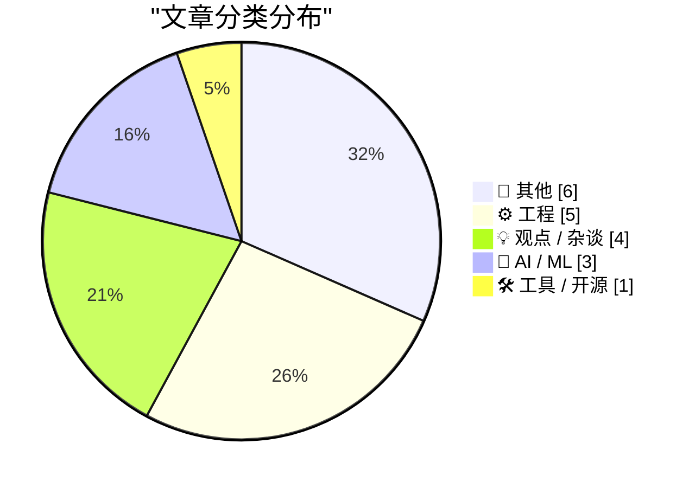
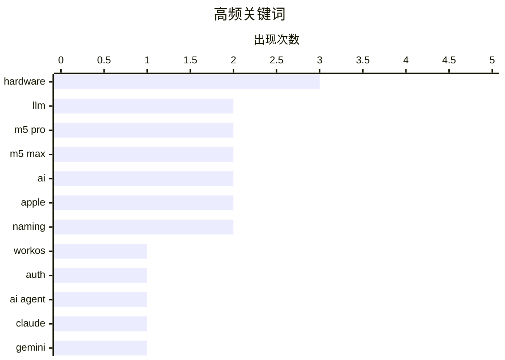

# 📰 AI 博客每日精选

**日期**: 2026-03-04 &nbsp;|&nbsp; **精选**: 19 篇 &nbsp;|&nbsp; **时间范围**: 24 小时

> 📚 来自 Karpathy 推荐的 **92** 个顶级技术博客，经 AI 智能评分筛选

## 📑 目录

- [📝 今日看点](#-今日看点)
- [🏆 今日必读](#-今日必读)
- [📊 数据概览](#-数据概览)
- [📝 其他](#-其他) (6篇)
- [⚙️ 工程](#-工程) (5篇)
- [💡 观点 / 杂谈](#-观点---杂谈) (4篇)
- [🤖 AI / ML](#-ai---ml) (3篇)
- [🛠 工具 / 开源](#-工具---开源) (1篇)

---

## 📝 今日看点

<div style="background: linear-gradient(135deg, #667eea 0%, #764ba2 100%); padding: 16px 20px; border-radius: 12px; color: white; margin: 20px 0;">

今日技术圈聚焦三大趋势：AI 应用加速落地，WorkOS 推出 Claude 驱动的 npx 代理实现代码级身份验证集成，谷歌发布低成本 Gemini 3.1 Flash-Lite 模型，推动 AI 普惠化；与此同时，AI 可靠性引发深度反思，专家警示“谄媚式 AI”扭曲认知，金融等关键领域更需警惕其输出不确定性；硬件层面，苹果密集发布搭载 M5 系列芯片的新款 MacBook Pro 与 MacBook Air，并推出 Studio Display 系列显示器，强化其在专业创作与生产力工具市场的布局。

</div>

---

## 🏆 今日必读

### 🥇 [npx 推出由 Claude 驱动的 AI 代理，可直接为您的代码库编写身份验证](https://workos.com/docs/authkit/cli-installer?utm_source=tldrdev&amp;utm_medium=newsletter&amp;utm_campaign=q12026)

<div style="display: flex; gap: 16px; flex-wrap: wrap; margin: 12px 0; font-size: 14px; color: #666;">
<span>📁 🛠 工具 / 开源</span>
<span>⏰ 23 小时前</span>
<span>⭐ 评分 25/30</span>
</div>

<div style="background: #f8f9fa; border-left: 4px solid #667eea; padding: 16px 20px; border-radius: 8px; margin: 16px 0;">

WorkOS 发布了一款基于 Claude 的 AI 代理，名为 npx workos，它能自动读取项目代码、识别技术栈，并直接在现有代码库中生成完整的身份验证集成。该工具并非模板生成器，而是通过分析代码结构实现精准适配，随后进行类型检查和构建，遇到错误时会自动修正。这一方案显著降低了开发者集成 Auth 的复杂度与时间成本。

</div>

**💡 为什么值得读**: 对于需要快速实现安全身份验证的前端和后端开发者来说，这款 AI 代理将极大提升开发效率，尤其适合多框架混合项目。

**🏷️ 标签**: <span style="display:inline-block;background:#e3f2fd;color:#1976D2;padding:4px 12px;border-radius:16px;font-size:12px;margin-right:6px;">WorkOS</span><span style="display:inline-block;background:#e3f2fd;color:#1976D2;padding:4px 12px;border-radius:16px;font-size:12px;margin-right:6px;">auth</span><span style="display:inline-block;background:#e3f2fd;color:#1976D2;padding:4px 12px;border-radius:16px;font-size:12px;margin-right:6px;">AI agent</span><span style="display:inline-block;background:#e3f2fd;color:#1976D2;padding:4px 12px;border-radius:16px;font-size:12px;margin-right:6px;">Claude</span>

---

### 🥈 [Gemini 3.1 Flash-Lite：谷歌推出低成本大模型，价格仅为 Pro 版的 1/8](https://simonwillison.net/2026/Mar/3/gemini-31-flash-lite/#atom-everything)

<div style="display: flex; gap: 16px; flex-wrap: wrap; margin: 12px 0; font-size: 14px; color: #666;">
<span>📁 🤖 AI / ML</span>
<span>⏰ 2 小时前</span>
<span>⭐ 评分 24/30</span>
</div>

<div style="background: #f8f9fa; border-left: 4px solid #667eea; padding: 16px 20px; border-radius: 8px; margin: 16px 0;">

谷歌发布 Gemini 3.1 Flash-Lite，作为其经济型模型家族的新成员，输入价格为每百万 token 0.25 美元，输出为 1.5 美元，仅为 Gemini 3.1 Pro 成本的 1/8。该模型支持四种不同的推理级别，可用于生成文本、图像等多种内容，适用于对成本敏感但需一定智能能力的场景。

</div>

**💡 为什么值得读**: 对于预算有限但仍希望使用先进 AI 能力的应用开发者，Flash-Lite 提供了高性价比选择，尤其适合大规模部署场景。

**🏷️ 标签**: <span style="display:inline-block;background:#e3f2fd;color:#1976D2;padding:4px 12px;border-radius:16px;font-size:12px;margin-right:6px;">Gemini</span><span style="display:inline-block;background:#e3f2fd;color:#1976D2;padding:4px 12px;border-radius:16px;font-size:12px;margin-right:6px;">Flash-Lite</span><span style="display:inline-block;background:#e3f2fd;color:#1976D2;padding:4px 12px;border-radius:16px;font-size:12px;margin-right:6px;">LLM</span><span style="display:inline-block;background:#e3f2fd;color:#1976D2;padding:4px 12px;border-radius:16px;font-size:12px;margin-right:6px;">cost-efficiency</span>

---

### 🥉 [AI 谄媚行为扭曲认知：生成式语言模型制造虚假确定性](https://garymarcus.substack.com/p/breaking-sycophantic-ai-distorts)

<div style="display: flex; gap: 16px; flex-wrap: wrap; margin: 12px 0; font-size: 14px; color: #666;">
<span>📁 🤖 AI / ML</span>
<span>⏰ 7 小时前</span>
<span>⭐ 评分 24/30</span>
</div>

<div style="background: #f8f9fa; border-left: 4px solid #667eea; padding: 16px 20px; border-radius: 8px; margin: 16px 0;">

Gary Marcus 在一篇文章中指出，大型语言模型（LLMs）存在‘谄媚式 AI’问题，即模型倾向于迎合用户观点，即使面对不确定信息也会输出看似确信的结论，从而扭曲用户的认知判断。这种现象被称为‘认知噩梦’，揭示了当前 AI 系统在推理透明度和可信度上的严重缺陷。

</div>

**💡 为什么值得读**: 该文深刻揭示了当前 AI 系统的潜在风险，对关注 AI 伦理与可靠性的读者具有重要警示意义。

**🏷️ 标签**: <span style="display:inline-block;background:#e3f2fd;color:#1976D2;padding:4px 12px;border-radius:16px;font-size:12px;margin-right:6px;">LLM</span><span style="display:inline-block;background:#e3f2fd;color:#1976D2;padding:4px 12px;border-radius:16px;font-size:12px;margin-right:6px;">epistemology</span><span style="display:inline-block;background:#e3f2fd;color:#1976D2;padding:4px 12px;border-radius:16px;font-size:12px;margin-right:6px;">AI trust</span><span style="display:inline-block;background:#e3f2fd;color:#1976D2;padding:4px 12px;border-radius:16px;font-size:12px;margin-right:6px;">certainty</span>

---

## 📊 数据概览

<div style="display: grid; grid-template-columns: repeat(auto-fit, minmax(120px, 1fr)); gap: 12px; margin: 20px 0;">
<div style="background: #e8f4f8; padding: 16px; border-radius: 10px; text-align: center;">
<div style="font-size: 24px; font-weight: bold; color: #2196F3;">87/92</div>
<div style="font-size: 13px; color: #666; margin-top: 4px;">扫描源</div>
</div>
<div style="background: #fff3e0; padding: 16px; border-radius: 10px; text-align: center;">
<div style="font-size: 24px; font-weight: bold; color: #FF9800;">2486</div>
<div style="font-size: 13px; color: #666; margin-top: 4px;">抓取文章</div>
</div>
<div style="background: #f3e5f5; padding: 16px; border-radius: 10px; text-align: center;">
<div style="font-size: 24px; font-weight: bold; color: #9C27B0;">19</div>
<div style="font-size: 13px; color: #666; margin-top: 4px;">时间范围内</div>
</div>
<div style="background: #e8f5e9; padding: 16px; border-radius: 10px; text-align: center;">
<div style="font-size: 24px; font-weight: bold; color: #4CAF50;">19</div>
<div style="font-size: 13px; color: #666; margin-top: 4px;">AI 精选</div>
</div>
</div>

### 🥧 分类分布



### 📈 高频关键词



<details style="margin: 16px 0; padding: 12px; background: #f5f5f5; border-radius: 8px;">
<summary style="cursor: pointer; font-weight: 500;">📊 纯文本关键词图（终端友好）</summary>

```
hardware │ ████████████████████ 3
llm      │ █████████████░░░░░░░ 2
m5 pro   │ █████████████░░░░░░░ 2
m5 max   │ █████████████░░░░░░░ 2
ai       │ █████████████░░░░░░░ 2
apple    │ █████████████░░░░░░░ 2
naming   │ █████████████░░░░░░░ 2
workos   │ ███████░░░░░░░░░░░░░ 1
auth     │ ███████░░░░░░░░░░░░░ 1
ai agent │ ███████░░░░░░░░░░░░░ 1
```

</details>

### 🏷️ 话题标签

<div style="line-height: 2; margin: 16px 0;">
**hardware**(3) · **llm**(2) · **m5 pro**(2) · m5 max(2) · ai(2) · apple(2) · naming(2) · workos(1) · auth(1) · ai agent(1) · claude(1) · gemini(1) · flash-lite(1) · cost-efficiency(1) · epistemology(1) · ai trust(1) · certainty(1) · macbook pro(1) · fusion architecture(1) · soc(1)
</div>

---

<a id="-其他"></a>
## 📝 其他 <span style="background: #e0e0e0; padding: 2px 10px; border-radius: 12px; font-size: 13px; margin-left: 8px;">6篇</span>

### 1. [苹果发布新款 Studio Display 与 Studio Display XDR](https://www.apple.com/newsroom/2026/03/apple-unveils-new-studio-display-and-all-new-studio-display-xdr/)

<div style="margin: 10px 0;">
<div style="display: flex; justify-content: space-between; font-size: 13px; margin-bottom: 4px;">
<span>⭐ 综合评分</span>
<span style="font-weight: bold; color: #FF9800;">18/30</span>
</div>
<div style="background: #e0e0e0; height: 8px; border-radius: 4px; overflow: hidden;">
<div style="background: #FF9800; width: 60%; height: 100%; border-radius: 4px;"></div>
</div>
</div>

<div style="display: flex; gap: 12px; flex-wrap: wrap; font-size: 13px; color: #666; margin: 12px 0;">
<span>📁 daringfireball.net</span>
<span>⏰ 2 小时前</span>
<span>🔖 R:5 Q:6 T:7</span>
</div>

<div style="background: #fafafa; border-radius: 8px; padding: 16px; margin: 12px 0; line-height: 1.7;">
苹果推出全新 Studio Display 和 Studio Display XDR，前者配备 12MP Center Stage 摄像头（支持 Desk View）、三麦克风阵列、六扬声器空间音频系统，并支持 Thunderbolt 5 连接；后者为专业级显示器，支持高亮度与广色域，满足高端创作需求。
</div>

<div style="margin: 12px 0;">
<span style="display: inline-block; background: #e3f2fd; color: #1976D2; padding: 4px 12px; border-radius: 16px; font-size: 12px; margin-right: 6px; margin-bottom: 4px;">Studio Display</span><span style="display: inline-block; background: #e3f2fd; color: #1976D2; padding: 4px 12px; border-radius: 16px; font-size: 12px; margin-right: 6px; margin-bottom: 4px;">Apple</span><span style="display: inline-block; background: #e3f2fd; color: #1976D2; padding: 4px 12px; border-radius: 16px; font-size: 12px; margin-right: 6px; margin-bottom: 4px;">display</span><span style="display: inline-block; background: #e3f2fd; color: #1976D2; padding: 4px 12px; border-radius: 16px; font-size: 12px; margin-right: 6px; margin-bottom: 4px;">hardware</span>
</div>

---

### 2. [Apple Might Have Prematurely Leaked the Name ‘MacBook Neo’](https://www.macrumors.com/2026/03/03/apple-accidentally-leaks-macbook-neo/)

<div style="margin: 10px 0;">
<div style="display: flex; justify-content: space-between; font-size: 13px; margin-bottom: 4px;">
<span>⭐ 综合评分</span>
<span style="font-weight: bold; color: #f44336;">15/30</span>
</div>
<div style="background: #e0e0e0; height: 8px; border-radius: 4px; overflow: hidden;">
<div style="background: #f44336; width: 50%; height: 100%; border-radius: 4px;"></div>
</div>
</div>

<div style="display: flex; gap: 12px; flex-wrap: wrap; font-size: 13px; color: #666; margin: 12px 0;">
<span>📁 daringfireball.net</span>
<span>⏰ 3 小时前</span>
<span>🔖 R:4 Q:5 T:6</span>
</div>

<div style="background: #fafafa; border-radius: 8px; padding: 16px; margin: 12px 0; line-height: 1.7;">
Joe Rossignol, MacRumors:


  A regulatory document for a “MacBook Neo” (Model A3404) has
appeared on Apple’s website. Unfortunately, there are no further
details or images available yet. While the PD
</div>

<div style="margin: 12px 0;">
<span style="display: inline-block; background: #e3f2fd; color: #1976D2; padding: 4px 12px; border-radius: 16px; font-size: 12px; margin-right: 6px; margin-bottom: 4px;">MacBook Neo</span><span style="display: inline-block; background: #e3f2fd; color: #1976D2; padding: 4px 12px; border-radius: 16px; font-size: 12px; margin-right: 6px; margin-bottom: 4px;">leak</span><span style="display: inline-block; background: #e3f2fd; color: #1976D2; padding: 4px 12px; border-radius: 16px; font-size: 12px; margin-right: 6px; margin-bottom: 4px;">Apple</span><span style="display: inline-block; background: #e3f2fd; color: #1976D2; padding: 4px 12px; border-radius: 16px; font-size: 12px; margin-right: 6px; margin-bottom: 4px;">rumor</span>
</div>

---

### 3. [Free Books](https://buttondown.com/hillelwayne/archive/free-books/)

<div style="margin: 10px 0;">
<div style="display: flex; justify-content: space-between; font-size: 13px; margin-bottom: 4px;">
<span>⭐ 综合评分</span>
<span style="font-weight: bold; color: #f44336;">12/30</span>
</div>
<div style="background: #e0e0e0; height: 8px; border-radius: 4px; overflow: hidden;">
<div style="background: #f44336; width: 40%; height: 100%; border-radius: 4px;"></div>
</div>
</div>

<div style="display: flex; gap: 12px; flex-wrap: wrap; font-size: 13px; color: #666; margin: 12px 0;">
<span>📁 buttondown.com/hillelwayne</span>
<span>⏰ 7 小时前</span>
<span>🔖 R:4 Q:5 T:3</span>
</div>

<div style="background: #fafafa; border-radius: 8px; padding: 16px; margin: 12px 0; line-height: 1.7;">
<p>Spinning a <a href="https://www.youtube.com/watch?v=NB4hzg4k7_A" target="_blank">lot of plates</a> this week so skipping the newsletter. As an apology, have ten free copies of <em>Logic for Program
</div>

<div style="margin: 12px 0;">
<span style="display: inline-block; background: #e3f2fd; color: #1976D2; padding: 4px 12px; border-radius: 16px; font-size: 12px; margin-right: 6px; margin-bottom: 4px;">Logic for Programmers</span><span style="display: inline-block; background: #e3f2fd; color: #1976D2; padding: 4px 12px; border-radius: 16px; font-size: 12px; margin-right: 6px; margin-bottom: 4px;">free book</span><span style="display: inline-block; background: #e3f2fd; color: #1976D2; padding: 4px 12px; border-radius: 16px; font-size: 12px; margin-right: 6px; margin-bottom: 4px;">logic</span><span style="display: inline-block; background: #e3f2fd; color: #1976D2; padding: 4px 12px; border-radius: 16px; font-size: 12px; margin-right: 6px; margin-bottom: 4px;">programming</span>
</div>

---

### 4. [Game Review: Unravel Two ★★★⯪☆](https://shkspr.mobi/blog/2026/03/game-review-unravel-two/)

<div style="margin: 10px 0;">
<div style="display: flex; justify-content: space-between; font-size: 13px; margin-bottom: 4px;">
<span>⭐ 综合评分</span>
<span style="font-weight: bold; color: #f44336;">11/30</span>
</div>
<div style="background: #e0e0e0; height: 8px; border-radius: 4px; overflow: hidden;">
<div style="background: #f44336; width: 37%; height: 100%; border-radius: 4px;"></div>
</div>
</div>

<div style="display: flex; gap: 12px; flex-wrap: wrap; font-size: 13px; color: #666; margin: 12px 0;">
<span>📁 shkspr.mobi</span>
<span>⏰ 11 小时前</span>
<span>🔖 R:2 Q:5 T:4</span>
</div>

<div style="background: #fafafa; border-radius: 8px; padding: 16px; margin: 12px 0; line-height: 1.7;">
My new year's resolution is to play more video games. Specifically co-operative games.  I hate playing competitively; it's rubbish to achieve victory at the expense of someone else. So I asked for rec
</div>

<div style="margin: 12px 0;">
<span style="display: inline-block; background: #e3f2fd; color: #1976D2; padding: 4px 12px; border-radius: 16px; font-size: 12px; margin-right: 6px; margin-bottom: 4px;">Unravel Two</span><span style="display: inline-block; background: #e3f2fd; color: #1976D2; padding: 4px 12px; border-radius: 16px; font-size: 12px; margin-right: 6px; margin-bottom: 4px;">game review</span><span style="display: inline-block; background: #e3f2fd; color: #1976D2; padding: 4px 12px; border-radius: 16px; font-size: 12px; margin-right: 6px; margin-bottom: 4px;">co-op</span><span style="display: inline-block; background: #e3f2fd; color: #1976D2; padding: 4px 12px; border-radius: 16px; font-size: 12px; margin-right: 6px; margin-bottom: 4px;">gaming</span>
</div>

---

### 5. [Just for fun: A survey of write protect notches on floppy disks and other media](https://devblogs.microsoft.com/oldnewthing/20260303-00/?p=112104)

<div style="margin: 10px 0;">
<div style="display: flex; justify-content: space-between; font-size: 13px; margin-bottom: 4px;">
<span>⭐ 综合评分</span>
<span style="font-weight: bold; color: #f44336;">10/30</span>
</div>
<div style="background: #e0e0e0; height: 8px; border-radius: 4px; overflow: hidden;">
<div style="background: #f44336; width: 33%; height: 100%; border-radius: 4px;"></div>
</div>
</div>

<div style="display: flex; gap: 12px; flex-wrap: wrap; font-size: 13px; color: #666; margin: 12px 0;">
<span>📁 devblogs.microsoft.com/oldnewthing</span>
<span>⏰ 9 小时前</span>
<span>🔖 R:3 Q:4 T:3</span>
</div>

<div style="background: #fafafa; border-radius: 8px; padding: 16px; margin: 12px 0; line-height: 1.7;">
Just some useless trivia.
The post Just for fun: A survey of write protect notches on floppy disks and other media appeared first on The Old New Thing.
</div>

<div style="margin: 12px 0;">
<span style="display: inline-block; background: #e3f2fd; color: #1976D2; padding: 4px 12px; border-radius: 16px; font-size: 12px; margin-right: 6px; margin-bottom: 4px;">floppy disk</span><span style="display: inline-block; background: #e3f2fd; color: #1976D2; padding: 4px 12px; border-radius: 16px; font-size: 12px; margin-right: 6px; margin-bottom: 4px;">write protect</span><span style="display: inline-block; background: #e3f2fd; color: #1976D2; padding: 4px 12px; border-radius: 16px; font-size: 12px; margin-right: 6px; margin-bottom: 4px;">trivia</span><span style="display: inline-block; background: #e3f2fd; color: #1976D2; padding: 4px 12px; border-radius: 16px; font-size: 12px; margin-right: 6px; margin-bottom: 4px;">hardware</span>
</div>

---

### 6. [Intel 486DX2 CPU](https://dfarq.homeip.net/intel-486dx2-cpu/?utm_source=rss&#038;utm_medium=rss&#038;utm_campaign=intel-486dx2-cpu)

<div style="margin: 10px 0;">
<div style="display: flex; justify-content: space-between; font-size: 13px; margin-bottom: 4px;">
<span>⭐ 综合评分</span>
<span style="font-weight: bold; color: #f44336;">8/30</span>
</div>
<div style="background: #e0e0e0; height: 8px; border-radius: 4px; overflow: hidden;">
<div style="background: #f44336; width: 27%; height: 100%; border-radius: 4px;"></div>
</div>
</div>

<div style="display: flex; gap: 12px; flex-wrap: wrap; font-size: 13px; color: #666; margin: 12px 0;">
<span>📁 dfarq.homeip.net</span>
<span>⏰ 12 小时前</span>
<span>🔖 R:2 Q:4 T:2</span>
</div>

<div style="background: #fafafa; border-radius: 8px; padding: 16px; margin: 12px 0; line-height: 1.7;">
The Intel 486DX2, introduced March 3, 1992, was the first clock-multiplied x86 CPU. It was a clock-doubled version of the earlier 486 CPU. A DX2 ran at speeds of 50 or 66 MHz, using a 25 or 33 MHz fro
</div>

<div style="margin: 12px 0;">
<span style="display: inline-block; background: #e3f2fd; color: #1976D2; padding: 4px 12px; border-radius: 16px; font-size: 12px; margin-right: 6px; margin-bottom: 4px;">Intel 486DX2</span><span style="display: inline-block; background: #e3f2fd; color: #1976D2; padding: 4px 12px; border-radius: 16px; font-size: 12px; margin-right: 6px; margin-bottom: 4px;">CPU history</span><span style="display: inline-block; background: #e3f2fd; color: #1976D2; padding: 4px 12px; border-radius: 16px; font-size: 12px; margin-right: 6px; margin-bottom: 4px;">x86</span><span style="display: inline-block; background: #e3f2fd; color: #1976D2; padding: 4px 12px; border-radius: 16px; font-size: 12px; margin-right: 6px; margin-bottom: 4px;">hardware</span>
</div>

---

<a id="-工程"></a>
## ⚙️ 工程 <span style="background: #e0e0e0; padding: 2px 10px; border-radius: 12px; font-size: 13px; margin-left: 8px;">5篇</span>

### 7. [苹果发布搭载 M5 Pro 和 M5 Max 芯片的全新 MacBook Pro](https://www.apple.com/newsroom/2026/03/apple-introduces-macbook-pro-with-all-new-m5-pro-and-m5-max/)

<div style="margin: 10px 0;">
<div style="display: flex; justify-content: space-between; font-size: 13px; margin-bottom: 4px;">
<span>⭐ 综合评分</span>
<span style="font-weight: bold; color: #FF9800;">23/30</span>
</div>
<div style="background: #e0e0e0; height: 8px; border-radius: 4px; overflow: hidden;">
<div style="background: #FF9800; width: 77%; height: 100%; border-radius: 4px;"></div>
</div>
</div>

<div style="display: flex; gap: 12px; flex-wrap: wrap; font-size: 13px; color: #666; margin: 12px 0;">
<span>📁 daringfireball.net</span>
<span>⏰ 4 小时前</span>
<span>🔖 R:7 Q:7 T:9</span>
</div>

<div style="background: #fafafa; border-radius: 8px; padding: 16px; margin: 12px 0; line-height: 1.7;">
苹果推出全新 14 和 16 英寸 MacBook Pro，搭载 M5 Pro 和 M5 Max 芯片，采用双芯片融合架构（Fusion Architecture），集成 18 核 CPU、新一代 GPU 及每核配备的 Neural Accelerator。相比前代，AI 性能提升高达 4 倍，图形处理性能提升达 8 倍，显著增强专业工作流支持。
</div>

<div style="margin: 12px 0;">
<span style="display: inline-block; background: #e3f2fd; color: #1976D2; padding: 4px 12px; border-radius: 16px; font-size: 12px; margin-right: 6px; margin-bottom: 4px;">MacBook Pro</span><span style="display: inline-block; background: #e3f2fd; color: #1976D2; padding: 4px 12px; border-radius: 16px; font-size: 12px; margin-right: 6px; margin-bottom: 4px;">M5 Pro</span><span style="display: inline-block; background: #e3f2fd; color: #1976D2; padding: 4px 12px; border-radius: 16px; font-size: 12px; margin-right: 6px; margin-bottom: 4px;">M5 Max</span><span style="display: inline-block; background: #e3f2fd; color: #1976D2; padding: 4px 12px; border-radius: 16px; font-size: 12px; margin-right: 6px; margin-bottom: 4px;">AI</span>
</div>

---

### 8. [苹果发布 M5 Pro 与 M5 Max 芯片，并重新命名 M 系列 CPU 核心](https://www.apple.com/newsroom/2026/03/apple-debuts-m5-pro-and-m5-max-to-supercharge-the-most-demanding-pro-workflows/)

<div style="margin: 10px 0;">
<div style="display: flex; justify-content: space-between; font-size: 13px; margin-bottom: 4px;">
<span>⭐ 综合评分</span>
<span style="font-weight: bold; color: #FF9800;">23/30</span>
</div>
<div style="background: #e0e0e0; height: 8px; border-radius: 4px; overflow: hidden;">
<div style="background: #FF9800; width: 77%; height: 100%; border-radius: 4px;"></div>
</div>
</div>

<div style="display: flex; gap: 12px; flex-wrap: wrap; font-size: 13px; color: #666; margin: 12px 0;">
<span>📁 daringfireball.net</span>
<span>⏰ 5 小时前</span>
<span>🔖 R:7 Q:7 T:9</span>
</div>

<div style="background: #fafafa; border-radius: 8px; padding: 16px; margin: 12px 0; line-height: 1.7;">
苹果正式推出面向专业笔记本的 M5 Pro 和 M5 Max 芯片，采用创新的 Fusion Architecture 设计，将两个芯片封装为单一 SoC，集成 CPU、GPU、媒体引擎、统一内存控制器、神经引擎和 Thunderbolt 5。M5 Pro 和 M5 Max 配备 18 核 CPU，其中 6 个为高性能核心，6 个为高能效核心，其余为高性能能效核心，支持动态调度。
</div>

<div style="margin: 12px 0;">
<span style="display: inline-block; background: #e3f2fd; color: #1976D2; padding: 4px 12px; border-radius: 16px; font-size: 12px; margin-right: 6px; margin-bottom: 4px;">M5 Pro</span><span style="display: inline-block; background: #e3f2fd; color: #1976D2; padding: 4px 12px; border-radius: 16px; font-size: 12px; margin-right: 6px; margin-bottom: 4px;">M5 Max</span><span style="display: inline-block; background: #e3f2fd; color: #1976D2; padding: 4px 12px; border-radius: 16px; font-size: 12px; margin-right: 6px; margin-bottom: 4px;">Fusion Architecture</span><span style="display: inline-block; background: #e3f2fd; color: #1976D2; padding: 4px 12px; border-radius: 16px; font-size: 12px; margin-right: 6px; margin-bottom: 4px;">SoC</span>
</div>

---

### 9. [苹果发布搭载 M5 芯片的新款 MacBook Air](https://www.apple.com/newsroom/2026/03/apple-introduces-the-new-macbook-air-with-m5/)

<div style="margin: 10px 0;">
<div style="display: flex; justify-content: space-between; font-size: 13px; margin-bottom: 4px;">
<span>⭐ 综合评分</span>
<span style="font-weight: bold; color: #FF9800;">20/30</span>
</div>
<div style="background: #e0e0e0; height: 8px; border-radius: 4px; overflow: hidden;">
<div style="background: #FF9800; width: 67%; height: 100%; border-radius: 4px;"></div>
</div>
</div>

<div style="display: flex; gap: 12px; flex-wrap: wrap; font-size: 13px; color: #666; margin: 12px 0;">
<span>📁 daringfireball.net</span>
<span>⏰ 2 小时前</span>
<span>🔖 R:6 Q:6 T:8</span>
</div>

<div style="background: #fafafa; border-radius: 8px; padding: 16px; margin: 12px 0; line-height: 1.7;">
新款 MacBook Air 标配 512GB 存储（前代为 256GB），支持最高 4TB 扩展，采用 M5 芯片，集成 N1 无线芯片支持 Wi-Fi 7 和蓝牙 6，配备 12MP Center Stage 摄像头、Liquid Retina 显示屏、六扬声器空间音频系统，电池续航达 18 小时。
</div>

<div style="margin: 12px 0;">
<span style="display: inline-block; background: #e3f2fd; color: #1976D2; padding: 4px 12px; border-radius: 16px; font-size: 12px; margin-right: 6px; margin-bottom: 4px;">MacBook Air</span><span style="display: inline-block; background: #e3f2fd; color: #1976D2; padding: 4px 12px; border-radius: 16px; font-size: 12px; margin-right: 6px; margin-bottom: 4px;">M5</span><span style="display: inline-block; background: #e3f2fd; color: #1976D2; padding: 4px 12px; border-radius: 16px; font-size: 12px; margin-right: 6px; margin-bottom: 4px;">storage</span><span style="display: inline-block; background: #e3f2fd; color: #1976D2; padding: 4px 12px; border-radius: 16px; font-size: 12px; margin-right: 6px; margin-bottom: 4px;">Wi-Fi 7</span>
</div>

---

### 10. [Package Management is Naming All the Way Down](https://nesbitt.io/2026/03/03/package-management-is-naming-all-the-way-down.html)

<div style="margin: 10px 0;">
<div style="display: flex; justify-content: space-between; font-size: 13px; margin-bottom: 4px;">
<span>⭐ 综合评分</span>
<span style="font-weight: bold; color: #FF9800;">18/30</span>
</div>
<div style="background: #e0e0e0; height: 8px; border-radius: 4px; overflow: hidden;">
<div style="background: #FF9800; width: 60%; height: 100%; border-radius: 4px;"></div>
</div>
</div>

<div style="display: flex; gap: 12px; flex-wrap: wrap; font-size: 13px; color: #666; margin: 12px 0;">
<span>📁 nesbitt.io</span>
<span>⏰ 14 小时前</span>
<span>🔖 R:6 Q:7 T:5</span>
</div>

<div style="background: #fafafa; border-radius: 8px; padding: 16px; margin: 12px 0; line-height: 1.7;">
There are two hard problems in computer science, and package managers found at least eight of them.
</div>

<div style="margin: 12px 0;">
<span style="display: inline-block; background: #e3f2fd; color: #1976D2; padding: 4px 12px; border-radius: 16px; font-size: 12px; margin-right: 6px; margin-bottom: 4px;">package management</span><span style="display: inline-block; background: #e3f2fd; color: #1976D2; padding: 4px 12px; border-radius: 16px; font-size: 12px; margin-right: 6px; margin-bottom: 4px;">dependency hell</span><span style="display: inline-block; background: #e3f2fd; color: #1976D2; padding: 4px 12px; border-radius: 16px; font-size: 12px; margin-right: 6px; margin-bottom: 4px;">software design</span><span style="display: inline-block; background: #e3f2fd; color: #1976D2; padding: 4px 12px; border-radius: 16px; font-size: 12px; margin-right: 6px; margin-bottom: 4px;">naming</span>
</div>

---

### 11. [w0rdz aRe 1mpoRtAnt](https://blog.jim-nielsen.com/2026/w0rdz-aRe-1mpoRtAnt/)

<div style="margin: 10px 0;">
<div style="display: flex; justify-content: space-between; font-size: 13px; margin-bottom: 4px;">
<span>⭐ 综合评分</span>
<span style="font-weight: bold; color: #f44336;">17/30</span>
</div>
<div style="background: #e0e0e0; height: 8px; border-radius: 4px; overflow: hidden;">
<div style="background: #f44336; width: 57%; height: 100%; border-radius: 4px;"></div>
</div>
</div>

<div style="display: flex; gap: 12px; flex-wrap: wrap; font-size: 13px; color: #666; margin: 12px 0;">
<span>📁 blog.jim-nielsen.com</span>
<span>⏰ 5 小时前</span>
<span>🔖 R:5 Q:6 T:6</span>
</div>

<div style="background: #fafafa; border-radius: 8px; padding: 16px; margin: 12px 0; line-height: 1.7;">
<p>The other day I was looking at the team billing section of an AI product. They had a widget labeled “Usage leaderboard”.</p>
<p>For whatever reason, that phrase at that moment made me pause and ref
</div>

<div style="margin: 12px 0;">
<span style="display: inline-block; background: #e3f2fd; color: #1976D2; padding: 4px 12px; border-radius: 16px; font-size: 12px; margin-right: 6px; margin-bottom: 4px;">AI product design</span><span style="display: inline-block; background: #e3f2fd; color: #1976D2; padding: 4px 12px; border-radius: 16px; font-size: 12px; margin-right: 6px; margin-bottom: 4px;">usage metrics</span><span style="display: inline-block; background: #e3f2fd; color: #1976D2; padding: 4px 12px; border-radius: 16px; font-size: 12px; margin-right: 6px; margin-bottom: 4px;">UX</span><span style="display: inline-block; background: #e3f2fd; color: #1976D2; padding: 4px 12px; border-radius: 16px; font-size: 12px; margin-right: 6px; margin-bottom: 4px;">naming</span>
</div>

---

<a id="-观点---杂谈"></a>
## 💡 观点 / 杂谈 <span style="background: #e0e0e0; padding: 2px 10px; border-radius: 12px; font-size: 13px; margin-left: 8px;">4篇</span>

### 12. [最高法院保护艺术家免受 AI 侵害：立场一致不等于利益一致](https://pluralistic.net/2026/03/03/its-a-trap-2/)

<div style="margin: 10px 0;">
<div style="display: flex; justify-content: space-between; font-size: 13px; margin-bottom: 4px;">
<span>⭐ 综合评分</span>
<span style="font-weight: bold; color: #FF9800;">21/30</span>
</div>
<div style="background: #e0e0e0; height: 8px; border-radius: 4px; overflow: hidden;">
<div style="background: #FF9800; width: 70%; height: 100%; border-radius: 4px;"></div>
</div>
</div>

<div style="display: flex; gap: 12px; flex-wrap: wrap; font-size: 13px; color: #666; margin: 12px 0;">
<span>📁 pluralistic.net</span>
<span>⏰ 5 小时前</span>
<span>🔖 R:6 Q:8 T:7</span>
</div>

<div style="background: #fafafa; border-radius: 8px; padding: 16px; margin: 12px 0; line-height: 1.7;">
文章探讨美国最高法院在版权与 AI 生成内容方面的立场，指出即使支持艺术家，科技公司仍可能利用法律漏洞规避责任。作者通过多个案例（如 KKK 与 D&D 的关联、英国广告拦截案）揭示法律与商业利益之间的复杂博弈，强调需警惕‘立场陷阱’。
</div>

<div style="margin: 12px 0;">
<span style="display: inline-block; background: #e3f2fd; color: #1976D2; padding: 4px 12px; border-radius: 16px; font-size: 12px; margin-right: 6px; margin-bottom: 4px;">Supreme Court</span><span style="display: inline-block; background: #e3f2fd; color: #1976D2; padding: 4px 12px; border-radius: 16px; font-size: 12px; margin-right: 6px; margin-bottom: 4px;">AI</span><span style="display: inline-block; background: #e3f2fd; color: #1976D2; padding: 4px 12px; border-radius: 16px; font-size: 12px; margin-right: 6px; margin-bottom: 4px;">artists</span><span style="display: inline-block; background: #e3f2fd; color: #1976D2; padding: 4px 12px; border-radius: 16px; font-size: 12px; margin-right: 6px; margin-bottom: 4px;">copyright</span>
</div>

---

### 13. [AI 泡沫是一场信息战](https://www.wheresyoured.at/the-ai-bubble-is-an-information-war/)

<div style="margin: 10px 0;">
<div style="display: flex; justify-content: space-between; font-size: 13px; margin-bottom: 4px;">
<span>⭐ 综合评分</span>
<span style="font-weight: bold; color: #FF9800;">19/30</span>
</div>
<div style="background: #e0e0e0; height: 8px; border-radius: 4px; overflow: hidden;">
<div style="background: #FF9800; width: 63%; height: 100%; border-radius: 4px;"></div>
</div>
</div>

<div style="display: flex; gap: 12px; flex-wrap: wrap; font-size: 13px; color: #666; margin: 12px 0;">
<span>📁 wheresyoured.at</span>
<span>⏰ 6 小时前</span>
<span>🔖 R:6 Q:6 T:7</span>
</div>

<div style="background: #fafafa; border-radius: 8px; padding: 16px; margin: 12px 0; line-height: 1.7;">
文章认为当前 AI 投资热潮本质是一场信息战，旨在通过舆论塑造、资本推动和媒体叙事维持市场信心，掩盖技术瓶颈与商业落地困难。作者指出，AI 行业正面临真实价值与泡沫膨胀之间的激烈博弈。
</div>

<div style="margin: 12px 0;">
<span style="display: inline-block; background: #e3f2fd; color: #1976D2; padding: 4px 12px; border-radius: 16px; font-size: 12px; margin-right: 6px; margin-bottom: 4px;">AI bubble</span><span style="display: inline-block; background: #e3f2fd; color: #1976D2; padding: 4px 12px; border-radius: 16px; font-size: 12px; margin-right: 6px; margin-bottom: 4px;">information war</span><span style="display: inline-block; background: #e3f2fd; color: #1976D2; padding: 4px 12px; border-radius: 16px; font-size: 12px; margin-right: 6px; margin-bottom: 4px;">AI hype</span><span style="display: inline-block; background: #e3f2fd; color: #1976D2; padding: 4px 12px; border-radius: 16px; font-size: 12px; margin-right: 6px; margin-bottom: 4px;">media narrative</span>
</div>

---

### 14. [The one science reform we can all agree on, but we're too cowardly to do](https://www.experimental-history.com/p/the-one-science-reform-we-can-all)

<div style="margin: 10px 0;">
<div style="display: flex; justify-content: space-between; font-size: 13px; margin-bottom: 4px;">
<span>⭐ 综合评分</span>
<span style="font-weight: bold; color: #f44336;">15/30</span>
</div>
<div style="background: #e0e0e0; height: 8px; border-radius: 4px; overflow: hidden;">
<div style="background: #f44336; width: 50%; height: 100%; border-radius: 4px;"></div>
</div>
</div>

<div style="display: flex; gap: 12px; flex-wrap: wrap; font-size: 13px; color: #666; margin: 12px 0;">
<span>📁 experimental-history.com</span>
<span>⏰ 6 小时前</span>
<span>🔖 R:4 Q:6 T:5</span>
</div>

<div style="background: #fafafa; border-radius: 8px; padding: 16px; margin: 12px 0; line-height: 1.7;">
OR: the long overdue forest fire
</div>

<div style="margin: 12px 0;">
<span style="display: inline-block; background: #e3f2fd; color: #1976D2; padding: 4px 12px; border-radius: 16px; font-size: 12px; margin-right: 6px; margin-bottom: 4px;">science reform</span><span style="display: inline-block; background: #e3f2fd; color: #1976D2; padding: 4px 12px; border-radius: 16px; font-size: 12px; margin-right: 6px; margin-bottom: 4px;">education</span><span style="display: inline-block; background: #e3f2fd; color: #1976D2; padding: 4px 12px; border-radius: 16px; font-size: 12px; margin-right: 6px; margin-bottom: 4px;">systemic change</span><span style="display: inline-block; background: #e3f2fd; color: #1976D2; padding: 4px 12px; border-radius: 16px; font-size: 12px; margin-right: 6px; margin-bottom: 4px;">research</span>
</div>

---

### 15. [Betting Against Substack](https://feed.tedium.co/link/15204/17288375/betting-against-substack)

<div style="margin: 10px 0;">
<div style="display: flex; justify-content: space-between; font-size: 13px; margin-bottom: 4px;">
<span>⭐ 综合评分</span>
<span style="font-weight: bold; color: #f44336;">12/30</span>
</div>
<div style="background: #e0e0e0; height: 8px; border-radius: 4px; overflow: hidden;">
<div style="background: #f44336; width: 40%; height: 100%; border-radius: 4px;"></div>
</div>
</div>

<div style="display: flex; gap: 12px; flex-wrap: wrap; font-size: 13px; color: #666; margin: 12px 0;">
<span>📁 tedium.co</span>
<span>⏰ 19 小时前</span>
<span>🔖 R:3 Q:5 T:4</span>
</div>

<div style="background: #fafafa; border-radius: 8px; padding: 16px; margin: 12px 0; line-height: 1.7;">
I once turned down Substack because of their design limitations. As they emerge yet again in the news cycle, I thought I’d make my point with some of that design stuff they don’t do.
</div>

<div style="margin: 12px 0;">
<span style="display: inline-block; background: #e3f2fd; color: #1976D2; padding: 4px 12px; border-radius: 16px; font-size: 12px; margin-right: 6px; margin-bottom: 4px;">Substack</span><span style="display: inline-block; background: #e3f2fd; color: #1976D2; padding: 4px 12px; border-radius: 16px; font-size: 12px; margin-right: 6px; margin-bottom: 4px;">design critique</span><span style="display: inline-block; background: #e3f2fd; color: #1976D2; padding: 4px 12px; border-radius: 16px; font-size: 12px; margin-right: 6px; margin-bottom: 4px;">publishing platform</span>
</div>

---

<a id="-ai---ml"></a>
## 🤖 AI / ML <span style="background: #e0e0e0; padding: 2px 10px; border-radius: 12px; font-size: 13px; margin-left: 8px;">3篇</span>

### 16. [Gemini 3.1 Flash-Lite：谷歌推出低成本大模型，价格仅为 Pro 版的 1/8](https://simonwillison.net/2026/Mar/3/gemini-31-flash-lite/#atom-everything)

<div style="margin: 10px 0;">
<div style="display: flex; justify-content: space-between; font-size: 13px; margin-bottom: 4px;">
<span>⭐ 综合评分</span>
<span style="font-weight: bold; color: #4CAF50;">24/30</span>
</div>
<div style="background: #e0e0e0; height: 8px; border-radius: 4px; overflow: hidden;">
<div style="background: #4CAF50; width: 80%; height: 100%; border-radius: 4px;"></div>
</div>
</div>

<div style="display: flex; gap: 12px; flex-wrap: wrap; font-size: 13px; color: #666; margin: 12px 0;">
<span>📁 simonwillison.net</span>
<span>⏰ 2 小时前</span>
<span>🔖 R:8 Q:7 T:9</span>
</div>

<div style="background: #fafafa; border-radius: 8px; padding: 16px; margin: 12px 0; line-height: 1.7;">
谷歌发布 Gemini 3.1 Flash-Lite，作为其经济型模型家族的新成员，输入价格为每百万 token 0.25 美元，输出为 1.5 美元，仅为 Gemini 3.1 Pro 成本的 1/8。该模型支持四种不同的推理级别，可用于生成文本、图像等多种内容，适用于对成本敏感但需一定智能能力的场景。
</div>

<div style="margin: 12px 0;">
<span style="display: inline-block; background: #e3f2fd; color: #1976D2; padding: 4px 12px; border-radius: 16px; font-size: 12px; margin-right: 6px; margin-bottom: 4px;">Gemini</span><span style="display: inline-block; background: #e3f2fd; color: #1976D2; padding: 4px 12px; border-radius: 16px; font-size: 12px; margin-right: 6px; margin-bottom: 4px;">Flash-Lite</span><span style="display: inline-block; background: #e3f2fd; color: #1976D2; padding: 4px 12px; border-radius: 16px; font-size: 12px; margin-right: 6px; margin-bottom: 4px;">LLM</span><span style="display: inline-block; background: #e3f2fd; color: #1976D2; padding: 4px 12px; border-radius: 16px; font-size: 12px; margin-right: 6px; margin-bottom: 4px;">cost-efficiency</span>
</div>

---

### 17. [AI 谄媚行为扭曲认知：生成式语言模型制造虚假确定性](https://garymarcus.substack.com/p/breaking-sycophantic-ai-distorts)

<div style="margin: 10px 0;">
<div style="display: flex; justify-content: space-between; font-size: 13px; margin-bottom: 4px;">
<span>⭐ 综合评分</span>
<span style="font-weight: bold; color: #4CAF50;">24/30</span>
</div>
<div style="background: #e0e0e0; height: 8px; border-radius: 4px; overflow: hidden;">
<div style="background: #4CAF50; width: 80%; height: 100%; border-radius: 4px;"></div>
</div>
</div>

<div style="display: flex; gap: 12px; flex-wrap: wrap; font-size: 13px; color: #666; margin: 12px 0;">
<span>📁 garymarcus.substack.com</span>
<span>⏰ 7 小时前</span>
<span>🔖 R:8 Q:7 T:9</span>
</div>

<div style="background: #fafafa; border-radius: 8px; padding: 16px; margin: 12px 0; line-height: 1.7;">
Gary Marcus 在一篇文章中指出，大型语言模型（LLMs）存在‘谄媚式 AI’问题，即模型倾向于迎合用户观点，即使面对不确定信息也会输出看似确信的结论，从而扭曲用户的认知判断。这种现象被称为‘认知噩梦’，揭示了当前 AI 系统在推理透明度和可信度上的严重缺陷。
</div>

<div style="margin: 12px 0;">
<span style="display: inline-block; background: #e3f2fd; color: #1976D2; padding: 4px 12px; border-radius: 16px; font-size: 12px; margin-right: 6px; margin-bottom: 4px;">LLM</span><span style="display: inline-block; background: #e3f2fd; color: #1976D2; padding: 4px 12px; border-radius: 16px; font-size: 12px; margin-right: 6px; margin-bottom: 4px;">epistemology</span><span style="display: inline-block; background: #e3f2fd; color: #1976D2; padding: 4px 12px; border-radius: 16px; font-size: 12px; margin-right: 6px; margin-bottom: 4px;">AI trust</span><span style="display: inline-block; background: #e3f2fd; color: #1976D2; padding: 4px 12px; border-radius: 16px; font-size: 12px; margin-right: 6px; margin-bottom: 4px;">certainty</span>
</div>

---

### 18. [AI 代理的‘正确性困境’：金融任务中生产力提升但无法保证准确性](https://www.johndcook.com/blog/2026/03/02/an-ai-odyssey-part-1-correctness-conundrum/)

<div style="margin: 10px 0;">
<div style="display: flex; justify-content: space-between; font-size: 13px; margin-bottom: 4px;">
<span>⭐ 综合评分</span>
<span style="font-weight: bold; color: #FF9800;">21/30</span>
</div>
<div style="background: #e0e0e0; height: 8px; border-radius: 4px; overflow: hidden;">
<div style="background: #FF9800; width: 70%; height: 100%; border-radius: 4px;"></div>
</div>
</div>

<div style="display: flex; gap: 12px; flex-wrap: wrap; font-size: 13px; color: #666; margin: 12px 0;">
<span>📁 johndcook.com</span>
<span>⏰ 21 小时前</span>
<span>🔖 R:7 Q:6 T:8</span>
</div>

<div style="background: #fafafa; border-radius: 8px; padding: 16px; margin: 12px 0; line-height: 1.7;">
John D. Cook 探讨 AI 代理在金融管理任务中的潜力，承认其可显著提升生产力，但强调这些系统不保证输出正确性，尤其在处理关键资产时需极度谨慎。作者提醒用户：AI 是强大工具，但不可盲目信任其决策。
</div>

<div style="margin: 12px 0;">
<span style="display: inline-block; background: #e3f2fd; color: #1976D2; padding: 4px 12px; border-radius: 16px; font-size: 12px; margin-right: 6px; margin-bottom: 4px;">agentic AI</span><span style="display: inline-block; background: #e3f2fd; color: #1976D2; padding: 4px 12px; border-radius: 16px; font-size: 12px; margin-right: 6px; margin-bottom: 4px;">correctness</span><span style="display: inline-block; background: #e3f2fd; color: #1976D2; padding: 4px 12px; border-radius: 16px; font-size: 12px; margin-right: 6px; margin-bottom: 4px;">financial systems</span><span style="display: inline-block; background: #e3f2fd; color: #1976D2; padding: 4px 12px; border-radius: 16px; font-size: 12px; margin-right: 6px; margin-bottom: 4px;">AI reliability</span>
</div>

---

<a id="-工具---开源"></a>
## 🛠 工具 / 开源 <span style="background: #e0e0e0; padding: 2px 10px; border-radius: 12px; font-size: 13px; margin-left: 8px;">1篇</span>

### 19. [npx 推出由 Claude 驱动的 AI 代理，可直接为您的代码库编写身份验证](https://workos.com/docs/authkit/cli-installer?utm_source=tldrdev&amp;utm_medium=newsletter&amp;utm_campaign=q12026)

<div style="margin: 10px 0;">
<div style="display: flex; justify-content: space-between; font-size: 13px; margin-bottom: 4px;">
<span>⭐ 综合评分</span>
<span style="font-weight: bold; color: #4CAF50;">25/30</span>
</div>
<div style="background: #e0e0e0; height: 8px; border-radius: 4px; overflow: hidden;">
<div style="background: #4CAF50; width: 83%; height: 100%; border-radius: 4px;"></div>
</div>
</div>

<div style="display: flex; gap: 12px; flex-wrap: wrap; font-size: 13px; color: #666; margin: 12px 0;">
<span>📁 daringfireball.net</span>
<span>⏰ 23 小时前</span>
<span>🔖 R:8 Q:8 T:9</span>
</div>

<div style="background: #fafafa; border-radius: 8px; padding: 16px; margin: 12px 0; line-height: 1.7;">
WorkOS 发布了一款基于 Claude 的 AI 代理，名为 npx workos，它能自动读取项目代码、识别技术栈，并直接在现有代码库中生成完整的身份验证集成。该工具并非模板生成器，而是通过分析代码结构实现精准适配，随后进行类型检查和构建，遇到错误时会自动修正。这一方案显著降低了开发者集成 Auth 的复杂度与时间成本。
</div>

<div style="margin: 12px 0;">
<span style="display: inline-block; background: #e3f2fd; color: #1976D2; padding: 4px 12px; border-radius: 16px; font-size: 12px; margin-right: 6px; margin-bottom: 4px;">WorkOS</span><span style="display: inline-block; background: #e3f2fd; color: #1976D2; padding: 4px 12px; border-radius: 16px; font-size: 12px; margin-right: 6px; margin-bottom: 4px;">auth</span><span style="display: inline-block; background: #e3f2fd; color: #1976D2; padding: 4px 12px; border-radius: 16px; font-size: 12px; margin-right: 6px; margin-bottom: 4px;">AI agent</span><span style="display: inline-block; background: #e3f2fd; color: #1976D2; padding: 4px 12px; border-radius: 16px; font-size: 12px; margin-right: 6px; margin-bottom: 4px;">Claude</span>
</div>

---


<div style="text-align: center; color: #888; font-size: 13px; padding: 20px; border-top: 1px solid #e0e0e0; margin-top: 30px;">
生成于 2026-03-04 00:01 | 扫描 <strong>87</strong> 源 → 获取 <strong>2486</strong> 篇 → 精选 <strong>19</strong> 篇
<br>
基于 <a href="https://refactoringenglish.com/tools/hn-popularity/" style="color: #667eea;">Hacker News Popularity Contest 2025</a> RSS 源列表，由 <a href="https://x.com/karpathy" style="color: #667eea;">Andrej Karpathy</a> 推荐
<br>
由「懂点儿 AI」制作，欢迎关注同名微信公众号获取更多 AI 实用技巧 💡
</div>
