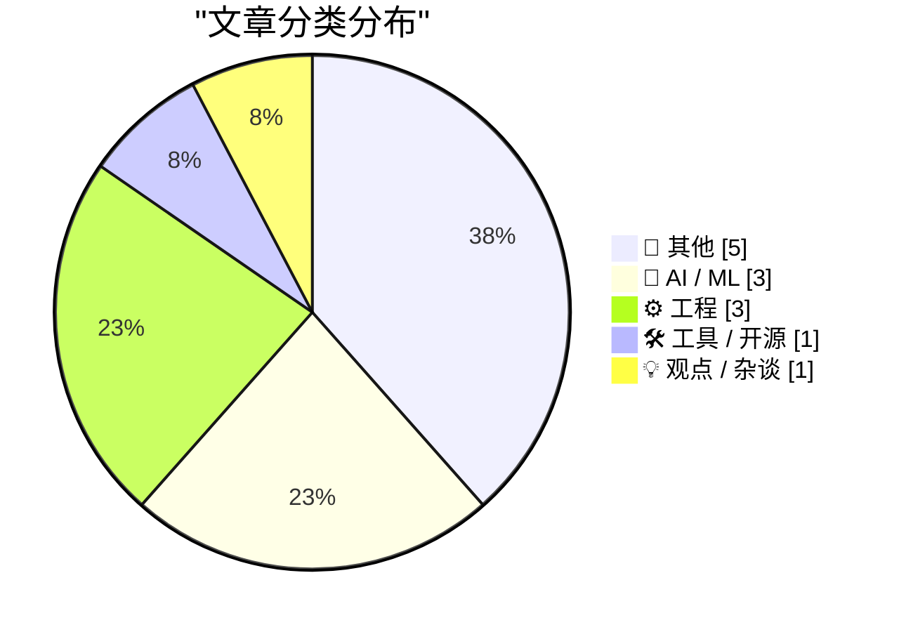
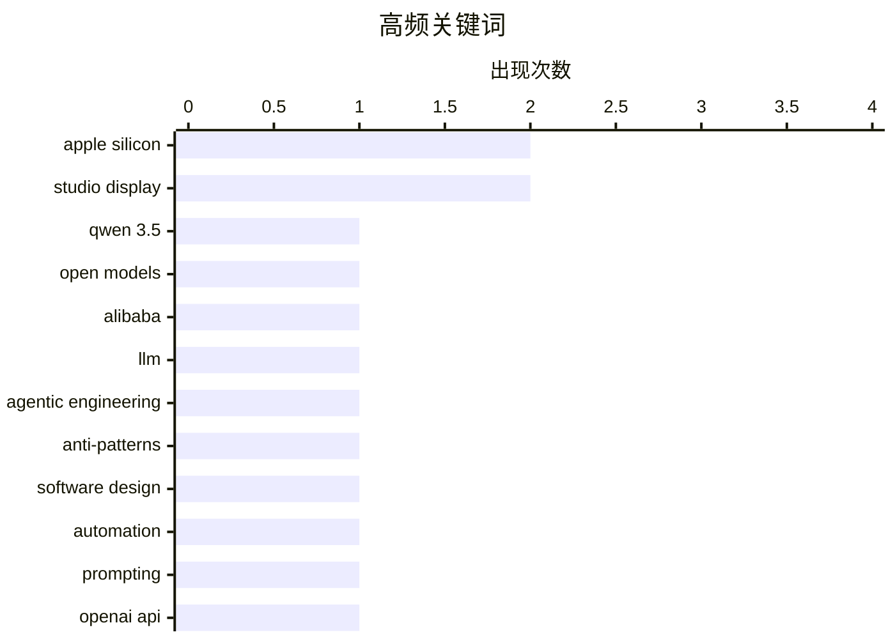

# 📰 AI 博客每日精选

**日期**: 2026-03-05 &nbsp;|&nbsp; **精选**: 13 篇 &nbsp;|&nbsp; **时间范围**: 24 小时

> 📚 来自 Karpathy 推荐的 **92** 个顶级技术博客，经 AI 智能评分筛选

## 📑 目录

- [📝 今日看点](#-今日看点)
- [🏆 今日必读](#-今日必读)
- [📊 数据概览](#-数据概览)
- [📝 其他](#-其他) (5篇)
- [🤖 AI / ML](#-ai---ml) (3篇)
- [⚙️ 工程](#-工程) (3篇)
- [🛠 工具 / 开源](#-工具---开源) (1篇)
- [💡 观点 / 杂谈](#-观点---杂谈) (1篇)

---

## 📝 今日看点

<div style="background: linear-gradient(135deg, #667eea 0%, #764ba2 100%); padding: 16px 20px; border-radius: 12px; color: white; margin: 20px 0;">

今日技术圈聚焦三大趋势：AI领域持续升温，Qwen 3.5 模型引发关注的同时，也暴露出团队动荡隐忧；工程实践方面，开发者愈发重视流程规范，从代码审查到依赖管理，反模式与边界案例成为反思重点；此外，工具生态趋向理性，包管理器探索依赖冷却机制，反映行业对稳定性与可持续性的深层思考。

</div>

---

## 🏆 今日必读

### 🥇 [Qwen 3.5 系列模型引发关注](https://simonwillison.net/2026/Mar/4/qwen/#atom-everything)

<div style="display: flex; gap: 16px; flex-wrap: wrap; margin: 12px 0; font-size: 14px; color: #666;">
<span>📁 🤖 AI / ML</span>
<span>⏰ 8 小时前</span>
<span>⭐ 评分 27/30</span>
</div>

<div style="background: #f8f9fa; border-left: 4px solid #667eea; padding: 16px 20px; border-radius: 8px; margin: 16px 0;">

阿里巴巴 Qwen 团队近期发布了 Qwen 3.5 系列开源模型，表现出色，引发广泛关注。然而，该团队在过去 24 小时内出现了多位高调成员离职，令人担忧其未来发展方向。作者推测 Qwen 3.5 可能不是该系列的最终作品，但团队稳定性问题令人疑虑。

</div>

**💡 为什么值得读**: 了解 Qwen 3.5 模型的表现以及团队变动对开源 AI 生态的潜在影响。

**🏷️ 标签**: <span style="display:inline-block;background:#e3f2fd;color:#1976D2;padding:4px 12px;border-radius:16px;font-size:12px;margin-right:6px;">Qwen 3.5</span><span style="display:inline-block;background:#e3f2fd;color:#1976D2;padding:4px 12px;border-radius:16px;font-size:12px;margin-right:6px;">open models</span><span style="display:inline-block;background:#e3f2fd;color:#1976D2;padding:4px 12px;border-radius:16px;font-size:12px;margin-right:6px;">Alibaba</span><span style="display:inline-block;background:#e3f2fd;color:#1976D2;padding:4px 12px;border-radius:16px;font-size:12px;margin-right:6px;">LLM</span>

---

### 🥈 [反模式：在代理工程中应避免的行为](https://simonwillison.net/guides/agentic-engineering-patterns/anti-patterns/#atom-everything)

<div style="display: flex; gap: 16px; flex-wrap: wrap; margin: 12px 0; font-size: 14px; color: #666;">
<span>📁 ⚙️ 工程</span>
<span>⏰ 6 小时前</span>
<span>⭐ 评分 24/30</span>
</div>

<div style="background: #f8f9fa; border-left: 4px solid #667eea; padding: 16px 20px; border-radius: 8px; margin: 16px 0;">

在代理工程领域，存在一些应避免的常见反模式。其中一种反模式是向协作者提交未经自己审查的代码，这会导致代码质量下降和协作效率降低。作者强调，在提交拉取请求前，开发者应确保代码经过充分审查。

</div>

**💡 为什么值得读**: 识别并避免代理工程中的常见反模式，提升团队协作效率和代码质量。

**🏷️ 标签**: <span style="display:inline-block;background:#e3f2fd;color:#1976D2;padding:4px 12px;border-radius:16px;font-size:12px;margin-right:6px;">agentic engineering</span><span style="display:inline-block;background:#e3f2fd;color:#1976D2;padding:4px 12px;border-radius:16px;font-size:12px;margin-right:6px;">anti-patterns</span><span style="display:inline-block;background:#e3f2fd;color:#1976D2;padding:4px 12px;border-radius:16px;font-size:12px;margin-right:6px;">software design</span><span style="display:inline-block;background:#e3f2fd;color:#1976D2;padding:4px 12px;border-radius:16px;font-size:12px;margin-right:6px;">automation</span>

---

### 🥉 [AI 奥德赛，第二部分：提示工程的危险](https://www.johndcook.com/blog/2026/03/04/an-ai-odyssey-part-2-prompting-peril/)

<div style="display: flex; gap: 16px; flex-wrap: wrap; margin: 12px 0; font-size: 14px; color: #666;">
<span>📁 🤖 AI / ML</span>
<span>⏰ 9 小时前</span>
<span>⭐ 评分 24/30</span>
</div>

<div style="background: #f8f9fa; border-left: 4px solid #667eea; padding: 16px 20px; border-radius: 8px; margin: 16px 0;">

作者与同事在使用 OpenAI API 时，探讨了通过修改 API 调用来增加推理量以提高响应准确性的可能性。然而，ChatGPT 的回答表明，这种想法存在误导性，提示工程并非如此简单。

</div>

**💡 为什么值得读**: 揭示提示工程的复杂性，避免对 AI 能力产生不切实际的期望。

**🏷️ 标签**: <span style="display:inline-block;background:#e3f2fd;color:#1976D2;padding:4px 12px;border-radius:16px;font-size:12px;margin-right:6px;">prompting</span><span style="display:inline-block;background:#e3f2fd;color:#1976D2;padding:4px 12px;border-radius:16px;font-size:12px;margin-right:6px;">OpenAI API</span><span style="display:inline-block;background:#e3f2fd;color:#1976D2;padding:4px 12px;border-radius:16px;font-size:12px;margin-right:6px;">reasoning</span><span style="display:inline-block;background:#e3f2fd;color:#1976D2;padding:4px 12px;border-radius:16px;font-size:12px;margin-right:6px;">accuracy</span>

---

## 📊 数据概览

<div style="display: grid; grid-template-columns: repeat(auto-fit, minmax(120px, 1fr)); gap: 12px; margin: 20px 0;">
<div style="background: #e8f4f8; padding: 16px; border-radius: 10px; text-align: center;">
<div style="font-size: 24px; font-weight: bold; color: #2196F3;">88/92</div>
<div style="font-size: 13px; color: #666; margin-top: 4px;">扫描源</div>
</div>
<div style="background: #fff3e0; padding: 16px; border-radius: 10px; text-align: center;">
<div style="font-size: 24px; font-weight: bold; color: #FF9800;">2496</div>
<div style="font-size: 13px; color: #666; margin-top: 4px;">抓取文章</div>
</div>
<div style="background: #f3e5f5; padding: 16px; border-radius: 10px; text-align: center;">
<div style="font-size: 24px; font-weight: bold; color: #9C27B0;">13</div>
<div style="font-size: 13px; color: #666; margin-top: 4px;">时间范围内</div>
</div>
<div style="background: #e8f5e9; padding: 16px; border-radius: 10px; text-align: center;">
<div style="font-size: 24px; font-weight: bold; color: #4CAF50;">13</div>
<div style="font-size: 13px; color: #666; margin-top: 4px;">AI 精选</div>
</div>
</div>

### 🥧 分类分布



### 📈 高频关键词



<details style="margin: 16px 0; padding: 12px; background: #f5f5f5; border-radius: 8px;">
<summary style="cursor: pointer; font-weight: 500;">📊 纯文本关键词图（终端友好）</summary>

```
apple silicon       │ ████████████████████ 2
studio display      │ ████████████████████ 2
qwen 3.5            │ ██████████░░░░░░░░░░ 1
open models         │ ██████████░░░░░░░░░░ 1
alibaba             │ ██████████░░░░░░░░░░ 1
llm                 │ ██████████░░░░░░░░░░ 1
agentic engineering │ ██████████░░░░░░░░░░ 1
anti-patterns       │ ██████████░░░░░░░░░░ 1
software design     │ ██████████░░░░░░░░░░ 1
automation          │ ██████████░░░░░░░░░░ 1
```

</details>

### 🏷️ 话题标签

<div style="line-height: 2; margin: 16px 0;">
**apple silicon**(2) · **studio display**(2) · **qwen 3.5**(1) · open models(1) · alibaba(1) · llm(1) · agentic engineering(1) · anti-patterns(1) · software design(1) · automation(1) · prompting(1) · openai api(1) · reasoning(1) · accuracy(1) · windows(1) · performance counter(1) · system programming(1) · documentation(1) · package manager(1) · dependency(1)
</div>

---

<a id="-其他"></a>
## 📝 其他 <span style="background: #e0e0e0; padding: 2px 10px; border-radius: 12px; font-size: 13px; margin-left: 8px;">5篇</span>

### 1. [对 MacBook Neo 的思考和观察](https://daringfireball.net/2026/03/599_not_a_piece_of_junk_macbook_neo)

<div style="margin: 10px 0;">
<div style="display: flex; justify-content: space-between; font-size: 13px; margin-bottom: 4px;">
<span>⭐ 综合评分</span>
<span style="font-weight: bold; color: #FF9800;">18/30</span>
</div>
<div style="background: #e0e0e0; height: 8px; border-radius: 4px; overflow: hidden;">
<div style="background: #FF9800; width: 60%; height: 100%; border-radius: 4px;"></div>
</div>
</div>

<div style="display: flex; gap: 12px; flex-wrap: wrap; font-size: 13px; color: #666; margin: 12px 0;">
<span>📁 daringfireball.net</span>
<span>⏰ 3 小时前</span>
<span>🔖 R:5 Q:6 T:7</span>
</div>

<div style="background: #fafafa; border-radius: 8px; padding: 16px; margin: 12px 0; line-height: 1.7;">
MacBook Neo 是苹果首款面向消费市场的重大新 Mac，旨在在整体 PC 市场中占据一席之地。尽管其市场份额可能微不足道，但它标志着苹果在消费级市场的重要尝试。
</div>

<div style="margin: 12px 0;">
<span style="display: inline-block; background: #e3f2fd; color: #1976D2; padding: 4px 12px; border-radius: 16px; font-size: 12px; margin-right: 6px; margin-bottom: 4px;">MacBook Neo</span><span style="display: inline-block; background: #e3f2fd; color: #1976D2; padding: 4px 12px; border-radius: 16px; font-size: 12px; margin-right: 6px; margin-bottom: 4px;">Apple Silicon</span><span style="display: inline-block; background: #e3f2fd; color: #1976D2; padding: 4px 12px; border-radius: 16px; font-size: 12px; margin-right: 6px; margin-bottom: 4px;">consumer market</span>
</div>

---

### 2. [门洛帕克的 Homebrew 计算机俱乐部](https://dfarq.homeip.net/homebrew-computer-club-in-menlo-park/?utm_source=rss&#038;utm_medium=rss&#038;utm_campaign=homebrew-computer-club-in-menlo-park)

<div style="margin: 10px 0;">
<div style="display: flex; justify-content: space-between; font-size: 13px; margin-bottom: 4px;">
<span>⭐ 综合评分</span>
<span style="font-weight: bold; color: #f44336;">17/30</span>
</div>
<div style="background: #e0e0e0; height: 8px; border-radius: 4px; overflow: hidden;">
<div style="background: #f44336; width: 57%; height: 100%; border-radius: 4px;"></div>
</div>
</div>

<div style="display: flex; gap: 12px; flex-wrap: wrap; font-size: 13px; color: #666; margin: 12px 0;">
<span>📁 dfarq.homeip.net</span>
<span>⏰ 12 小时前</span>
<span>🔖 R:6 Q:7 T:4</span>
</div>

<div style="background: #fafafa; border-radius: 8px; padding: 16px; margin: 12px 0; line-height: 1.7;">
Homebrew 计算机俱乐部是门洛帕克一个传奇的早期计算机爱好者团体，对计算机行业产生了深远影响。本书《Fire in the Valley》和电影《硅谷海盗》都描述了该俱乐部的关键作用。
</div>

<div style="margin: 12px 0;">
<span style="display: inline-block; background: #e3f2fd; color: #1976D2; padding: 4px 12px; border-radius: 16px; font-size: 12px; margin-right: 6px; margin-bottom: 4px;">Homebrew Computer Club</span><span style="display: inline-block; background: #e3f2fd; color: #1976D2; padding: 4px 12px; border-radius: 16px; font-size: 12px; margin-right: 6px; margin-bottom: 4px;">hobbyist</span><span style="display: inline-block; background: #e3f2fd; color: #1976D2; padding: 4px 12px; border-radius: 16px; font-size: 12px; margin-right: 6px; margin-bottom: 4px;">history</span><span style="display: inline-block; background: #e3f2fd; color: #1976D2; padding: 4px 12px; border-radius: 16px; font-size: 12px; margin-right: 6px; margin-bottom: 4px;">computing</span>
</div>

---

### 3. [Studio Display 与 Studio Display XDR 对比](https://www.apple.com/displays/)

<div style="margin: 10px 0;">
<div style="display: flex; justify-content: space-between; font-size: 13px; margin-bottom: 4px;">
<span>⭐ 综合评分</span>
<span style="font-weight: bold; color: #f44336;">15/30</span>
</div>
<div style="background: #e0e0e0; height: 8px; border-radius: 4px; overflow: hidden;">
<div style="background: #f44336; width: 50%; height: 100%; border-radius: 4px;"></div>
</div>
</div>

<div style="display: flex; gap: 12px; flex-wrap: wrap; font-size: 13px; color: #666; margin: 12px 0;">
<span>📁 daringfireball.net</span>
<span>⏰ 5 小时前</span>
<span>🔖 R:4 Q:5 T:6</span>
</div>

<div style="background: #fafafa; border-radius: 8px; padding: 16px; margin: 12px 0; line-height: 1.7;">
苹果官网提供了 Studio Display 和 Studio Display XDR 的详细规格对比，方便用户选择。XDR 版本在显示质量、亮度和色彩准确性方面更胜一筹，但价格也更高。
</div>

<div style="margin: 12px 0;">
<span style="display: inline-block; background: #e3f2fd; color: #1976D2; padding: 4px 12px; border-radius: 16px; font-size: 12px; margin-right: 6px; margin-bottom: 4px;">Studio Display</span><span style="display: inline-block; background: #e3f2fd; color: #1976D2; padding: 4px 12px; border-radius: 16px; font-size: 12px; margin-right: 6px; margin-bottom: 4px;">XDR</span><span style="display: inline-block; background: #e3f2fd; color: #1976D2; padding: 4px 12px; border-radius: 16px; font-size: 12px; margin-right: 6px; margin-bottom: 4px;">display comparison</span>
</div>

---

### 4. [Compatibility Notes on the New Studio Displays](https://www.macrumors.com/2026/03/03/apple-studio-display-no-intel-mac-support/)

<div style="margin: 10px 0;">
<div style="display: flex; justify-content: space-between; font-size: 13px; margin-bottom: 4px;">
<span>⭐ 综合评分</span>
<span style="font-weight: bold; color: #f44336;">15/30</span>
</div>
<div style="background: #e0e0e0; height: 8px; border-radius: 4px; overflow: hidden;">
<div style="background: #f44336; width: 50%; height: 100%; border-radius: 4px;"></div>
</div>
</div>

<div style="display: flex; gap: 12px; flex-wrap: wrap; font-size: 13px; color: #666; margin: 12px 0;">
<span>📁 daringfireball.net</span>
<span>⏰ 7 小时前</span>
<span>🔖 R:4 Q:5 T:6</span>
</div>

<div style="background: #fafafa; border-radius: 8px; padding: 16px; margin: 12px 0; line-height: 1.7;">
Juli Clover, at MacRumors, notes that neither the new Studio Display nor the Studio Display XDR are compatible with Intel-based Macs. (I’m curious why.) Also, in a separate report, she notes that Macs
</div>

<div style="margin: 12px 0;">
<span style="display: inline-block; background: #e3f2fd; color: #1976D2; padding: 4px 12px; border-radius: 16px; font-size: 12px; margin-right: 6px; margin-bottom: 4px;">Studio Display</span><span style="display: inline-block; background: #e3f2fd; color: #1976D2; padding: 4px 12px; border-radius: 16px; font-size: 12px; margin-right: 6px; margin-bottom: 4px;">compatibility</span><span style="display: inline-block; background: #e3f2fd; color: #1976D2; padding: 4px 12px; border-radius: 16px; font-size: 12px; margin-right: 6px; margin-bottom: 4px;">M1</span><span style="display: inline-block; background: #e3f2fd; color: #1976D2; padding: 4px 12px; border-radius: 16px; font-size: 12px; margin-right: 6px; margin-bottom: 4px;">M2</span>
</div>

---

### 5. [How many hours do you need to work to afford a pint of beer?](https://shkspr.mobi/blog/2026/03/how-many-hours-do-you-need-to-work-to-afford-a-pint-of-beer/)

<div style="margin: 10px 0;">
<div style="display: flex; justify-content: space-between; font-size: 13px; margin-bottom: 4px;">
<span>⭐ 综合评分</span>
<span style="font-weight: bold; color: #f44336;">9/30</span>
</div>
<div style="background: #e0e0e0; height: 8px; border-radius: 4px; overflow: hidden;">
<div style="background: #f44336; width: 30%; height: 100%; border-radius: 4px;"></div>
</div>
</div>

<div style="display: flex; gap: 12px; flex-wrap: wrap; font-size: 13px; color: #666; margin: 12px 0;">
<span>📁 shkspr.mobi</span>
<span>⏰ 11 小时前</span>
<span>🔖 R:2 Q:4 T:3</span>
</div>

<div style="background: #fafafa; border-radius: 8px; padding: 16px; margin: 12px 0; line-height: 1.7;">
I dropped into a pub in central London and ordered two pints of draught beer. Obviously the price of everything is nuts these days - and doubly so in London - so I only winced a little bit when the co
</div>

<div style="margin: 12px 0;">
<span style="display: inline-block; background: #e3f2fd; color: #1976D2; padding: 4px 12px; border-radius: 16px; font-size: 12px; margin-right: 6px; margin-bottom: 4px;">inflation</span><span style="display: inline-block; background: #e3f2fd; color: #1976D2; padding: 4px 12px; border-radius: 16px; font-size: 12px; margin-right: 6px; margin-bottom: 4px;">cost of living</span><span style="display: inline-block; background: #e3f2fd; color: #1976D2; padding: 4px 12px; border-radius: 16px; font-size: 12px; margin-right: 6px; margin-bottom: 4px;">London</span><span style="display: inline-block; background: #e3f2fd; color: #1976D2; padding: 4px 12px; border-radius: 16px; font-size: 12px; margin-right: 6px; margin-bottom: 4px;">beer price</span>
</div>

---

<a id="-ai---ml"></a>
## 🤖 AI / ML <span style="background: #e0e0e0; padding: 2px 10px; border-radius: 12px; font-size: 13px; margin-left: 8px;">3篇</span>

### 6. [Qwen 3.5 系列模型引发关注](https://simonwillison.net/2026/Mar/4/qwen/#atom-everything)

<div style="margin: 10px 0;">
<div style="display: flex; justify-content: space-between; font-size: 13px; margin-bottom: 4px;">
<span>⭐ 综合评分</span>
<span style="font-weight: bold; color: #4CAF50;">27/30</span>
</div>
<div style="background: #e0e0e0; height: 8px; border-radius: 4px; overflow: hidden;">
<div style="background: #4CAF50; width: 90%; height: 100%; border-radius: 4px;"></div>
</div>
</div>

<div style="display: flex; gap: 12px; flex-wrap: wrap; font-size: 13px; color: #666; margin: 12px 0;">
<span>📁 simonwillison.net</span>
<span>⏰ 8 小时前</span>
<span>🔖 R:9 Q:8 T:10</span>
</div>

<div style="background: #fafafa; border-radius: 8px; padding: 16px; margin: 12px 0; line-height: 1.7;">
阿里巴巴 Qwen 团队近期发布了 Qwen 3.5 系列开源模型，表现出色，引发广泛关注。然而，该团队在过去 24 小时内出现了多位高调成员离职，令人担忧其未来发展方向。作者推测 Qwen 3.5 可能不是该系列的最终作品，但团队稳定性问题令人疑虑。
</div>

<div style="margin: 12px 0;">
<span style="display: inline-block; background: #e3f2fd; color: #1976D2; padding: 4px 12px; border-radius: 16px; font-size: 12px; margin-right: 6px; margin-bottom: 4px;">Qwen 3.5</span><span style="display: inline-block; background: #e3f2fd; color: #1976D2; padding: 4px 12px; border-radius: 16px; font-size: 12px; margin-right: 6px; margin-bottom: 4px;">open models</span><span style="display: inline-block; background: #e3f2fd; color: #1976D2; padding: 4px 12px; border-radius: 16px; font-size: 12px; margin-right: 6px; margin-bottom: 4px;">Alibaba</span><span style="display: inline-block; background: #e3f2fd; color: #1976D2; padding: 4px 12px; border-radius: 16px; font-size: 12px; margin-right: 6px; margin-bottom: 4px;">LLM</span>
</div>

---

### 7. [AI 奥德赛，第二部分：提示工程的危险](https://www.johndcook.com/blog/2026/03/04/an-ai-odyssey-part-2-prompting-peril/)

<div style="margin: 10px 0;">
<div style="display: flex; justify-content: space-between; font-size: 13px; margin-bottom: 4px;">
<span>⭐ 综合评分</span>
<span style="font-weight: bold; color: #4CAF50;">24/30</span>
</div>
<div style="background: #e0e0e0; height: 8px; border-radius: 4px; overflow: hidden;">
<div style="background: #4CAF50; width: 80%; height: 100%; border-radius: 4px;"></div>
</div>
</div>

<div style="display: flex; gap: 12px; flex-wrap: wrap; font-size: 13px; color: #666; margin: 12px 0;">
<span>📁 johndcook.com</span>
<span>⏰ 9 小时前</span>
<span>🔖 R:8 Q:7 T:9</span>
</div>

<div style="background: #fafafa; border-radius: 8px; padding: 16px; margin: 12px 0; line-height: 1.7;">
作者与同事在使用 OpenAI API 时，探讨了通过修改 API 调用来增加推理量以提高响应准确性的可能性。然而，ChatGPT 的回答表明，这种想法存在误导性，提示工程并非如此简单。
</div>

<div style="margin: 12px 0;">
<span style="display: inline-block; background: #e3f2fd; color: #1976D2; padding: 4px 12px; border-radius: 16px; font-size: 12px; margin-right: 6px; margin-bottom: 4px;">prompting</span><span style="display: inline-block; background: #e3f2fd; color: #1976D2; padding: 4px 12px; border-radius: 16px; font-size: 12px; margin-right: 6px; margin-bottom: 4px;">OpenAI API</span><span style="display: inline-block; background: #e3f2fd; color: #1976D2; padding: 4px 12px; border-radius: 16px; font-size: 12px; margin-right: 6px; margin-bottom: 4px;">reasoning</span><span style="display: inline-block; background: #e3f2fd; color: #1976D2; padding: 4px 12px; border-radius: 16px; font-size: 12px; margin-right: 6px; margin-bottom: 4px;">accuracy</span>
</div>

---

### 8. [从逻辑回归到人工智能](https://www.johndcook.com/blog/2026/03/04/from-logistic-regression-to-ai/)

<div style="margin: 10px 0;">
<div style="display: flex; justify-content: space-between; font-size: 13px; margin-bottom: 4px;">
<span>⭐ 综合评分</span>
<span style="font-weight: bold; color: #FF9800;">22/30</span>
</div>
<div style="background: #e0e0e0; height: 8px; border-radius: 4px; overflow: hidden;">
<div style="background: #FF9800; width: 73%; height: 100%; border-radius: 4px;"></div>
</div>
</div>

<div style="display: flex; gap: 12px; flex-wrap: wrap; font-size: 13px; color: #666; margin: 12px 0;">
<span>📁 johndcook.com</span>
<span>⏰ 9 小时前</span>
<span>🔖 R:7 Q:8 T:7</span>
</div>

<div style="background: #fafafa; border-radius: 8px; padding: 16px; margin: 12px 0; line-height: 1.7;">
神经网络有时被称为“只是”逻辑回归，但作者指出，尽管神经网络在结构上类似于逻辑回归，但更多的参数带来了新的现象，使其成为更复杂的模型。
</div>

<div style="margin: 12px 0;">
<span style="display: inline-block; background: #e3f2fd; color: #1976D2; padding: 4px 12px; border-radius: 16px; font-size: 12px; margin-right: 6px; margin-bottom: 4px;">logistic regression</span><span style="display: inline-block; background: #e3f2fd; color: #1976D2; padding: 4px 12px; border-radius: 16px; font-size: 12px; margin-right: 6px; margin-bottom: 4px;">neural networks</span><span style="display: inline-block; background: #e3f2fd; color: #1976D2; padding: 4px 12px; border-radius: 16px; font-size: 12px; margin-right: 6px; margin-bottom: 4px;">AI history</span><span style="display: inline-block; background: #e3f2fd; color: #1976D2; padding: 4px 12px; border-radius: 16px; font-size: 12px; margin-right: 6px; margin-bottom: 4px;">machine learning</span>
</div>

---

<a id="-工程"></a>
## ⚙️ 工程 <span style="background: #e0e0e0; padding: 2px 10px; border-radius: 12px; font-size: 13px; margin-left: 8px;">3篇</span>

### 9. [反模式：在代理工程中应避免的行为](https://simonwillison.net/guides/agentic-engineering-patterns/anti-patterns/#atom-everything)

<div style="margin: 10px 0;">
<div style="display: flex; justify-content: space-between; font-size: 13px; margin-bottom: 4px;">
<span>⭐ 综合评分</span>
<span style="font-weight: bold; color: #4CAF50;">24/30</span>
</div>
<div style="background: #e0e0e0; height: 8px; border-radius: 4px; overflow: hidden;">
<div style="background: #4CAF50; width: 80%; height: 100%; border-radius: 4px;"></div>
</div>
</div>

<div style="display: flex; gap: 12px; flex-wrap: wrap; font-size: 13px; color: #666; margin: 12px 0;">
<span>📁 simonwillison.net</span>
<span>⏰ 6 小时前</span>
<span>🔖 R:8 Q:7 T:9</span>
</div>

<div style="background: #fafafa; border-radius: 8px; padding: 16px; margin: 12px 0; line-height: 1.7;">
在代理工程领域，存在一些应避免的常见反模式。其中一种反模式是向协作者提交未经自己审查的代码，这会导致代码质量下降和协作效率降低。作者强调，在提交拉取请求前，开发者应确保代码经过充分审查。
</div>

<div style="margin: 12px 0;">
<span style="display: inline-block; background: #e3f2fd; color: #1976D2; padding: 4px 12px; border-radius: 16px; font-size: 12px; margin-right: 6px; margin-bottom: 4px;">agentic engineering</span><span style="display: inline-block; background: #e3f2fd; color: #1976D2; padding: 4px 12px; border-radius: 16px; font-size: 12px; margin-right: 6px; margin-bottom: 4px;">anti-patterns</span><span style="display: inline-block; background: #e3f2fd; color: #1976D2; padding: 4px 12px; border-radius: 16px; font-size: 12px; margin-right: 6px; margin-bottom: 4px;">software design</span><span style="display: inline-block; background: #e3f2fd; color: #1976D2; padding: 4px 12px; border-radius: 16px; font-size: 12px; margin-right: 6px; margin-bottom: 4px;">automation</span>
</div>

---

### 10. [我发现了一个反例，证明 QueryPerformanceCounter 并非永不失败](https://devblogs.microsoft.com/oldnewthing/20260304-00/?p=112110)

<div style="margin: 10px 0;">
<div style="display: flex; justify-content: space-between; font-size: 13px; margin-bottom: 4px;">
<span>⭐ 综合评分</span>
<span style="font-weight: bold; color: #FF9800;">23/30</span>
</div>
<div style="background: #e0e0e0; height: 8px; border-radius: 4px; overflow: hidden;">
<div style="background: #FF9800; width: 77%; height: 100%; border-radius: 4px;"></div>
</div>
</div>

<div style="display: flex; gap: 12px; flex-wrap: wrap; font-size: 13px; color: #666; margin: 12px 0;">
<span>📁 devblogs.microsoft.com/oldnewthing</span>
<span>⏰ 9 小时前</span>
<span>🔖 R:7 Q:8 T:8</span>
</div>

<div style="background: #fafafa; border-radius: 8px; padding: 16px; margin: 12px 0; line-height: 1.7;">
微软的 QueryPerformanceCounter 函数通常被认为不会失败，但作者发现了一个反例，证明在违反规则的情况下，该函数也可能失败。这表明，即使是最可靠的 API 也存在边界情况。
</div>

<div style="margin: 12px 0;">
<span style="display: inline-block; background: #e3f2fd; color: #1976D2; padding: 4px 12px; border-radius: 16px; font-size: 12px; margin-right: 6px; margin-bottom: 4px;">Windows</span><span style="display: inline-block; background: #e3f2fd; color: #1976D2; padding: 4px 12px; border-radius: 16px; font-size: 12px; margin-right: 6px; margin-bottom: 4px;">performance counter</span><span style="display: inline-block; background: #e3f2fd; color: #1976D2; padding: 4px 12px; border-radius: 16px; font-size: 12px; margin-right: 6px; margin-bottom: 4px;">system programming</span><span style="display: inline-block; background: #e3f2fd; color: #1976D2; padding: 4px 12px; border-radius: 16px; font-size: 12px; margin-right: 6px; margin-bottom: 4px;">documentation</span>
</div>

---

### 11. [中断驱动开发](https://idiallo.com/blog/interruption-driven-development?src=feed)

<div style="margin: 10px 0;">
<div style="display: flex; justify-content: space-between; font-size: 13px; margin-bottom: 4px;">
<span>⭐ 综合评分</span>
<span style="font-weight: bold; color: #FF9800;">20/30</span>
</div>
<div style="background: #e0e0e0; height: 8px; border-radius: 4px; overflow: hidden;">
<div style="background: #FF9800; width: 67%; height: 100%; border-radius: 4px;"></div>
</div>
</div>

<div style="display: flex; gap: 12px; flex-wrap: wrap; font-size: 13px; color: #666; margin: 12px 0;">
<span>📁 idiallo.com</span>
<span>⏰ 12 小时前</span>
<span>🔖 R:6 Q:7 T:7</span>
</div>

<div style="background: #fafafa; border-radius: 8px; padding: 16px; margin: 12px 0; line-height: 1.7;">
作者分享了自己对音乐和专注力的看法，以及如何通过佩戴耳机来管理同事的干扰。他提出，与其说音乐干扰了他，不如说是同事的干扰打断了他的工作流。
</div>

<div style="margin: 12px 0;">
<span style="display: inline-block; background: #e3f2fd; color: #1976D2; padding: 4px 12px; border-radius: 16px; font-size: 12px; margin-right: 6px; margin-bottom: 4px;">focus</span><span style="display: inline-block; background: #e3f2fd; color: #1976D2; padding: 4px 12px; border-radius: 16px; font-size: 12px; margin-right: 6px; margin-bottom: 4px;">interruption</span><span style="display: inline-block; background: #e3f2fd; color: #1976D2; padding: 4px 12px; border-radius: 16px; font-size: 12px; margin-right: 6px; margin-bottom: 4px;">productivity</span><span style="display: inline-block; background: #e3f2fd; color: #1976D2; padding: 4px 12px; border-radius: 16px; font-size: 12px; margin-right: 6px; margin-bottom: 4px;">developer workflow</span>
</div>

---

<a id="-工具---开源"></a>
## 🛠 工具 / 开源 <span style="background: #e0e0e0; padding: 2px 10px; border-radius: 12px; font-size: 13px; margin-left: 8px;">1篇</span>

### 12. [包管理器需要冷静下来](https://nesbitt.io/2026/03/04/package-managers-need-to-cool-down.html)

<div style="margin: 10px 0;">
<div style="display: flex; justify-content: space-between; font-size: 13px; margin-bottom: 4px;">
<span>⭐ 综合评分</span>
<span style="font-weight: bold; color: #FF9800;">23/30</span>
</div>
<div style="background: #e0e0e0; height: 8px; border-radius: 4px; overflow: hidden;">
<div style="background: #FF9800; width: 77%; height: 100%; border-radius: 4px;"></div>
</div>
</div>

<div style="display: flex; gap: 12px; flex-wrap: wrap; font-size: 13px; color: #666; margin: 12px 0;">
<span>📁 nesbitt.io</span>
<span>⏰ 14 小时前</span>
<span>🔖 R:7 Q:8 T:8</span>
</div>

<div style="background: #fafafa; border-radius: 8px; padding: 16px; margin: 12px 0; line-height: 1.7;">
本文对包管理器和更新工具中的依赖项冷却支持进行了调查。研究发现，虽然一些工具开始引入冷却机制，但整体支持仍处于早期阶段，且缺乏统一标准。
</div>

<div style="margin: 12px 0;">
<span style="display: inline-block; background: #e3f2fd; color: #1976D2; padding: 4px 12px; border-radius: 16px; font-size: 12px; margin-right: 6px; margin-bottom: 4px;">package manager</span><span style="display: inline-block; background: #e3f2fd; color: #1976D2; padding: 4px 12px; border-radius: 16px; font-size: 12px; margin-right: 6px; margin-bottom: 4px;">dependency</span><span style="display: inline-block; background: #e3f2fd; color: #1976D2; padding: 4px 12px; border-radius: 16px; font-size: 12px; margin-right: 6px; margin-bottom: 4px;">cooldown</span><span style="display: inline-block; background: #e3f2fd; color: #1976D2; padding: 4px 12px; border-radius: 16px; font-size: 12px; margin-right: 6px; margin-bottom: 4px;">update tools</span>
</div>

---

<a id="-观点---杂谈"></a>
## 💡 观点 / 杂谈 <span style="background: #e0e0e0; padding: 2px 10px; border-radius: 12px; font-size: 13px; margin-left: 8px;">1篇</span>

### 13. [‘In Other Words, Batman Has Become Superman and Robin Has Become Batman’](https://sixcolors.com/post/2026/03/apple-gives-in-to-temptation-and-renames-its-cpu-cores/)

<div style="margin: 10px 0;">
<div style="display: flex; justify-content: space-between; font-size: 13px; margin-bottom: 4px;">
<span>⭐ 综合评分</span>
<span style="font-weight: bold; color: #f44336;">14/30</span>
</div>
<div style="background: #e0e0e0; height: 8px; border-radius: 4px; overflow: hidden;">
<div style="background: #f44336; width: 47%; height: 100%; border-radius: 4px;"></div>
</div>
</div>

<div style="display: flex; gap: 12px; flex-wrap: wrap; font-size: 13px; color: #666; margin: 12px 0;">
<span>📁 daringfireball.net</span>
<span>⏰ 10 小时前</span>
<span>🔖 R:3 Q:6 T:5</span>
</div>

<div style="background: #fafafa; border-radius: 8px; padding: 16px; margin: 12px 0; line-height: 1.7;">
Jason Snell, Six Colors:


  Here’s the backstory: With every new generation of Apple’s
Mac-series processors, I’ve gotten the impression from Apple execs
that they’ve been a little frustrated with th
</div>

<div style="margin: 12px 0;">
<span style="display: inline-block; background: #e3f2fd; color: #1976D2; padding: 4px 12px; border-radius: 16px; font-size: 12px; margin-right: 6px; margin-bottom: 4px;">Apple Silicon</span><span style="display: inline-block; background: #e3f2fd; color: #1976D2; padding: 4px 12px; border-radius: 16px; font-size: 12px; margin-right: 6px; margin-bottom: 4px;">efficiency cores</span><span style="display: inline-block; background: #e3f2fd; color: #1976D2; padding: 4px 12px; border-radius: 16px; font-size: 12px; margin-right: 6px; margin-bottom: 4px;">processor design</span>
</div>

---


<div style="text-align: center; color: #888; font-size: 13px; padding: 20px; border-top: 1px solid #e0e0e0; margin-top: 30px;">
生成于 2026-03-05 00:01 | 扫描 <strong>88</strong> 源 → 获取 <strong>2496</strong> 篇 → 精选 <strong>13</strong> 篇
<br>
基于 <a href="https://refactoringenglish.com/tools/hn-popularity/" style="color: #667eea;">Hacker News Popularity Contest 2025</a> RSS 源列表，由 <a href="https://x.com/karpathy" style="color: #667eea;">Andrej Karpathy</a> 推荐
<br>
由「懂点儿 AI」制作，欢迎关注同名微信公众号获取更多 AI 实用技巧 💡
</div>
