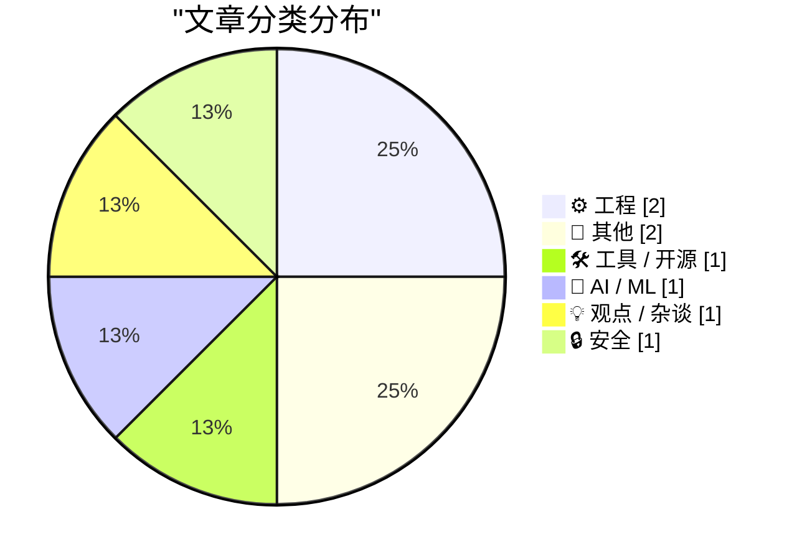
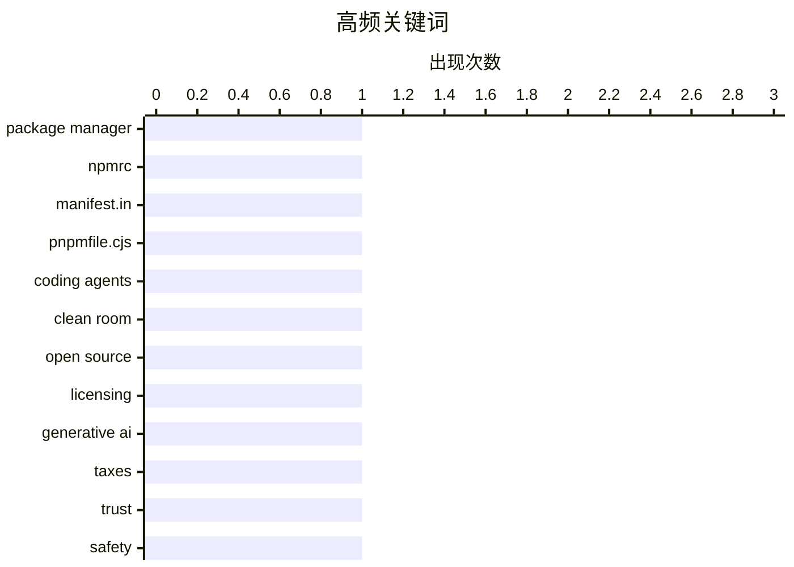

# 📰 AI 博客每日精选

**日期**: 2026-03-06 &nbsp;|&nbsp; **精选**: 8 篇 &nbsp;|&nbsp; **时间范围**: 24 小时

> 📚 来自 Karpathy 推荐的 **92** 个顶级技术博客，经 AI 智能评分筛选

## 📑 目录

- [📝 今日看点](#-今日看点)
- [🏆 今日必读](#-今日必读)
- [📊 数据概览](#-数据概览)
- [⚙️ 工程](#-工程) (2篇)
- [📝 其他](#-其他) (2篇)
- [🛠 工具 / 开源](#-工具---开源) (1篇)
- [🤖 AI / ML](#-ai---ml) (1篇)
- [💡 观点 / 杂谈](#-观点---杂谈) (1篇)
- [🔒 安全](#-安全) (1篇)

---

## 📝 今日看点

<div style="background: linear-gradient(135deg, #667eea 0%, #764ba2 100%); padding: 16px 20px; border-radius: 12px; color: white; margin: 20px 0;">

今日技术圈聚焦三大趋势：一是包管理生态的“魔法文件”标准化探索，涵盖 npm、Python、.NET 等多平台配置实践；二是生成式 AI 在关键领域（如报税、医疗）的可靠性争议，凸显其概率生成机制与事实核查的深层矛盾；三是企业治理与技术创新间的张力显现，从高管短视决策到开源代码合规难题，反映出自动化与伦理风险的交织。

</div>

---

## 🏆 今日必读

### 🥇 [包管理器魔法文件及其位置：.npmrc、MANIFEST.in、Directory.Packages.props、.pnpmfile.cjs 等](https://nesbitt.io/2026/03/05/package-manager-magic-files.html)

<div style="display: flex; gap: 16px; flex-wrap: wrap; margin: 12px 0; font-size: 14px; color: #666;">
<span>📁 🛠 工具 / 开源</span>
<span>⏰ 14 小时前</span>
<span>⭐ 评分 25/30</span>
</div>

<div style="background: #f8f9fa; border-left: 4px solid #667eea; padding: 16px 20px; border-radius: 8px; margin: 16px 0;">

文章探讨了多种编程语言和生态系统中的包管理器配置文件，统称为“魔法文件”，如 npm 的 .npmrc、Python 的 MANIFEST.in、.NET 的 Directory.Packages.props 和 pnpm 的 .pnpmfile.cjs。这些文件用于控制依赖安装、构建行为、镜像源选择、版本策略等关键功能。作者通过具体示例说明了每个文件的作用场景和配置语法，帮助开发者理解其背后的设计逻辑。文章旨在为跨语言开发者提供一份实用的配置参考指南。

</div>

**💡 为什么值得读**: 如果你在多个开发生态中切换，这篇指南能帮你快速定位并理解那些‘看不见但至关重要’的配置文件，避免踩坑。

**🏷️ 标签**: <span style="display:inline-block;background:#e3f2fd;color:#1976D2;padding:4px 12px;border-radius:16px;font-size:12px;margin-right:6px;">package manager</span><span style="display:inline-block;background:#e3f2fd;color:#1976D2;padding:4px 12px;border-radius:16px;font-size:12px;margin-right:6px;">npmrc</span><span style="display:inline-block;background:#e3f2fd;color:#1976D2;padding:4px 12px;border-radius:16px;font-size:12px;margin-right:6px;">MANIFEST.in</span><span style="display:inline-block;background:#e3f2fd;color:#1976D2;padding:4px 12px;border-radius:16px;font-size:12px;margin-right:6px;">pnpmfile.cjs</span>

---

### 🥈 [编码智能体能否通过‘洁净室’实现方式重新许可开源代码？](https://simonwillison.net/2026/Mar/5/chardet/#atom-everything)

<div style="display: flex; gap: 16px; flex-wrap: wrap; margin: 12px 0; font-size: 14px; color: #666;">
<span>📁 ⚙️ 工程</span>
<span>⏰ 7 小时前</span>
<span>⭐ 评分 24/30</span>
</div>

<div style="background: #f8f9fa; border-left: 4px solid #667eea; padding: 16px 20px; border-radius: 8px; margin: 16px 0;">

文章探讨了在当前编码智能体（coding agents）高度自动化的背景下，是否可能通过‘洁净室实现’（clean room implementation）来合法地重用或重新许可开源代码。作者指出，尽管智能体擅长模仿代码行为，但关键在于能否在开发过程中严格隔离原始代码与实现团队，避免知识产权侵权。历史上 Compaq 在1982年克隆 IBM BIOS 的成功案例被引用为类比。

</div>

**💡 为什么值得读**: 随着 AI 编程工具的普及，理解‘洁净室实现’的法律与技术边界，对开发者、公司和开源社区都至关重要。

**🏷️ 标签**: <span style="display:inline-block;background:#e3f2fd;color:#1976D2;padding:4px 12px;border-radius:16px;font-size:12px;margin-right:6px;">coding agents</span><span style="display:inline-block;background:#e3f2fd;color:#1976D2;padding:4px 12px;border-radius:16px;font-size:12px;margin-right:6px;">clean room</span><span style="display:inline-block;background:#e3f2fd;color:#1976D2;padding:4px 12px;border-radius:16px;font-size:12px;margin-right:6px;">open source</span><span style="display:inline-block;background:#e3f2fd;color:#1976D2;padding:4px 12px;border-radius:16px;font-size:12px;margin-right:6px;">licensing</span>

---

### 🥉 [不要相信生成式 AI 帮你报税，也不要让它介入人命攸关的事](https://garymarcus.substack.com/p/dont-trust-generative-ai-to-do-your)

<div style="display: flex; gap: 16px; flex-wrap: wrap; margin: 12px 0; font-size: 14px; color: #666;">
<span>📁 🤖 AI / ML</span>
<span>⏰ 6 小时前</span>
<span>⭐ 评分 24/30</span>
</div>

<div style="background: #f8f9fa; border-left: 4px solid #667eea; padding: 16px 20px; border-radius: 8px; margin: 16px 0;">

作者指出，生成式 AI 在涉及税务、医疗等高风险任务中不可靠，其根本问题在于设计原理——它们基于概率生成文本，而非理解事实或验证准确性。即使模型看似‘聪明’，也无法保证输出正确，尤其在需要精确性和责任归属的领域。

</div>

**💡 为什么值得读**: 在 AI 被广泛部署到关键领域前，这篇文章提醒我们：信任不等于正确，尤其在人命关天的场景里。

**🏷️ 标签**: <span style="display:inline-block;background:#e3f2fd;color:#1976D2;padding:4px 12px;border-radius:16px;font-size:12px;margin-right:6px;">Generative AI</span><span style="display:inline-block;background:#e3f2fd;color:#1976D2;padding:4px 12px;border-radius:16px;font-size:12px;margin-right:6px;">taxes</span><span style="display:inline-block;background:#e3f2fd;color:#1976D2;padding:4px 12px;border-radius:16px;font-size:12px;margin-right:6px;">trust</span><span style="display:inline-block;background:#e3f2fd;color:#1976D2;padding:4px 12px;border-radius:16px;font-size:12px;margin-right:6px;">safety</span>

---

## 📊 数据概览

<div style="display: grid; grid-template-columns: repeat(auto-fit, minmax(120px, 1fr)); gap: 12px; margin: 20px 0;">
<div style="background: #e8f4f8; padding: 16px; border-radius: 10px; text-align: center;">
<div style="font-size: 24px; font-weight: bold; color: #2196F3;">88/92</div>
<div style="font-size: 13px; color: #666; margin-top: 4px;">扫描源</div>
</div>
<div style="background: #fff3e0; padding: 16px; border-radius: 10px; text-align: center;">
<div style="font-size: 24px; font-weight: bold; color: #FF9800;">2496</div>
<div style="font-size: 13px; color: #666; margin-top: 4px;">抓取文章</div>
</div>
<div style="background: #f3e5f5; padding: 16px; border-radius: 10px; text-align: center;">
<div style="font-size: 24px; font-weight: bold; color: #9C27B0;">8</div>
<div style="font-size: 13px; color: #666; margin-top: 4px;">时间范围内</div>
</div>
<div style="background: #e8f5e9; padding: 16px; border-radius: 10px; text-align: center;">
<div style="font-size: 24px; font-weight: bold; color: #4CAF50;">8</div>
<div style="font-size: 13px; color: #666; margin-top: 4px;">AI 精选</div>
</div>
</div>

### 🥧 分类分布



### 📈 高频关键词



<details style="margin: 16px 0; padding: 12px; background: #f5f5f5; border-radius: 8px;">
<summary style="cursor: pointer; font-weight: 500;">📊 纯文本关键词图（终端友好）</summary>

```
package manager │ ████████████████████ 1
npmrc           │ ████████████████████ 1
manifest.in     │ ████████████████████ 1
pnpmfile.cjs    │ ████████████████████ 1
coding agents   │ ████████████████████ 1
clean room      │ ████████████████████ 1
open source     │ ████████████████████ 1
licensing       │ ████████████████████ 1
generative ai   │ ████████████████████ 1
taxes           │ ████████████████████ 1
```

</details>

### 🏷️ 话题标签

<div style="line-height: 2; margin: 16px 0;">
**package manager**(1) · **npmrc**(1) · **manifest.in**(1) · pnpmfile.cjs(1) · coding agents(1) · clean room(1) · open source(1) · licensing(1) · generative ai(1) · taxes(1) · trust(1) · safety(1) · windows(1) · message loop(1) · posted message(1) · win32(1) · executive dysfunction(1) · management(1) · culture(1) · tech industry(1)
</div>

---

<a id="-工程"></a>
## ⚙️ 工程 <span style="background: #e0e0e0; padding: 2px 10px; border-radius: 12px; font-size: 13px; margin-left: 8px;">2篇</span>

### 1. [编码智能体能否通过‘洁净室’实现方式重新许可开源代码？](https://simonwillison.net/2026/Mar/5/chardet/#atom-everything)

<div style="margin: 10px 0;">
<div style="display: flex; justify-content: space-between; font-size: 13px; margin-bottom: 4px;">
<span>⭐ 综合评分</span>
<span style="font-weight: bold; color: #4CAF50;">24/30</span>
</div>
<div style="background: #e0e0e0; height: 8px; border-radius: 4px; overflow: hidden;">
<div style="background: #4CAF50; width: 80%; height: 100%; border-radius: 4px;"></div>
</div>
</div>

<div style="display: flex; gap: 12px; flex-wrap: wrap; font-size: 13px; color: #666; margin: 12px 0;">
<span>📁 simonwillison.net</span>
<span>⏰ 7 小时前</span>
<span>🔖 R:8 Q:7 T:9</span>
</div>

<div style="background: #fafafa; border-radius: 8px; padding: 16px; margin: 12px 0; line-height: 1.7;">
文章探讨了在当前编码智能体（coding agents）高度自动化的背景下，是否可能通过‘洁净室实现’（clean room implementation）来合法地重用或重新许可开源代码。作者指出，尽管智能体擅长模仿代码行为，但关键在于能否在开发过程中严格隔离原始代码与实现团队，避免知识产权侵权。历史上 Compaq 在1982年克隆 IBM BIOS 的成功案例被引用为类比。
</div>

<div style="margin: 12px 0;">
<span style="display: inline-block; background: #e3f2fd; color: #1976D2; padding: 4px 12px; border-radius: 16px; font-size: 12px; margin-right: 6px; margin-bottom: 4px;">coding agents</span><span style="display: inline-block; background: #e3f2fd; color: #1976D2; padding: 4px 12px; border-radius: 16px; font-size: 12px; margin-right: 6px; margin-bottom: 4px;">clean room</span><span style="display: inline-block; background: #e3f2fd; color: #1976D2; padding: 4px 12px; border-radius: 16px; font-size: 12px; margin-right: 6px; margin-bottom: 4px;">open source</span><span style="display: inline-block; background: #e3f2fd; color: #1976D2; padding: 4px 12px; border-radius: 16px; font-size: 12px; margin-right: 6px; margin-bottom: 4px;">licensing</span>
</div>

---

### 2. [发往主消息循环的消息为何会在到达前被派发？](https://devblogs.microsoft.com/oldnewthing/20260305-00/?p=112114)

<div style="margin: 10px 0;">
<div style="display: flex; justify-content: space-between; font-size: 13px; margin-bottom: 4px;">
<span>⭐ 综合评分</span>
<span style="font-weight: bold; color: #FF9800;">22/30</span>
</div>
<div style="background: #e0e0e0; height: 8px; border-radius: 4px; overflow: hidden;">
<div style="background: #FF9800; width: 73%; height: 100%; border-radius: 4px;"></div>
</div>
</div>

<div style="display: flex; gap: 12px; flex-wrap: wrap; font-size: 13px; color: #666; margin: 12px 0;">
<span>📁 devblogs.microsoft.com/oldnewthing</span>
<span>⏰ 9 小时前</span>
<span>🔖 R:7 Q:8 T:7</span>
</div>

<div style="background: #fafafa; border-radius: 8px; padding: 16px; margin: 12px 0; line-height: 1.7;">
文章解释了一个 Windows 编程中的疑难问题：当一个消息被 PostMessage 发送后，为何有时会在到达主消息循环前就被 DispatchMessage 处理？根本原因在于调用者可能调用了 PeekMessage 或 GetMessage 后立即手动调用 DispatchMessage，导致消息被提前处理。
</div>

<div style="margin: 12px 0;">
<span style="display: inline-block; background: #e3f2fd; color: #1976D2; padding: 4px 12px; border-radius: 16px; font-size: 12px; margin-right: 6px; margin-bottom: 4px;">Windows</span><span style="display: inline-block; background: #e3f2fd; color: #1976D2; padding: 4px 12px; border-radius: 16px; font-size: 12px; margin-right: 6px; margin-bottom: 4px;">message loop</span><span style="display: inline-block; background: #e3f2fd; color: #1976D2; padding: 4px 12px; border-radius: 16px; font-size: 12px; margin-right: 6px; margin-bottom: 4px;">posted message</span><span style="display: inline-block; background: #e3f2fd; color: #1976D2; padding: 4px 12px; border-radius: 16px; font-size: 12px; margin-right: 6px; margin-bottom: 4px;">Win32</span>
</div>

---

<a id="-其他"></a>
## 📝 其他 <span style="background: #e0e0e0; padding: 2px 10px; border-radius: 12px; font-size: 13px; margin-left: 8px;">2篇</span>

### 3. [史蒂夫·乔布斯在2007年谈苹果对 PC 市场份额的追求：‘我们就是不能发垃圾’](https://www.youtube.com/watch?v=U37Ds3RvyoM)

<div style="margin: 10px 0;">
<div style="display: flex; justify-content: space-between; font-size: 13px; margin-bottom: 4px;">
<span>⭐ 综合评分</span>
<span style="font-weight: bold; color: #f44336;">12/30</span>
</div>
<div style="background: #e0e0e0; height: 8px; border-radius: 4px; overflow: hidden;">
<div style="background: #f44336; width: 40%; height: 100%; border-radius: 4px;"></div>
</div>
</div>

<div style="display: flex; gap: 12px; flex-wrap: wrap; font-size: 13px; color: #666; margin: 12px 0;">
<span>📁 daringfireball.net</span>
<span>⏰ 4 小时前</span>
<span>🔖 R:3 Q:6 T:3</span>
</div>

<div style="background: #fafafa; border-radius: 8px; padding: 16px; margin: 12px 0; line-height: 1.7;">
在2007年8月的一次 Mac 发布会上，乔布斯明确表示苹果的目标不是超越 PC 市场，而是做出最好的产品。他强调‘我们就是不能发垃圾’，体现了苹果对产品质量的极致追求。
</div>

<div style="margin: 12px 0;">
<span style="display: inline-block; background: #e3f2fd; color: #1976D2; padding: 4px 12px; border-radius: 16px; font-size: 12px; margin-right: 6px; margin-bottom: 4px;">Steve Jobs</span><span style="display: inline-block; background: #e3f2fd; color: #1976D2; padding: 4px 12px; border-radius: 16px; font-size: 12px; margin-right: 6px; margin-bottom: 4px;">Apple</span><span style="display: inline-block; background: #e3f2fd; color: #1976D2; padding: 4px 12px; border-radius: 16px; font-size: 12px; margin-right: 6px; margin-bottom: 4px;">PC market</span><span style="display: inline-block; background: #e3f2fd; color: #1976D2; padding: 4px 12px; border-radius: 16px; font-size: 12px; margin-right: 6px; margin-bottom: 4px;">iMac</span>
</div>

---

### 4. [书评：《Katabasis》by R.F. Kuang ★★★★⯪](https://shkspr.mobi/blog/2026/03/book-review-katabasis-by-r-f-kuang/)

<div style="margin: 10px 0;">
<div style="display: flex; justify-content: space-between; font-size: 13px; margin-bottom: 4px;">
<span>⭐ 综合评分</span>
<span style="font-weight: bold; color: #f44336;">8/30</span>
</div>
<div style="background: #e0e0e0; height: 8px; border-radius: 4px; overflow: hidden;">
<div style="background: #f44336; width: 27%; height: 100%; border-radius: 4px;"></div>
</div>
</div>

<div style="display: flex; gap: 12px; flex-wrap: wrap; font-size: 13px; color: #666; margin: 12px 0;">
<span>📁 shkspr.mobi</span>
<span>⏰ 11 小时前</span>
<span>🔖 R:1 Q:5 T:2</span>
</div>

<div style="background: #fafafa; border-radius: 8px; padding: 16px; margin: 12px 0; line-height: 1.7;">
作者认为 R.F. Kuang 的《Katabasis》是其作品中首次令人捧腹大笑的小说，讲述主角为完成学业必须下地狱拯救已故导师的故事。作者赞赏 Kuang 将个人创伤转化为创作灵感的勇气。
</div>

<div style="margin: 12px 0;">
<span style="display: inline-block; background: #e3f2fd; color: #1976D2; padding: 4px 12px; border-radius: 16px; font-size: 12px; margin-right: 6px; margin-bottom: 4px;">Katabasis</span><span style="display: inline-block; background: #e3f2fd; color: #1976D2; padding: 4px 12px; border-radius: 16px; font-size: 12px; margin-right: 6px; margin-bottom: 4px;">R.F. Kuang</span><span style="display: inline-block; background: #e3f2fd; color: #1976D2; padding: 4px 12px; border-radius: 16px; font-size: 12px; margin-right: 6px; margin-bottom: 4px;">book review</span><span style="display: inline-block; background: #e3f2fd; color: #1976D2; padding: 4px 12px; border-radius: 16px; font-size: 12px; margin-right: 6px; margin-bottom: 4px;">fantasy</span>
</div>

---

<a id="-工具---开源"></a>
## 🛠 工具 / 开源 <span style="background: #e0e0e0; padding: 2px 10px; border-radius: 12px; font-size: 13px; margin-left: 8px;">1篇</span>

### 5. [包管理器魔法文件及其位置：.npmrc、MANIFEST.in、Directory.Packages.props、.pnpmfile.cjs 等](https://nesbitt.io/2026/03/05/package-manager-magic-files.html)

<div style="margin: 10px 0;">
<div style="display: flex; justify-content: space-between; font-size: 13px; margin-bottom: 4px;">
<span>⭐ 综合评分</span>
<span style="font-weight: bold; color: #4CAF50;">25/30</span>
</div>
<div style="background: #e0e0e0; height: 8px; border-radius: 4px; overflow: hidden;">
<div style="background: #4CAF50; width: 83%; height: 100%; border-radius: 4px;"></div>
</div>
</div>

<div style="display: flex; gap: 12px; flex-wrap: wrap; font-size: 13px; color: #666; margin: 12px 0;">
<span>📁 nesbitt.io</span>
<span>⏰ 14 小时前</span>
<span>🔖 R:9 Q:8 T:8</span>
</div>

<div style="background: #fafafa; border-radius: 8px; padding: 16px; margin: 12px 0; line-height: 1.7;">
文章探讨了多种编程语言和生态系统中的包管理器配置文件，统称为“魔法文件”，如 npm 的 .npmrc、Python 的 MANIFEST.in、.NET 的 Directory.Packages.props 和 pnpm 的 .pnpmfile.cjs。这些文件用于控制依赖安装、构建行为、镜像源选择、版本策略等关键功能。作者通过具体示例说明了每个文件的作用场景和配置语法，帮助开发者理解其背后的设计逻辑。文章旨在为跨语言开发者提供一份实用的配置参考指南。
</div>

<div style="margin: 12px 0;">
<span style="display: inline-block; background: #e3f2fd; color: #1976D2; padding: 4px 12px; border-radius: 16px; font-size: 12px; margin-right: 6px; margin-bottom: 4px;">package manager</span><span style="display: inline-block; background: #e3f2fd; color: #1976D2; padding: 4px 12px; border-radius: 16px; font-size: 12px; margin-right: 6px; margin-bottom: 4px;">npmrc</span><span style="display: inline-block; background: #e3f2fd; color: #1976D2; padding: 4px 12px; border-radius: 16px; font-size: 12px; margin-right: 6px; margin-bottom: 4px;">MANIFEST.in</span><span style="display: inline-block; background: #e3f2fd; color: #1976D2; padding: 4px 12px; border-radius: 16px; font-size: 12px; margin-right: 6px; margin-bottom: 4px;">pnpmfile.cjs</span>
</div>

---

<a id="-ai---ml"></a>
## 🤖 AI / ML <span style="background: #e0e0e0; padding: 2px 10px; border-radius: 12px; font-size: 13px; margin-left: 8px;">1篇</span>

### 6. [不要相信生成式 AI 帮你报税，也不要让它介入人命攸关的事](https://garymarcus.substack.com/p/dont-trust-generative-ai-to-do-your)

<div style="margin: 10px 0;">
<div style="display: flex; justify-content: space-between; font-size: 13px; margin-bottom: 4px;">
<span>⭐ 综合评分</span>
<span style="font-weight: bold; color: #4CAF50;">24/30</span>
</div>
<div style="background: #e0e0e0; height: 8px; border-radius: 4px; overflow: hidden;">
<div style="background: #4CAF50; width: 80%; height: 100%; border-radius: 4px;"></div>
</div>
</div>

<div style="display: flex; gap: 12px; flex-wrap: wrap; font-size: 13px; color: #666; margin: 12px 0;">
<span>📁 garymarcus.substack.com</span>
<span>⏰ 6 小时前</span>
<span>🔖 R:8 Q:7 T:9</span>
</div>

<div style="background: #fafafa; border-radius: 8px; padding: 16px; margin: 12px 0; line-height: 1.7;">
作者指出，生成式 AI 在涉及税务、医疗等高风险任务中不可靠，其根本问题在于设计原理——它们基于概率生成文本，而非理解事实或验证准确性。即使模型看似‘聪明’，也无法保证输出正确，尤其在需要精确性和责任归属的领域。
</div>

<div style="margin: 12px 0;">
<span style="display: inline-block; background: #e3f2fd; color: #1976D2; padding: 4px 12px; border-radius: 16px; font-size: 12px; margin-right: 6px; margin-bottom: 4px;">Generative AI</span><span style="display: inline-block; background: #e3f2fd; color: #1976D2; padding: 4px 12px; border-radius: 16px; font-size: 12px; margin-right: 6px; margin-bottom: 4px;">taxes</span><span style="display: inline-block; background: #e3f2fd; color: #1976D2; padding: 4px 12px; border-radius: 16px; font-size: 12px; margin-right: 6px; margin-bottom: 4px;">trust</span><span style="display: inline-block; background: #e3f2fd; color: #1976D2; padding: 4px 12px; border-radius: 16px; font-size: 12px; margin-right: 6px; margin-bottom: 4px;">safety</span>
</div>

---

<a id="-观点---杂谈"></a>
## 💡 观点 / 杂谈 <span style="background: #e0e0e0; padding: 2px 10px; border-radius: 12px; font-size: 13px; margin-left: 8px;">1篇</span>

### 7. [Pluralistic：烧蛙（05 Mar 2026）——高管功能障碍](https://pluralistic.net/2026/03/05/executive-dysfunction/)

<div style="margin: 10px 0;">
<div style="display: flex; justify-content: space-between; font-size: 13px; margin-bottom: 4px;">
<span>⭐ 综合评分</span>
<span style="font-weight: bold; color: #FF9800;">19/30</span>
</div>
<div style="background: #e0e0e0; height: 8px; border-radius: 4px; overflow: hidden;">
<div style="background: #FF9800; width: 63%; height: 100%; border-radius: 4px;"></div>
</div>
</div>

<div style="display: flex; gap: 12px; flex-wrap: wrap; font-size: 13px; color: #666; margin: 12px 0;">
<span>📁 pluralistic.net</span>
<span>⏰ 4 小时前</span>
<span>🔖 R:5 Q:8 T:6</span>
</div>

<div style="background: #fafafa; border-radius: 8px; padding: 16px; margin: 12px 0; line-height: 1.7;">
文章是一篇观点鲜明的评论，批评企业高管在应对危机时的短视与无能，用‘烧蛙’比喻温水煮青蛙式的渐进式失败。作者列举了多个现实案例，从 TSA 安检到教育体系，揭示系统性失灵。
</div>

<div style="margin: 12px 0;">
<span style="display: inline-block; background: #e3f2fd; color: #1976D2; padding: 4px 12px; border-radius: 16px; font-size: 12px; margin-right: 6px; margin-bottom: 4px;">executive dysfunction</span><span style="display: inline-block; background: #e3f2fd; color: #1976D2; padding: 4px 12px; border-radius: 16px; font-size: 12px; margin-right: 6px; margin-bottom: 4px;">management</span><span style="display: inline-block; background: #e3f2fd; color: #1976D2; padding: 4px 12px; border-radius: 16px; font-size: 12px; margin-right: 6px; margin-bottom: 4px;">culture</span><span style="display: inline-block; background: #e3f2fd; color: #1976D2; padding: 4px 12px; border-radius: 16px; font-size: 12px; margin-right: 6px; margin-bottom: 4px;">tech industry</span>
</div>

---

<a id="-安全"></a>
## 🔒 安全 <span style="background: #e0e0e0; padding: 2px 10px; border-radius: 12px; font-size: 13px; margin-left: 8px;">1篇</span>

### 8. [重提米开朗基罗病毒：1992年3月6日的硬盘毁灭者](https://dfarq.homeip.net/remembering-michelangelo/?utm_source=rss&#038;utm_medium=rss&#038;utm_campaign=remembering-michelangelo)

<div style="margin: 10px 0;">
<div style="display: flex; justify-content: space-between; font-size: 13px; margin-bottom: 4px;">
<span>⭐ 综合评分</span>
<span style="font-weight: bold; color: #f44336;">13/30</span>
</div>
<div style="background: #e0e0e0; height: 8px; border-radius: 4px; overflow: hidden;">
<div style="background: #f44336; width: 43%; height: 100%; border-radius: 4px;"></div>
</div>
</div>

<div style="display: flex; gap: 12px; flex-wrap: wrap; font-size: 13px; color: #666; margin: 12px 0;">
<span>📁 dfarq.homeip.net</span>
<span>⏰ 12 小时前</span>
<span>🔖 R:4 Q:6 T:3</span>
</div>

<div style="background: #fafafa; border-radius: 8px; padding: 16px; margin: 12px 0; line-height: 1.7;">
文章回顾了1992年3月6日激活的米开朗基罗病毒，该病毒会覆盖硬盘前100个扇区，虽不格式化整个硬盘，但对普通用户而言破坏性极大。它代表了早期计算机病毒对大众用户的心理冲击。
</div>

<div style="margin: 12px 0;">
<span style="display: inline-block; background: #e3f2fd; color: #1976D2; padding: 4px 12px; border-radius: 16px; font-size: 12px; margin-right: 6px; margin-bottom: 4px;">Michelangelo virus</span><span style="display: inline-block; background: #e3f2fd; color: #1976D2; padding: 4px 12px; border-radius: 16px; font-size: 12px; margin-right: 6px; margin-bottom: 4px;">1992</span><span style="display: inline-block; background: #e3f2fd; color: #1976D2; padding: 4px 12px; border-radius: 16px; font-size: 12px; margin-right: 6px; margin-bottom: 4px;">boot sector</span><span style="display: inline-block; background: #e3f2fd; color: #1976D2; padding: 4px 12px; border-radius: 16px; font-size: 12px; margin-right: 6px; margin-bottom: 4px;">malware</span>
</div>

---


<div style="text-align: center; color: #888; font-size: 13px; padding: 20px; border-top: 1px solid #e0e0e0; margin-top: 30px;">
生成于 2026-03-06 00:01 | 扫描 <strong>88</strong> 源 → 获取 <strong>2496</strong> 篇 → 精选 <strong>8</strong> 篇
<br>
基于 <a href="https://refactoringenglish.com/tools/hn-popularity/" style="color: #667eea;">Hacker News Popularity Contest 2025</a> RSS 源列表，由 <a href="https://x.com/karpathy" style="color: #667eea;">Andrej Karpathy</a> 推荐
<br>
由「懂点儿 AI」制作，欢迎关注同名微信公众号获取更多 AI 实用技巧 💡
</div>
