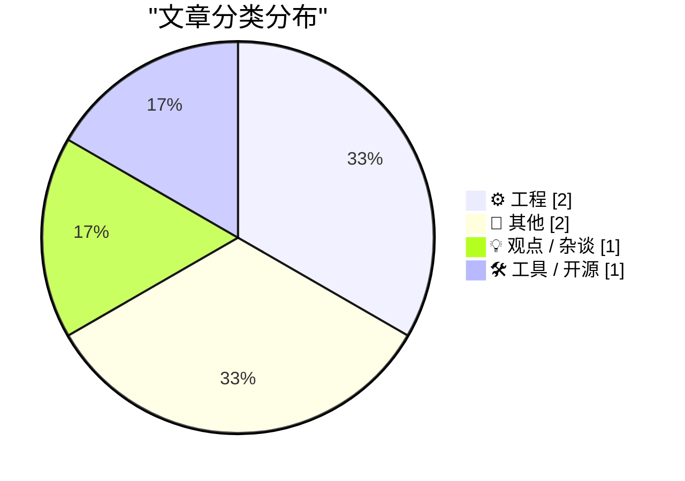
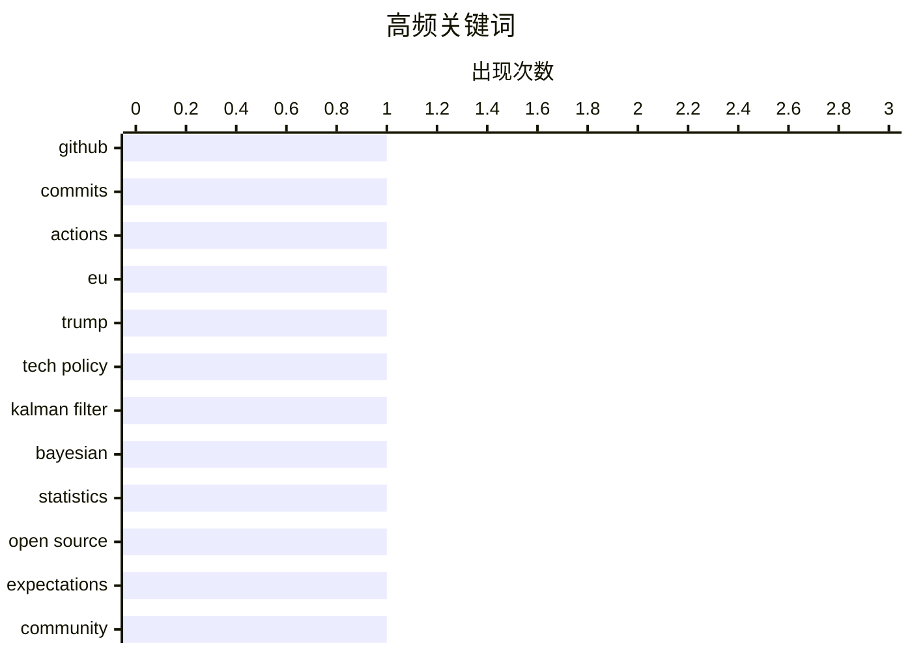

# 📰 AI 博客每日精选

**日期**: 2026-04-05 &nbsp;|&nbsp; **精选**: 6 篇 &nbsp;|&nbsp; **时间范围**: 24 小时

> 📚 来自 Karpathy 推荐的 **92** 个顶级技术博客，经 AI 智能评分筛选

## 📑 目录

- [📝 今日看点](#-今日看点)
- [🏆 今日必读](#-今日必读)
- [📊 数据概览](#-数据概览)
- [⚙️ 工程](#-工程) (2篇)
- [📝 其他](#-其他) (2篇)
- [💡 观点 / 杂谈](#-观点---杂谈) (1篇)
- [🛠 工具 / 开源](#-工具---开源) (1篇)

---

## 📝 今日看点

<div style="background: linear-gradient(135deg, #667eea 0%, #764ba2 100%); padding: 16px 20px; border-radius: 12px; color: white; margin: 20px 0;">

今日技术圈聚焦三大趋势：GitHub 平台活跃度持续攀升，2025年提交量已突破10亿次，凸显开发者生态的高度活跃；欧盟在特朗普政策压力下或调整数字主权立场，面临跨国科技监管与供应链协调的妥协风险；与此同时，开源运动的理想与现实张力加剧，不同群体对“开源”的认知差异引发法律与实践冲突，反映技术治理的深层挑战。

</div>

---

## 🏆 今日必读

### 🥇 [GitHub 平台活跃度激增：2025 年达 10 亿次提交，每周 2.75 亿次](https://simonwillison.net/2026/Apr/4/kyle-daigle/#atom-everything)

<div style="display: flex; gap: 16px; flex-wrap: wrap; margin: 12px 0; font-size: 14px; color: #666;">
<span>📁 ⚙️ 工程</span>
<span>⏰ 21 小时前</span>
<span>⭐ 评分 22/30</span>
</div>

<div style="background: #f8f9fa; border-left: 4px solid #667eea; padding: 16px 20px; border-radius: 8px; margin: 16px 0;">

GitHub 平台活动持续高速增长，2025 年累计提交次数突破 10 亿，目前每周提交量已达 2.75 亿次，按此线性趋势今年将达 14 亿次。GitHub Actions 使用时长也从 2023 年的每周 5 亿分钟增长至 2025 年的 10 亿分钟，本周已超 21 亿分钟。这些数据表明开发者生态和自动化流程正以前所未有的速度扩张。

</div>

**💡 为什么值得读**: 这组关键指标揭示了现代软件开发基础设施的爆炸式增长，对理解 DevOps 工具链演进和云资源消耗趋势具有重要参考价值。

**🏷️ 标签**: <span style="display:inline-block;background:#e3f2fd;color:#1976D2;padding:4px 12px;border-radius:16px;font-size:12px;margin-right:6px;">GitHub</span><span style="display:inline-block;background:#e3f2fd;color:#1976D2;padding:4px 12px;border-radius:16px;font-size:12px;margin-right:6px;">commits</span><span style="display:inline-block;background:#e3f2fd;color:#1976D2;padding:4px 12px;border-radius:16px;font-size:12px;margin-right:6px;">Actions</span>

---

### 🥈 [欧盟准备在科技领域向特朗普妥协](https://pluralistic.net/2026/04/04/digital-subjugation/)

<div style="display: flex; gap: 16px; flex-wrap: wrap; margin: 12px 0; font-size: 14px; color: #666;">
<span>📁 💡 观点 / 杂谈</span>
<span>⏰ 16 小时前</span>
<span>⭐ 评分 20/30</span>
</div>

<div style="background: #f8f9fa; border-left: 4px solid #667eea; padding: 16px 20px; border-radius: 8px; margin: 16px 0;">

文章探讨欧盟在特朗普政府政策压力下可能做出的技术让步，涉及数字主权、关税政策与跨国科技监管协调问题。作者指出欧盟面临‘数字顺从’风险，可能在数据本地化、AI 治理或半导体供应链等方面做出妥协。文中还提及安大略省疫苗分发困境、AI 心理治疗可信度争议等案例，强调技术治理中的政治博弈。

</div>

**💡 为什么值得读**: 该文深度剖析了地缘政治对全球科技政策的影响，为观察中美欧三方科技角力提供了独特视角。

**🏷️ 标签**: <span style="display:inline-block;background:#e3f2fd;color:#1976D2;padding:4px 12px;border-radius:16px;font-size:12px;margin-right:6px;">EU</span><span style="display:inline-block;background:#e3f2fd;color:#1976D2;padding:4px 12px;border-radius:16px;font-size:12px;margin-right:6px;">Trump</span><span style="display:inline-block;background:#e3f2fd;color:#1976D2;padding:4px 12px;border-radius:16px;font-size:12px;margin-right:6px;">tech policy</span>

---

### 🥉 [用卡尔曼滤波与贝叶斯统计更新平均成绩](https://www.johndcook.com/blog/2026/04/04/kalman-bayes/)

<div style="display: flex; gap: 16px; flex-wrap: wrap; margin: 12px 0; font-size: 14px; color: #666;">
<span>📁 ⚙️ 工程</span>
<span>⏰ 9 小时前</span>
<span>⭐ 评分 19/30</span>
</div>

<div style="background: #f8f9fa; border-left: 4px solid #667eea; padding: 16px 20px; border-radius: 8px; margin: 16px 0;">

本文将计算课程平均成绩的问题建模为贝叶斯推断和卡尔曼滤波的特例。假设每次考试成绩权重相等，已知前 n 次考试的平均分 m，当新增第 (n+1) 次成绩 x_{n+1} 时，可通过递推公式平滑更新整体平均。该方法展示了如何将简单统计问题嵌入更通用的概率框架中处理不确定性。

</div>

**💡 为什么值得读**: 通过经典教学场景演示高级统计方法的应用，适合希望理解贝叶斯思维与状态估计初学者。

**🏷️ 标签**: <span style="display:inline-block;background:#e3f2fd;color:#1976D2;padding:4px 12px;border-radius:16px;font-size:12px;margin-right:6px;">Kalman filter</span><span style="display:inline-block;background:#e3f2fd;color:#1976D2;padding:4px 12px;border-radius:16px;font-size:12px;margin-right:6px;">Bayesian</span><span style="display:inline-block;background:#e3f2fd;color:#1976D2;padding:4px 12px;border-radius:16px;font-size:12px;margin-right:6px;">statistics</span>

---

## 📊 数据概览

<div style="display: grid; grid-template-columns: repeat(auto-fit, minmax(120px, 1fr)); gap: 12px; margin: 20px 0;">
<div style="background: #e8f4f8; padding: 16px; border-radius: 10px; text-align: center;">
<div style="font-size: 24px; font-weight: bold; color: #2196F3;">87/92</div>
<div style="font-size: 13px; color: #666; margin-top: 4px;">扫描源</div>
</div>
<div style="background: #fff3e0; padding: 16px; border-radius: 10px; text-align: center;">
<div style="font-size: 24px; font-weight: bold; color: #FF9800;">2510</div>
<div style="font-size: 13px; color: #666; margin-top: 4px;">抓取文章</div>
</div>
<div style="background: #f3e5f5; padding: 16px; border-radius: 10px; text-align: center;">
<div style="font-size: 24px; font-weight: bold; color: #9C27B0;">6</div>
<div style="font-size: 13px; color: #666; margin-top: 4px;">时间范围内</div>
</div>
<div style="background: #e8f5e9; padding: 16px; border-radius: 10px; text-align: center;">
<div style="font-size: 24px; font-weight: bold; color: #4CAF50;">6</div>
<div style="font-size: 13px; color: #666; margin-top: 4px;">AI 精选</div>
</div>
</div>

### 🥧 分类分布



### 📈 高频关键词



<details style="margin: 16px 0; padding: 12px; background: #f5f5f5; border-radius: 8px;">
<summary style="cursor: pointer; font-weight: 500;">📊 纯文本关键词图（终端友好）</summary>

```
github        │ ████████████████████ 1
commits       │ ████████████████████ 1
actions       │ ████████████████████ 1
eu            │ ████████████████████ 1
trump         │ ████████████████████ 1
tech policy   │ ████████████████████ 1
kalman filter │ ████████████████████ 1
bayesian      │ ████████████████████ 1
statistics    │ ████████████████████ 1
open source   │ ████████████████████ 1
```

</details>

### 🏷️ 话题标签

<div style="line-height: 2; margin: 16px 0;">
**github**(1) · **commits**(1) · **actions**(1) · eu(1) · trump(1) · tech policy(1) · kalman filter(1) · bayesian(1) · statistics(1) · open source(1) · expectations(1) · community(1) · aluminum(1) · ev(1) · transformer shortage(1) · rss(1) · atom(1) · social network(1)
</div>

---

<a id="-工程"></a>
## ⚙️ 工程 <span style="background: #e0e0e0; padding: 2px 10px; border-radius: 12px; font-size: 13px; margin-left: 8px;">2篇</span>

### 1. [GitHub 平台活跃度激增：2025 年达 10 亿次提交，每周 2.75 亿次](https://simonwillison.net/2026/Apr/4/kyle-daigle/#atom-everything)

<div style="margin: 10px 0;">
<div style="display: flex; justify-content: space-between; font-size: 13px; margin-bottom: 4px;">
<span>⭐ 综合评分</span>
<span style="font-weight: bold; color: #FF9800;">22/30</span>
</div>
<div style="background: #e0e0e0; height: 8px; border-radius: 4px; overflow: hidden;">
<div style="background: #FF9800; width: 73%; height: 100%; border-radius: 4px;"></div>
</div>
</div>

<div style="display: flex; gap: 12px; flex-wrap: wrap; font-size: 13px; color: #666; margin: 12px 0;">
<span>📁 simonwillison.net</span>
<span>⏰ 21 小时前</span>
<span>🔖 R:7 Q:6 T:9</span>
</div>

<div style="background: #fafafa; border-radius: 8px; padding: 16px; margin: 12px 0; line-height: 1.7;">
GitHub 平台活动持续高速增长，2025 年累计提交次数突破 10 亿，目前每周提交量已达 2.75 亿次，按此线性趋势今年将达 14 亿次。GitHub Actions 使用时长也从 2023 年的每周 5 亿分钟增长至 2025 年的 10 亿分钟，本周已超 21 亿分钟。这些数据表明开发者生态和自动化流程正以前所未有的速度扩张。
</div>

<div style="margin: 12px 0;">
<span style="display: inline-block; background: #e3f2fd; color: #1976D2; padding: 4px 12px; border-radius: 16px; font-size: 12px; margin-right: 6px; margin-bottom: 4px;">GitHub</span><span style="display: inline-block; background: #e3f2fd; color: #1976D2; padding: 4px 12px; border-radius: 16px; font-size: 12px; margin-right: 6px; margin-bottom: 4px;">commits</span><span style="display: inline-block; background: #e3f2fd; color: #1976D2; padding: 4px 12px; border-radius: 16px; font-size: 12px; margin-right: 6px; margin-bottom: 4px;">Actions</span>
</div>

---

### 2. [用卡尔曼滤波与贝叶斯统计更新平均成绩](https://www.johndcook.com/blog/2026/04/04/kalman-bayes/)

<div style="margin: 10px 0;">
<div style="display: flex; justify-content: space-between; font-size: 13px; margin-bottom: 4px;">
<span>⭐ 综合评分</span>
<span style="font-weight: bold; color: #FF9800;">19/30</span>
</div>
<div style="background: #e0e0e0; height: 8px; border-radius: 4px; overflow: hidden;">
<div style="background: #FF9800; width: 63%; height: 100%; border-radius: 4px;"></div>
</div>
</div>

<div style="display: flex; gap: 12px; flex-wrap: wrap; font-size: 13px; color: #666; margin: 12px 0;">
<span>📁 johndcook.com</span>
<span>⏰ 9 小时前</span>
<span>🔖 R:6 Q:8 T:5</span>
</div>

<div style="background: #fafafa; border-radius: 8px; padding: 16px; margin: 12px 0; line-height: 1.7;">
本文将计算课程平均成绩的问题建模为贝叶斯推断和卡尔曼滤波的特例。假设每次考试成绩权重相等，已知前 n 次考试的平均分 m，当新增第 (n+1) 次成绩 x_{n+1} 时，可通过递推公式平滑更新整体平均。该方法展示了如何将简单统计问题嵌入更通用的概率框架中处理不确定性。
</div>

<div style="margin: 12px 0;">
<span style="display: inline-block; background: #e3f2fd; color: #1976D2; padding: 4px 12px; border-radius: 16px; font-size: 12px; margin-right: 6px; margin-bottom: 4px;">Kalman filter</span><span style="display: inline-block; background: #e3f2fd; color: #1976D2; padding: 4px 12px; border-radius: 16px; font-size: 12px; margin-right: 6px; margin-bottom: 4px;">Bayesian</span><span style="display: inline-block; background: #e3f2fd; color: #1976D2; padding: 4px 12px; border-radius: 16px; font-size: 12px; margin-right: 6px; margin-bottom: 4px;">statistics</span>
</div>

---

<a id="-其他"></a>
## 📝 其他 <span style="background: #e0e0e0; padding: 2px 10px; border-radius: 12px; font-size: 13px; margin-left: 8px;">2篇</span>

### 3. [建筑物理阅读清单（2026年4月4日）](https://www.construction-physics.com/p/reading-list-04042026)

<div style="margin: 10px 0;">
<div style="display: flex; justify-content: space-between; font-size: 13px; margin-bottom: 4px;">
<span>⭐ 综合评分</span>
<span style="font-weight: bold; color: #f44336;">16/30</span>
</div>
<div style="background: #e0e0e0; height: 8px; border-radius: 4px; overflow: hidden;">
<div style="background: #f44336; width: 53%; height: 100%; border-radius: 4px;"></div>
</div>
</div>

<div style="display: flex; gap: 12px; flex-wrap: wrap; font-size: 13px; color: #666; margin: 12px 0;">
<span>📁 construction-physics.com</span>
<span>⏰ 12 小时前</span>
<span>🔖 R:4 Q:5 T:7</span>
</div>

<div style="background: #fafafa; border-radius: 8px; padding: 16px; margin: 12px 0; line-height: 1.7;">
本期推荐涵盖铝材料供应中断、电动汽车‘锈蚀地带’现象、变压器持续短缺、SpaceX 启动 IPO 等重大议题。内容聚焦基建材料与能源转型交叉领域的现实挑战，包括极端气候对金属耐久性的影响及可再生能源设备供应链瓶颈。
</div>

<div style="margin: 12px 0;">
<span style="display: inline-block; background: #e3f2fd; color: #1976D2; padding: 4px 12px; border-radius: 16px; font-size: 12px; margin-right: 6px; margin-bottom: 4px;">aluminum</span><span style="display: inline-block; background: #e3f2fd; color: #1976D2; padding: 4px 12px; border-radius: 16px; font-size: 12px; margin-right: 6px; margin-bottom: 4px;">EV</span><span style="display: inline-block; background: #e3f2fd; color: #1976D2; padding: 4px 12px; border-radius: 16px; font-size: 12px; margin-right: 6px; margin-bottom: 4px;">transformer shortage</span>
</div>

---

### 4. [欢迎来到 RSS 俱乐部！](https://shkspr.mobi/blog/2026/04/welcome-to-rss-club/)

<div style="margin: 10px 0;">
<div style="display: flex; justify-content: space-between; font-size: 13px; margin-bottom: 4px;">
<span>⭐ 综合评分</span>
<span style="font-weight: bold; color: #f44336;">13/30</span>
</div>
<div style="background: #e0e0e0; height: 8px; border-radius: 4px; overflow: hidden;">
<div style="background: #f44336; width: 43%; height: 100%; border-radius: 4px;"></div>
</div>
</div>

<div style="display: flex; gap: 12px; flex-wrap: wrap; font-size: 13px; color: #666; margin: 12px 0;">
<span>📁 shkspr.mobi</span>
<span>⏰ 12 小时前</span>
<span>🔖 R:3 Q:4 T:6</span>
</div>

<div style="background: #fafafa; border-radius: 8px; padding: 16px; margin: 12px 0; line-height: 1.7;">
作者创建了一个仅对 RSS/Atom 订阅者可见的秘密社交圈——RSS Club，其内容无法被搜索引擎索引，也不会同步到 Mastodon 等社交平台。该实验旨在探索去中心化信息传播的可能性，强调 RSS 作为开放协议在对抗算法茧房中的潜力。
</div>

<div style="margin: 12px 0;">
<span style="display: inline-block; background: #e3f2fd; color: #1976D2; padding: 4px 12px; border-radius: 16px; font-size: 12px; margin-right: 6px; margin-bottom: 4px;">RSS</span><span style="display: inline-block; background: #e3f2fd; color: #1976D2; padding: 4px 12px; border-radius: 16px; font-size: 12px; margin-right: 6px; margin-bottom: 4px;">Atom</span><span style="display: inline-block; background: #e3f2fd; color: #1976D2; padding: 4px 12px; border-radius: 16px; font-size: 12px; margin-right: 6px; margin-bottom: 4px;">social network</span>
</div>

---

<a id="-观点---杂谈"></a>
## 💡 观点 / 杂谈 <span style="background: #e0e0e0; padding: 2px 10px; border-radius: 12px; font-size: 13px; margin-left: 8px;">1篇</span>

### 5. [欧盟准备在科技领域向特朗普妥协](https://pluralistic.net/2026/04/04/digital-subjugation/)

<div style="margin: 10px 0;">
<div style="display: flex; justify-content: space-between; font-size: 13px; margin-bottom: 4px;">
<span>⭐ 综合评分</span>
<span style="font-weight: bold; color: #FF9800;">20/30</span>
</div>
<div style="background: #e0e0e0; height: 8px; border-radius: 4px; overflow: hidden;">
<div style="background: #FF9800; width: 67%; height: 100%; border-radius: 4px;"></div>
</div>
</div>

<div style="display: flex; gap: 12px; flex-wrap: wrap; font-size: 13px; color: #666; margin: 12px 0;">
<span>📁 pluralistic.net</span>
<span>⏰ 16 小时前</span>
<span>🔖 R:5 Q:7 T:8</span>
</div>

<div style="background: #fafafa; border-radius: 8px; padding: 16px; margin: 12px 0; line-height: 1.7;">
文章探讨欧盟在特朗普政府政策压力下可能做出的技术让步，涉及数字主权、关税政策与跨国科技监管协调问题。作者指出欧盟面临‘数字顺从’风险，可能在数据本地化、AI 治理或半导体供应链等方面做出妥协。文中还提及安大略省疫苗分发困境、AI 心理治疗可信度争议等案例，强调技术治理中的政治博弈。
</div>

<div style="margin: 12px 0;">
<span style="display: inline-block; background: #e3f2fd; color: #1976D2; padding: 4px 12px; border-radius: 16px; font-size: 12px; margin-right: 6px; margin-bottom: 4px;">EU</span><span style="display: inline-block; background: #e3f2fd; color: #1976D2; padding: 4px 12px; border-radius: 16px; font-size: 12px; margin-right: 6px; margin-bottom: 4px;">Trump</span><span style="display: inline-block; background: #e3f2fd; color: #1976D2; padding: 4px 12px; border-radius: 16px; font-size: 12px; margin-right: 6px; margin-bottom: 4px;">tech policy</span>
</div>

---

<a id="-工具---开源"></a>
## 🛠 工具 / 开源 <span style="background: #e0e0e0; padding: 2px 10px; border-radius: 12px; font-size: 13px; margin-left: 8px;">1篇</span>

### 6. [开源究竟意味着什么？](https://nesbitt.io/2026/04/04/what-does-open-source-mean.html)

<div style="margin: 10px 0;">
<div style="display: flex; justify-content: space-between; font-size: 13px; margin-bottom: 4px;">
<span>⭐ 综合评分</span>
<span style="font-weight: bold; color: #FF9800;">18/30</span>
</div>
<div style="background: #e0e0e0; height: 8px; border-radius: 4px; overflow: hidden;">
<div style="background: #FF9800; width: 60%; height: 100%; border-radius: 4px;"></div>
</div>
</div>

<div style="display: flex; gap: 12px; flex-wrap: wrap; font-size: 13px; color: #666; margin: 12px 0;">
<span>📁 nesbitt.io</span>
<span>⏰ 14 小时前</span>
<span>🔖 R:6 Q:7 T:5</span>
</div>

<div style="background: #fafafa; border-radius: 8px; padding: 16px; margin: 12px 0; line-height: 1.7;">
文章指出围绕“开源”存在多重互不相容的期望：开发者期待自由修改与分发，企业要求商业友好许可，社区重视透明协作，而用户则希望无隐藏后门。这种认知错位导致开源项目常陷入法律、伦理与实践层面的冲突，反映出定义本身的模糊性。
</div>

<div style="margin: 12px 0;">
<span style="display: inline-block; background: #e3f2fd; color: #1976D2; padding: 4px 12px; border-radius: 16px; font-size: 12px; margin-right: 6px; margin-bottom: 4px;">Open Source</span><span style="display: inline-block; background: #e3f2fd; color: #1976D2; padding: 4px 12px; border-radius: 16px; font-size: 12px; margin-right: 6px; margin-bottom: 4px;">expectations</span><span style="display: inline-block; background: #e3f2fd; color: #1976D2; padding: 4px 12px; border-radius: 16px; font-size: 12px; margin-right: 6px; margin-bottom: 4px;">community</span>
</div>

---


<div style="text-align: center; color: #888; font-size: 13px; padding: 20px; border-top: 1px solid #e0e0e0; margin-top: 30px;">
生成于 2026-04-05 00:02 | 扫描 <strong>87</strong> 源 → 获取 <strong>2510</strong> 篇 → 精选 <strong>6</strong> 篇
<br>
基于 <a href="https://refactoringenglish.com/tools/hn-popularity/" style="color: #667eea;">Hacker News Popularity Contest 2025</a> RSS 源列表，由 <a href="https://x.com/karpathy" style="color: #667eea;">Andrej Karpathy</a> 推荐
<br>
由「懂点儿 AI」制作，欢迎关注同名微信公众号获取更多 AI 实用技巧 💡
</div>
