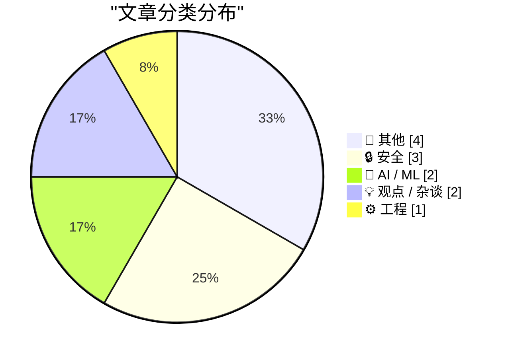
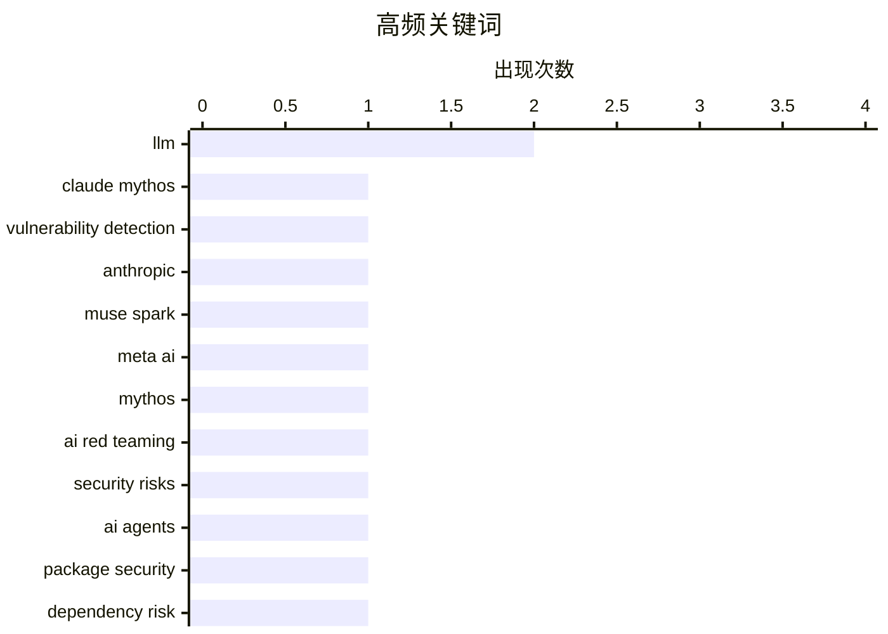

# 📰 AI 博客每日精选

**日期**: 2026-04-09 &nbsp;|&nbsp; **精选**: 12 篇 &nbsp;|&nbsp; **时间范围**: 24 小时

> 📚 来自 Karpathy 推荐的 **92** 个顶级技术博客，经 AI 智能评分筛选

## 📑 目录

- [📝 今日看点](#-今日看点)
- [🏆 今日必读](#-今日必读)
- [📊 数据概览](#-数据概览)
- [📝 其他](#-其他) (4篇)
- [🔒 安全](#-安全) (3篇)
- [🤖 AI / ML](#-ai---ml) (2篇)
- [💡 观点 / 杂谈](#-观点---杂谈) (2篇)
- [⚙️ 工程](#-工程) (1篇)

---

## 📝 今日看点

<div style="background: linear-gradient(135deg, #667eea 0%, #764ba2 100%); padding: 16px 20px; border-radius: 12px; color: white; margin: 20px 0;">

今日技术圈聚焦三大趋势：AI安全引发新担忧，Anthropic的Claude Mythos模型因强大漏洞挖掘能力被限制发布，凸显前沿AI可能带来的失控风险；Meta推出闭源模型Muse Spark并集成至meta.ai平台，反映大模型商业化应用加速，但仅限私有预览的模式也暴露生态封闭倾向；此外，公众对AI的双重态度持续发酵，一边积极利用AI提升他人效率，一边抗拒自身职业被替代，揭示技术变革中根深蒂固的心理矛盾。

</div>

---

## 🏆 今日必读

### 🥇 [Anthropic 的新 Claude Mythos 在发现和利用漏洞方面表现出色，因此暂未向公众发布](https://red.anthropic.com/2026/mythos-preview/)

<div style="display: flex; gap: 16px; flex-wrap: wrap; margin: 12px 0; font-size: 14px; color: #666;">
<span>📁 🔒 安全</span>
<span>⏰ 8 小时前</span>
<span>⭐ 评分 27/30</span>
</div>

<div style="background: #f8f9fa; border-left: 4px solid #667eea; padding: 16px 20px; border-radius: 8px; margin: 16px 0;">

Anthropic 推出了名为 Claude Mythos Preview 的全新通用语言模型，其在计算机安全任务上表现尤为突出。为此，公司启动了 Project Glasswing 项目，旨在利用 Mythos Preview 帮助加固全球最关键的软件系统，并为行业应对日益增长的网络攻击做好准备。该模型具备强大的漏洞识别与利用能力，远超现有公开模型。Anthropic 出于安全考虑，目前仅以预览形式内部使用，暂不公开发布。这表明 AI 在主动攻防网络安全领域已达到实用化水平。

</div>

**💡 为什么值得读**: 揭示了前沿 AI 模型在主动网络安全防御中的颠覆性潜力，以及科技公司对高风险能力的自我审查机制。

**🏷️ 标签**: <span style="display:inline-block;background:#e3f2fd;color:#1976D2;padding:4px 12px;border-radius:16px;font-size:12px;margin-right:6px;">Claude Mythos</span><span style="display:inline-block;background:#e3f2fd;color:#1976D2;padding:4px 12px;border-radius:16px;font-size:12px;margin-right:6px;">vulnerability detection</span><span style="display:inline-block;background:#e3f2fd;color:#1976D2;padding:4px 12px;border-radius:16px;font-size:12px;margin-right:6px;">Anthropic</span>

---

### 🥈 [Meta 推出新模型 Muse Spark，meta.ai 聊天平台集成多项实用工具](https://simonwillison.net/2026/Apr/8/muse-spark/#atom-everything)

<div style="display: flex; gap: 16px; flex-wrap: wrap; margin: 12px 0; font-size: 14px; color: #666;">
<span>📁 🤖 AI / ML</span>
<span>⏰ 1 小时前</span>
<span>⭐ 评分 24/30</span>
</div>

<div style="background: #f8f9fa; border-left: 4px solid #667eea; padding: 16px 20px; border-radius: 8px; margin: 16px 0;">

Meta 发布了自 Llama 4 以来首个新模型 Muse Spark，该模型托管于 Meta 平台而非开源，API 目前仅限精选用户参与私有预览。用户可通过 meta.ai（需 Facebook 或 Instagram 登录）直接体验其功能。Meta 宣称其在图像生成和文本理解等基准测试中表现优于 Llama 4。尽管未开放权重，但此次发布标志着 Meta 在生成式 AI 应用层布局的加速。

</div>

**💡 为什么值得读**: 展示了 Meta 如何将大模型能力整合进消费级社交平台，为开发者提供了新的 AI 应用入口。

**🏷️ 标签**: <span style="display:inline-block;background:#e3f2fd;color:#1976D2;padding:4px 12px;border-radius:16px;font-size:12px;margin-right:6px;">Muse Spark</span><span style="display:inline-block;background:#e3f2fd;color:#1976D2;padding:4px 12px;border-radius:16px;font-size:12px;margin-right:6px;">Meta AI</span><span style="display:inline-block;background:#e3f2fd;color:#1976D2;padding:4px 12px;border-radius:16px;font-size:12px;margin-right:6px;">LLM</span>

---

### 🥉 [我们应该如何看待 Anthropic 关于 Mythos 模型的潜在威胁报告？](https://garymarcus.substack.com/p/what-should-we-take-from-anthropics)

<div style="display: flex; gap: 16px; flex-wrap: wrap; margin: 12px 0; font-size: 14px; color: #666;">
<span>📁 🔒 安全</span>
<span>⏰ 6 小时前</span>
<span>⭐ 评分 24/30</span>
</div>

<div style="background: #f8f9fa; border-left: 4px solid #667eea; padding: 16px 20px; border-radius: 8px; margin: 16px 0;">

尽管 Anthropic 尚未公布 Claude Mythos 的具体细节，但 Gary Marcus 指出其可能具备极强的代码漏洞挖掘与利用能力，引发对其失控风险的担忧。他认为此类模型若被恶意使用，将极大提升网络攻击效率。作者呼吁业界保持警惕，建立更严格的 AI 安全评估框架。当前信息有限，但已足以促使我们重新审视 AGI 发展的伦理边界。

</div>

**💡 为什么值得读**: 从独立专家视角剖析 Mythos 模型背后的安全风险，推动公众讨论 AI 安全治理的紧迫性。

**🏷️ 标签**: <span style="display:inline-block;background:#e3f2fd;color:#1976D2;padding:4px 12px;border-radius:16px;font-size:12px;margin-right:6px;">Mythos</span><span style="display:inline-block;background:#e3f2fd;color:#1976D2;padding:4px 12px;border-radius:16px;font-size:12px;margin-right:6px;">AI red teaming</span><span style="display:inline-block;background:#e3f2fd;color:#1976D2;padding:4px 12px;border-radius:16px;font-size:12px;margin-right:6px;">security risks</span>

---

## 📊 数据概览

<div style="display: grid; grid-template-columns: repeat(auto-fit, minmax(120px, 1fr)); gap: 12px; margin: 20px 0;">
<div style="background: #e8f4f8; padding: 16px; border-radius: 10px; text-align: center;">
<div style="font-size: 24px; font-weight: bold; color: #2196F3;">86/92</div>
<div style="font-size: 13px; color: #666; margin-top: 4px;">扫描源</div>
</div>
<div style="background: #fff3e0; padding: 16px; border-radius: 10px; text-align: center;">
<div style="font-size: 24px; font-weight: bold; color: #FF9800;">2358</div>
<div style="font-size: 13px; color: #666; margin-top: 4px;">抓取文章</div>
</div>
<div style="background: #f3e5f5; padding: 16px; border-radius: 10px; text-align: center;">
<div style="font-size: 24px; font-weight: bold; color: #9C27B0;">12</div>
<div style="font-size: 13px; color: #666; margin-top: 4px;">时间范围内</div>
</div>
<div style="background: #e8f5e9; padding: 16px; border-radius: 10px; text-align: center;">
<div style="font-size: 24px; font-weight: bold; color: #4CAF50;">12</div>
<div style="font-size: 13px; color: #666; margin-top: 4px;">AI 精选</div>
</div>
</div>

### 🥧 分类分布



### 📈 高频关键词



<details style="margin: 16px 0; padding: 12px; background: #f5f5f5; border-radius: 8px;">
<summary style="cursor: pointer; font-weight: 500;">📊 纯文本关键词图（终端友好）</summary>

```
llm                     │ ████████████████████ 2
claude mythos           │ ██████████░░░░░░░░░░ 1
vulnerability detection │ ██████████░░░░░░░░░░ 1
anthropic               │ ██████████░░░░░░░░░░ 1
muse spark              │ ██████████░░░░░░░░░░ 1
meta ai                 │ ██████████░░░░░░░░░░ 1
mythos                  │ ██████████░░░░░░░░░░ 1
ai red teaming          │ ██████████░░░░░░░░░░ 1
security risks          │ ██████████░░░░░░░░░░ 1
ai agents               │ ██████████░░░░░░░░░░ 1
```

</details>

### 🏷️ 话题标签

<div style="line-height: 2; margin: 16px 0;">
**llm**(2) · **claude mythos**(1) · **vulnerability detection**(1) · anthropic(1) · muse spark(1) · meta ai(1) · mythos(1) · ai red teaming(1) · security risks(1) · ai agents(1) · package security(1) · dependency risk(1) · windows api(1) · msgwaitformultipleobjects(1) · handle management(1) · ai(1) · weirdness(1) · behavior(1) · ai tools(1) · profession(1)
</div>

---

<a id="-其他"></a>
## 📝 其他 <span style="background: #e0e0e0; padding: 2px 10px; border-radius: 12px; font-size: 13px; margin-left: 8px;">4篇</span>

### 1. [Artemis I 轨道揭示三体与四体引力难题](https://www.johndcook.com/blog/2026/04/08/artemis-1-apollo-12/)

<div style="margin: 10px 0;">
<div style="display: flex; justify-content: space-between; font-size: 13px; margin-bottom: 4px;">
<span>⭐ 综合评分</span>
<span style="font-weight: bold; color: #f44336;">13/30</span>
</div>
<div style="background: #e0e0e0; height: 8px; border-radius: 4px; overflow: hidden;">
<div style="background: #f44336; width: 43%; height: 100%; border-radius: 4px;"></div>
</div>
</div>

<div style="display: flex; gap: 12px; flex-wrap: wrap; font-size: 13px; color: #666; margin: 12px 0;">
<span>📁 johndcook.com</span>
<span>⏰ 38 分钟前</span>
<span>🔖 R:3 Q:6 T:4</span>
</div>

<div style="background: #fafafa; border-radius: 8px; padding: 16px; margin: 12px 0; line-height: 1.7;">
Artemis I 无人绕月任务历时25天，其轨道设计涉及地球、月球和太阳的三体引力作用，构成典型的限制性三体问题。相比载人 Artemis II 的10天任务，Artemis I 可执行更复杂的引力弹弓机动。NASA 工程师通过精确计算实现了这一壮举，为后续载人登月积累了宝贵数据。该任务成功验证了深空导航的新方法。
</div>

<div style="margin: 12px 0;">
<span style="display: inline-block; background: #e3f2fd; color: #1976D2; padding: 4px 12px; border-radius: 16px; font-size: 12px; margin-right: 6px; margin-bottom: 4px;">Artemis mission</span><span style="display: inline-block; background: #e3f2fd; color: #1976D2; padding: 4px 12px; border-radius: 16px; font-size: 12px; margin-right: 6px; margin-bottom: 4px;">orbital mechanics</span><span style="display: inline-block; background: #e3f2fd; color: #1976D2; padding: 4px 12px; border-radius: 16px; font-size: 12px; margin-right: 6px; margin-bottom: 4px;">NASA</span>
</div>

---

### 2. [Pork Johnson 木偶剧创作者揭秘 GIMP 恶搞预告片幕后故事](https://feed.tedium.co/link/15204/17315642/pork-johnson-gimp-parody-interview)

<div style="margin: 10px 0;">
<div style="display: flex; justify-content: space-between; font-size: 13px; margin-bottom: 4px;">
<span>⭐ 综合评分</span>
<span style="font-weight: bold; color: #f44336;">11/30</span>
</div>
<div style="background: #e0e0e0; height: 8px; border-radius: 4px; overflow: hidden;">
<div style="background: #f44336; width: 37%; height: 100%; border-radius: 4px;"></div>
</div>
</div>

<div style="display: flex; gap: 12px; flex-wrap: wrap; font-size: 13px; color: #666; margin: 12px 0;">
<span>📁 tedium.co</span>
<span>⏰ 20 小时前</span>
<span>🔖 R:2 Q:5 T:4</span>
</div>

<div style="background: #fafafa; border-radius: 8px; padding: 16px; margin: 12px 0; line-height: 1.7;">
半病毒式传播的虚假 GIMP 电影预告片灵感源自 Pork Johnson 的木偶剧创作。这位木偶师兼喜剧演员表示，他故意用夸张手法讽刺开源社区对商业软件的刻板印象。该事件意外推动了 FOSS 文化的反思，也凸显了创意表达在网络时代的传播威力。
</div>

<div style="margin: 12px 0;">
<span style="display: inline-block; background: #e3f2fd; color: #1976D2; padding: 4px 12px; border-radius: 16px; font-size: 12px; margin-right: 6px; margin-bottom: 4px;">Pork Johnson</span><span style="display: inline-block; background: #e3f2fd; color: #1976D2; padding: 4px 12px; border-radius: 16px; font-size: 12px; margin-right: 6px; margin-bottom: 4px;">GIMP trailer</span><span style="display: inline-block; background: #e3f2fd; color: #1976D2; padding: 4px 12px; border-radius: 16px; font-size: 12px; margin-right: 6px; margin-bottom: 4px;">puppetry</span>
</div>

---

### 3. [Atari ST introduced April 8, 1985](https://dfarq.homeip.net/atari-st-introduced-april-8-1985/?utm_source=rss&#038;utm_medium=rss&#038;utm_campaign=atari-st-introduced-april-8-1985)

<div style="margin: 10px 0;">
<div style="display: flex; justify-content: space-between; font-size: 13px; margin-bottom: 4px;">
<span>⭐ 综合评分</span>
<span style="font-weight: bold; color: #f44336;">10/30</span>
</div>
<div style="background: #e0e0e0; height: 8px; border-radius: 4px; overflow: hidden;">
<div style="background: #f44336; width: 33%; height: 100%; border-radius: 4px;"></div>
</div>
</div>

<div style="display: flex; gap: 12px; flex-wrap: wrap; font-size: 13px; color: #666; margin: 12px 0;">
<span>📁 dfarq.homeip.net</span>
<span>⏰ 13 小时前</span>
<span>🔖 R:3 Q:5 T:2</span>
</div>

<div style="background: #fafafa; border-radius: 8px; padding: 16px; margin: 12px 0; line-height: 1.7;">
It is hard for me to be objective about the Atari ST, because I was a dyed in the wool Amiga fanboy in the early ’90s. But the Atari ST was released April 8, 1985 and quickly sold 50,000 units.
The po
</div>

<div style="margin: 12px 0;">
<span style="display: inline-block; background: #e3f2fd; color: #1976D2; padding: 4px 12px; border-radius: 16px; font-size: 12px; margin-right: 6px; margin-bottom: 4px;">Atari ST</span><span style="display: inline-block; background: #e3f2fd; color: #1976D2; padding: 4px 12px; border-radius: 16px; font-size: 12px; margin-right: 6px; margin-bottom: 4px;">history</span><span style="display: inline-block; background: #e3f2fd; color: #1976D2; padding: 4px 12px; border-radius: 16px; font-size: 12px; margin-right: 6px; margin-bottom: 4px;">computing</span><span style="display: inline-block; background: #e3f2fd; color: #1976D2; padding: 4px 12px; border-radius: 16px; font-size: 12px; margin-right: 6px; margin-bottom: 4px;">retro</span>
</div>

---

### 4. [Theatre Review: Avenue Q ★★★★★](https://shkspr.mobi/blog/2026/04/theatre-review-avenue-q/)

<div style="margin: 10px 0;">
<div style="display: flex; justify-content: space-between; font-size: 13px; margin-bottom: 4px;">
<span>⭐ 综合评分</span>
<span style="font-weight: bold; color: #f44336;">9/30</span>
</div>
<div style="background: #e0e0e0; height: 8px; border-radius: 4px; overflow: hidden;">
<div style="background: #f44336; width: 30%; height: 100%; border-radius: 4px;"></div>
</div>
</div>

<div style="display: flex; gap: 12px; flex-wrap: wrap; font-size: 13px; color: #666; margin: 12px 0;">
<span>📁 shkspr.mobi</span>
<span>⏰ 12 小时前</span>
<span>🔖 R:1 Q:5 T:3</span>
</div>

<div style="background: #fafafa; border-radius: 8px; padding: 16px; margin: 12px 0; line-height: 1.7;">
I'll admit, I was a little sceptical about returning to Avenue Q. I saw it on its original West End run back in… OH MY GOD I AM SO OLD! FUCK! Where did the time go?  It's always hard to know how much 
</div>

<div style="margin: 12px 0;">
<span style="display: inline-block; background: #e3f2fd; color: #1976D2; padding: 4px 12px; border-radius: 16px; font-size: 12px; margin-right: 6px; margin-bottom: 4px;">Avenue Q</span><span style="display: inline-block; background: #e3f2fd; color: #1976D2; padding: 4px 12px; border-radius: 16px; font-size: 12px; margin-right: 6px; margin-bottom: 4px;">theatre review</span><span style="display: inline-block; background: #e3f2fd; color: #1976D2; padding: 4px 12px; border-radius: 16px; font-size: 12px; margin-right: 6px; margin-bottom: 4px;">nostalgia</span>
</div>

---

<a id="-安全"></a>
## 🔒 安全 <span style="background: #e0e0e0; padding: 2px 10px; border-radius: 12px; font-size: 13px; margin-left: 8px;">3篇</span>

### 5. [Anthropic 的新 Claude Mythos 在发现和利用漏洞方面表现出色，因此暂未向公众发布](https://red.anthropic.com/2026/mythos-preview/)

<div style="margin: 10px 0;">
<div style="display: flex; justify-content: space-between; font-size: 13px; margin-bottom: 4px;">
<span>⭐ 综合评分</span>
<span style="font-weight: bold; color: #4CAF50;">27/30</span>
</div>
<div style="background: #e0e0e0; height: 8px; border-radius: 4px; overflow: hidden;">
<div style="background: #4CAF50; width: 90%; height: 100%; border-radius: 4px;"></div>
</div>
</div>

<div style="display: flex; gap: 12px; flex-wrap: wrap; font-size: 13px; color: #666; margin: 12px 0;">
<span>📁 daringfireball.net</span>
<span>⏰ 8 小时前</span>
<span>🔖 R:9 Q:8 T:10</span>
</div>

<div style="background: #fafafa; border-radius: 8px; padding: 16px; margin: 12px 0; line-height: 1.7;">
Anthropic 推出了名为 Claude Mythos Preview 的全新通用语言模型，其在计算机安全任务上表现尤为突出。为此，公司启动了 Project Glasswing 项目，旨在利用 Mythos Preview 帮助加固全球最关键的软件系统，并为行业应对日益增长的网络攻击做好准备。该模型具备强大的漏洞识别与利用能力，远超现有公开模型。Anthropic 出于安全考虑，目前仅以预览形式内部使用，暂不公开发布。这表明 AI 在主动攻防网络安全领域已达到实用化水平。
</div>

<div style="margin: 12px 0;">
<span style="display: inline-block; background: #e3f2fd; color: #1976D2; padding: 4px 12px; border-radius: 16px; font-size: 12px; margin-right: 6px; margin-bottom: 4px;">Claude Mythos</span><span style="display: inline-block; background: #e3f2fd; color: #1976D2; padding: 4px 12px; border-radius: 16px; font-size: 12px; margin-right: 6px; margin-bottom: 4px;">vulnerability detection</span><span style="display: inline-block; background: #e3f2fd; color: #1976D2; padding: 4px 12px; border-radius: 16px; font-size: 12px; margin-right: 6px; margin-bottom: 4px;">Anthropic</span>
</div>

---

### 6. [我们应该如何看待 Anthropic 关于 Mythos 模型的潜在威胁报告？](https://garymarcus.substack.com/p/what-should-we-take-from-anthropics)

<div style="margin: 10px 0;">
<div style="display: flex; justify-content: space-between; font-size: 13px; margin-bottom: 4px;">
<span>⭐ 综合评分</span>
<span style="font-weight: bold; color: #4CAF50;">24/30</span>
</div>
<div style="background: #e0e0e0; height: 8px; border-radius: 4px; overflow: hidden;">
<div style="background: #4CAF50; width: 80%; height: 100%; border-radius: 4px;"></div>
</div>
</div>

<div style="display: flex; gap: 12px; flex-wrap: wrap; font-size: 13px; color: #666; margin: 12px 0;">
<span>📁 garymarcus.substack.com</span>
<span>⏰ 6 小时前</span>
<span>🔖 R:8 Q:7 T:9</span>
</div>

<div style="background: #fafafa; border-radius: 8px; padding: 16px; margin: 12px 0; line-height: 1.7;">
尽管 Anthropic 尚未公布 Claude Mythos 的具体细节，但 Gary Marcus 指出其可能具备极强的代码漏洞挖掘与利用能力，引发对其失控风险的担忧。他认为此类模型若被恶意使用，将极大提升网络攻击效率。作者呼吁业界保持警惕，建立更严格的 AI 安全评估框架。当前信息有限，但已足以促使我们重新审视 AGI 发展的伦理边界。
</div>

<div style="margin: 12px 0;">
<span style="display: inline-block; background: #e3f2fd; color: #1976D2; padding: 4px 12px; border-radius: 16px; font-size: 12px; margin-right: 6px; margin-bottom: 4px;">Mythos</span><span style="display: inline-block; background: #e3f2fd; color: #1976D2; padding: 4px 12px; border-radius: 16px; font-size: 12px; margin-right: 6px; margin-bottom: 4px;">AI red teaming</span><span style="display: inline-block; background: #e3f2fd; color: #1976D2; padding: 4px 12px; border-radius: 16px; font-size: 12px; margin-right: 6px; margin-bottom: 4px;">security risks</span>
</div>

---

### 7. [AI 代理面临包管理安全困境：依赖链越长，风险越高](https://nesbitt.io/2026/04/08/package-security-problems-for-ai-agents.html)

<div style="margin: 10px 0;">
<div style="display: flex; justify-content: space-between; font-size: 13px; margin-bottom: 4px;">
<span>⭐ 综合评分</span>
<span style="font-weight: bold; color: #FF9800;">22/30</span>
</div>
<div style="background: #e0e0e0; height: 8px; border-radius: 4px; overflow: hidden;">
<div style="background: #FF9800; width: 73%; height: 100%; border-radius: 4px;"></div>
</div>
</div>

<div style="display: flex; gap: 12px; flex-wrap: wrap; font-size: 13px; color: #666; margin: 12px 0;">
<span>📁 nesbitt.io</span>
<span>⏰ 14 小时前</span>
<span>🔖 R:7 Q:7 T:8</span>
</div>

<div style="background: #fafafa; border-radius: 8px; padding: 16px; margin: 12px 0; line-height: 1.7;">
文章深入探讨了 AI 代理在执行自动化任务时因过度依赖第三方软件包而引发的系统性安全风险。由于现代开发环境存在‘包依赖地狱’，一个微小的供应链漏洞即可导致整个代理系统被入侵。作者强调，缺乏沙箱隔离、权限控制和审计机制使得 AI 代理极易成为攻击跳板。必须建立端到端的包验证与运行时防护体系。
</div>

<div style="margin: 12px 0;">
<span style="display: inline-block; background: #e3f2fd; color: #1976D2; padding: 4px 12px; border-radius: 16px; font-size: 12px; margin-right: 6px; margin-bottom: 4px;">AI agents</span><span style="display: inline-block; background: #e3f2fd; color: #1976D2; padding: 4px 12px; border-radius: 16px; font-size: 12px; margin-right: 6px; margin-bottom: 4px;">package security</span><span style="display: inline-block; background: #e3f2fd; color: #1976D2; padding: 4px 12px; border-radius: 16px; font-size: 12px; margin-right: 6px; margin-bottom: 4px;">dependency risk</span>
</div>

---

<a id="-ai---ml"></a>
## 🤖 AI / ML <span style="background: #e0e0e0; padding: 2px 10px; border-radius: 12px; font-size: 13px; margin-left: 8px;">2篇</span>

### 8. [Meta 推出新模型 Muse Spark，meta.ai 聊天平台集成多项实用工具](https://simonwillison.net/2026/Apr/8/muse-spark/#atom-everything)

<div style="margin: 10px 0;">
<div style="display: flex; justify-content: space-between; font-size: 13px; margin-bottom: 4px;">
<span>⭐ 综合评分</span>
<span style="font-weight: bold; color: #4CAF50;">24/30</span>
</div>
<div style="background: #e0e0e0; height: 8px; border-radius: 4px; overflow: hidden;">
<div style="background: #4CAF50; width: 80%; height: 100%; border-radius: 4px;"></div>
</div>
</div>

<div style="display: flex; gap: 12px; flex-wrap: wrap; font-size: 13px; color: #666; margin: 12px 0;">
<span>📁 simonwillison.net</span>
<span>⏰ 1 小时前</span>
<span>🔖 R:8 Q:7 T:9</span>
</div>

<div style="background: #fafafa; border-radius: 8px; padding: 16px; margin: 12px 0; line-height: 1.7;">
Meta 发布了自 Llama 4 以来首个新模型 Muse Spark，该模型托管于 Meta 平台而非开源，API 目前仅限精选用户参与私有预览。用户可通过 meta.ai（需 Facebook 或 Instagram 登录）直接体验其功能。Meta 宣称其在图像生成和文本理解等基准测试中表现优于 Llama 4。尽管未开放权重，但此次发布标志着 Meta 在生成式 AI 应用层布局的加速。
</div>

<div style="margin: 12px 0;">
<span style="display: inline-block; background: #e3f2fd; color: #1976D2; padding: 4px 12px; border-radius: 16px; font-size: 12px; margin-right: 6px; margin-bottom: 4px;">Muse Spark</span><span style="display: inline-block; background: #e3f2fd; color: #1976D2; padding: 4px 12px; border-radius: 16px; font-size: 12px; margin-right: 6px; margin-bottom: 4px;">Meta AI</span><span style="display: inline-block; background: #e3f2fd; color: #1976D2; padding: 4px 12px; border-radius: 16px; font-size: 12px; margin-right: 6px; margin-bottom: 4px;">LLM</span>
</div>

---

### 9. [AI 真的很奇怪](https://www.wheresyoured.at/ai-is-really-weird/)

<div style="margin: 10px 0;">
<div style="display: flex; justify-content: space-between; font-size: 13px; margin-bottom: 4px;">
<span>⭐ 综合评分</span>
<span style="font-weight: bold; color: #FF9800;">21/30</span>
</div>
<div style="background: #e0e0e0; height: 8px; border-radius: 4px; overflow: hidden;">
<div style="background: #FF9800; width: 70%; height: 100%; border-radius: 4px;"></div>
</div>
</div>

<div style="display: flex; gap: 12px; flex-wrap: wrap; font-size: 13px; color: #666; margin: 12px 0;">
<span>📁 wheresyoured.at</span>
<span>⏰ 8 小时前</span>
<span>🔖 R:6 Q:7 T:8</span>
</div>

<div style="background: #fafafa; border-radius: 8px; padding: 16px; margin: 12px 0; line-height: 1.7;">
作者观察到 AI 技术呈现出一种矛盾现象：人们热衷于用 AI 替代他人职业，却强烈抵制自己的职业被 AI 取代。这种双重标准反映了人类对技术变革的心理抗拒。文章进一步指出，当前 AI 发展路径偏离了真正解决复杂问题的方向，反而加剧了社会焦虑。我们需要重新思考 AI 的真正价值所在。
</div>

<div style="margin: 12px 0;">
<span style="display: inline-block; background: #e3f2fd; color: #1976D2; padding: 4px 12px; border-radius: 16px; font-size: 12px; margin-right: 6px; margin-bottom: 4px;">AI</span><span style="display: inline-block; background: #e3f2fd; color: #1976D2; padding: 4px 12px; border-radius: 16px; font-size: 12px; margin-right: 6px; margin-bottom: 4px;">weirdness</span><span style="display: inline-block; background: #e3f2fd; color: #1976D2; padding: 4px 12px; border-radius: 16px; font-size: 12px; margin-right: 6px; margin-bottom: 4px;">LLM</span><span style="display: inline-block; background: #e3f2fd; color: #1976D2; padding: 4px 12px; border-radius: 16px; font-size: 12px; margin-right: 6px; margin-bottom: 4px;">behavior</span>
</div>

---

<a id="-观点---杂谈"></a>
## 💡 观点 / 杂谈 <span style="background: #e0e0e0; padding: 2px 10px; border-radius: 12px; font-size: 13px; margin-left: 8px;">2篇</span>

### 10. [Giles Turnbull：人人都想用 AI 做别人的工作，却不愿自己的工作被别人用 AI 抢走](https://simonwillison.net/2026/Apr/8/giles-turnbull/#atom-everything)

<div style="margin: 10px 0;">
<div style="display: flex; justify-content: space-between; font-size: 13px; margin-bottom: 4px;">
<span>⭐ 综合评分</span>
<span style="font-weight: bold; color: #f44336;">17/30</span>
</div>
<div style="background: #e0e0e0; height: 8px; border-radius: 4px; overflow: hidden;">
<div style="background: #f44336; width: 57%; height: 100%; border-radius: 4px;"></div>
</div>
</div>

<div style="display: flex; gap: 12px; flex-wrap: wrap; font-size: 13px; color: #666; margin: 12px 0;">
<span>📁 simonwillison.net</span>
<span>⏰ 8 小时前</span>
<span>🔖 R:5 Q:6 T:6</span>
</div>

<div style="background: #fafafa; border-radius: 8px; padding: 16px; margin: 12px 0; line-height: 1.7;">
Giles Turnbull 提出一个尖锐观点：公众普遍支持使用 AI 工具辅助他人完成专业工作（如写作、编程），但当涉及自身职业时，则表现出强烈抵触情绪。这种选择性接受暴露了人们对 AI 的认知割裂。该观察揭示了 AI 伦理中的核心矛盾——技术中立性与社会权力结构之间的张力。
</div>

<div style="margin: 12px 0;">
<span style="display: inline-block; background: #e3f2fd; color: #1976D2; padding: 4px 12px; border-radius: 16px; font-size: 12px; margin-right: 6px; margin-bottom: 4px;">AI tools</span><span style="display: inline-block; background: #e3f2fd; color: #1976D2; padding: 4px 12px; border-radius: 16px; font-size: 12px; margin-right: 6px; margin-bottom: 4px;">profession</span><span style="display: inline-block; background: #e3f2fd; color: #1976D2; padding: 4px 12px; border-radius: 16px; font-size: 12px; margin-right: 6px; margin-bottom: 4px;">public perception</span>
</div>

---

### 11. [过程知识 vs 老板权威：谁该定义工作流程？](https://pluralistic.net/2026/04/08/process-knowledge-vs-bosses/)

<div style="margin: 10px 0;">
<div style="display: flex; justify-content: space-between; font-size: 13px; margin-bottom: 4px;">
<span>⭐ 综合评分</span>
<span style="font-weight: bold; color: #f44336;">16/30</span>
</div>
<div style="background: #e0e0e0; height: 8px; border-radius: 4px; overflow: hidden;">
<div style="background: #f44336; width: 53%; height: 100%; border-radius: 4px;"></div>
</div>
</div>

<div style="display: flex; gap: 12px; flex-wrap: wrap; font-size: 13px; color: #666; margin: 12px 0;">
<span>📁 pluralistic.net</span>
<span>⏰ 10 小时前</span>
<span>🔖 R:4 Q:7 T:5</span>
</div>

<div style="background: #fafafa; border-radius: 8px; padding: 16px; margin: 12px 0; line-height: 1.7;">
Cory Doctorow 区分了‘过程知识’（process knowledge）与‘老板权威’（boss authority）。前者指一线员工积累的实际操作经验，后者则是管理层制定的规则。他主张应尊重过程知识的价值，因其往往包含未被文档化的最佳实践。过度依赖老板权威会导致组织僵化，抑制创新。真正的效率来自一线智慧的系统化沉淀。
</div>

<div style="margin: 12px 0;">
<span style="display: inline-block; background: #e3f2fd; color: #1976D2; padding: 4px 12px; border-radius: 16px; font-size: 12px; margin-right: 6px; margin-bottom: 4px;">process knowledge</span><span style="display: inline-block; background: #e3f2fd; color: #1976D2; padding: 4px 12px; border-radius: 16px; font-size: 12px; margin-right: 6px; margin-bottom: 4px;">creativity</span><span style="display: inline-block; background: #e3f2fd; color: #1976D2; padding: 4px 12px; border-radius: 16px; font-size: 12px; margin-right: 6px; margin-bottom: 4px;">human labor</span>
</div>

---

<a id="-工程"></a>
## ⚙️ 工程 <span style="background: #e0e0e0; padding: 2px 10px; border-radius: 12px; font-size: 13px; margin-left: 8px;">1篇</span>

### 12. [如何在运行中的 MsgWaitForMultipleObjects 中添加或移除句柄？](https://devblogs.microsoft.com/oldnewthing/20260408-00/?p=112218)

<div style="margin: 10px 0;">
<div style="display: flex; justify-content: space-between; font-size: 13px; margin-bottom: 4px;">
<span>⭐ 综合评分</span>
<span style="font-weight: bold; color: #FF9800;">21/30</span>
</div>
<div style="background: #e0e0e0; height: 8px; border-radius: 4px; overflow: hidden;">
<div style="background: #FF9800; width: 70%; height: 100%; border-radius: 4px;"></div>
</div>
</div>

<div style="display: flex; gap: 12px; flex-wrap: wrap; font-size: 13px; color: #666; margin: 12px 0;">
<span>📁 devblogs.microsoft.com/oldnewthing</span>
<span>⏰ 10 小时前</span>
<span>🔖 R:7 Q:8 T:6</span>
</div>

<div style="background: #fafafa; border-radius: 8px; padding: 16px; margin: 12px 0; line-height: 1.7;">
Windows API 设计存在限制：一旦调用 MsgWaitForMultipleObjects 进入等待状态，无法直接添加或移除监控对象句柄。Raymond Chen 解释了解决方案——通过创建辅助线程或利用消息队列间接实现动态更新。此技巧常用于 GUI 编程中实现灵活的事件监听机制。该问题体现了 Windows 同步机制的设计哲学：宁可复杂也不破坏原子性。
</div>

<div style="margin: 12px 0;">
<span style="display: inline-block; background: #e3f2fd; color: #1976D2; padding: 4px 12px; border-radius: 16px; font-size: 12px; margin-right: 6px; margin-bottom: 4px;">Windows API</span><span style="display: inline-block; background: #e3f2fd; color: #1976D2; padding: 4px 12px; border-radius: 16px; font-size: 12px; margin-right: 6px; margin-bottom: 4px;">MsgWaitForMultipleObjects</span><span style="display: inline-block; background: #e3f2fd; color: #1976D2; padding: 4px 12px; border-radius: 16px; font-size: 12px; margin-right: 6px; margin-bottom: 4px;">handle management</span>
</div>

---


<div style="text-align: center; color: #888; font-size: 13px; padding: 20px; border-top: 1px solid #e0e0e0; margin-top: 30px;">
生成于 2026-04-09 00:08 | 扫描 <strong>86</strong> 源 → 获取 <strong>2358</strong> 篇 → 精选 <strong>12</strong> 篇
<br>
基于 <a href="https://refactoringenglish.com/tools/hn-popularity/" style="color: #667eea;">Hacker News Popularity Contest 2025</a> RSS 源列表，由 <a href="https://x.com/karpathy" style="color: #667eea;">Andrej Karpathy</a> 推荐
<br>
由「懂点儿 AI」制作，欢迎关注同名微信公众号获取更多 AI 实用技巧 💡
</div>
