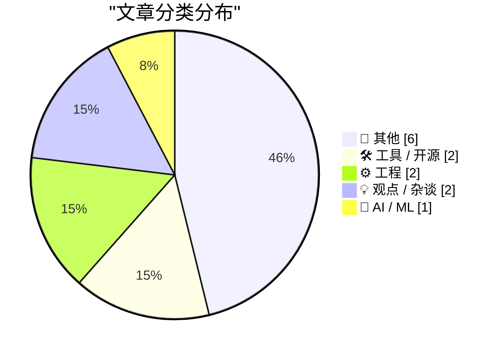
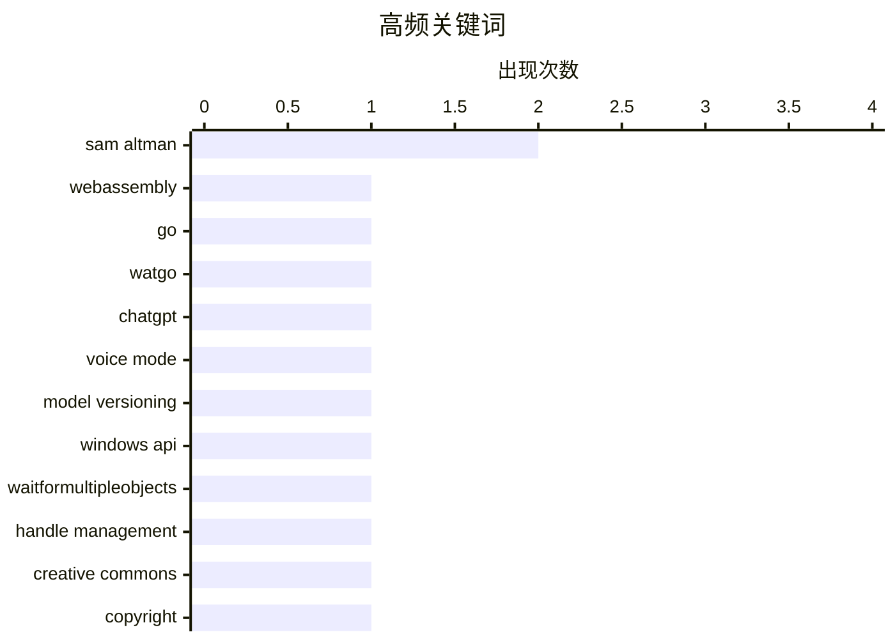

# 📰 AI 博客每日精选

**日期**: 2026-04-11 &nbsp;|&nbsp; **精选**: 13 篇 &nbsp;|&nbsp; **时间范围**: 24 小时

> 📚 来自 Karpathy 推荐的 **92** 个顶级技术博客，经 AI 智能评分筛选

## 📑 目录

- [📝 今日看点](#-今日看点)
- [🏆 今日必读](#-今日必读)
- [📊 数据概览](#-数据概览)
- [📝 其他](#-其他) (6篇)
- [🛠 工具 / 开源](#-工具---开源) (2篇)
- [⚙️ 工程](#-工程) (2篇)
- [💡 观点 / 杂谈](#-观点---杂谈) (2篇)
- [🤖 AI / ML](#-ai---ml) (1篇)

---

## 📝 今日看点

<div style="background: linear-gradient(135deg, #667eea 0%, #764ba2 100%); padding: 16px 20px; border-radius: 12px; color: white; margin: 20px 0;">

今日技术圈聚焦三大趋势：WebAssembly 工具链持续完善，Go 语言生态迎来纯 Go 编写的 watgo 项目，推动 WASM 开发民主化；AI 领域则曝出 ChatGPT 语音模式实际使用旧版模型，引发对 AI 宣传与真实能力差距的讨论；同时，软件包管理系统的元数据效率问题受关注，npm、PyPI 等注册中心面临海量版本带来的查询与分页挑战。

</div>

---

## 🏆 今日必读

### 🥇 [watgo - Go 语言的 WebAssembly 工具包](https://eli.thegreenplace.net/2026/watgo-a-webassembly-toolkit-for-go/)

<div style="display: flex; gap: 16px; flex-wrap: wrap; margin: 12px 0; font-size: 14px; color: #666;">
<span>📁 🛠 工具 / 开源</span>
<span>⏰ 21 小时前</span>
<span>⭐ 评分 25/30</span>
</div>

<div style="background: #f8f9fa; border-left: 4px solid #667eea; padding: 16px 20px; border-radius: 8px; margin: 16px 0;">

watgo 是一个纯 Go 语言编写的零依赖 WebAssembly 工具包，旨在为 Go 开发者提供类似 wabt（C++）和 wasm-tools（Rust）的功能。该项目支持 WebAssembly 模块的解析、验证和操作，填补了 Go 生态中缺乏原生 WASM 工具链的空白。作者 eliben 宣布 watgo 已正式发布，适用于需要直接在 Go 中处理 WebAssembly 二进制代码的场景。该工具包的设计目标是轻量、易用且无需外部依赖，适合集成到构建流程或运行时环境中。

</div>

**💡 为什么值得读**: 如果你在 Go 项目中需要处理 WebAssembly 文件而不依赖 C/C++ 工具链，watgo 提供了一个干净、可移植的解决方案。

**🏷️ 标签**: <span style="display:inline-block;background:#e3f2fd;color:#1976D2;padding:4px 12px;border-radius:16px;font-size:12px;margin-right:6px;">WebAssembly</span><span style="display:inline-block;background:#e3f2fd;color:#1976D2;padding:4px 12px;border-radius:16px;font-size:12px;margin-right:6px;">Go</span><span style="display:inline-block;background:#e3f2fd;color:#1976D2;padding:4px 12px;border-radius:16px;font-size:12px;margin-right:6px;">watgo</span>

---

### 🥈 [ChatGPT 语音模式使用的是较弱的模型](https://simonwillison.net/2026/Apr/10/voice-mode-is-weaker/#atom-everything)

<div style="display: flex; gap: 16px; flex-wrap: wrap; margin: 12px 0; font-size: 14px; color: #666;">
<span>📁 🤖 AI / ML</span>
<span>⏰ 8 小时前</span>
<span>⭐ 评分 24/30</span>
</div>

<div style="background: #f8f9fa; border-left: 4px solid #667eea; padding: 16px 20px; border-radius: 8px; margin: 16px 0;">

OpenAI 的 ChatGPT 语音模式实际上运行在一个较旧、性能较弱的人工智能模型上，其知识截止日期为 2024 年 4 月，属于 GPT-4o 时代之前的版本。尽管用户感觉像是在与最先进的 AI 对话，但实际能力受限于该旧模型，远不如当前旗舰模型强大。这一发现挑战了人们对语音交互 AI 应具备最高智能水平的普遍认知。作者指出，这种‘弱模型’策略可能出于成本或稳定性考虑，而非技术先进性。

</div>

**💡 为什么值得读**: 了解 ChatGPT 语音模式的真实能力边界，有助于用户更理性地评估其适用场景并避免期望落差。

**🏷️ 标签**: <span style="display:inline-block;background:#e3f2fd;color:#1976D2;padding:4px 12px;border-radius:16px;font-size:12px;margin-right:6px;">ChatGPT</span><span style="display:inline-block;background:#e3f2fd;color:#1976D2;padding:4px 12px;border-radius:16px;font-size:12px;margin-right:6px;">voice mode</span><span style="display:inline-block;background:#e3f2fd;color:#1976D2;padding:4px 12px;border-radius:16px;font-size:12px;margin-right:6px;">model versioning</span>

---

### 🥉 [如何动态添加或移除 WaitForMultipleObjects 中的句柄（续）](https://devblogs.microsoft.com/oldnewthing/20260410-00/?p=112223)

<div style="display: flex; gap: 16px; flex-wrap: wrap; margin: 12px 0; font-size: 14px; color: #666;">
<span>📁 ⚙️ 工程</span>
<span>⏰ 10 小时前</span>
<span>⭐ 评分 22/30</span>
</div>

<div style="background: #f8f9fa; border-left: 4px solid #667eea; padding: 16px 20px; border-radius: 8px; margin: 16px 0;">

本文是《如何从正在执行的 WaitForMultipleObjects 中添加或移除句柄》系列的第二部分，深入探讨了在多线程环境下修改等待对象集合时的同步问题。核心挑战在于确保等待线程能正确感知句柄列表的变化，同时避免竞态条件。解决方案涉及使用临界区、事件对象或原子操作来协调主线程与等待线程之间的状态变更。微软平台开发者在设计高并发系统时需特别注意此类底层机制。

</div>

**💡 为什么值得读**: 对于 Windows 系统级编程人员而言，掌握 WaitForMultipleObjects 的动态管理技巧能有效提升多线程程序的健壮性和响应性。

**🏷️ 标签**: <span style="display:inline-block;background:#e3f2fd;color:#1976D2;padding:4px 12px;border-radius:16px;font-size:12px;margin-right:6px;">Windows API</span><span style="display:inline-block;background:#e3f2fd;color:#1976D2;padding:4px 12px;border-radius:16px;font-size:12px;margin-right:6px;">WaitForMultipleObjects</span><span style="display:inline-block;background:#e3f2fd;color:#1976D2;padding:4px 12px;border-radius:16px;font-size:12px;margin-right:6px;">handle management</span>

---

## 📊 数据概览

<div style="display: grid; grid-template-columns: repeat(auto-fit, minmax(120px, 1fr)); gap: 12px; margin: 20px 0;">
<div style="background: #e8f4f8; padding: 16px; border-radius: 10px; text-align: center;">
<div style="font-size: 24px; font-weight: bold; color: #2196F3;">87/92</div>
<div style="font-size: 13px; color: #666; margin-top: 4px;">扫描源</div>
</div>
<div style="background: #fff3e0; padding: 16px; border-radius: 10px; text-align: center;">
<div style="font-size: 24px; font-weight: bold; color: #FF9800;">2499</div>
<div style="font-size: 13px; color: #666; margin-top: 4px;">抓取文章</div>
</div>
<div style="background: #f3e5f5; padding: 16px; border-radius: 10px; text-align: center;">
<div style="font-size: 24px; font-weight: bold; color: #9C27B0;">13</div>
<div style="font-size: 13px; color: #666; margin-top: 4px;">时间范围内</div>
</div>
<div style="background: #e8f5e9; padding: 16px; border-radius: 10px; text-align: center;">
<div style="font-size: 24px; font-weight: bold; color: #4CAF50;">13</div>
<div style="font-size: 13px; color: #666; margin-top: 4px;">AI 精选</div>
</div>
</div>

### 🥧 分类分布



### 📈 高频关键词



<details style="margin: 16px 0; padding: 12px; background: #f5f5f5; border-radius: 8px;">
<summary style="cursor: pointer; font-weight: 500;">📊 纯文本关键词图（终端友好）</summary>

```
sam altman             │ ████████████████████ 2
webassembly            │ ██████████░░░░░░░░░░ 1
go                     │ ██████████░░░░░░░░░░ 1
watgo                  │ ██████████░░░░░░░░░░ 1
chatgpt                │ ██████████░░░░░░░░░░ 1
voice mode             │ ██████████░░░░░░░░░░ 1
model versioning       │ ██████████░░░░░░░░░░ 1
windows api            │ ██████████░░░░░░░░░░ 1
waitformultipleobjects │ ██████████░░░░░░░░░░ 1
handle management      │ ██████████░░░░░░░░░░ 1
```

</details>

### 🏷️ 话题标签

<div style="line-height: 2; margin: 16px 0;">
**sam altman**(2) · **webassembly**(1) · **go**(1) · watgo(1) · chatgpt(1) · voice mode(1) · model versioning(1) · windows api(1) · waitformultipleobjects(1) · handle management(1) · creative commons(1) · copyright(1) · bidenomics(1) · package registry(1) · pagination(1) · metadata(1) · openai(1) · leadership(1) · rss(1) · atom(1)
</div>

---

<a id="-其他"></a>
## 📝 其他 <span style="background: #e0e0e0; padding: 2px 10px; border-radius: 12px; font-size: 13px; margin-left: 8px;">6篇</span>

### 1. [《恨者指南》：OpenAI 的真相](https://www.wheresyoured.at/hatersguide-openai/)

<div style="margin: 10px 0;">
<div style="display: flex; justify-content: space-between; font-size: 13px; margin-bottom: 4px;">
<span>⭐ 综合评分</span>
<span style="font-weight: bold; color: #FF9800;">18/30</span>
</div>
<div style="background: #e0e0e0; height: 8px; border-radius: 4px; overflow: hidden;">
<div style="background: #FF9800; width: 60%; height: 100%; border-radius: 4px;"></div>
</div>
</div>

<div style="display: flex; gap: 12px; flex-wrap: wrap; font-size: 13px; color: #666; margin: 12px 0;">
<span>📁 wheresyoured.at</span>
<span>⏰ 7 小时前</span>
<span>🔖 R:6 Q:5 T:7</span>
</div>

<div style="background: #fafafa; border-radius: 8px; padding: 16px; margin: 12px 0; line-height: 1.7;">
文章聚焦 OpenAI 内部治理危机，引用《纽约客》对 Sam Altman 的深度报道，揭示其在 2023 年被短暂解雇期间未能正视‘欺骗行为模式’。作者通过分析高层决策矛盾、技术路线分歧及伦理争议，质疑 OpenAI 宣称的‘安全优先’原则是否名不副实。内容涵盖董事会权力斗争、AGI 发展节奏争议以及对公众形象的操控策略。
</div>

<div style="margin: 12px 0;">
<span style="display: inline-block; background: #e3f2fd; color: #1976D2; padding: 4px 12px; border-radius: 16px; font-size: 12px; margin-right: 6px; margin-bottom: 4px;">OpenAI</span><span style="display: inline-block; background: #e3f2fd; color: #1976D2; padding: 4px 12px; border-radius: 16px; font-size: 12px; margin-right: 6px; margin-bottom: 4px;">Sam Altman</span><span style="display: inline-block; background: #e3f2fd; color: #1976D2; padding: 4px 12px; border-radius: 16px; font-size: 12px; margin-right: 6px; margin-bottom: 4px;">leadership</span>
</div>

---

### 2. [分数的小数表示中数字的分布规律](https://www.johndcook.com/blog/2026/04/10/fraction-digits/)

<div style="margin: 10px 0;">
<div style="display: flex; justify-content: space-between; font-size: 13px; margin-bottom: 4px;">
<span>⭐ 综合评分</span>
<span style="font-weight: bold; color: #f44336;">15/30</span>
</div>
<div style="background: #e0e0e0; height: 8px; border-radius: 4px; overflow: hidden;">
<div style="background: #f44336; width: 50%; height: 100%; border-radius: 4px;"></div>
</div>
</div>

<div style="display: flex; gap: 12px; flex-wrap: wrap; font-size: 13px; color: #666; margin: 12px 0;">
<span>📁 johndcook.com</span>
<span>⏰ 9 小时前</span>
<span>🔖 R:4 Q:7 T:4</span>
</div>

<div style="background: #fafafa; border-radius: 8px; padding: 16px; margin: 12px 0; line-height: 1.7;">
约翰·D·库克通过数学分析揭示了一个有趣现象：大于 5 的分数 p/q 的小数形式中，各数字的出现频率并非均匀分布。具体而言，某些数字出现的概率显著高于其他数字，这与直觉相悖。研究利用模运算和数论方法推导出特定条件下数字分布的偏差规律，展示了基础数学中隐藏的精妙结构。
</div>

<div style="margin: 12px 0;">
<span style="display: inline-block; background: #e3f2fd; color: #1976D2; padding: 4px 12px; border-radius: 16px; font-size: 12px; margin-right: 6px; margin-bottom: 4px;">decimal digits</span><span style="display: inline-block; background: #e3f2fd; color: #1976D2; padding: 4px 12px; border-radius: 16px; font-size: 12px; margin-right: 6px; margin-bottom: 4px;">fractions</span><span style="display: inline-block; background: #e3f2fd; color: #1976D2; padding: 4px 12px; border-radius: 16px; font-size: 12px; margin-right: 6px; margin-bottom: 4px;">mathematics</span>
</div>

---

### 3. [荷兰乌得勒支苹果博物馆](https://applemuseum.nl/)

<div style="margin: 10px 0;">
<div style="display: flex; justify-content: space-between; font-size: 13px; margin-bottom: 4px;">
<span>⭐ 综合评分</span>
<span style="font-weight: bold; color: #f44336;">13/30</span>
</div>
<div style="background: #e0e0e0; height: 8px; border-radius: 4px; overflow: hidden;">
<div style="background: #f44336; width: 43%; height: 100%; border-radius: 4px;"></div>
</div>
</div>

<div style="display: flex; gap: 12px; flex-wrap: wrap; font-size: 13px; color: #666; margin: 12px 0;">
<span>📁 daringfireball.net</span>
<span>⏰ 7 小时前</span>
<span>🔖 R:2 Q:5 T:6</span>
</div>

<div style="background: #fafafa; border-radius: 8px; padding: 16px; margin: 12px 0; line-height: 1.7;">
位于荷兰乌得勒支的新建苹果博物馆令人惊叹，其中最引人注目的是那面由彩虹色 iMac 组成的墙面，完整呈现了苹果产品的视觉演变史。博物馆收藏了大量经典 Macintosh 机型、早期 iPod 原型及周边设备，生动还原了苹果公司从车库创业到全球科技巨头的历程。参观者可通过互动装置深入了解 Mac OS 系统发展史与工业设计哲学。
</div>

<div style="margin: 12px 0;">
<span style="display: inline-block; background: #e3f2fd; color: #1976D2; padding: 4px 12px; border-radius: 16px; font-size: 12px; margin-right: 6px; margin-bottom: 4px;">Apple Museum</span><span style="display: inline-block; background: #e3f2fd; color: #1976D2; padding: 4px 12px; border-radius: 16px; font-size: 12px; margin-right: 6px; margin-bottom: 4px;">Utrecht</span><span style="display: inline-block; background: #e3f2fd; color: #1976D2; padding: 4px 12px; border-radius: 16px; font-size: 12px; margin-right: 6px; margin-bottom: 4px;">iMac</span>
</div>

---

### 4. [The Solitaire Shuffle](https://feed.tedium.co/link/15204/17316812/solitaire-card-game-types-history)

<div style="margin: 10px 0;">
<div style="display: flex; justify-content: space-between; font-size: 13px; margin-bottom: 4px;">
<span>⭐ 综合评分</span>
<span style="font-weight: bold; color: #f44336;">10/30</span>
</div>
<div style="background: #e0e0e0; height: 8px; border-radius: 4px; overflow: hidden;">
<div style="background: #f44336; width: 33%; height: 100%; border-radius: 4px;"></div>
</div>
</div>

<div style="display: flex; gap: 12px; flex-wrap: wrap; font-size: 13px; color: #666; margin: 12px 0;">
<span>📁 tedium.co</span>
<span>⏰ 20 小时前</span>
<span>🔖 R:2 Q:5 T:3</span>
</div>

<div style="background: #fafafa; border-radius: 8px; padding: 16px; margin: 12px 0; line-height: 1.7;">
A meditation on the game of Solitaire and its endless variations, which go well beyond what you can find in Windows 3.1.
</div>

<div style="margin: 12px 0;">
<span style="display: inline-block; background: #e3f2fd; color: #1976D2; padding: 4px 12px; border-radius: 16px; font-size: 12px; margin-right: 6px; margin-bottom: 4px;">Solitaire</span><span style="display: inline-block; background: #e3f2fd; color: #1976D2; padding: 4px 12px; border-radius: 16px; font-size: 12px; margin-right: 6px; margin-bottom: 4px;">game design</span><span style="display: inline-block; background: #e3f2fd; color: #1976D2; padding: 4px 12px; border-radius: 16px; font-size: 12px; margin-right: 6px; margin-bottom: 4px;">variations</span>
</div>

---

### 5. [Intel 486 CPU announced April 10, 1989](https://dfarq.homeip.net/intel-486-cpu-announced-april-10-1989/?utm_source=rss&#038;utm_medium=rss&#038;utm_campaign=intel-486-cpu-announced-april-10-1989)

<div style="margin: 10px 0;">
<div style="display: flex; justify-content: space-between; font-size: 13px; margin-bottom: 4px;">
<span>⭐ 综合评分</span>
<span style="font-weight: bold; color: #f44336;">9/30</span>
</div>
<div style="background: #e0e0e0; height: 8px; border-radius: 4px; overflow: hidden;">
<div style="background: #f44336; width: 30%; height: 100%; border-radius: 4px;"></div>
</div>
</div>

<div style="display: flex; gap: 12px; flex-wrap: wrap; font-size: 13px; color: #666; margin: 12px 0;">
<span>📁 dfarq.homeip.net</span>
<span>⏰ 13 小时前</span>
<span>🔖 R:3 Q:4 T:2</span>
</div>

<div style="background: #fafafa; border-radius: 8px; padding: 16px; margin: 12px 0; line-height: 1.7;">
Intel announced the 486 CPU at Comdex on April 10, 1989. It was an expensive chip, priced at $950 each in quantities of 1,000. I thought it would be fun to look back at what the magazines at the time

</div>

<div style="margin: 12px 0;">
<span style="display: inline-block; background: #e3f2fd; color: #1976D2; padding: 4px 12px; border-radius: 16px; font-size: 12px; margin-right: 6px; margin-bottom: 4px;">Intel 486</span><span style="display: inline-block; background: #e3f2fd; color: #1976D2; padding: 4px 12px; border-radius: 16px; font-size: 12px; margin-right: 6px; margin-bottom: 4px;">CPU history</span><span style="display: inline-block; background: #e3f2fd; color: #1976D2; padding: 4px 12px; border-radius: 16px; font-size: 12px; margin-right: 6px; margin-bottom: 4px;">retro computing</span>
</div>

---

### 6. [Kākāpō parrots](https://simonwillison.net/2026/Apr/10/kakapo/#atom-everything)

<div style="margin: 10px 0;">
<div style="display: flex; justify-content: space-between; font-size: 13px; margin-bottom: 4px;">
<span>⭐ 综合评分</span>
<span style="font-weight: bold; color: #f44336;">6/30</span>
</div>
<div style="background: #e0e0e0; height: 8px; border-radius: 4px; overflow: hidden;">
<div style="background: #f44336; width: 20%; height: 100%; border-radius: 4px;"></div>
</div>
</div>

<div style="display: flex; gap: 12px; flex-wrap: wrap; font-size: 13px; color: #666; margin: 12px 0;">
<span>📁 simonwillison.net</span>
<span>⏰ 5 小时前</span>
<span>🔖 R:1 Q:3 T:2</span>
</div>

<div style="background: #fafafa; border-radius: 8px; padding: 16px; margin: 12px 0; line-height: 1.7;">
<p>Lenny <a href="https://twitter.com/lennysan/status/2042615413494939943">posted</a> another snippet from <a href="https://simonwillison.net/2026/Apr/2/lennys-podcast/">our 1 hour 40 minute podcast r
</div>

<div style="margin: 12px 0;">
<span style="display: inline-block; background: #e3f2fd; color: #1976D2; padding: 4px 12px; border-radius: 16px; font-size: 12px; margin-right: 6px; margin-bottom: 4px;">kakapo</span><span style="display: inline-block; background: #e3f2fd; color: #1976D2; padding: 4px 12px; border-radius: 16px; font-size: 12px; margin-right: 6px; margin-bottom: 4px;">parrots</span><span style="display: inline-block; background: #e3f2fd; color: #1976D2; padding: 4px 12px; border-radius: 16px; font-size: 12px; margin-right: 6px; margin-bottom: 4px;">podcast</span>
</div>

---

<a id="-工具---开源"></a>
## 🛠 工具 / 开源 <span style="background: #e0e0e0; padding: 2px 10px; border-radius: 12px; font-size: 13px; margin-left: 8px;">2篇</span>

### 7. [watgo - Go 语言的 WebAssembly 工具包](https://eli.thegreenplace.net/2026/watgo-a-webassembly-toolkit-for-go/)

<div style="margin: 10px 0;">
<div style="display: flex; justify-content: space-between; font-size: 13px; margin-bottom: 4px;">
<span>⭐ 综合评分</span>
<span style="font-weight: bold; color: #4CAF50;">25/30</span>
</div>
<div style="background: #e0e0e0; height: 8px; border-radius: 4px; overflow: hidden;">
<div style="background: #4CAF50; width: 83%; height: 100%; border-radius: 4px;"></div>
</div>
</div>

<div style="display: flex; gap: 12px; flex-wrap: wrap; font-size: 13px; color: #666; margin: 12px 0;">
<span>📁 eli.thegreenplace.net</span>
<span>⏰ 21 小时前</span>
<span>🔖 R:8 Q:8 T:9</span>
</div>

<div style="background: #fafafa; border-radius: 8px; padding: 16px; margin: 12px 0; line-height: 1.7;">
watgo 是一个纯 Go 语言编写的零依赖 WebAssembly 工具包，旨在为 Go 开发者提供类似 wabt（C++）和 wasm-tools（Rust）的功能。该项目支持 WebAssembly 模块的解析、验证和操作，填补了 Go 生态中缺乏原生 WASM 工具链的空白。作者 eliben 宣布 watgo 已正式发布，适用于需要直接在 Go 中处理 WebAssembly 二进制代码的场景。该工具包的设计目标是轻量、易用且无需外部依赖，适合集成到构建流程或运行时环境中。
</div>

<div style="margin: 12px 0;">
<span style="display: inline-block; background: #e3f2fd; color: #1976D2; padding: 4px 12px; border-radius: 16px; font-size: 12px; margin-right: 6px; margin-bottom: 4px;">WebAssembly</span><span style="display: inline-block; background: #e3f2fd; color: #1976D2; padding: 4px 12px; border-radius: 16px; font-size: 12px; margin-right: 6px; margin-bottom: 4px;">Go</span><span style="display: inline-block; background: #e3f2fd; color: #1976D2; padding: 4px 12px; border-radius: 16px; font-size: 12px; margin-right: 6px; margin-bottom: 4px;">watgo</span>
</div>

---

### 8. [RSS Club：为何选择 RSS 而非 Atom？](https://shkspr.mobi/blog/2026/04/rss-club-why-do-you-use-rss-rather-than-atom/)

<div style="margin: 10px 0;">
<div style="display: flex; justify-content: space-between; font-size: 13px; margin-bottom: 4px;">
<span>⭐ 综合评分</span>
<span style="font-weight: bold; color: #f44336;">17/30</span>
</div>
<div style="background: #e0e0e0; height: 8px; border-radius: 4px; overflow: hidden;">
<div style="background: #f44336; width: 57%; height: 100%; border-radius: 4px;"></div>
</div>
</div>

<div style="display: flex; gap: 12px; flex-wrap: wrap; font-size: 13px; color: #666; margin: 12px 0;">
<span>📁 shkspr.mobi</span>
<span>⏰ 12 小时前</span>
<span>🔖 R:5 Q:6 T:6</span>
</div>

<div style="background: #fafafa; border-radius: 8px; padding: 16px; margin: 12px 0; line-height: 1.7;">
博主发起名为‘RSS Club’的实验，探讨为何多数人仍偏好使用 RSS 协议而非 Atom。他认为尽管两者均为 XML 格式，但 RSS 拥有更广泛的客户端支持和社区惯性。文章还介绍了本地隐私友好的阅读追踪系统，可统计来自 Hacker News 或 Google 等平台的点击数据，并展示每篇文章的独立浏览量。实验目标是在保持去中心化优势的同时增强可读性与隐私保护。
</div>

<div style="margin: 12px 0;">
<span style="display: inline-block; background: #e3f2fd; color: #1976D2; padding: 4px 12px; border-radius: 16px; font-size: 12px; margin-right: 6px; margin-bottom: 4px;">RSS</span><span style="display: inline-block; background: #e3f2fd; color: #1976D2; padding: 4px 12px; border-radius: 16px; font-size: 12px; margin-right: 6px; margin-bottom: 4px;">Atom</span><span style="display: inline-block; background: #e3f2fd; color: #1976D2; padding: 4px 12px; border-radius: 16px; font-size: 12px; margin-right: 6px; margin-bottom: 4px;">privacy</span>
</div>

---

<a id="-工程"></a>
## ⚙️ 工程 <span style="background: #e0e0e0; padding: 2px 10px; border-radius: 12px; font-size: 13px; margin-left: 8px;">2篇</span>

### 9. [如何动态添加或移除 WaitForMultipleObjects 中的句柄（续）](https://devblogs.microsoft.com/oldnewthing/20260410-00/?p=112223)

<div style="margin: 10px 0;">
<div style="display: flex; justify-content: space-between; font-size: 13px; margin-bottom: 4px;">
<span>⭐ 综合评分</span>
<span style="font-weight: bold; color: #FF9800;">22/30</span>
</div>
<div style="background: #e0e0e0; height: 8px; border-radius: 4px; overflow: hidden;">
<div style="background: #FF9800; width: 73%; height: 100%; border-radius: 4px;"></div>
</div>
</div>

<div style="display: flex; gap: 12px; flex-wrap: wrap; font-size: 13px; color: #666; margin: 12px 0;">
<span>📁 devblogs.microsoft.com/oldnewthing</span>
<span>⏰ 10 小时前</span>
<span>🔖 R:7 Q:8 T:7</span>
</div>

<div style="background: #fafafa; border-radius: 8px; padding: 16px; margin: 12px 0; line-height: 1.7;">
本文是《如何从正在执行的 WaitForMultipleObjects 中添加或移除句柄》系列的第二部分，深入探讨了在多线程环境下修改等待对象集合时的同步问题。核心挑战在于确保等待线程能正确感知句柄列表的变化，同时避免竞态条件。解决方案涉及使用临界区、事件对象或原子操作来协调主线程与等待线程之间的状态变更。微软平台开发者在设计高并发系统时需特别注意此类底层机制。
</div>

<div style="margin: 12px 0;">
<span style="display: inline-block; background: #e3f2fd; color: #1976D2; padding: 4px 12px; border-radius: 16px; font-size: 12px; margin-right: 6px; margin-bottom: 4px;">Windows API</span><span style="display: inline-block; background: #e3f2fd; color: #1976D2; padding: 4px 12px; border-radius: 16px; font-size: 12px; margin-right: 6px; margin-bottom: 4px;">WaitForMultipleObjects</span><span style="display: inline-block; background: #e3f2fd; color: #1976D2; padding: 4px 12px; border-radius: 16px; font-size: 12px; margin-right: 6px; margin-bottom: 4px;">handle management</span>
</div>

---

### 10. [软件包注册中心与分页机制](https://nesbitt.io/2026/04/10/package-registries-and-pagination.html)

<div style="margin: 10px 0;">
<div style="display: flex; justify-content: space-between; font-size: 13px; margin-bottom: 4px;">
<span>⭐ 综合评分</span>
<span style="font-weight: bold; color: #FF9800;">18/30</span>
</div>
<div style="background: #e0e0e0; height: 8px; border-radius: 4px; overflow: hidden;">
<div style="background: #FF9800; width: 60%; height: 100%; border-radius: 4px;"></div>
</div>
</div>

<div style="display: flex; gap: 12px; flex-wrap: wrap; font-size: 13px; color: #666; margin: 12px 0;">
<span>📁 nesbitt.io</span>
<span>⏰ 14 小时前</span>
<span>🔖 R:6 Q:6 T:6</span>
</div>

<div style="background: #fafafa; border-radius: 8px; padding: 16px; margin: 12px 0; line-height: 1.7;">
文章分析了主流软件包注册中心在处理大规模元数据时的分页策略，指出仅 10,451 个版本就产生高达 100MB 的元数据负载。作者探讨了不同注册中心（如 npm、PyPI）在查询效率、缓存机制和分页接口设计上的差异，并提出优化建议以减少带宽消耗和提升用户体验。研究表明，合理的分页粒度与索引策略对缓解元数据膨胀至关重要。
</div>

<div style="margin: 12px 0;">
<span style="display: inline-block; background: #e3f2fd; color: #1976D2; padding: 4px 12px; border-radius: 16px; font-size: 12px; margin-right: 6px; margin-bottom: 4px;">package registry</span><span style="display: inline-block; background: #e3f2fd; color: #1976D2; padding: 4px 12px; border-radius: 16px; font-size: 12px; margin-right: 6px; margin-bottom: 4px;">pagination</span><span style="display: inline-block; background: #e3f2fd; color: #1976D2; padding: 4px 12px; border-radius: 16px; font-size: 12px; margin-right: 6px; margin-bottom: 4px;">metadata</span>
</div>

---

<a id="-观点---杂谈"></a>
## 💡 观点 / 杂谈 <span style="background: #e0e0e0; padding: 2px 10px; border-radius: 12px; font-size: 13px; margin-left: 8px;">2篇</span>

### 11. [Pluralistic：坎尼谷效应与知识共享（2026年4月10日）](https://pluralistic.net/2026/04/10/canny-valley/)

<div style="margin: 10px 0;">
<div style="display: flex; justify-content: space-between; font-size: 13px; margin-bottom: 4px;">
<span>⭐ 综合评分</span>
<span style="font-weight: bold; color: #FF9800;">21/30</span>
</div>
<div style="background: #e0e0e0; height: 8px; border-radius: 4px; overflow: hidden;">
<div style="background: #FF9800; width: 70%; height: 100%; border-radius: 4px;"></div>
</div>
</div>

<div style="display: flex; gap: 12px; flex-wrap: wrap; font-size: 13px; color: #666; margin: 12px 0;">
<span>📁 pluralistic.net</span>
<span>⏰ 14 小时前</span>
<span>🔖 R:6 Q:8 T:7</span>
</div>

<div style="background: #fafafa; border-radius: 8px; padding: 16px; margin: 12px 0; line-height: 1.7;">
这篇文章围绕创意产业中的‘坎尼谷效应’展开讨论，即过度拟真反而引发反感，强调真正有价值的创作应超越表面模仿。作者批评当前版权制度助长‘版权蟑螂’对创作者的骚扰，主张强化 Creative Commons 等开放授权模式以保护表达自由。文中还提及拜登经济政策、Al Franken 的财政平衡理念以及艺术作为洗钱工具的现象，呼吁社会重新思考知识产权的本质。
</div>

<div style="margin: 12px 0;">
<span style="display: inline-block; background: #e3f2fd; color: #1976D2; padding: 4px 12px; border-radius: 16px; font-size: 12px; margin-right: 6px; margin-bottom: 4px;">Creative Commons</span><span style="display: inline-block; background: #e3f2fd; color: #1976D2; padding: 4px 12px; border-radius: 16px; font-size: 12px; margin-right: 6px; margin-bottom: 4px;">copyright</span><span style="display: inline-block; background: #e3f2fd; color: #1976D2; padding: 4px 12px; border-radius: 16px; font-size: 12px; margin-right: 6px; margin-bottom: 4px;">Bidenomics</span>
</div>

---

### 12. [让我们学会在生者生前表达敬意](https://daringfireball.net/2026/04/when_he_is_alive_and_not_after_he_is_dead)

<div style="margin: 10px 0;">
<div style="display: flex; justify-content: space-between; font-size: 13px; margin-bottom: 4px;">
<span>⭐ 综合评分</span>
<span style="font-weight: bold; color: #f44336;">12/30</span>
</div>
<div style="background: #e0e0e0; height: 8px; border-radius: 4px; overflow: hidden;">
<div style="background: #f44336; width: 40%; height: 100%; border-radius: 4px;"></div>
</div>
</div>

<div style="display: flex; gap: 12px; flex-wrap: wrap; font-size: 13px; color: #666; margin: 12px 0;">
<span>📁 daringfireball.net</span>
<span>⏰ 2 小时前</span>
<span>🔖 R:3 Q:4 T:5</span>
</div>

<div style="background: #fafafa; border-radius: 8px; padding: 16px; margin: 12px 0; line-height: 1.7;">
针对《纽约客》对 Sam Altman 的长篇报道，作者反思媒体对待科技领袖的叙事方式——往往在对方失势后才进行道德审判。文章呼吁公众在人物尚在世时就公正评价其贡献与缺陷，避免陷入非黑即白的英雄/反派框架。这种态度不仅关乎个体尊重，也影响公众对科技行业的整体认知。
</div>

<div style="margin: 12px 0;">
<span style="display: inline-block; background: #e3f2fd; color: #1976D2; padding: 4px 12px; border-radius: 16px; font-size: 12px; margin-right: 6px; margin-bottom: 4px;">Sam Altman</span><span style="display: inline-block; background: #e3f2fd; color: #1976D2; padding: 4px 12px; border-radius: 16px; font-size: 12px; margin-right: 6px; margin-bottom: 4px;">New Yorker</span><span style="display: inline-block; background: #e3f2fd; color: #1976D2; padding: 4px 12px; border-radius: 16px; font-size: 12px; margin-right: 6px; margin-bottom: 4px;">profile</span>
</div>

---

<a id="-ai---ml"></a>
## 🤖 AI / ML <span style="background: #e0e0e0; padding: 2px 10px; border-radius: 12px; font-size: 13px; margin-left: 8px;">1篇</span>

### 13. [ChatGPT 语音模式使用的是较弱的模型](https://simonwillison.net/2026/Apr/10/voice-mode-is-weaker/#atom-everything)

<div style="margin: 10px 0;">
<div style="display: flex; justify-content: space-between; font-size: 13px; margin-bottom: 4px;">
<span>⭐ 综合评分</span>
<span style="font-weight: bold; color: #4CAF50;">24/30</span>
</div>
<div style="background: #e0e0e0; height: 8px; border-radius: 4px; overflow: hidden;">
<div style="background: #4CAF50; width: 80%; height: 100%; border-radius: 4px;"></div>
</div>
</div>

<div style="display: flex; gap: 12px; flex-wrap: wrap; font-size: 13px; color: #666; margin: 12px 0;">
<span>📁 simonwillison.net</span>
<span>⏰ 8 小时前</span>
<span>🔖 R:8 Q:7 T:9</span>
</div>

<div style="background: #fafafa; border-radius: 8px; padding: 16px; margin: 12px 0; line-height: 1.7;">
OpenAI 的 ChatGPT 语音模式实际上运行在一个较旧、性能较弱的人工智能模型上，其知识截止日期为 2024 年 4 月，属于 GPT-4o 时代之前的版本。尽管用户感觉像是在与最先进的 AI 对话，但实际能力受限于该旧模型，远不如当前旗舰模型强大。这一发现挑战了人们对语音交互 AI 应具备最高智能水平的普遍认知。作者指出，这种‘弱模型’策略可能出于成本或稳定性考虑，而非技术先进性。
</div>

<div style="margin: 12px 0;">
<span style="display: inline-block; background: #e3f2fd; color: #1976D2; padding: 4px 12px; border-radius: 16px; font-size: 12px; margin-right: 6px; margin-bottom: 4px;">ChatGPT</span><span style="display: inline-block; background: #e3f2fd; color: #1976D2; padding: 4px 12px; border-radius: 16px; font-size: 12px; margin-right: 6px; margin-bottom: 4px;">voice mode</span><span style="display: inline-block; background: #e3f2fd; color: #1976D2; padding: 4px 12px; border-radius: 16px; font-size: 12px; margin-right: 6px; margin-bottom: 4px;">model versioning</span>
</div>

---


<div style="text-align: center; color: #888; font-size: 13px; padding: 20px; border-top: 1px solid #e0e0e0; margin-top: 30px;">
生成于 2026-04-11 00:12 | 扫描 <strong>87</strong> 源 → 获取 <strong>2499</strong> 篇 → 精选 <strong>13</strong> 篇
<br>
基于 <a href="https://refactoringenglish.com/tools/hn-popularity/" style="color: #667eea;">Hacker News Popularity Contest 2025</a> RSS 源列表，由 <a href="https://x.com/karpathy" style="color: #667eea;">Andrej Karpathy</a> 推荐
<br>
由「懂点儿 AI」制作，欢迎关注同名微信公众号获取更多 AI 实用技巧 💡
</div>
