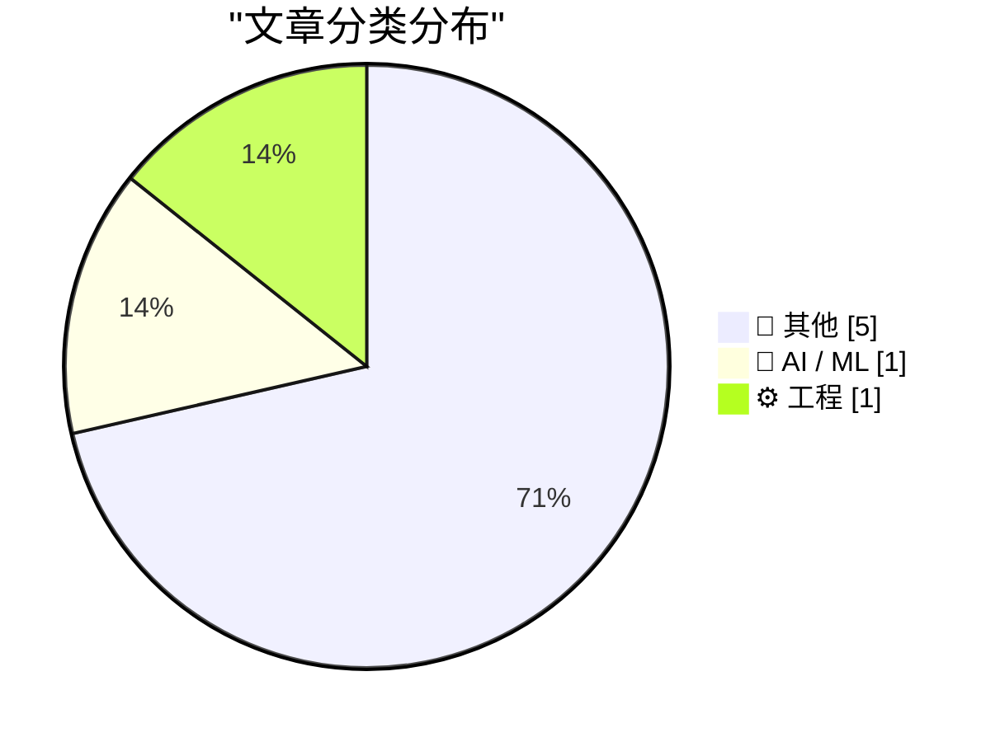
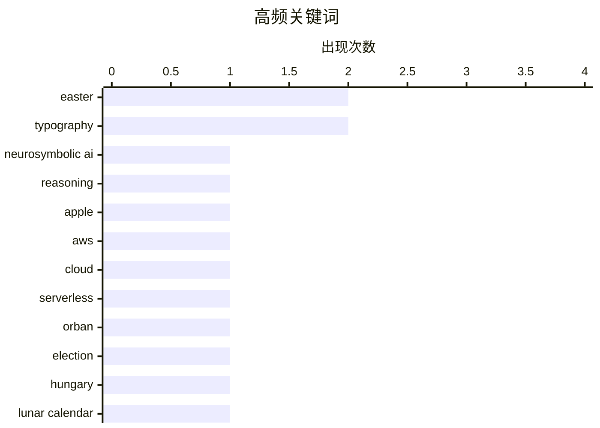

# 📰 AI 博客每日精选

**日期**: 2026-04-13 &nbsp;|&nbsp; **精选**: 7 篇 &nbsp;|&nbsp; **时间范围**: 24 小时

> 📚 来自 Karpathy 推荐的 **92** 个顶级技术博客，经 AI 智能评分筛选

## 📑 目录

- [📝 今日看点](#-今日看点)
- [🏆 今日必读](#-今日必读)
- [📊 数据概览](#-数据概览)
- [📝 其他](#-其他) (5篇)
- [🤖 AI / ML](#-ai---ml) (1篇)
- [⚙️ 工程](#-工程) (1篇)

---

## 📝 今日看点

<div style="background: linear-gradient(135deg, #667eea 0%, #764ba2 100%); padding: 16px 20px; border-radius: 12px; color: white; margin: 20px 0;">

今日技术圈聚焦三大趋势：神经符号AI成为前沿热点，其在融合神经网络与符号推理方面展现突破潜力；云计算服务优化持续受关注，AWS等平台的资源命名混乱问题引发开发者对使用体验的讨论；同时，设计领域迎来创新突破，Zed字体系统通过科学测试验证其在视障人群阅读场景中的显著优势。

</div>

---

## 🏆 今日必读

### 🥇 [神经符号 AI 的未来迎来更多好消息](https://garymarcus.substack.com/p/even-more-good-news-for-the-future)

<div style="display: flex; gap: 16px; flex-wrap: wrap; margin: 12px 0; font-size: 14px; color: #666;">
<span>📁 🤖 AI / ML</span>
<span>⏰ 8 小时前</span>
<span>⭐ 评分 26/30</span>
</div>

<div style="background: #f8f9fa; border-left: 4px solid #667eea; padding: 16px 20px; border-radius: 8px; margin: 16px 0;">

文章探讨了神经符号人工智能（neurosymbolic AI）的发展前景，指出其在结合神经网络的学习能力与符号系统的推理能力方面展现出巨大潜力。作者认为，尽管早期对苹果2025年提出的“推理”论文存在误解和批评，但当前进展正逐步验证其前瞻性观点。通过具体案例说明神经符号系统在复杂任务中的优势，如提升可解释性和逻辑一致性。最终，作者强调这一融合方向有望推动AI向更智能、可靠的方向演进。

</div>

**💡 为什么值得读**: 如果你关注AI发展趋势，这篇文章提供了对神经符号AI未来潜力的乐观展望，并澄清了对苹果相关研究的误读，值得技术决策者和研究者一读。

**🏷️ 标签**: <span style="display:inline-block;background:#e3f2fd;color:#1976D2;padding:4px 12px;border-radius:16px;font-size:12px;margin-right:6px;">neurosymbolic AI</span><span style="display:inline-block;background:#e3f2fd;color:#1976D2;padding:4px 12px;border-radius:16px;font-size:12px;margin-right:6px;">reasoning</span><span style="display:inline-block;background:#e3f2fd;color:#1976D2;padding:4px 12px;border-radius:16px;font-size:12px;margin-right:6px;">Apple</span>

---

### 🥈 [你的 AWS 证书让你成了 AWS 销售员](https://idiallo.com/byte-size/we-are-aws-salesmen?src=feed)

<div style="display: flex; gap: 16px; flex-wrap: wrap; margin: 12px 0; font-size: 14px; color: #666;">
<span>📁 ⚙️ 工程</span>
<span>⏰ 6 小时前</span>
<span>⭐ 评分 24/30</span>
</div>

<div style="background: #f8f9fa; border-left: 4px solid #667eea; padding: 16px 20px; border-radius: 8px; margin: 16px 0;">

作者回顾了自己曾对 AWS 控制台功能混乱的困惑，尤其是不清楚如何搭建静态网站。经过探索发现，EC2（弹性计算云实例）是托管静态网站的合适服务。文章揭示了 AWS 服务命名体系虽庞大，但核心资源如 EC2 实际上承担了传统服务器角色，帮助用户理解云服务架构本质。

</div>

**💡 为什么值得读**: 对于刚接触 AWS 的开发者来说，这篇文章以亲身经历拆解了常见服务的使用场景，能有效降低学习门槛，避免被复杂界面误导。

**🏷️ 标签**: <span style="display:inline-block;background:#e3f2fd;color:#1976D2;padding:4px 12px;border-radius:16px;font-size:12px;margin-right:6px;">AWS</span><span style="display:inline-block;background:#e3f2fd;color:#1976D2;padding:4px 12px;border-radius:16px;font-size:12px;margin-right:6px;">cloud</span><span style="display:inline-block;background:#e3f2fd;color:#1976D2;padding:4px 12px;border-radius:16px;font-size:12px;margin-right:6px;">serverless</span>

---

### 🥉 [匈牙利总理欧尔班败选，承认失败并祝贺对手](https://www.nytimes.com/2026/04/12/world/europe/hungary-election-orban-magyar.html)

<div style="display: flex; gap: 16px; flex-wrap: wrap; margin: 12px 0; font-size: 14px; color: #666;">
<span>📁 📝 其他</span>
<span>⏰ 2 小时前</span>
<span>⭐ 评分 17/30</span>
</div>

<div style="background: #f8f9fa; border-left: 4px solid #667eea; padding: 16px 20px; border-radius: 8px; margin: 16px 0;">

匈牙利总理维克托·欧尔班在2026年4月的选举中意外落败，他公开承认败选并向反对派领导人彼得·马耶尔表示祝贺。尽管他承诺永不放弃政治斗争，但此次失利标志着其长期执政时代的终结。马耶尔作为前欧尔班阵营成员及主要反对党领袖，将接任总理职务。

</div>

**💡 为什么值得读**: 这场选举结果反映了欧洲政治格局的重要变化，尤其对东欧民主进程具有象征意义，值得关注地缘政治的读者了解。

**🏷️ 标签**: <span style="display:inline-block;background:#e3f2fd;color:#1976D2;padding:4px 12px;border-radius:16px;font-size:12px;margin-right:6px;">Orban</span><span style="display:inline-block;background:#e3f2fd;color:#1976D2;padding:4px 12px;border-radius:16px;font-size:12px;margin-right:6px;">election</span><span style="display:inline-block;background:#e3f2fd;color:#1976D2;padding:4px 12px;border-radius:16px;font-size:12px;margin-right:6px;">Hungary</span>

---

## 📊 数据概览

<div style="display: grid; grid-template-columns: repeat(auto-fit, minmax(120px, 1fr)); gap: 12px; margin: 20px 0;">
<div style="background: #e8f4f8; padding: 16px; border-radius: 10px; text-align: center;">
<div style="font-size: 24px; font-weight: bold; color: #2196F3;">87/92</div>
<div style="font-size: 13px; color: #666; margin-top: 4px;">扫描源</div>
</div>
<div style="background: #fff3e0; padding: 16px; border-radius: 10px; text-align: center;">
<div style="font-size: 24px; font-weight: bold; color: #FF9800;">2514</div>
<div style="font-size: 13px; color: #666; margin-top: 4px;">抓取文章</div>
</div>
<div style="background: #f3e5f5; padding: 16px; border-radius: 10px; text-align: center;">
<div style="font-size: 24px; font-weight: bold; color: #9C27B0;">7</div>
<div style="font-size: 13px; color: #666; margin-top: 4px;">时间范围内</div>
</div>
<div style="background: #e8f5e9; padding: 16px; border-radius: 10px; text-align: center;">
<div style="font-size: 24px; font-weight: bold; color: #4CAF50;">7</div>
<div style="font-size: 13px; color: #666; margin-top: 4px;">AI 精选</div>
</div>
</div>

### 🥧 分类分布



### 📈 高频关键词



<details style="margin: 16px 0; padding: 12px; background: #f5f5f5; border-radius: 8px;">
<summary style="cursor: pointer; font-weight: 500;">📊 纯文本关键词图（终端友好）</summary>

```
easter           │ ████████████████████ 2
typography       │ ████████████████████ 2
neurosymbolic ai │ ██████████░░░░░░░░░░ 1
reasoning        │ ██████████░░░░░░░░░░ 1
apple            │ ██████████░░░░░░░░░░ 1
aws              │ ██████████░░░░░░░░░░ 1
cloud            │ ██████████░░░░░░░░░░ 1
serverless       │ ██████████░░░░░░░░░░ 1
orban            │ ██████████░░░░░░░░░░ 1
election         │ ██████████░░░░░░░░░░ 1
```

</details>

### 🏷️ 话题标签

<div style="line-height: 2; margin: 16px 0;">
**easter**(2) · **typography**(2) · **neurosymbolic ai**(1) · reasoning(1) · apple(1) · aws(1) · cloud(1) · serverless(1) · orban(1) · election(1) · hungary(1) · lunar calendar(1) · astronomy(1) · eastern orthodox(1) · calendar(1) · zed(1) · font(1) · bus tickets(1) · graphic design(1)
</div>

---

<a id="-其他"></a>
## 📝 其他 <span style="background: #e0e0e0; padding: 2px 10px; border-radius: 12px; font-size: 13px; margin-left: 8px;">5篇</span>

### 1. [匈牙利总理欧尔班败选，承认失败并祝贺对手](https://www.nytimes.com/2026/04/12/world/europe/hungary-election-orban-magyar.html)

<div style="margin: 10px 0;">
<div style="display: flex; justify-content: space-between; font-size: 13px; margin-bottom: 4px;">
<span>⭐ 综合评分</span>
<span style="font-weight: bold; color: #f44336;">17/30</span>
</div>
<div style="background: #e0e0e0; height: 8px; border-radius: 4px; overflow: hidden;">
<div style="background: #f44336; width: 57%; height: 100%; border-radius: 4px;"></div>
</div>
</div>

<div style="display: flex; gap: 12px; flex-wrap: wrap; font-size: 13px; color: #666; margin: 12px 0;">
<span>📁 daringfireball.net</span>
<span>⏰ 2 小时前</span>
<span>🔖 R:2 Q:7 T:8</span>
</div>

<div style="background: #fafafa; border-radius: 8px; padding: 16px; margin: 12px 0; line-height: 1.7;">
匈牙利总理维克托·欧尔班在2026年4月的选举中意外落败，他公开承认败选并向反对派领导人彼得·马耶尔表示祝贺。尽管他承诺永不放弃政治斗争，但此次失利标志着其长期执政时代的终结。马耶尔作为前欧尔班阵营成员及主要反对党领袖，将接任总理职务。
</div>

<div style="margin: 12px 0;">
<span style="display: inline-block; background: #e3f2fd; color: #1976D2; padding: 4px 12px; border-radius: 16px; font-size: 12px; margin-right: 6px; margin-bottom: 4px;">Orban</span><span style="display: inline-block; background: #e3f2fd; color: #1976D2; padding: 4px 12px; border-radius: 16px; font-size: 12px; margin-right: 6px; margin-bottom: 4px;">election</span><span style="display: inline-block; background: #e3f2fd; color: #1976D2; padding: 4px 12px; border-radius: 16px; font-size: 12px; margin-right: 6px; margin-bottom: 4px;">Hungary</span>
</div>

---

### 2. [月相周期近似值](https://www.johndcook.com/blog/2026/04/12/lunations/)

<div style="margin: 10px 0;">
<div style="display: flex; justify-content: space-between; font-size: 13px; margin-bottom: 4px;">
<span>⭐ 综合评分</span>
<span style="font-weight: bold; color: #f44336;">17/30</span>
</div>
<div style="background: #e0e0e0; height: 8px; border-radius: 4px; overflow: hidden;">
<div style="background: #f44336; width: 57%; height: 100%; border-radius: 4px;"></div>
</div>
</div>

<div style="display: flex; gap: 12px; flex-wrap: wrap; font-size: 13px; color: #666; margin: 12px 0;">
<span>📁 johndcook.com</span>
<span>⏰ 23 分钟前</span>
<span>🔖 R:4 Q:7 T:6</span>
</div>

<div style="background: #fafafa; border-radius: 8px; padding: 16px; margin: 12px 0; line-height: 1.7;">
文章解释了复活节的计算方法：教会规定复活节为春分后第一个满月之后的第一个星期日。由于该日期基于儒略历，而实际天文现象按公历观测，因此需借助月相周期近似公式进行换算。文中提供了用于估算月相周期的数学方法，帮助理解复活节日期的推算逻辑。
</div>

<div style="margin: 12px 0;">
<span style="display: inline-block; background: #e3f2fd; color: #1976D2; padding: 4px 12px; border-radius: 16px; font-size: 12px; margin-right: 6px; margin-bottom: 4px;">Easter</span><span style="display: inline-block; background: #e3f2fd; color: #1976D2; padding: 4px 12px; border-radius: 16px; font-size: 12px; margin-right: 6px; margin-bottom: 4px;">lunar calendar</span><span style="display: inline-block; background: #e3f2fd; color: #1976D2; padding: 4px 12px; border-radius: 16px; font-size: 12px; margin-right: 6px; margin-bottom: 4px;">astronomy</span>
</div>

---

### 3. [东正教与西方复活节日期差异解析](https://www.johndcook.com/blog/2026/04/12/orthodox-western-easter/)

<div style="margin: 10px 0;">
<div style="display: flex; justify-content: space-between; font-size: 13px; margin-bottom: 4px;">
<span>⭐ 综合评分</span>
<span style="font-weight: bold; color: #f44336;">17/30</span>
</div>
<div style="background: #e0e0e0; height: 8px; border-radius: 4px; overflow: hidden;">
<div style="background: #f44336; width: 57%; height: 100%; border-radius: 4px;"></div>
</div>
</div>

<div style="display: flex; gap: 12px; flex-wrap: wrap; font-size: 13px; color: #666; margin: 12px 0;">
<span>📁 johndcook.com</span>
<span>⏰ 11 小时前</span>
<span>🔖 R:4 Q:7 T:6</span>
</div>

<div style="background: #fafafa; border-radius: 8px; padding: 16px; margin: 12px 0; line-height: 1.7;">
东正教与天主教复活节日期不同，前者通常晚于后者，因两者采用不同的历法体系：西方使用格里高利历并依赖天文春分点，而东正教仍部分沿用儒略历。两者最大间隔可达五周，取决于月相与星期对齐情况。差异源于教会分裂后的历法改革分歧。
</div>

<div style="margin: 12px 0;">
<span style="display: inline-block; background: #e3f2fd; color: #1976D2; padding: 4px 12px; border-radius: 16px; font-size: 12px; margin-right: 6px; margin-bottom: 4px;">Easter</span><span style="display: inline-block; background: #e3f2fd; color: #1976D2; padding: 4px 12px; border-radius: 16px; font-size: 12px; margin-right: 6px; margin-bottom: 4px;">Eastern Orthodox</span><span style="display: inline-block; background: #e3f2fd; color: #1976D2; padding: 4px 12px; border-radius: 16px; font-size: 12px; margin-right: 6px; margin-bottom: 4px;">calendar</span>
</div>

---

### 4. [Zed——面向21世纪的字体超级家族](https://www.typotheque.com/blog/zed-a-sans-for-the-needs-of-21century/?utm_source=df)

<div style="margin: 10px 0;">
<div style="display: flex; justify-content: space-between; font-size: 13px; margin-bottom: 4px;">
<span>⭐ 综合评分</span>
<span style="font-weight: bold; color: #f44336;">14/30</span>
</div>
<div style="background: #e0e0e0; height: 8px; border-radius: 4px; overflow: hidden;">
<div style="background: #f44336; width: 47%; height: 100%; border-radius: 4px;"></div>
</div>
</div>

<div style="display: flex; gap: 12px; flex-wrap: wrap; font-size: 13px; color: #666; margin: 12px 0;">
<span>📁 daringfireball.net</span>
<span>⏰ 2 小时前</span>
<span>🔖 R:3 Q:6 T:5</span>
</div>

<div style="background: #fafafa; border-radius: 8px; padding: 16px; margin: 12px 0; line-height: 1.7;">
Typotheque推出的Zed字体系统专为提升阅读体验设计，特别针对视障人士优化。在法国一家眼科医院测试中，Zed Text在阅读速度上全面超越Helvetica，证明其在真实用户场景中的实用性优于传统美学导向字体。该系统兼顾可读性、一致性与多语言支持。
</div>

<div style="margin: 12px 0;">
<span style="display: inline-block; background: #e3f2fd; color: #1976D2; padding: 4px 12px; border-radius: 16px; font-size: 12px; margin-right: 6px; margin-bottom: 4px;">Zed</span><span style="display: inline-block; background: #e3f2fd; color: #1976D2; padding: 4px 12px; border-radius: 16px; font-size: 12px; margin-right: 6px; margin-bottom: 4px;">font</span><span style="display: inline-block; background: #e3f2fd; color: #1976D2; padding: 4px 12px; border-radius: 16px; font-size: 12px; margin-right: 6px; margin-bottom: 4px;">typography</span>
</div>

---

### 5. [黄金车票：1940-50年代密尔沃基公交票收藏](https://www.presentandcorrect.com/blogs/blog/golden-tickets)

<div style="margin: 10px 0;">
<div style="display: flex; justify-content: space-between; font-size: 13px; margin-bottom: 4px;">
<span>⭐ 综合评分</span>
<span style="font-weight: bold; color: #f44336;">12/30</span>
</div>
<div style="background: #e0e0e0; height: 8px; border-radius: 4px; overflow: hidden;">
<div style="background: #f44336; width: 40%; height: 100%; border-radius: 4px;"></div>
</div>
</div>

<div style="display: flex; gap: 12px; flex-wrap: wrap; font-size: 13px; color: #666; margin: 12px 0;">
<span>📁 daringfireball.net</span>
<span>⏰ 6 小时前</span>
<span>🔖 R:2 Q:6 T:4</span>
</div>

<div style="background: #fafafa; border-radius: 8px; padding: 16px; margin: 12px 0; line-height: 1.7;">
Present & Correct博客整理了一批1940年代末至1950年代初的密尔沃基公交票，展示了丰富的色彩与字体设计。这些每周更换的票据体现了设计师持续投入的热情，即使日常物品也能成为充满创意的表达载体，反映出当时公共艺术设计的活力。
</div>

<div style="margin: 12px 0;">
<span style="display: inline-block; background: #e3f2fd; color: #1976D2; padding: 4px 12px; border-radius: 16px; font-size: 12px; margin-right: 6px; margin-bottom: 4px;">bus tickets</span><span style="display: inline-block; background: #e3f2fd; color: #1976D2; padding: 4px 12px; border-radius: 16px; font-size: 12px; margin-right: 6px; margin-bottom: 4px;">graphic design</span><span style="display: inline-block; background: #e3f2fd; color: #1976D2; padding: 4px 12px; border-radius: 16px; font-size: 12px; margin-right: 6px; margin-bottom: 4px;">typography</span>
</div>

---

<a id="-ai---ml"></a>
## 🤖 AI / ML <span style="background: #e0e0e0; padding: 2px 10px; border-radius: 12px; font-size: 13px; margin-left: 8px;">1篇</span>

### 6. [神经符号 AI 的未来迎来更多好消息](https://garymarcus.substack.com/p/even-more-good-news-for-the-future)

<div style="margin: 10px 0;">
<div style="display: flex; justify-content: space-between; font-size: 13px; margin-bottom: 4px;">
<span>⭐ 综合评分</span>
<span style="font-weight: bold; color: #4CAF50;">26/30</span>
</div>
<div style="background: #e0e0e0; height: 8px; border-radius: 4px; overflow: hidden;">
<div style="background: #4CAF50; width: 87%; height: 100%; border-radius: 4px;"></div>
</div>
</div>

<div style="display: flex; gap: 12px; flex-wrap: wrap; font-size: 13px; color: #666; margin: 12px 0;">
<span>📁 garymarcus.substack.com</span>
<span>⏰ 8 小时前</span>
<span>🔖 R:9 Q:8 T:9</span>
</div>

<div style="background: #fafafa; border-radius: 8px; padding: 16px; margin: 12px 0; line-height: 1.7;">
文章探讨了神经符号人工智能（neurosymbolic AI）的发展前景，指出其在结合神经网络的学习能力与符号系统的推理能力方面展现出巨大潜力。作者认为，尽管早期对苹果2025年提出的“推理”论文存在误解和批评，但当前进展正逐步验证其前瞻性观点。通过具体案例说明神经符号系统在复杂任务中的优势，如提升可解释性和逻辑一致性。最终，作者强调这一融合方向有望推动AI向更智能、可靠的方向演进。
</div>

<div style="margin: 12px 0;">
<span style="display: inline-block; background: #e3f2fd; color: #1976D2; padding: 4px 12px; border-radius: 16px; font-size: 12px; margin-right: 6px; margin-bottom: 4px;">neurosymbolic AI</span><span style="display: inline-block; background: #e3f2fd; color: #1976D2; padding: 4px 12px; border-radius: 16px; font-size: 12px; margin-right: 6px; margin-bottom: 4px;">reasoning</span><span style="display: inline-block; background: #e3f2fd; color: #1976D2; padding: 4px 12px; border-radius: 16px; font-size: 12px; margin-right: 6px; margin-bottom: 4px;">Apple</span>
</div>

---

<a id="-工程"></a>
## ⚙️ 工程 <span style="background: #e0e0e0; padding: 2px 10px; border-radius: 12px; font-size: 13px; margin-left: 8px;">1篇</span>

### 7. [你的 AWS 证书让你成了 AWS 销售员](https://idiallo.com/byte-size/we-are-aws-salesmen?src=feed)

<div style="margin: 10px 0;">
<div style="display: flex; justify-content: space-between; font-size: 13px; margin-bottom: 4px;">
<span>⭐ 综合评分</span>
<span style="font-weight: bold; color: #4CAF50;">24/30</span>
</div>
<div style="background: #e0e0e0; height: 8px; border-radius: 4px; overflow: hidden;">
<div style="background: #4CAF50; width: 80%; height: 100%; border-radius: 4px;"></div>
</div>
</div>

<div style="display: flex; gap: 12px; flex-wrap: wrap; font-size: 13px; color: #666; margin: 12px 0;">
<span>📁 idiallo.com</span>
<span>⏰ 6 小时前</span>
<span>🔖 R:7 Q:8 T:9</span>
</div>

<div style="background: #fafafa; border-radius: 8px; padding: 16px; margin: 12px 0; line-height: 1.7;">
作者回顾了自己曾对 AWS 控制台功能混乱的困惑，尤其是不清楚如何搭建静态网站。经过探索发现，EC2（弹性计算云实例）是托管静态网站的合适服务。文章揭示了 AWS 服务命名体系虽庞大，但核心资源如 EC2 实际上承担了传统服务器角色，帮助用户理解云服务架构本质。
</div>

<div style="margin: 12px 0;">
<span style="display: inline-block; background: #e3f2fd; color: #1976D2; padding: 4px 12px; border-radius: 16px; font-size: 12px; margin-right: 6px; margin-bottom: 4px;">AWS</span><span style="display: inline-block; background: #e3f2fd; color: #1976D2; padding: 4px 12px; border-radius: 16px; font-size: 12px; margin-right: 6px; margin-bottom: 4px;">cloud</span><span style="display: inline-block; background: #e3f2fd; color: #1976D2; padding: 4px 12px; border-radius: 16px; font-size: 12px; margin-right: 6px; margin-bottom: 4px;">serverless</span>
</div>

---


<div style="text-align: center; color: #888; font-size: 13px; padding: 20px; border-top: 1px solid #e0e0e0; margin-top: 30px;">
生成于 2026-04-13 00:05 | 扫描 <strong>87</strong> 源 → 获取 <strong>2514</strong> 篇 → 精选 <strong>7</strong> 篇
<br>
基于 <a href="https://refactoringenglish.com/tools/hn-popularity/" style="color: #667eea;">Hacker News Popularity Contest 2025</a> RSS 源列表，由 <a href="https://x.com/karpathy" style="color: #667eea;">Andrej Karpathy</a> 推荐
<br>
由「懂点儿 AI」制作，欢迎关注同名微信公众号获取更多 AI 实用技巧 💡
</div>
