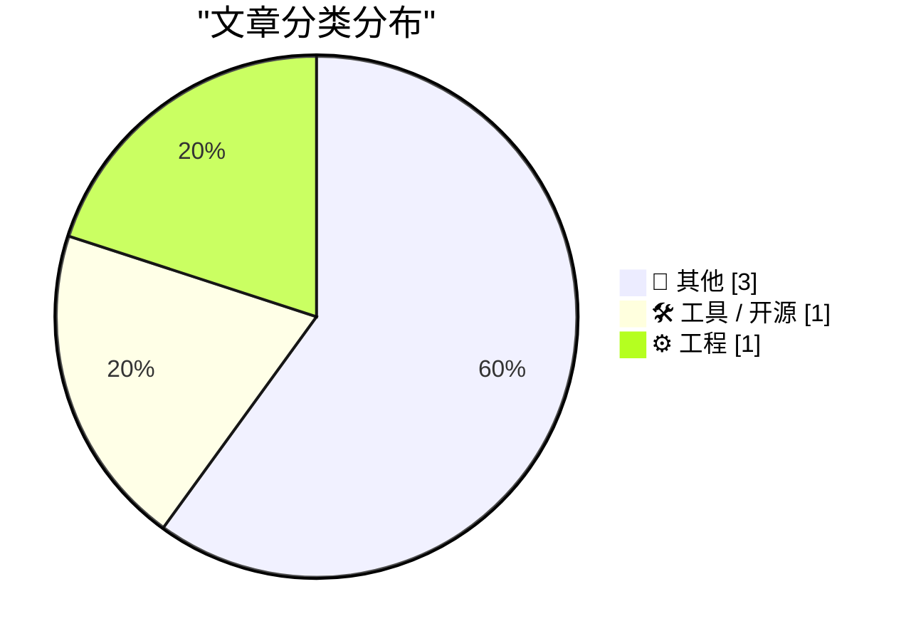
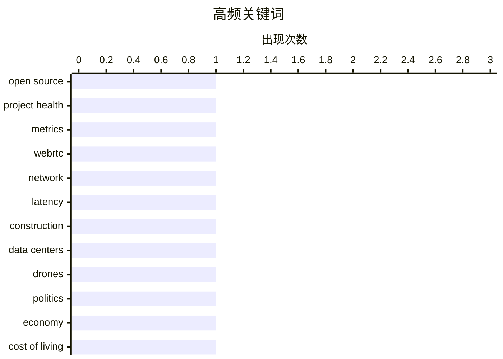

# 📰 AI 博客每日精选

**日期**: 2026-05-10 &nbsp;|&nbsp; **精选**: 5 篇 &nbsp;|&nbsp; **时间范围**: 24 小时

> 📚 来自 Karpathy 推荐的 **92** 个顶级技术博客，经 AI 智能评分筛选

## 📑 目录

- [📝 今日看点](#-今日看点)
- [🏆 今日必读](#-今日必读)
- [📊 数据概览](#-数据概览)
- [📝 其他](#-其他) (3篇)
- [🛠 工具 / 开源](#-工具---开源) (1篇)
- [⚙️ 工程](#-工程) (1篇)

---

## 📝 今日看点

<div style="background: linear-gradient(135deg, #667eea 0%, #764ba2 100%); padding: 16px 20px; border-radius: 12px; color: white; margin: 20px 0;">

今日技术圈聚焦三大趋势：开源项目评估正面临“路灯效应”困扰，传统健康度指标易误导对真实状况的判断；WebRTC在低延迟与音频质量间的取舍引发争议，尤其在视频会议场景中牺牲音质换取流畅性；同时，跨界创新持续涌现，从家用微型数据中心到纸板军用无人机，技术边界不断拓展。

</div>

---

## 🏆 今日必读

### 🥇 [开源项目的健康度评分存在偏差](https://nesbitt.io/2026/05/09/the-mismeasure-of-open-source.html)

<div style="display: flex; gap: 16px; flex-wrap: wrap; margin: 12px 0; font-size: 14px; color: #666;">
<span>📁 🛠 工具 / 开源</span>
<span>⏰ 14 小时前</span>
<span>⭐ 评分 24/30</span>
</div>

<div style="background: #f8f9fa; border-left: 4px solid #667eea; padding: 16px 20px; border-radius: 8px; margin: 16px 0;">

文章探讨了开源项目健康度评估中的‘路灯效应’（streetlight effect），即人们倾向于在容易观察的地方寻找数据，导致对项目真实状态的误判。作者指出，传统的健康度指标如提交频率、星标数和贡献者数量往往无法反映项目的实际维护质量和可持续性。通过分析多个开源项目的案例，研究发现这些指标容易被操纵或产生误导，尤其是在大型项目中。因此，作者呼吁采用更全面、多维度的评估方法，结合代码质量、社区参与度和长期维护记录等指标。

</div>

**💡 为什么值得读**: 该文揭示了当前开源生态中普遍存在的评估盲区，为开发者、投资者和决策者提供了重新思考如何衡量开源项目价值的视角。

**🏷️ 标签**: <span style="display:inline-block;background:#e3f2fd;color:#1976D2;padding:4px 12px;border-radius:16px;font-size:12px;margin-right:6px;">open source</span><span style="display:inline-block;background:#e3f2fd;color:#1976D2;padding:4px 12px;border-radius:16px;font-size:12px;margin-right:6px;">project health</span><span style="display:inline-block;background:#e3f2fd;color:#1976D2;padding:4px 12px;border-radius:16px;font-size:12px;margin-right:6px;">metrics</span>

---

### 🥈 [引用卢克·柯利：WebRTC 是问题所在](https://simonwillison.net/2026/May/9/luke-curley/#atom-everything)

<div style="display: flex; gap: 16px; flex-wrap: wrap; margin: 12px 0; font-size: 14px; color: #666;">
<span>📁 ⚙️ 工程</span>
<span>⏰ 22 小时前</span>
<span>⭐ 评分 18/30</span>
</div>

<div style="background: #f8f9fa; border-left: 4px solid #667eea; padding: 16px 20px; border-radius: 8px; margin: 16px 0;">

文章引用了卢克·柯利的观点，指出 WebRTC 在网络条件不佳时会主动丢弃音频数据包以维持低延迟，这可能导致语音失真或中断。作者批评这种设计在视频会议等实时通信场景中虽能保证流畅性，却牺牲了音频完整性，用户体验不佳。尽管 WebRTC 的设计初衷是为了适应高延迟网络下的快速交互，但其在现实应用中的表现引发了对技术取舍的质疑。

</div>

**💡 为什么值得读**: 这篇文章帮助读者理解现代实时通信技术背后的权衡机制，尤其适合关注音视频质量与网络性能平衡的开发者和产品经理阅读。

**🏷️ 标签**: <span style="display:inline-block;background:#e3f2fd;color:#1976D2;padding:4px 12px;border-radius:16px;font-size:12px;margin-right:6px;">WebRTC</span><span style="display:inline-block;background:#e3f2fd;color:#1976D2;padding:4px 12px;border-radius:16px;font-size:12px;margin-right:6px;">network</span><span style="display:inline-block;background:#e3f2fd;color:#1976D2;padding:4px 12px;border-radius:16px;font-size:12px;margin-right:6px;">latency</span>

---

### 🥉 [建筑物理阅读清单：被困大楼、家用数据中心、纸板无人机等](https://www.construction-physics.com/p/reading-list-05092026)

<div style="display: flex; gap: 16px; flex-wrap: wrap; margin: 12px 0; font-size: 14px; color: #666;">
<span>📁 📝 其他</span>
<span>⏰ 11 小时前</span>
<span>⭐ 评分 16/30</span>
</div>

<div style="background: #f8f9fa; border-left: 4px solid #667eea; padding: 16px 20px; border-radius: 8px; margin: 16px 0;">

本期阅读清单涵盖多个热点话题：包括高层建筑火灾中人员被困的风险、家庭内部部署微型数据中心的趋势、使用 cardboard 材料制造的军事级无人机原型，以及 Brightline 高铁公司可能面临破产的消息。内容横跨建筑安全、边缘计算、国防科技与交通基础设施等多个领域。

</div>

**💡 为什么值得读**: 这份清单精选了跨学科的前沿动态，适合工程师、城市规划师和科技爱好者快速了解行业动向。

**🏷️ 标签**: <span style="display:inline-block;background:#e3f2fd;color:#1976D2;padding:4px 12px;border-radius:16px;font-size:12px;margin-right:6px;">construction</span><span style="display:inline-block;background:#e3f2fd;color:#1976D2;padding:4px 12px;border-radius:16px;font-size:12px;margin-right:6px;">data centers</span><span style="display:inline-block;background:#e3f2fd;color:#1976D2;padding:4px 12px;border-radius:16px;font-size:12px;margin-right:6px;">drones</span>

---

## 📊 数据概览

<div style="display: grid; grid-template-columns: repeat(auto-fit, minmax(120px, 1fr)); gap: 12px; margin: 20px 0;">
<div style="background: #e8f4f8; padding: 16px; border-radius: 10px; text-align: center;">
<div style="font-size: 24px; font-weight: bold; color: #2196F3;">85/92</div>
<div style="font-size: 13px; color: #666; margin-top: 4px;">扫描源</div>
</div>
<div style="background: #fff3e0; padding: 16px; border-radius: 10px; text-align: center;">
<div style="font-size: 24px; font-weight: bold; color: #FF9800;">2482</div>
<div style="font-size: 13px; color: #666; margin-top: 4px;">抓取文章</div>
</div>
<div style="background: #f3e5f5; padding: 16px; border-radius: 10px; text-align: center;">
<div style="font-size: 24px; font-weight: bold; color: #9C27B0;">5</div>
<div style="font-size: 13px; color: #666; margin-top: 4px;">时间范围内</div>
</div>
<div style="background: #e8f5e9; padding: 16px; border-radius: 10px; text-align: center;">
<div style="font-size: 24px; font-weight: bold; color: #4CAF50;">5</div>
<div style="font-size: 13px; color: #666; margin-top: 4px;">AI 精选</div>
</div>
</div>

### 🥧 分类分布



### 📈 高频关键词



<details style="margin: 16px 0; padding: 12px; background: #f5f5f5; border-radius: 8px;">
<summary style="cursor: pointer; font-weight: 500;">📊 纯文本关键词图（终端友好）</summary>

```
open source    │ ████████████████████ 1
project health │ ████████████████████ 1
metrics        │ ████████████████████ 1
webrtc         │ ████████████████████ 1
network        │ ████████████████████ 1
latency        │ ████████████████████ 1
construction   │ ████████████████████ 1
data centers   │ ████████████████████ 1
drones         │ ████████████████████ 1
politics       │ ████████████████████ 1
```

</details>

### 🏷️ 话题标签

<div style="line-height: 2; margin: 16px 0;">
**open source**(1) · **project health**(1) · **metrics**(1) · webrtc(1) · network(1) · latency(1) · construction(1) · data centers(1) · drones(1) · politics(1) · economy(1) · cost of living(1) · literature(1) · book review(1) · fiction(1)
</div>

---

<a id="-其他"></a>
## 📝 其他 <span style="background: #e0e0e0; padding: 2px 10px; border-radius: 12px; font-size: 13px; margin-left: 8px;">3篇</span>

### 1. [建筑物理阅读清单：被困大楼、家用数据中心、纸板无人机等](https://www.construction-physics.com/p/reading-list-05092026)

<div style="margin: 10px 0;">
<div style="display: flex; justify-content: space-between; font-size: 13px; margin-bottom: 4px;">
<span>⭐ 综合评分</span>
<span style="font-weight: bold; color: #f44336;">16/30</span>
</div>
<div style="background: #e0e0e0; height: 8px; border-radius: 4px; overflow: hidden;">
<div style="background: #f44336; width: 53%; height: 100%; border-radius: 4px;"></div>
</div>
</div>

<div style="display: flex; gap: 12px; flex-wrap: wrap; font-size: 13px; color: #666; margin: 12px 0;">
<span>📁 construction-physics.com</span>
<span>⏰ 11 小时前</span>
<span>🔖 R:5 Q:5 T:6</span>
</div>

<div style="background: #fafafa; border-radius: 8px; padding: 16px; margin: 12px 0; line-height: 1.7;">
本期阅读清单涵盖多个热点话题：包括高层建筑火灾中人员被困的风险、家庭内部部署微型数据中心的趋势、使用 cardboard 材料制造的军事级无人机原型，以及 Brightline 高铁公司可能面临破产的消息。内容横跨建筑安全、边缘计算、国防科技与交通基础设施等多个领域。
</div>

<div style="margin: 12px 0;">
<span style="display: inline-block; background: #e3f2fd; color: #1976D2; padding: 4px 12px; border-radius: 16px; font-size: 12px; margin-right: 6px; margin-bottom: 4px;">construction</span><span style="display: inline-block; background: #e3f2fd; color: #1976D2; padding: 4px 12px; border-radius: 16px; font-size: 12px; margin-right: 6px; margin-bottom: 4px;">data centers</span><span style="display: inline-block; background: #e3f2fd; color: #1976D2; padding: 4px 12px; border-radius: 16px; font-size: 12px; margin-right: 6px; margin-bottom: 4px;">drones</span>
</div>

---

### 2. [特朗普徒劳地寻找可致死的公牛：通胀危机与富豪利益不可兼得](https://pluralistic.net/2026/05/09/cossie-livvie-crissie/)

<div style="margin: 10px 0;">
<div style="display: flex; justify-content: space-between; font-size: 13px; margin-bottom: 4px;">
<span>⭐ 综合评分</span>
<span style="font-weight: bold; color: #f44336;">9/30</span>
</div>
<div style="background: #e0e0e0; height: 8px; border-radius: 4px; overflow: hidden;">
<div style="background: #f44336; width: 30%; height: 100%; border-radius: 4px;"></div>
</div>
</div>

<div style="display: flex; gap: 12px; flex-wrap: wrap; font-size: 13px; color: #666; margin: 12px 0;">
<span>📁 pluralistic.net</span>
<span>⏰ 11 小时前</span>
<span>🔖 R:2 Q:4 T:3</span>
</div>

<div style="background: #fafafa; border-radius: 8px; padding: 16px; margin: 12px 0; line-height: 1.7;">
文章围绕特朗普政府试图寻找一个象征性‘可致死的公牛’展开隐喻式评论，实则批判其政策在安抚亿万富翁与维护民生成本之间的矛盾立场。作者认为，满足富豪阶层的需求必然加剧普通民众的生活压力，二者无法共存。文中还提及《PRO Act》劳工法案、Zuck 的新脑控射线传闻、《Panama Papers》举报人发声等社会议题。
</div>

<div style="margin: 12px 0;">
<span style="display: inline-block; background: #e3f2fd; color: #1976D2; padding: 4px 12px; border-radius: 16px; font-size: 12px; margin-right: 6px; margin-bottom: 4px;">politics</span><span style="display: inline-block; background: #e3f2fd; color: #1976D2; padding: 4px 12px; border-radius: 16px; font-size: 12px; margin-right: 6px; margin-bottom: 4px;">economy</span><span style="display: inline-block; background: #e3f2fd; color: #1976D2; padding: 4px 12px; border-radius: 16px; font-size: 12px; margin-right: 6px; margin-bottom: 4px;">cost of living</span>
</div>

---

### 3. [书评：《The Names》——叙事优美但令人不适的家庭暴力主题小说](https://shkspr.mobi/blog/2026/05/book-review-the-names-by-florence-knapp/)

<div style="margin: 10px 0;">
<div style="display: flex; justify-content: space-between; font-size: 13px; margin-bottom: 4px;">
<span>⭐ 综合评分</span>
<span style="font-weight: bold; color: #f44336;">9/30</span>
</div>
<div style="background: #e0e0e0; height: 8px; border-radius: 4px; overflow: hidden;">
<div style="background: #f44336; width: 30%; height: 100%; border-radius: 4px;"></div>
</div>
</div>

<div style="display: flex; gap: 12px; flex-wrap: wrap; font-size: 13px; color: #666; margin: 12px 0;">
<span>📁 shkspr.mobi</span>
<span>⏰ 12 小时前</span>
<span>🔖 R:1 Q:6 T:2</span>
</div>

<div style="background: #fafafa; border-radius: 8px; padding: 16px; margin: 12px 0; line-height: 1.7;">
Florence Knapp 的小说《The Names》采用多线叙事结构，融合《Sliding Doors》与《Same Time Next Year》的时间跳跃手法，讲述一位母亲在遭遇家暴后是否为孩子命名的问题上做出不同选择的故事。尽管文笔优美、情节引人入胜，但书中对家庭暴力的描写过于直白且令人 distressing，影响了整体阅读体验。
</div>

<div style="margin: 12px 0;">
<span style="display: inline-block; background: #e3f2fd; color: #1976D2; padding: 4px 12px; border-radius: 16px; font-size: 12px; margin-right: 6px; margin-bottom: 4px;">literature</span><span style="display: inline-block; background: #e3f2fd; color: #1976D2; padding: 4px 12px; border-radius: 16px; font-size: 12px; margin-right: 6px; margin-bottom: 4px;">book review</span><span style="display: inline-block; background: #e3f2fd; color: #1976D2; padding: 4px 12px; border-radius: 16px; font-size: 12px; margin-right: 6px; margin-bottom: 4px;">fiction</span>
</div>

---

<a id="-工具---开源"></a>
## 🛠 工具 / 开源 <span style="background: #e0e0e0; padding: 2px 10px; border-radius: 12px; font-size: 13px; margin-left: 8px;">1篇</span>

### 4. [开源项目的健康度评分存在偏差](https://nesbitt.io/2026/05/09/the-mismeasure-of-open-source.html)

<div style="margin: 10px 0;">
<div style="display: flex; justify-content: space-between; font-size: 13px; margin-bottom: 4px;">
<span>⭐ 综合评分</span>
<span style="font-weight: bold; color: #4CAF50;">24/30</span>
</div>
<div style="background: #e0e0e0; height: 8px; border-radius: 4px; overflow: hidden;">
<div style="background: #4CAF50; width: 80%; height: 100%; border-radius: 4px;"></div>
</div>
</div>

<div style="display: flex; gap: 12px; flex-wrap: wrap; font-size: 13px; color: #666; margin: 12px 0;">
<span>📁 nesbitt.io</span>
<span>⏰ 14 小时前</span>
<span>🔖 R:8 Q:8 T:8</span>
</div>

<div style="background: #fafafa; border-radius: 8px; padding: 16px; margin: 12px 0; line-height: 1.7;">
文章探讨了开源项目健康度评估中的‘路灯效应’（streetlight effect），即人们倾向于在容易观察的地方寻找数据，导致对项目真实状态的误判。作者指出，传统的健康度指标如提交频率、星标数和贡献者数量往往无法反映项目的实际维护质量和可持续性。通过分析多个开源项目的案例，研究发现这些指标容易被操纵或产生误导，尤其是在大型项目中。因此，作者呼吁采用更全面、多维度的评估方法，结合代码质量、社区参与度和长期维护记录等指标。
</div>

<div style="margin: 12px 0;">
<span style="display: inline-block; background: #e3f2fd; color: #1976D2; padding: 4px 12px; border-radius: 16px; font-size: 12px; margin-right: 6px; margin-bottom: 4px;">open source</span><span style="display: inline-block; background: #e3f2fd; color: #1976D2; padding: 4px 12px; border-radius: 16px; font-size: 12px; margin-right: 6px; margin-bottom: 4px;">project health</span><span style="display: inline-block; background: #e3f2fd; color: #1976D2; padding: 4px 12px; border-radius: 16px; font-size: 12px; margin-right: 6px; margin-bottom: 4px;">metrics</span>
</div>

---

<a id="-工程"></a>
## ⚙️ 工程 <span style="background: #e0e0e0; padding: 2px 10px; border-radius: 12px; font-size: 13px; margin-left: 8px;">1篇</span>

### 5. [引用卢克·柯利：WebRTC 是问题所在](https://simonwillison.net/2026/May/9/luke-curley/#atom-everything)

<div style="margin: 10px 0;">
<div style="display: flex; justify-content: space-between; font-size: 13px; margin-bottom: 4px;">
<span>⭐ 综合评分</span>
<span style="font-weight: bold; color: #FF9800;">18/30</span>
</div>
<div style="background: #e0e0e0; height: 8px; border-radius: 4px; overflow: hidden;">
<div style="background: #FF9800; width: 60%; height: 100%; border-radius: 4px;"></div>
</div>
</div>

<div style="display: flex; gap: 12px; flex-wrap: wrap; font-size: 13px; color: #666; margin: 12px 0;">
<span>📁 simonwillison.net</span>
<span>⏰ 22 小时前</span>
<span>🔖 R:6 Q:5 T:7</span>
</div>

<div style="background: #fafafa; border-radius: 8px; padding: 16px; margin: 12px 0; line-height: 1.7;">
文章引用了卢克·柯利的观点，指出 WebRTC 在网络条件不佳时会主动丢弃音频数据包以维持低延迟，这可能导致语音失真或中断。作者批评这种设计在视频会议等实时通信场景中虽能保证流畅性，却牺牲了音频完整性，用户体验不佳。尽管 WebRTC 的设计初衷是为了适应高延迟网络下的快速交互，但其在现实应用中的表现引发了对技术取舍的质疑。
</div>

<div style="margin: 12px 0;">
<span style="display: inline-block; background: #e3f2fd; color: #1976D2; padding: 4px 12px; border-radius: 16px; font-size: 12px; margin-right: 6px; margin-bottom: 4px;">WebRTC</span><span style="display: inline-block; background: #e3f2fd; color: #1976D2; padding: 4px 12px; border-radius: 16px; font-size: 12px; margin-right: 6px; margin-bottom: 4px;">network</span><span style="display: inline-block; background: #e3f2fd; color: #1976D2; padding: 4px 12px; border-radius: 16px; font-size: 12px; margin-right: 6px; margin-bottom: 4px;">latency</span>
</div>

---


<div style="text-align: center; color: #888; font-size: 13px; padding: 20px; border-top: 1px solid #e0e0e0; margin-top: 30px;">
生成于 2026-05-10 00:02 | 扫描 <strong>85</strong> 源 → 获取 <strong>2482</strong> 篇 → 精选 <strong>5</strong> 篇
<br>
基于 <a href="https://refactoringenglish.com/tools/hn-popularity/" style="color: #667eea;">Hacker News Popularity Contest 2025</a> RSS 源列表，由 <a href="https://x.com/karpathy" style="color: #667eea;">Andrej Karpathy</a> 推荐
<br>
由「懂点儿 AI」制作，欢迎关注同名微信公众号获取更多 AI 实用技巧 💡
</div>
