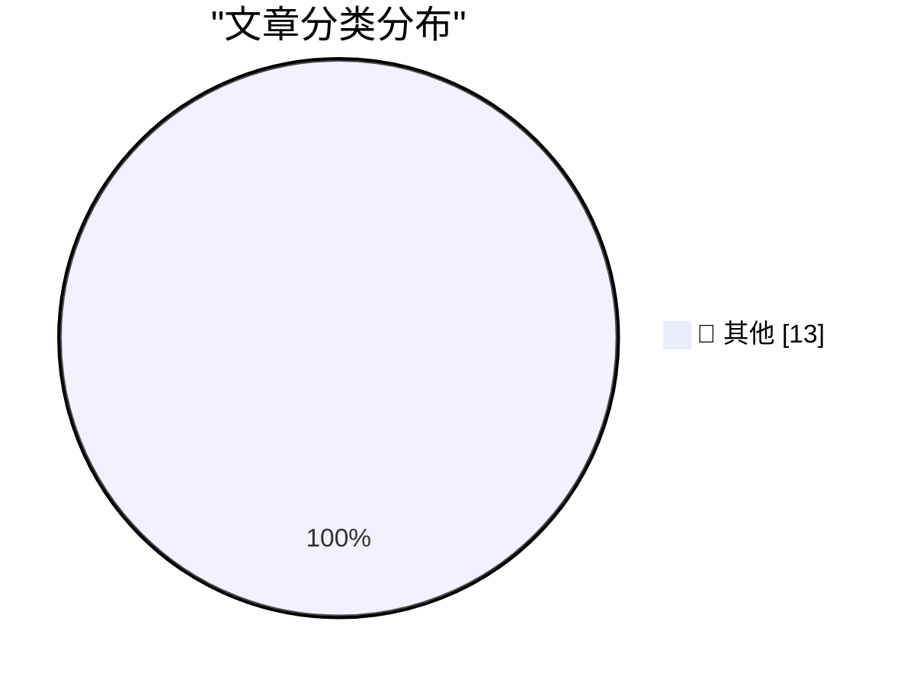

# 📰 AI 博客每日精选

**日期**: 2026-05-29 &nbsp;|&nbsp; **精选**: 13 篇 &nbsp;|&nbsp; **时间范围**: 24 小时

> 📚 来自 Karpathy 推荐的 **92** 个顶级技术博客，经 AI 智能评分筛选

## 📑 目录

- [📝 今日看点](#-今日看点)
- [🏆 今日必读](#-今日必读)
- [📊 数据概览](#-数据概览)
- [📝 其他](#-其他) (13篇)

---

## 🏆 今日必读

### 🥇 [Tuning in FM Radio on a 3D Printer Heatbed](https://www.jeffgeerling.com/blog/2026/tuning-in-fm-radio-on-a-3d-printer-heatbed/)

📁 📝 其他
⏰ 10 小时前
⭐ 评分 15/30

Tuning in FM Radio on a 3D Printer Heatbed

---

### 🥈 [Footage From the LA-Houston MLS Match That Apple Shot Using iPhone 17 Pro Cameras](https://tv.apple.com/us/sporting-event/mls-wrap-up/umc.cse.3a198p24hrehwhonbhgx2zvhv)

📁 📝 其他
⏰ 7 小时前
⭐ 评分 15/30

Footage From the LA-Houston MLS Match That Apple Shot Using iPhone 17 Pro Cameras

---

### 🥉 [Researchers Publish Method to Surveil Web Page Visitors by Analyzing Their SSD Activity](https://arstechnica.com/security/2026/05/websites-have-a-new-way-to-spy-on-visitors-analyzing-their-ssd-activity/)

📁 📝 其他
⏰ 9 小时前
⭐ 评分 15/30

Researchers Publish Method to Surveil Web Page Visitors by Analyzing Their SSD Activity

---

## 📊 数据概览

86/92

扫描源

2529

抓取文章

13

时间范围内

13

AI 精选

### 🥧 分类分布

---

## 📝 其他 13篇

### 1. [Tuning in FM Radio on a 3D Printer Heatbed](https://www.jeffgeerling.com/blog/2026/tuning-in-fm-radio-on-a-3d-printer-heatbed/)

⭐ 综合评分
15/30

📁 jeffgeerling.com
⏰ 10 小时前
🔖 R:5 Q:5 T:5

Tuning in FM Radio on a 3D Printer Heatbed

---

### 2. [Footage From the LA-Houston MLS Match That Apple Shot Using iPhone 17 Pro Cameras](https://tv.apple.com/us/sporting-event/mls-wrap-up/umc.cse.3a198p24hrehwhonbhgx2zvhv)

⭐ 综合评分
15/30

📁 daringfireball.net
⏰ 7 小时前
🔖 R:5 Q:5 T:5

Footage From the LA-Houston MLS Match That Apple Shot Using iPhone 17 Pro Cameras

---

### 3. [Researchers Publish Method to Surveil Web Page Visitors by Analyzing Their SSD Activity](https://arstechnica.com/security/2026/05/websites-have-a-new-way-to-spy-on-visitors-analyzing-their-ssd-activity/)

⭐ 综合评分
15/30

📁 daringfireball.net
⏰ 9 小时前
🔖 R:5 Q:5 T:5

Researchers Publish Method to Surveil Web Page Visitors by Analyzing Their SSD Activity

---

### 4. [Pluralistic: Hold on for dear life (28 May 2026)](https://pluralistic.net/2026/05/28/we-live-in-a-society/)

⭐ 综合评分
15/30

📁 pluralistic.net
⏰ 12 小时前
🔖 R:5 Q:5 T:5

Pluralistic: Hold on for dear life (28 May 2026)

---

### 5. [Sharing the result of a single Windows Runtime IAsyncOperation among multiple coroutines, part 2](https://devblogs.microsoft.com/oldnewthing/20260528-00/?p=112365)

⭐ 综合评分
15/30

📁 devblogs.microsoft.com/oldnewthing
⏰ 10 小时前
🔖 R:5 Q:5 T:5

Sharing the result of a single Windows Runtime IAsyncOperation among multiple coroutines, part 2

---

### 6. [Breaking: bad news for three of the biggest IPOs in history](https://garymarcus.substack.com/p/breaking-bad-news-for-three-of-the)

⭐ 综合评分
15/30

📁 garymarcus.substack.com
⏰ 4 小时前
🔖 R:5 Q:5 T:5

Breaking: bad news for three of the biggest IPOs in history

---

### 7. [Turning K-L divergence into a metric](https://www.johndcook.com/blog/2026/05/27/jensen-shannon/)

⭐ 综合评分
15/30

📁 johndcook.com
⏰ 22 小时前
🔖 R:5 Q:5 T:5

Turning K-L divergence into a metric

---

### 8. [Protestware for coding agents](https://nesbitt.io/2026/05/28/protestware-for-coding-agents.html)

⭐ 综合评分
15/30

📁 nesbitt.io
⏰ 9 小时前
🔖 R:5 Q:5 T:5

Protestware for coding agents

---

### 9. [Package managers that package package managers](https://nesbitt.io/2026/05/28/package-managers-that-package-package-managers.html)

⭐ 综合评分
15/30

📁 nesbitt.io
⏰ 14 小时前
🔖 R:5 Q:5 T:5

Package managers that package package managers

---

### 10. [Where Are the Economies of Scale in Homebuilding?](https://www.construction-physics.com/p/where-are-the-economies-of-scale)

⭐ 综合评分
15/30

📁 construction-physics.com
⏰ 12 小时前
🔖 R:5 Q:5 T:5

Where Are the Economies of Scale in Homebuilding?

---

### 11. [Knowing about things is cheaper than knowing things](https://buttondown.com/hillelwayne/archive/knowing-about-things-is-cheaper-than-knowing/)

⭐ 综合评分
15/30

📁 buttondown.com/hillelwayne
⏰ 8 小时前
🔖 R:5 Q:5 T:5

Knowing about things is cheaper than knowing things

---

### 12. [Notes on Fourier series](https://eli.thegreenplace.net/2026/notes-on-fourier-series/)

⭐ 综合评分
15/30

📁 eli.thegreenplace.net
⏰ 21 小时前
🔖 R:5 Q:5 T:5

Notes on Fourier series

---

### 13. [Every Enemy Wears Your Face](https://simone.org/projection/)

⭐ 综合评分
15/30

📁 simone.org
⏰ 11 小时前
🔖 R:5 Q:5 T:5

Every Enemy Wears Your Face

---

生成于 2026-05-29 00:04 | 扫描 <strong>86</strong> 源 → 获取 <strong>2529</strong> 篇 → 精选 <strong>13</strong> 篇
 
基于 <a href="https://refactoringenglish.com/tools/hn-popularity/" style="color: #667eea;">Hacker News Popularity Contest 2025</a> RSS 源列表，由 <a href="https://x.com/karpathy" style="color: #667eea;">Andrej Karpathy</a> 推荐
 
由「懂点儿 AI」制作，欢迎关注同名微信公众号获取更多 AI 实用技巧 💡

