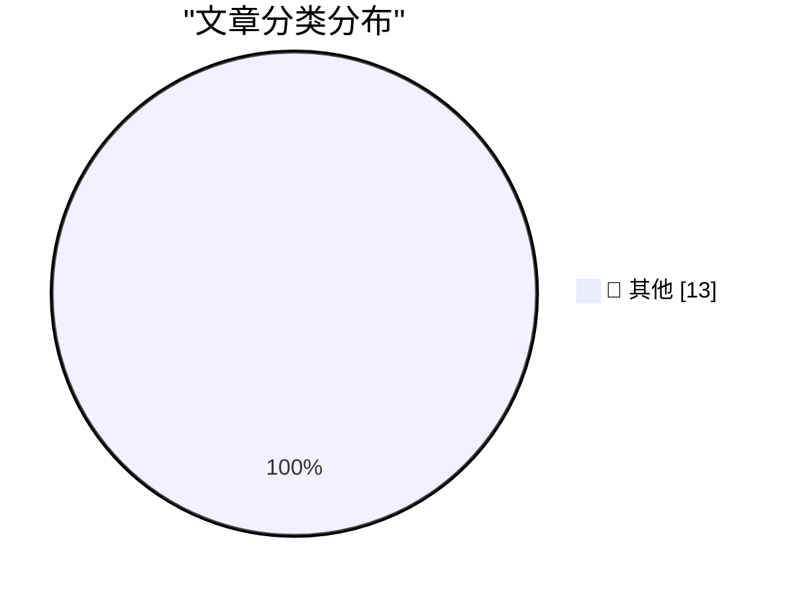

# 📰 AI 博客每日精选

**日期**: 2026-05-30 &nbsp;|&nbsp; **精选**: 13 篇 &nbsp;|&nbsp; **时间范围**: 24 小时

> 📚 来自 Karpathy 推荐的 **92** 个顶级技术博客，经 AI 智能评分筛选

## 📑 目录

- [📝 今日看点](#-今日看点)
- [🏆 今日必读](#-今日必读)
- [📊 数据概览](#-数据概览)
- [📝 其他](#-其他) (13篇)

---

## 🏆 今日必读

### 🥇 [datasette 1.0a31](https://simonwillison.net/2026/May/29/datasette/#atom-everything)

📁 📝 其他
⏰ 20 小时前
⭐ 评分 15/30

datasette 1.0a31

---

### 🥈 [Anthropic's run-rate revenue hits $47 billion](https://simonwillison.net/2026/May/29/anthropic/#atom-everything)

📁 📝 其他
⏰ 22 小时前
⭐ 评分 15/30

Anthropic's run-rate revenue hits $47 billion

---

### 🥉 [It's hard to justify buying a Framework 12](https://www.jeffgeerling.com/blog/2026/its-hard-to-justify-framework-12/)

📁 📝 其他
⏰ 10 小时前
⭐ 评分 15/30

It's hard to justify buying a Framework 12

---

## 📊 数据概览

85/92

扫描源

2520

抓取文章

13

时间范围内

13

AI 精选

### 🥧 分类分布

---

## 📝 其他 13篇

### 1. [datasette 1.0a31](https://simonwillison.net/2026/May/29/datasette/#atom-everything)

⭐ 综合评分
15/30

📁 simonwillison.net
⏰ 20 小时前
🔖 R:5 Q:5 T:5

datasette 1.0a31

---

### 2. [Anthropic's run-rate revenue hits $47 billion](https://simonwillison.net/2026/May/29/anthropic/#atom-everything)

⭐ 综合评分
15/30

📁 simonwillison.net
⏰ 22 小时前
🔖 R:5 Q:5 T:5

Anthropic's run-rate revenue hits $47 billion

---

### 3. [It's hard to justify buying a Framework 12](https://www.jeffgeerling.com/blog/2026/its-hard-to-justify-framework-12/)

⭐ 综合评分
15/30

📁 jeffgeerling.com
⏰ 10 小时前
🔖 R:5 Q:5 T:5

It's hard to justify buying a Framework 12

---

### 4. [★ What Is a Dickover?](https://daringfireball.net/2026/05/what_is_a_dickover)

⭐ 综合评分
15/30

📁 daringfireball.net
⏰ 3 小时前
🔖 R:5 Q:5 T:5

★ What Is a Dickover?

---

### 5. [One Group, Clearly, Is Deranged](https://paulkrugman.substack.com/p/whos-deranged-exactly)

⭐ 综合评分
15/30

📁 daringfireball.net
⏰ 7 小时前
🔖 R:5 Q:5 T:5

One Group, Clearly, Is Deranged

---

### 6. [The UK Government's Low Value Purchase System is a Waste of Time](https://shkspr.mobi/blog/2026/05/the-uk-governments-low-value-purchase-system-is-a-waste-of-time/)

⭐ 综合评分
15/30

📁 shkspr.mobi
⏰ 12 小时前
🔖 R:5 Q:5 T:5

The UK Government's Low Value Purchase System is a Waste of Time

---

### 7. [What happens next, after the decline of tokenmaxxing?](https://garymarcus.substack.com/p/what-happens-next-after-the-decline)

⭐ 综合评分
15/30

📁 garymarcus.substack.com
⏰ 6 小时前
🔖 R:5 Q:5 T:5

What happens next, after the decline of tokenmaxxing?

---

### 8. [Online (one-pass) algorithms](https://www.johndcook.com/blog/2026/05/29/online-one-pass-algorithms/)

⭐ 综合评分
15/30

📁 johndcook.com
⏰ 11 小时前
🔖 R:5 Q:5 T:5

Online (one-pass) algorithms

---

### 9. [Composer’s dependency policies](https://nesbitt.io/2026/05/29/composer-dependency-policies.html)

⭐ 综合评分
15/30

📁 nesbitt.io
⏰ 14 小时前
🔖 R:5 Q:5 T:5

Composer’s dependency policies

---

### 10. [Premium: What If...We're In An AI Bubble? (Part 3)](https://www.wheresyoured.at/premium-what-if-were-in-an-ai-bubble-part-3/)

⭐ 综合评分
15/30

📁 wheresyoured.at
⏰ 7 小时前
🔖 R:5 Q:5 T:5

Premium: What If...We're In An AI Bubble? (Part 3)

---

### 11. [This Week on The Analog Antiquarian](https://www.filfre.net/2026/05/this-week-on-the-analog-antiquarian/)

⭐ 综合评分
15/30

📁 filfre.net
⏰ 7 小时前
🔖 R:5 Q:5 T:5

This Week on The Analog Antiquarian

---

### 12. [Why people say CRTs don’t have pixels](https://dfarq.homeip.net/why-people-say-crts-dont-have-pixels/?utm_source=rss&#038;utm_medium=rss&#038;utm_campaign=why-people-say-crts-dont-have-pixels)

⭐ 综合评分
15/30

📁 dfarq.homeip.net
⏰ 13 小时前
🔖 R:5 Q:5 T:5

Why people say CRTs don’t have pixels

---

### 13. [DR DOS: Revenge of CP/M](https://dfarq.homeip.net/dr-dos-revenge-of-cp-m/?utm_source=rss&#038;utm_medium=rss&#038;utm_campaign=dr-dos-revenge-of-cp-m)

⭐ 综合评分
15/30

📁 dfarq.homeip.net
⏰ 13 小时前
🔖 R:5 Q:5 T:5

DR DOS: Revenge of CP/M

---

生成于 2026-05-30 00:04 | 扫描 <strong>85</strong> 源 → 获取 <strong>2520</strong> 篇 → 精选 <strong>13</strong> 篇
 
基于 <a href="https://refactoringenglish.com/tools/hn-popularity/" style="color: #667eea;">Hacker News Popularity Contest 2025</a> RSS 源列表，由 <a href="https://x.com/karpathy" style="color: #667eea;">Andrej Karpathy</a> 推荐
 
由「懂点儿 AI」制作，欢迎关注同名微信公众号获取更多 AI 实用技巧 💡

