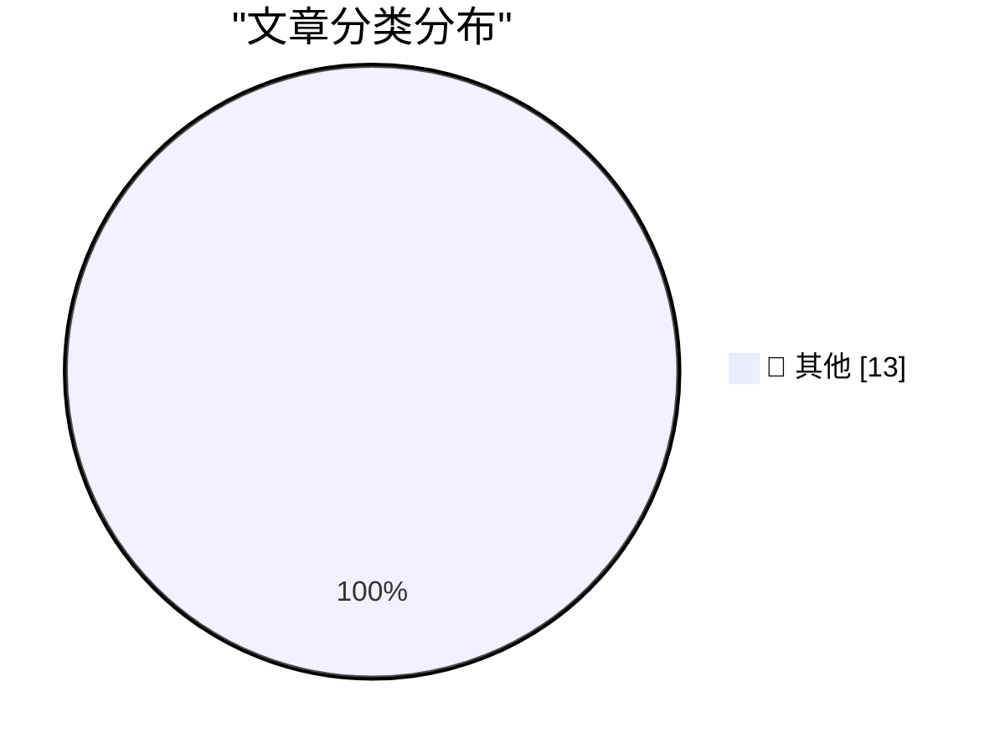

# 📰 AI 博客每日精选

**日期**: 2026-05-31 &nbsp;|&nbsp; **精选**: 13 篇 &nbsp;|&nbsp; **时间范围**: 24 小时

> 📚 来自 Karpathy 推荐的 **92** 个顶级技术博客，经 AI 智能评分筛选

## 📑 目录

- [📝 今日看点](#-今日看点)
- [🏆 今日必读](#-今日必读)
- [📊 数据概览](#-数据概览)
- [📝 其他](#-其他) (13篇)

---

## 🏆 今日必读

### 🥇 [How we contain Claude across products](https://simonwillison.net/2026/May/30/how-we-contain-claude/#atom-everything)

📁 📝 其他
⏰ 2 小时前
⭐ 评分 15/30

How we contain Claude across products

---

### 🥈 [Running Python ASGI apps in the browser via Pyodide + a service worker](https://simonwillison.net/2026/May/30/pyodide-asgi-browser/#atom-everything)

📁 📝 其他
⏰ 3 小时前
⭐ 评分 15/30

Running Python ASGI apps in the browser via Pyodide + a service worker

---

### 🥉 [I Am Retiring from Tech to Live Offline](https://simonwillison.net/2026/May/30/retiring-from-tech-to-live-offline/#atom-everything)

📁 📝 其他
⏰ 4 小时前
⭐ 评分 15/30

I Am Retiring from Tech to Live Offline

---

## 📊 数据概览

86/92

扫描源

2530

抓取文章

13

时间范围内

13

AI 精选

### 🥧 分类分布

---

## 📝 其他 13篇

### 1. [How we contain Claude across products](https://simonwillison.net/2026/May/30/how-we-contain-claude/#atom-everything)

⭐ 综合评分
15/30

📁 simonwillison.net
⏰ 2 小时前
🔖 R:5 Q:5 T:5

How we contain Claude across products

---

### 2. [Running Python ASGI apps in the browser via Pyodide + a service worker](https://simonwillison.net/2026/May/30/pyodide-asgi-browser/#atom-everything)

⭐ 综合评分
15/30

📁 simonwillison.net
⏰ 3 小时前
🔖 R:5 Q:5 T:5

Running Python ASGI apps in the browser via Pyodide + a service worker

---

### 3. [I Am Retiring from Tech to Live Offline](https://simonwillison.net/2026/May/30/retiring-from-tech-to-live-offline/#atom-everything)

⭐ 综合评分
15/30

📁 simonwillison.net
⏰ 4 小时前
🔖 R:5 Q:5 T:5

I Am Retiring from Tech to Live Offline

---

### 4. [Quoting Daniel Jalkut](https://simonwillison.net/2026/May/30/daniel-jalkut/#atom-everything)

⭐ 综合评分
15/30

📁 simonwillison.net
⏰ 6 小时前
🔖 R:5 Q:5 T:5

Quoting Daniel Jalkut

---

### 5. [Meta Is Launching Instagram, Facebook, and WhatsApp Subscriptions for ‘Fun Features’](https://techcrunch.com/2026/05/27/meta-officially-launches-instagram-facebook-and-whatsapp-subscriptions-with-more-to-come-including-ai-plans/)

⭐ 综合评分
15/30

📁 daringfireball.net
⏰ 8 小时前
🔖 R:5 Q:5 T:5

Meta Is Launching Instagram, Facebook, and WhatsApp Subscriptions for ‘Fun Features’

---

### 6. [Daniel Jalkut on AI](https://mastodon.social/@danielpunkass/116639318125898071)

⭐ 综合评分
15/30

📁 daringfireball.net
⏰ 8 小时前
🔖 R:5 Q:5 T:5

Daniel Jalkut on AI

---

### 7. [Yours Truly on TBPN Yesterday](https://www.youtube.com/live/sQVwLUxFdMY?t=1997)

⭐ 综合评分
15/30

📁 daringfireball.net
⏰ 11 小时前
🔖 R:5 Q:5 T:5

Yours Truly on TBPN Yesterday

---

### 8. [Pluralistic: Carneyism without Carney (30 May 2026)](https://pluralistic.net/2026/05/30/rupture/)

⭐ 综合评分
15/30

📁 pluralistic.net
⏰ 14 小时前
🔖 R:5 Q:5 T:5

Pluralistic: Carneyism without Carney (30 May 2026)

---

### 9. [Microcode inside the Intel 8087 floating-point chip: register exchange](http://www.righto.com/feeds/5917097192784199241/comments/default)

⭐ 综合评分
15/30

📁 righto.com
⏰ 6 小时前
🔖 R:5 Q:5 T:5

Microcode inside the Intel 8087 floating-point chip: register exchange

---

### 10. [Spot checking polynomial identities](https://www.johndcook.com/blog/2026/05/30/schwartz-zippel/)

⭐ 综合评分
15/30

📁 johndcook.com
⏰ 2 小时前
🔖 R:5 Q:5 T:5

Spot checking polynomial identities

---

### 11. [On first looking into JAX](https://www.gilesthomas.com/2026/05/on-first-looking-into-jax)

⭐ 综合评分
15/30

📁 gilesthomas.com
⏰ 5 小时前
🔖 R:5 Q:5 T:5

On first looking into JAX

---

### 12. [This Week in Package Management: 30 May 2026](https://nesbitt.io/2026/05/30/this-week-in-package-management.html)

⭐ 综合评分
15/30

📁 nesbitt.io
⏰ 14 小时前
🔖 R:5 Q:5 T:5

This Week in Package Management: 30 May 2026

---

### 13. [Reading List 05/30/26](https://www.construction-physics.com/p/reading-list-053026)

⭐ 综合评分
15/30

📁 construction-physics.com
⏰ 12 小时前
🔖 R:5 Q:5 T:5

Reading List 05/30/26

---

生成于 2026-05-31 00:04 | 扫描 <strong>86</strong> 源 → 获取 <strong>2530</strong> 篇 → 精选 <strong>13</strong> 篇
 
基于 <a href="https://refactoringenglish.com/tools/hn-popularity/" style="color: #667eea;">Hacker News Popularity Contest 2025</a> RSS 源列表，由 <a href="https://x.com/karpathy" style="color: #667eea;">Andrej Karpathy</a> 推荐
 
由「懂点儿 AI」制作，欢迎关注同名微信公众号获取更多 AI 实用技巧 💡

