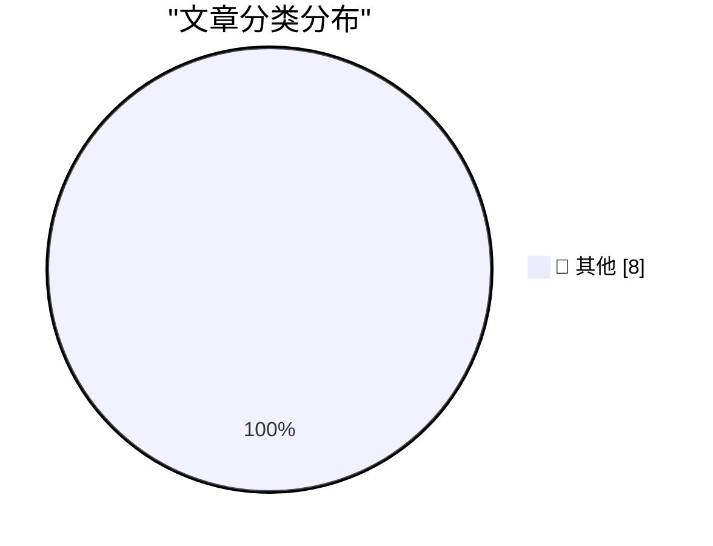

# 📰 AI 博客每日精选

**日期**: 2026-06-01 &nbsp;|&nbsp; **精选**: 8 篇 &nbsp;|&nbsp; **时间范围**: 24 小时

> 📚 来自 Karpathy 推荐的 **92** 个顶级技术博客，经 AI 智能评分筛选

## 📑 目录

- [📝 今日看点](#-今日看点)
- [🏆 今日必读](#-今日必读)
- [📊 数据概览](#-数据概览)
- [📝 其他](#-其他) (8篇)

---

## 🏆 今日必读

### 🥇 [datasette 1.0a32](https://simonwillison.net/2026/May/31/datasette/#atom-everything)

📁 📝 其他
⏰ 38 分钟前
⭐ 评分 15/30

datasette 1.0a32

---

### 🥈 [The solution might be cancelling my AI subscription](https://simonwillison.net/2026/May/31/the-solution-might-be-cancelling-my-ai-subscription/#atom-everything)

📁 📝 其他
⏰ 7 小时前
⭐ 评分 15/30

The solution might be cancelling my AI subscription

---

### 🥉 [Quoting Karen Kwok for Reuters Breakingviews](https://simonwillison.net/2026/May/31/anthropic-run-rate/#atom-everything)

📁 📝 其他
⏰ 22 小时前
⭐ 评分 15/30

Quoting Karen Kwok for Reuters Breakingviews

---

## 📊 数据概览

86/92

扫描源

2541

抓取文章

8

时间范围内

8

AI 精选

### 🥧 分类分布

---

## 📝 其他 8篇

### 1. [datasette 1.0a32](https://simonwillison.net/2026/May/31/datasette/#atom-everything)

⭐ 综合评分
15/30

📁 simonwillison.net
⏰ 38 分钟前
🔖 R:5 Q:5 T:5

datasette 1.0a32

---

### 2. [The solution might be cancelling my AI subscription](https://simonwillison.net/2026/May/31/the-solution-might-be-cancelling-my-ai-subscription/#atom-everything)

⭐ 综合评分
15/30

📁 simonwillison.net
⏰ 7 小时前
🔖 R:5 Q:5 T:5

The solution might be cancelling my AI subscription

---

### 3. [Quoting Karen Kwok for Reuters Breakingviews](https://simonwillison.net/2026/May/31/anthropic-run-rate/#atom-everything)

⭐ 综合评分
15/30

📁 simonwillison.net
⏰ 22 小时前
🔖 R:5 Q:5 T:5

Quoting Karen Kwok for Reuters Breakingviews

---

### 4. [Who are the actors in the UK's 2015 passport?](https://shkspr.mobi/blog/2026/05/who-are-the-actors-in-the-uks-2015-passport/)

⭐ 综合评分
15/30

📁 shkspr.mobi
⏰ 12 小时前
🔖 R:5 Q:5 T:5

Who are the actors in the UK's 2015 passport?

---

### 5. [The Pope appears to understand AI better than Geoffrey Hinton does.](https://garymarcus.substack.com/p/the-pope-appears-to-understand-ai)

⭐ 综合评分
15/30

📁 garymarcus.substack.com
⏰ 7 小时前
🔖 R:5 Q:5 T:5

The Pope appears to understand AI better than Geoffrey Hinton does.

---

### 6. [Another Gaussian approximation](https://www.johndcook.com/blog/2026/05/31/another-gaussian-approximation/)

⭐ 综合评分
15/30

📁 johndcook.com
⏰ 7 小时前
🔖 R:5 Q:5 T:5

Another Gaussian approximation

---

### 7. [One &udm After Another](https://feed.tedium.co/link/15204/17351430/google-ai-udm14-reflection)

⭐ 综合评分
15/30

📁 tedium.co
⏰ 23 小时前
🔖 R:5 Q:5 T:5

One &udm After Another

---

### 8. [Ahoy, DECmate II! the little PDP-8 that could](https://oldvcr.blogspot.com/feeds/8074763508065030069/comments/default)

⭐ 综合评分
15/30

📁 oldvcr.blogspot.com
⏰ 21 小时前
🔖 R:5 Q:5 T:5

Ahoy, DECmate II! the little PDP-8 that could

---

生成于 2026-06-01 00:01 | 扫描 <strong>86</strong> 源 → 获取 <strong>2541</strong> 篇 → 精选 <strong>8</strong> 篇
 
基于 <a href="https://refactoringenglish.com/tools/hn-popularity/" style="color: #667eea;">Hacker News Popularity Contest 2025</a> RSS 源列表，由 <a href="https://x.com/karpathy" style="color: #667eea;">Andrej Karpathy</a> 推荐
 
由「懂点儿 AI」制作，欢迎关注同名微信公众号获取更多 AI 实用技巧 💡

