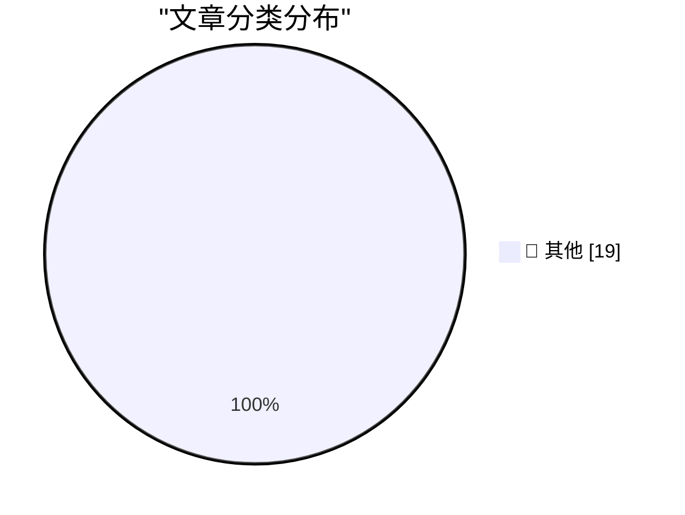

# 📰 AI 博客每日精选

**日期**: 2026-06-02 &nbsp;|&nbsp; **精选**: 19 篇 &nbsp;|&nbsp; **时间范围**: 24 小时

> 📚 来自 Karpathy 推荐的 **92** 个顶级技术博客，经 AI 智能评分筛选

## 📑 目录

- [📝 今日看点](#-今日看点)
- [🏆 今日必读](#-今日必读)
- [📊 数据概览](#-数据概览)
- [📝 其他](#-其他) (19篇)

---

## 🏆 今日必读

### 🥇 [Hackers Simply Asked Meta AI to Give Them Access to High-Profile Instagram Accounts. It Worked](https://simonwillison.net/2026/Jun/1/hackers-simply-asked-meta-ai/#atom-everything)

📁 📝 其他
⏰ 2 小时前
⭐ 评分 15/30

Hackers Simply Asked Meta AI to Give Them Access to High-Profile Instagram Accounts. It Worked

---

### 🥈 [May 2026 newsletter](https://simonwillison.net/2026/Jun/1/may-newsletter/#atom-everything)

📁 📝 其他
⏰ 19 小时前
⭐ 评分 15/30

May 2026 newsletter

---

### 🥉 [Hackers Used Meta’s AI Support Bot to Seize Instagram Accounts](https://krebsonsecurity.com/2026/06/hackers-used-metas-ai-support-bot-to-seize-instagram-accounts/)

📁 📝 其他
⏰ 6 小时前
⭐ 评分 15/30

Hackers Used Meta’s AI Support Bot to Seize Instagram Accounts

---

## 📊 数据概览

86/92

扫描源

2528

抓取文章

19

时间范围内

19

AI 精选

### 🥧 分类分布

---

## 📝 其他 19篇

### 1. [Hackers Simply Asked Meta AI to Give Them Access to High-Profile Instagram Accounts. It Worked](https://simonwillison.net/2026/Jun/1/hackers-simply-asked-meta-ai/#atom-everything)

⭐ 综合评分
15/30

📁 simonwillison.net
⏰ 2 小时前
🔖 R:5 Q:5 T:5

Hackers Simply Asked Meta AI to Give Them Access to High-Profile Instagram Accounts. It Worked

---

### 2. [May 2026 newsletter](https://simonwillison.net/2026/Jun/1/may-newsletter/#atom-everything)

⭐ 综合评分
15/30

📁 simonwillison.net
⏰ 19 小时前
🔖 R:5 Q:5 T:5

May 2026 newsletter

---

### 3. [Hackers Used Meta’s AI Support Bot to Seize Instagram Accounts](https://krebsonsecurity.com/2026/06/hackers-used-metas-ai-support-bot-to-seize-instagram-accounts/)

⭐ 综合评分
15/30

📁 krebsonsecurity.com
⏰ 6 小时前
🔖 R:5 Q:5 T:5

Hackers Used Meta’s AI Support Bot to Seize Instagram Accounts

---

### 4. [‘If You Take the Weasel Job Then You Must Be the Weasel’](https://www.hamiltonnolan.com/p/if-you-take-the-weasel-job-then-you?r=qy6gq)

⭐ 综合评分
15/30

📁 daringfireball.net
⏰ 29 分钟前
🔖 R:5 Q:5 T:5

‘If You Take the Weasel Job Then You Must Be the Weasel’

---

### 5. [‘We Are Living in Pinocchio’s World’](https://om.co/2026/05/25/we-are-living-in-pinocchios-world/)

⭐ 综合评分
15/30

📁 daringfireball.net
⏰ 3 小时前
🔖 R:5 Q:5 T:5

‘We Are Living in Pinocchio’s World’

---

### 6. [Amazon Made AI Podcasts for Products](https://www.businessinsider.com/amazon-ai-generated-podcasts-products-2026-4)

⭐ 综合评分
15/30

📁 daringfireball.net
⏰ 7 小时前
🔖 R:5 Q:5 T:5

Amazon Made AI Podcasts for Products

---

### 7. [The Talk Show Live From WWDC 2026: Tuesday June 9](https://ti.to/daringfireball/the-talk-show-live-from-wwdc-2026)

⭐ 综合评分
15/30

📁 daringfireball.net
⏰ 22 小时前
🔖 R:5 Q:5 T:5

The Talk Show Live From WWDC 2026: Tuesday June 9

---

### 8. [exe.dev](https://exe.dev/?df)

⭐ 综合评分
15/30

📁 daringfireball.net
⏰ 22 小时前
🔖 R:5 Q:5 T:5

exe.dev

---

### 9. [Take Two](https://x.com/markgurman/status/2061236259843182813)

⭐ 综合评分
15/30

📁 daringfireball.net
⏰ 23 小时前
🔖 R:5 Q:5 T:5

Take Two

---

### 10. [The web is changing, and we are not going back](https://idiallo.com/blog/web-is-changing-we-are-not-going-back?src=feed)

⭐ 综合评分
15/30

📁 idiallo.com
⏰ 4 小时前
🔖 R:5 Q:5 T:5

The web is changing, and we are not going back

---

### 11. [Pluralistic: Molly Crabapple's 'Here Where We Live Is Our Country' (01 Jun 2026)](https://pluralistic.net/2026/06/01/doikayt/)

⭐ 综合评分
15/30

📁 pluralistic.net
⏰ 14 小时前
🔖 R:5 Q:5 T:5

Pluralistic: Molly Crabapple's 'Here Where We Live Is Our Country' (01 Jun 2026)

---

### 12. [Weekend trivia: your process' memory is a file](https://lcamtuf.substack.com/p/weekend-trivia-your-process-memory)

⭐ 综合评分
15/30

📁 lcamtuf.substack.com
⏰ 21 小时前
🔖 R:5 Q:5 T:5

Weekend trivia: your process' memory is a file

---

### 13. [It’s not just Taylor series](https://www.johndcook.com/blog/2026/06/01/not-just-taylor-series/)

⭐ 综合评分
15/30

📁 johndcook.com
⏰ 11 小时前
🔖 R:5 Q:5 T:5

It’s not just Taylor series

---

### 14. [Subscribe by email](https://www.johndcook.com/blog/2026/06/01/subscribe-by-email/)

⭐ 综合评分
15/30

📁 johndcook.com
⏰ 13 小时前
🔖 R:5 Q:5 T:5

Subscribe by email

---

### 15. [The Infosec Phrasebook](https://nesbitt.io/2026/06/01/the-infosec-phrasebook.html)

⭐ 综合评分
15/30

📁 nesbitt.io
⏰ 14 小时前
🔖 R:5 Q:5 T:5

The Infosec Phrasebook

---

### 16. [Intel 8088s and non-Intel non-clones](https://dfarq.homeip.net/intel-8088s-and-non-intel-non-clones/?utm_source=rss&#038;utm_medium=rss&#038;utm_campaign=intel-8088s-and-non-intel-non-clones)

⭐ 综合评分
15/30

📁 dfarq.homeip.net
⏰ 13 小时前
🔖 R:5 Q:5 T:5

Intel 8088s and non-Intel non-clones

---

### 17. [Micro Instrumentation and Telemetry Systems](https://www.abortretry.fail/p/micro-instrumentation-and-telemetry)

⭐ 综合评分
15/30

📁 abortretry.fail
⏰ 22 小时前
🔖 R:5 Q:5 T:5

Micro Instrumentation and Telemetry Systems

---

### 18. [1,000 Data Breaches Later, the Disclosure Lag is Worse Than Ever](https://www.troyhunt.com/1000-data-breaches-later-the-disclosure-lag-is-worse-than-ever/)

⭐ 综合评分
15/30

📁 troyhunt.com
⏰ 15 小时前
🔖 R:5 Q:5 T:5

1,000 Data Breaches Later, the Disclosure Lag is Worse Than Ever

---

### 19. [Weekly Update 506](https://www.troyhunt.com/weekly-update-506/)

⭐ 综合评分
15/30

📁 troyhunt.com
⏰ 20 小时前
🔖 R:5 Q:5 T:5

Weekly Update 506

---

生成于 2026-06-02 00:01 | 扫描 <strong>86</strong> 源 → 获取 <strong>2528</strong> 篇 → 精选 <strong>19</strong> 篇
 
基于 <a href="https://refactoringenglish.com/tools/hn-popularity/" style="color: #667eea;">Hacker News Popularity Contest 2025</a> RSS 源列表，由 <a href="https://x.com/karpathy" style="color: #667eea;">Andrej Karpathy</a> 推荐
 
由「懂点儿 AI」制作，欢迎关注同名微信公众号获取更多 AI 实用技巧 💡

