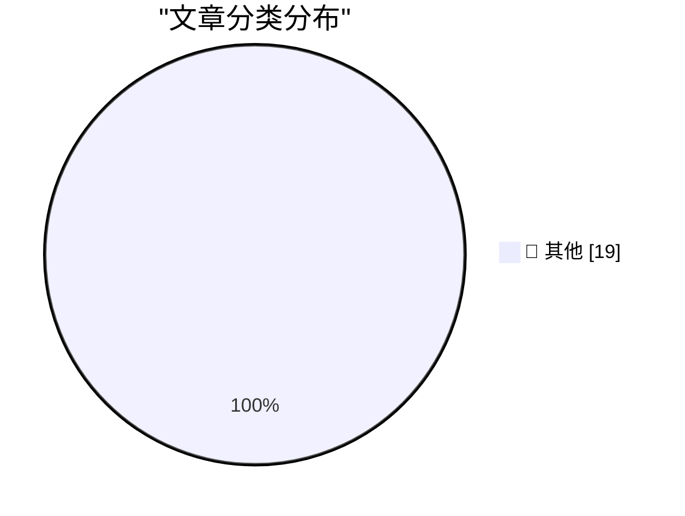

# 📰 AI 博客每日精选

**日期**: 2026-06-03 &nbsp;|&nbsp; **精选**: 19 篇 &nbsp;|&nbsp; **时间范围**: 24 小时

> 📚 来自 Karpathy 推荐的 **92** 个顶级技术博客，经 AI 智能评分筛选

## 📑 目录

- [📝 今日看点](#-今日看点)
- [🏆 今日必读](#-今日必读)
- [📊 数据概览](#-数据概览)
- [📝 其他](#-其他) (19篇)

---

## 🏆 今日必读

### 🥇 [Microsoft's new MAI models](https://simonwillison.net/2026/Jun/2/microsofts-new-models/#atom-everything)

📁 📝 其他
⏰ 1 小时前
⭐ 评分 15/30

Microsoft's new MAI models

---

### 🥈 [California Brown Pelican](https://simonwillison.net/2026/Jun/2/sighting-367841339/#atom-everything)

📁 📝 其他
⏰ 5 小时前
⭐ 评分 15/30

California Brown Pelican

---

### 🥉 [Pasted File Editor](https://simonwillison.net/2026/Jun/2/pasted-file-editor/#atom-everything)

📁 📝 其他
⏰ 19 小时前
⭐ 评分 15/30

Pasted File Editor

---

## 📊 数据概览

86/92

扫描源

2528

抓取文章

19

时间范围内

19

AI 精选

### 🥧 分类分布

---

## 📝 其他 19篇

### 1. [Microsoft's new MAI models](https://simonwillison.net/2026/Jun/2/microsofts-new-models/#atom-everything)

⭐ 综合评分
15/30

📁 simonwillison.net
⏰ 1 小时前
🔖 R:5 Q:5 T:5

Microsoft's new MAI models

---

### 2. [California Brown Pelican](https://simonwillison.net/2026/Jun/2/sighting-367841339/#atom-everything)

⭐ 综合评分
15/30

📁 simonwillison.net
⏰ 5 小时前
🔖 R:5 Q:5 T:5

California Brown Pelican

---

### 3. [Pasted File Editor](https://simonwillison.net/2026/Jun/2/pasted-file-editor/#atom-everything)

⭐ 综合评分
15/30

📁 simonwillison.net
⏰ 19 小时前
🔖 R:5 Q:5 T:5

Pasted File Editor

---

### 4. [Meta Reportedly Has a Slew of New Smart Glasses Planned for This Year](https://gizmodo.com/meta-has-a-ridiculous-amount-of-smart-glasses-planned-for-this-year-2000765741)

⭐ 综合评分
15/30

📁 daringfireball.net
⏰ 2 小时前
🔖 R:5 Q:5 T:5

Meta Reportedly Has a Slew of New Smart Glasses Planned for This Year

---

### 5. [Apple, the Anti-‘Metaverse’ VR Company](https://daringfireball.net/2025/12/meta_says_fuck_that_metaverse_shit)

⭐ 综合评分
15/30

📁 daringfireball.net
⏰ 3 小时前
🔖 R:5 Q:5 T:5

Apple, the Anti-‘Metaverse’ VR Company

---

### 6. [The Metaverse Was Snake Oil for Isolation](https://daringfireball.net/linked/2026/06/01/the-metaverse-fever-dream)

⭐ 综合评分
15/30

📁 daringfireball.net
⏰ 3 小时前
🔖 R:5 Q:5 T:5

The Metaverse Was Snake Oil for Isolation

---

### 7. [Scott Pelley Accuses CBS News Boss of ‘Murdering’ ‘60 Minutes’](https://www.nytimes.com/2026/06/01/business/media/cbs-60-minutes-scott-pelley-nick-bilton.html?unlocked_article_code=1.nFA.TDGJ.HbBmlXuQWmcQ&amp;smid=url-share)

⭐ 综合评分
15/30

📁 daringfireball.net
⏰ 4 小时前
🔖 R:5 Q:5 T:5

Scott Pelley Accuses CBS News Boss of ‘Murdering’ ‘60 Minutes’

---

### 8. [Three Ways to Get Paid](https://jasonzweig.com/three-ways-to-get-paid/)

⭐ 综合评分
15/30

📁 daringfireball.net
⏰ 7 小时前
🔖 R:5 Q:5 T:5

Three Ways to Get Paid

---

### 9. [The First-Time-Buyer-Discount Dickover Scheme](https://x.com/usgraphics/status/2060559523585355986)

⭐ 综合评分
15/30

📁 daringfireball.net
⏰ 8 小时前
🔖 R:5 Q:5 T:5

The First-Time-Buyer-Discount Dickover Scheme

---

### 10. [[Sponsor] Mux — Video for Developers](https://www.mux.com/?utm_campaign=fireball&amp;utm_source=DF)

⭐ 综合评分
15/30

📁 daringfireball.net
⏰ 22 小时前
🔖 R:5 Q:5 T:5

[Sponsor] Mux — Video for Developers

---

### 11. [‘The Metaverse Fever Dream’](https://pxlnv.com/blog/metaverse-fever-dream/)

⭐ 综合评分
15/30

📁 daringfireball.net
⏰ 23 小时前
🔖 R:5 Q:5 T:5

‘The Metaverse Fever Dream’

---

### 12. [Pluralistic: The tedious power of storytelling (02 Jun 2026) must-we-pretend](https://pluralistic.net/2026/06/02/must-we-pretend/)

⭐ 综合评分
15/30

📁 pluralistic.net
⏰ 14 小时前
🔖 R:5 Q:5 T:5

Pluralistic: The tedious power of storytelling (02 Jun 2026) must-we-pretend

---

### 13. [Using FourSquare's API to post location checkins to social media](https://shkspr.mobi/blog/2026/06/using-foursquares-api-to-post-location-checkins-to-social-media/)

⭐ 综合评分
15/30

📁 shkspr.mobi
⏰ 12 小时前
🔖 R:5 Q:5 T:5

Using FourSquare's API to post location checkins to social media

---

### 14. [Breaking: When dreams for AI sanity come true](https://garymarcus.substack.com/p/breaking-when-dreams-for-ai-sanity)

⭐ 综合评分
15/30

📁 garymarcus.substack.com
⏰ 4 小时前
🔖 R:5 Q:5 T:5

Breaking: When dreams for AI sanity come true

---

### 15. [Why things will eventually fall apart](https://garymarcus.substack.com/p/why-things-will-eventually-fall-apart)

⭐ 综合评分
15/30

📁 garymarcus.substack.com
⏰ 8 小时前
🔖 R:5 Q:5 T:5

Why things will eventually fall apart

---

### 16. [Logic for Programmers extra credits](https://buttondown.com/hillelwayne/archive/logic-for-programmers-extra-credits/)

⭐ 综合评分
15/30

📁 buttondown.com/hillelwayne
⏰ 9 小时前
🔖 R:5 Q:5 T:5

Logic for Programmers extra credits

---

### 17. [AI Doesn't Have ROI](https://www.wheresyoured.at/ai-doesnt-have-roi/)

⭐ 综合评分
15/30

📁 wheresyoured.at
⏰ 9 小时前
🔖 R:5 Q:5 T:5

AI Doesn't Have ROI

---

### 18. [An Ode to the Exacting Pedantry of Computers](https://blog.jim-nielsen.com/2026/pedantry-of-computing/)

⭐ 综合评分
15/30

📁 blog.jim-nielsen.com
⏰ 5 小时前
🔖 R:5 Q:5 T:5

An Ode to the Exacting Pedantry of Computers

---

### 19. [Cyrix 486DLC CPU: Introduced June 1992](https://dfarq.homeip.net/cyrix-486dlc-cpu-introduced-june-1992/?utm_source=rss&#038;utm_medium=rss&#038;utm_campaign=cyrix-486dlc-cpu-introduced-june-1992)

⭐ 综合评分
15/30

📁 dfarq.homeip.net
⏰ 13 小时前
🔖 R:5 Q:5 T:5

Cyrix 486DLC CPU: Introduced June 1992

---

生成于 2026-06-03 00:01 | 扫描 <strong>86</strong> 源 → 获取 <strong>2528</strong> 篇 → 精选 <strong>19</strong> 篇
 
基于 <a href="https://refactoringenglish.com/tools/hn-popularity/" style="color: #667eea;">Hacker News Popularity Contest 2025</a> RSS 源列表，由 <a href="https://x.com/karpathy" style="color: #667eea;">Andrej Karpathy</a> 推荐
 
由「懂点儿 AI」制作，欢迎关注同名微信公众号获取更多 AI 实用技巧 💡

