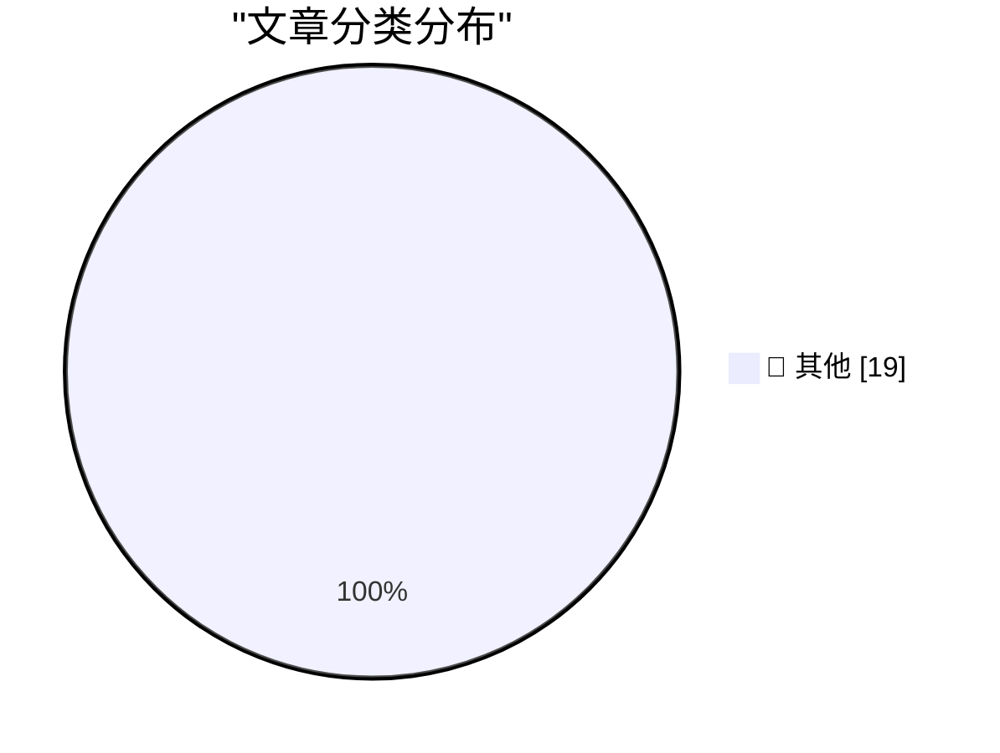

# 📰 AI 博客每日精选

**日期**: 2026-06-10 &nbsp;|&nbsp; **精选**: 19 篇 &nbsp;|&nbsp; **时间范围**: 24 小时

> 📚 来自 Karpathy 推荐的 **92** 个顶级技术博客，经 AI 智能评分筛选

## 📑 目录

- [📝 今日看点](#-今日看点)
- [🏆 今日必读](#-今日必读)
- [📊 数据概览](#-数据概览)
- [📝 其他](#-其他) (19篇)

---

## 🏆 今日必读

### 🥇 [Initial impressions of Claude Fable 5](https://simonwillison.net/2026/Jun/9/claude-fable-5/#atom-everything)

📁 📝 其他
⏰ 22 分钟前
⭐ 评分 15/30

Initial impressions of Claude Fable 5

---

### 🥈 [Setting a custom price for a model in AgentsView](https://simonwillison.net/2026/Jun/9/agentsview-custom-model-price/#atom-everything)

📁 📝 其他
⏰ 2 小时前
⭐ 评分 15/30

Setting a custom price for a model in AgentsView

---

### 🥉 [Quoting Andrej Karpathy](https://simonwillison.net/2026/Jun/9/andrej-karpathy/#atom-everything)

📁 📝 其他
⏰ 5 小时前
⭐ 评分 15/30

Quoting Andrej Karpathy

---

## 📊 数据概览

84/92

扫描源

2501

抓取文章

19

时间范围内

19

AI 精选

### 🥧 分类分布

---

## 📝 其他 19篇

### 1. [Initial impressions of Claude Fable 5](https://simonwillison.net/2026/Jun/9/claude-fable-5/#atom-everything)

⭐ 综合评分
15/30

📁 simonwillison.net
⏰ 22 分钟前
🔖 R:5 Q:5 T:5

Initial impressions of Claude Fable 5

---

### 2. [Setting a custom price for a model in AgentsView](https://simonwillison.net/2026/Jun/9/agentsview-custom-model-price/#atom-everything)

⭐ 综合评分
15/30

📁 simonwillison.net
⏰ 2 小时前
🔖 R:5 Q:5 T:5

Setting a custom price for a model in AgentsView

---

### 3. [Quoting Andrej Karpathy](https://simonwillison.net/2026/Jun/9/andrej-karpathy/#atom-everything)

⭐ 综合评分
15/30

📁 simonwillison.net
⏰ 5 小时前
🔖 R:5 Q:5 T:5

Quoting Andrej Karpathy

---

### 4. [A Record-Breaking Patch Tuesday for June 2026](https://krebsonsecurity.com/2026/06/a-record-breaking-patch-tuesday-for-june-2026/)

⭐ 综合评分
15/30

📁 krebsonsecurity.com
⏰ 2 小时前
🔖 R:5 Q:5 T:5

A Record-Breaking Patch Tuesday for June 2026

---

### 5. [Apple OS 27: The Small Things](https://blog.oneberri.com/posts/wwdc26-the-small-things)

⭐ 综合评分
15/30

📁 daringfireball.net
⏰ 2 小时前
🔖 R:5 Q:5 T:5

Apple OS 27: The Small Things

---

### 6. [The Talk Show Live From WWDC: Tonight, In-Person and Streaming](https://ti.to/daringfireball/the-talk-show-live-from-wwdc-2026)

⭐ 综合评分
15/30

📁 daringfireball.net
⏰ 5 小时前
🔖 R:5 Q:5 T:5

The Talk Show Live From WWDC: Tonight, In-Person and Streaming

---

### 7. [Apple WWDC 2026 Keynote](https://www.youtube.com/watch?v=hF8swzNR1-o)

⭐ 综合评分
15/30

📁 daringfireball.net
⏰ 6 小时前
🔖 R:5 Q:5 T:5

Apple WWDC 2026 Keynote

---

### 8. [Apple’s WWDC AI Demos Were Real and in Real Time](https://techcrunch.com/2026/06/08/apples-wwdc-ai-demos-looked-more-real-after-250m-false-ad-settlement/)

⭐ 综合评分
15/30

📁 daringfireball.net
⏰ 6 小时前
🔖 R:5 Q:5 T:5

Apple’s WWDC AI Demos Were Real and in Real Time

---

### 9. [Apple Introduces Siri AI](https://www.apple.com/newsroom/2026/06/apple-introduces-siri-ai-a-profoundly-more-capable-and-personal-assistant/)

⭐ 综合评分
15/30

📁 daringfireball.net
⏰ 6 小时前
🔖 R:5 Q:5 T:5

Apple Introduces Siri AI

---

### 10. [Apple’s WWDC Announcement of the New Apple Intelligence System](https://www.apple.com/newsroom/2026/06/apple-intelligence-brings-powerful-ai-capabilities-into-everyday-experiences/)

⭐ 综合评分
15/30

📁 daringfireball.net
⏰ 7 小时前
🔖 R:5 Q:5 T:5

Apple’s WWDC Announcement of the New Apple Intelligence System

---

### 11. [[Sponsor] WorkOS Launches auth.md — an Open Protocol for Agent Registration](https://youtu.be/Dqp_b8GHLXU?t=1074)

⭐ 综合评分
15/30

📁 daringfireball.net
⏰ 19 小时前
🔖 R:5 Q:5 T:5

[Sponsor] WorkOS Launches auth.md — an Open Protocol for Agent Registration

---

### 12. [From the Annals of People Having Knowledge of the Matter, Siri AI Extensions Edition](https://www.bloomberg.com/news/articles/2026-03-26/apple-plans-to-open-up-siri-to-rival-ai-assistants-beyond-chatgpt-in-ios-27)

⭐ 综合评分
15/30

📁 daringfireball.net
⏰ 22 小时前
🔖 R:5 Q:5 T:5

From the Annals of People Having Knowledge of the Matter, Siri AI Extensions Edition

---

### 13. [Pluralistic: Naomi Kritzer's "Obstetrix" (09 Jun 2026)](https://pluralistic.net/2026/06/09/deliver-us/)

⭐ 综合评分
15/30

📁 pluralistic.net
⏰ 10 小时前
🔖 R:5 Q:5 T:5

Pluralistic: Naomi Kritzer's "Obstetrix" (09 Jun 2026)

---

### 14. [The Microsoft Company Party where everybody played name tag swap](https://devblogs.microsoft.com/oldnewthing/20260609-00/?p=112409)

⭐ 综合评分
15/30

📁 devblogs.microsoft.com/oldnewthing
⏰ 10 小时前
🔖 R:5 Q:5 T:5

The Microsoft Company Party where everybody played name tag swap

---

### 15. [The revenge of Claude Mythos](https://garymarcus.substack.com/p/the-revenge-of-claude-mythos)

⭐ 综合评分
15/30

📁 garymarcus.substack.com
⏰ 6 小时前
🔖 R:5 Q:5 T:5

The revenge of Claude Mythos

---

### 16. [Forms of Open Source Government](https://nesbitt.io/2026/06/09/forms-of-open-source-government.html)

⭐ 综合评分
15/30

📁 nesbitt.io
⏰ 14 小时前
🔖 R:5 Q:5 T:5

Forms of Open Source Government

---

### 17. [Apple II: Launched June 10, 1977](https://dfarq.homeip.net/apple-ii-launched-june-10-1977/?utm_source=rss&#038;utm_medium=rss&#038;utm_campaign=apple-ii-launched-june-10-1977)

⭐ 综合评分
15/30

📁 dfarq.homeip.net
⏰ 13 小时前
🔖 R:5 Q:5 T:5

Apple II: Launched June 10, 1977

---

### 18. [Active recall](https://herman.bearblog.dev/active-recall/)

⭐ 综合评分
15/30

📁 herman.bearblog.dev
⏰ 9 小时前
🔖 R:5 Q:5 T:5

Active recall

---

### 19. [Stop eating Lady Gaga's Oreos](https://www.experimental-history.com/p/stop-eating-lady-gagas-oreos)

⭐ 综合评分
15/30

📁 experimental-history.com
⏰ 7 小时前
🔖 R:5 Q:5 T:5

Stop eating Lady Gaga's Oreos

---

生成于 2026-06-10 00:22 | 扫描 <strong>84</strong> 源 → 获取 <strong>2501</strong> 篇 → 精选 <strong>19</strong> 篇
 
基于 <a href="https://refactoringenglish.com/tools/hn-popularity/" style="color: #667eea;">Hacker News Popularity Contest 2025</a> RSS 源列表，由 <a href="https://x.com/karpathy" style="color: #667eea;">Andrej Karpathy</a> 推荐
 
由「懂点儿 AI」制作，欢迎关注同名微信公众号获取更多 AI 实用技巧 💡

