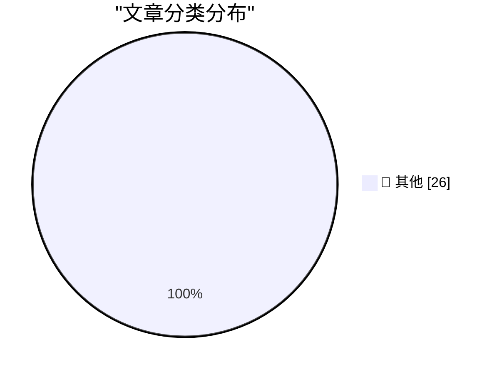

# 📰 AI 博客每日精选

**日期**: 2026-07-01 &nbsp;|&nbsp; **精选**: 26 篇 &nbsp;|&nbsp; **时间范围**: 24 小时

> 📚 来自 Karpathy 推荐的 **92** 个顶级技术博客，经 AI 智能评分筛选

## 📑 目录

- [📝 今日看点](#-今日看点)
- [🏆 今日必读](#-今日必读)
- [📊 数据概览](#-数据概览)
- [📝 其他](#-其他) (26篇)

---

## 🏆 今日必读

### 🥇 [Nano Banana 2 Lite](https://simonwillison.net/2026/Jun/30/nano-banana-2-lite/#atom-everything)

📁 📝 其他
⏰ 1 小时前
⭐ 评分 15/30

Nano Banana 2 Lite

---

### 🥈 [What's new in Claude Sonnet 5](https://simonwillison.net/2026/Jun/30/claude-sonnet-5/#atom-everything)

📁 📝 其他
⏰ 2 小时前
⭐ 评分 15/30

What's new in Claude Sonnet 5

---

### 🥉 [The AI Compass](https://simonwillison.net/2026/Jun/30/the-ai-compass/#atom-everything)

📁 📝 其他
⏰ 6 小时前
⭐ 评分 15/30

The AI Compass

---

## 📊 数据概览

84/92

扫描源

2518

抓取文章

26

时间范围内

26

AI 精选

### 🥧 分类分布

---

## 📝 其他 26篇

### 1. [Nano Banana 2 Lite](https://simonwillison.net/2026/Jun/30/nano-banana-2-lite/#atom-everything)

⭐ 综合评分
15/30

📁 simonwillison.net
⏰ 1 小时前
🔖 R:5 Q:5 T:5

Nano Banana 2 Lite

---

### 2. [What's new in Claude Sonnet 5](https://simonwillison.net/2026/Jun/30/claude-sonnet-5/#atom-everything)

⭐ 综合评分
15/30

📁 simonwillison.net
⏰ 2 小时前
🔖 R:5 Q:5 T:5

What's new in Claude Sonnet 5

---

### 3. [The AI Compass](https://simonwillison.net/2026/Jun/30/the-ai-compass/#atom-everything)

⭐ 综合评分
15/30

📁 simonwillison.net
⏰ 6 小时前
🔖 R:5 Q:5 T:5

The AI Compass

---

### 4. [Have your agent record video demos of its work with shot-scraper video](https://simonwillison.net/2026/Jun/30/shot-scraper-video/#atom-everything)

⭐ 综合评分
15/30

📁 simonwillison.net
⏰ 7 小时前
🔖 R:5 Q:5 T:5

Have your agent record video demos of its work with shot-scraper video

---

### 5. [shot-scraper 1.10](https://simonwillison.net/2026/Jun/30/shot-scraper/#atom-everything)

⭐ 综合评分
15/30

📁 simonwillison.net
⏰ 8 小时前
🔖 R:5 Q:5 T:5

shot-scraper 1.10

---

### 6. [Gnome](https://lexfriedman.com/gnome/)

⭐ 综合评分
15/30

📁 daringfireball.net
⏰ 3 小时前
🔖 R:5 Q:5 T:5

Gnome

---

### 7. [Supreme Court Agrees to Review Apple’s Petition Regarding Civil Contempt Finding in ‘Apple v. Epic Games’](https://www.supremecourt.gov/orders/courtorders/063026zor_3f14.pdf)

⭐ 综合评分
15/30

📁 daringfireball.net
⏰ 3 小时前
🔖 R:5 Q:5 T:5

Supreme Court Agrees to Review Apple’s Petition Regarding Civil Contempt Finding in ‘Apple v. Epic Games’

---

### 8. [Supreme Court Upholds Birthright Citizenship in 6-3 Decision](https://talkingpointsmemo.com/edblog/the-birthright-citizenship-decision-is-more-evidence-for-court-reform/sharetoken/e2bf9547-fa9b-468c-8af3-aa09e72ca698)

⭐ 综合评分
15/30

📁 daringfireball.net
⏰ 4 小时前
🔖 R:5 Q:5 T:5

Supreme Court Upholds Birthright Citizenship in 6-3 Decision

---

### 9. [★ The Supreme Court Rules That Law Enforcement’s Use of ‘Geofence Warrant’ Was a ‘Search’ (But May Be Moot, Technically, Since 2024)](https://daringfireball.net/2026/06/scotus_geofence_warrant_search)

⭐ 综合评分
15/30

📁 daringfireball.net
⏰ 5 小时前
🔖 R:5 Q:5 T:5

★ The Supreme Court Rules That Law Enforcement’s Use of ‘Geofence Warrant’ Was a ‘Search’ (But May Be Moot, Technically, Since 2024)

---

### 10. [Three Players From the Japanese Men’s National Team vs. 100 School Children](https://x.com/BallStreet/status/950382135969566720)

⭐ 综合评分
15/30

📁 daringfireball.net
⏰ 5 小时前
🔖 R:5 Q:5 T:5

Three Players From the Japanese Men’s National Team vs. 100 School Children

---

### 11. [CMA Consultation on Mobile App Steering and NFC Access](https://www.gov.uk/government/news/cma-consults-on-new-requirements-for-apple-and-googles-mobile-platforms)

⭐ 综合评分
15/30

📁 daringfireball.net
⏰ 7 小时前
🔖 R:5 Q:5 T:5

CMA Consultation on Mobile App Steering and NFC Access

---

### 12. [U.K. Regulator Considers Requiring App Store to Allow Steering to the Web, and iOS NFC to Be Open](https://www.reuters.com/world/uk-regulator-proposes-easing-apple-google-app-store-payment-rules-2026-06-30/)

⭐ 综合评分
15/30

📁 daringfireball.net
⏰ 8 小时前
🔖 R:5 Q:5 T:5

U.K. Regulator Considers Requiring App Store to Allow Steering to the Web, and iOS NFC to Be Open

---

### 13. [Data Breach at Indian Supplier Tata Electronics Exposes iPhone 18 Pro Details and Photos](https://www.reuters.com/business/media-telecom/apple-iphone-18-pro-supplier-list-parts-photos-exposed-tata-data-leak-2026-06-29/)

⭐ 综合评分
15/30

📁 daringfireball.net
⏰ 23 小时前
🔖 R:5 Q:5 T:5

Data Breach at Indian Supplier Tata Electronics Exposes iPhone 18 Pro Details and Photos

---

### 14. [The Dating App Plot Device](https://idiallo.com/blog/dating-plot-device)

⭐ 综合评分
15/30

📁 idiallo.com
⏰ 17 小时前
🔖 R:5 Q:5 T:5

The Dating App Plot Device

---

### 15. [Pluralistic: Jo Walton's "Everybody's Perfect" (30 Jun 2026)](https://pluralistic.net/2026/06/30/serenissima/)

⭐ 综合评分
15/30

📁 pluralistic.net
⏰ 12 小时前
🔖 R:5 Q:5 T:5

Pluralistic: Jo Walton's "Everybody's Perfect" (30 Jun 2026)

---

### 16. [Book Review: Fake Creativity by Blake Loch ★★★☆☆](https://shkspr.mobi/blog/2026/06/book-review-fake-creativity-by-blake-loch/)

⭐ 综合评分
15/30

📁 shkspr.mobi
⏰ 12 小时前
🔖 R:5 Q:5 T:5

Book Review: Fake Creativity by Blake Loch ★★★☆☆

---

### 17. [A compatibility note on the abuse of Windows window class extra bytes](https://devblogs.microsoft.com/oldnewthing/20260630-00/?p=112488)

⭐ 综合评分
15/30

📁 devblogs.microsoft.com/oldnewthing
⏰ 10 小时前
🔖 R:5 Q:5 T:5

A compatibility note on the abuse of Windows window class extra bytes

---

### 18. [Distinguishing variables from parameters](https://www.johndcook.com/blog/2026/06/30/variables-and-parameters/)

⭐ 综合评分
15/30

📁 johndcook.com
⏰ 5 小时前
🔖 R:5 Q:5 T:5

Distinguishing variables from parameters

---

### 19. [Silver Rectangles and the Ways of Kings](https://www.johndcook.com/blog/2026/06/30/silver-kings/)

⭐ 综合评分
15/30

📁 johndcook.com
⏰ 9 小时前
🔖 R:5 Q:5 T:5

Silver Rectangles and the Ways of Kings

---

### 20. [Derivative equals inverse](https://www.johndcook.com/blog/2026/06/29/derivative-equals-inverse/)

⭐ 综合评分
15/30

📁 johndcook.com
⏰ 23 小时前
🔖 R:5 Q:5 T:5

Derivative equals inverse

---

### 21. [Writing an LLM from scratch, part 34a -- building a JAX training loop for an LLM training run](https://www.gilesthomas.com/2026/06/llm-from-scratch-34a-building-a-jax-training-loop-for-an-llm-training-run)

⭐ 综合评分
15/30

📁 gilesthomas.com
⏰ 5 小时前
🔖 R:5 Q:5 T:5

Writing an LLM from scratch, part 34a -- building a JAX training loop for an LLM training run

---

### 22. [Taking Roads and Bridges literally](https://nesbitt.io/2026/06/30/taking-roads-and-bridges-literally.html)

⭐ 综合评分
15/30

📁 nesbitt.io
⏰ 14 小时前
🔖 R:5 Q:5 T:5

Taking Roads and Bridges literally

---

### 23. [Grant Sanderson – AI and the future of math](https://www.dwarkesh.com/p/grant-sanderson-2)

⭐ 综合评分
15/30

📁 dwarkesh.com
⏰ 8 小时前
🔖 R:5 Q:5 T:5

Grant Sanderson – AI and the future of math

---

### 24. [The AI Industry Is Losing](https://www.wheresyoured.at/the-ai-industry-is-losing/)

⭐ 综合评分
15/30

📁 wheresyoured.at
⏰ 8 小时前
🔖 R:5 Q:5 T:5

The AI Industry Is Losing

---

### 25. [Apricot Computers: An underrated British brand](https://dfarq.homeip.net/apricot-computers-an-underrated-british-brand/?utm_source=rss&#038;utm_medium=rss&#038;utm_campaign=apricot-computers-an-underrated-british-brand)

⭐ 综合评分
15/30

📁 dfarq.homeip.net
⏰ 13 小时前
🔖 R:5 Q:5 T:5

Apricot Computers: An underrated British brand

---

### 26. [Weekly Update 510: Live From Mallorca with Scott Helme](https://www.troyhunt.com/weekly-update-510/)

⭐ 综合评分
15/30

📁 troyhunt.com
⏰ 8 小时前
🔖 R:5 Q:5 T:5

Weekly Update 510: Live From Mallorca with Scott Helme

---

生成于 2026-07-01 00:08 | 扫描 <strong>84</strong> 源 → 获取 <strong>2518</strong> 篇 → 精选 <strong>26</strong> 篇
 
基于 <a href="https://refactoringenglish.com/tools/hn-popularity/" style="color: #667eea;">Hacker News Popularity Contest 2025</a> RSS 源列表，由 <a href="https://x.com/karpathy" style="color: #667eea;">Andrej Karpathy</a> 推荐
 
由「懂点儿 AI」制作，欢迎关注同名微信公众号获取更多 AI 实用技巧 💡

