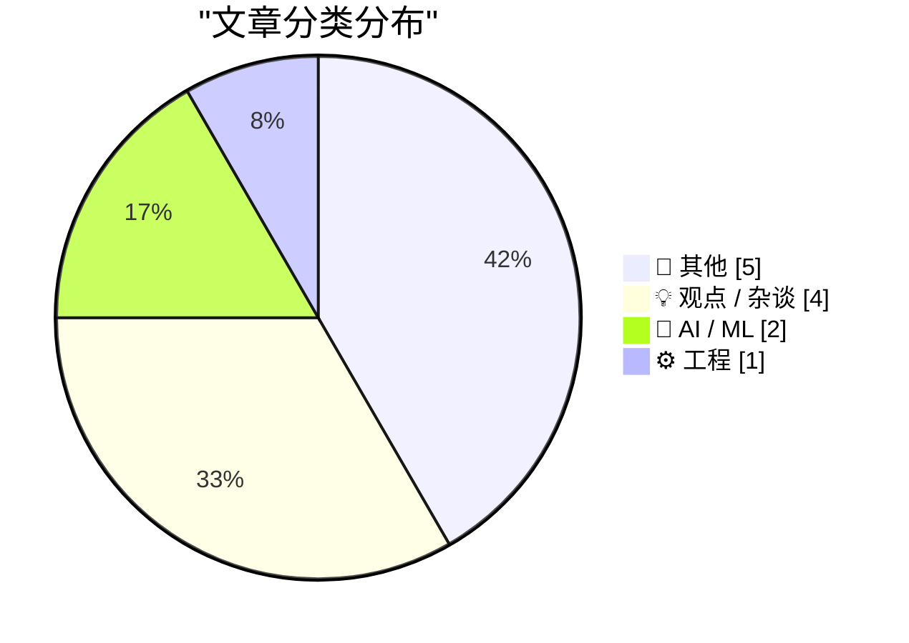
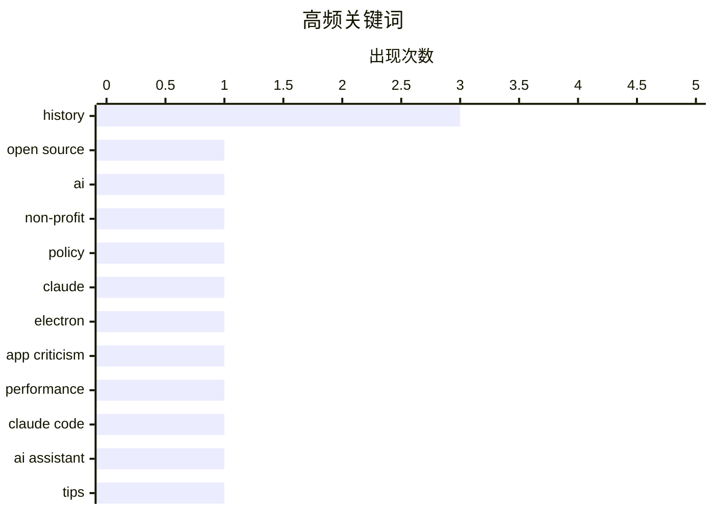

# 📰 AI 博客每日精选

**日期**: 2026-07-04 &nbsp;|&nbsp; **精选**: 12 篇 &nbsp;|&nbsp; **时间范围**: 24 小时

> 📚 来自 Karpathy 推荐的 **92** 个顶级技术博客，经 AI 智能评分筛选

## 📑 目录

- [📝 今日看点](#-今日看点)
- [🏆 今日必读](#-今日必读)
- [📊 数据概览](#-数据概览)
- [📝 其他](#-其他) (5篇)
- [💡 观点 / 杂谈](#-观点---杂谈) (4篇)
- [🤖 AI / ML](#-ai---ml) (2篇)
- [⚙️ 工程](#-工程) (1篇)

---

## 📝 今日看点

<div style="background: linear-gradient(135deg, #667eea 0%, #764ba2 100%); padding: 16px 20px; border-radius: 12px; color: white; margin: 20px 0;">

今日技术圈聚焦两大趋势：AI基础设施的公共化与工具体验的深层矛盾。一方面，巴黎AI峰会上成立的“Current AI”组织携4亿美元资金发布“差距地图”，试图构建开源AI的公共选项；另一方面，Claude桌面应用因Electron框架性能问题遭尖锐批评，暴露出AI工具在工程实现与用户体验间的割裂。同时，编程抽象化带来的“氛围编码”现象引发反思，开发者开始警惕过度依赖高抽象层而丧失对底层逻辑的掌控力。

</div>

---

## 🏆 今日必读

### 🥇 [开源 AI 差距地图](https://simonwillison.net/2026/Jul/3/open-source-ai-gap-map/#atom-everything)

<div style="display: flex; gap: 16px; flex-wrap: wrap; margin: 12px 0; font-size: 14px; color: #666;">
<span>📁 🤖 AI / ML</span>
<span>⏰ 2 小时前</span>
<span>⭐ 评分 24/30</span>
</div>

<div style="background: #f8f9fa; border-left: 4px solid #667eea; padding: 16px 20px; border-radius: 8px; margin: 16px 0;">

Current AI 是一个在 2025 年巴黎 AI 行动峰会上成立的非营利组织，已获得 4 亿美元承诺资金，旨在构建“AI 公共选项”。该组织发布了“差距地图”（Gap Map）v0.1 版本，试图系统性地索引当前开源 AI 生态中存在的空白和不足。该地图旨在帮助社区识别哪些领域缺乏高质量的开源模型、数据集或工具，从而引导资源投入。这是对全球开源 AI 基础设施进行的一次结构化盘点，为后续的针对性发展提供了路线图。

</div>

**💡 为什么值得读**: 如果你关心开源 AI 生态的现状与短板，这份由 4 亿美元背书的非营利组织发布的差距地图，是了解“哪里最需要你”的权威指南。

**🏷️ 标签**: <span style="display:inline-block;background:#e3f2fd;color:#1976D2;padding:4px 12px;border-radius:16px;font-size:12px;margin-right:6px;">Open Source</span><span style="display:inline-block;background:#e3f2fd;color:#1976D2;padding:4px 12px;border-radius:16px;font-size:12px;margin-right:6px;">AI</span><span style="display:inline-block;background:#e3f2fd;color:#1976D2;padding:4px 12px;border-radius:16px;font-size:12px;margin-right:6px;">non-profit</span><span style="display:inline-block;background:#e3f2fd;color:#1976D2;padding:4px 12px;border-radius:16px;font-size:12px;margin-right:6px;">policy</span>

---

### 🥈 [Claude 糟糕透顶的 Electron Mac 应用是“内鬼”干的](https://daringfireball.net/2026/07/claudes_criminally_bad_mac_app_is_an_inside_job)

<div style="display: flex; gap: 16px; flex-wrap: wrap; margin: 12px 0; font-size: 14px; color: #666;">
<span>📁 💡 观点 / 杂谈</span>
<span>⏰ 3 小时前</span>
<span>⭐ 评分 23/30</span>
</div>

<div style="background: #f8f9fa; border-left: 4px solid #667eea; padding: 16px 20px; border-radius: 8px; margin: 16px 0;">

文章尖锐批评了 Claude 的 Mac 桌面应用，指出其基于 Electron 框架导致性能低下、体验糟糕。作者发现，Claude 桌面应用的主要开发者 Felix Rieseberg 恰好是 Electron 框架的创始人和主要维护者。文章将此比喻为“负责盖楼的人恰好是全世界最大锤子制造商的老板”，暗示技术选型并非基于用户最佳体验，而是开发者个人利益和偏好的结果。结论是，Claude 应用之所以是 Electron 架构，是因为决策者本身就是 Electron 的既得利益者。

</div>

**💡 为什么值得读**: 这篇文章揭露了一个令人震惊的利益冲突：Claude 糟糕的 Mac 应用体验，根源在于其开发者正是 Electron 框架的创始人，值得所有关心软件质量和技术选型的人深思。

**🏷️ 标签**: <span style="display:inline-block;background:#e3f2fd;color:#1976D2;padding:4px 12px;border-radius:16px;font-size:12px;margin-right:6px;">Claude</span><span style="display:inline-block;background:#e3f2fd;color:#1976D2;padding:4px 12px;border-radius:16px;font-size:12px;margin-right:6px;">Electron</span><span style="display:inline-block;background:#e3f2fd;color:#1976D2;padding:4px 12px;border-radius:16px;font-size:12px;margin-right:6px;">app criticism</span><span style="display:inline-block;background:#e3f2fd;color:#1976D2;padding:4px 12px;border-radius:16px;font-size:12px;margin-right:6px;">performance</span>

---

### 🥉 [Fable 的判断力](https://simonwillison.net/2026/Jul/3/judgement/#atom-everything)

<div style="display: flex; gap: 16px; flex-wrap: wrap; margin: 12px 0; font-size: 14px; color: #666;">
<span>📁 🤖 AI / ML</span>
<span>⏰ 5 小时前</span>
<span>⭐ 评分 21/30</span>
</div>

<div style="background: #f8f9fa; border-left: 4px solid #667eea; padding: 16px 20px; border-radius: 8px; margin: 16px 0;">

在与 Claude Code 团队 Cat Wu 和 Thariq Shihipar 的炉边谈话中，作者获得了一个关键建议：让 AI 模型（如 Fable 和 Opus）自主判断工作方式，而非事无巨细地指令。以测试为例，直接告诉 Fable“只对大型功能使用自动化测试”效果更好，而不是规定它每一步如何执行。这种方法利用了模型自身的推理能力，反而能产出更合理、更高效的结果。核心观点是，过度约束会扼杀 AI 的潜力，信任并赋予其判断权是更优的协作策略。

</div>

**💡 为什么值得读**: 来自 Claude Code 团队的一手经验：别再手把手教 AI 做事了，让它自己判断反而效果更好——这是提升 AI 编程效率的实用心法。

**🏷️ 标签**: <span style="display:inline-block;background:#e3f2fd;color:#1976D2;padding:4px 12px;border-radius:16px;font-size:12px;margin-right:6px;">Claude Code</span><span style="display:inline-block;background:#e3f2fd;color:#1976D2;padding:4px 12px;border-radius:16px;font-size:12px;margin-right:6px;">AI assistant</span><span style="display:inline-block;background:#e3f2fd;color:#1976D2;padding:4px 12px;border-radius:16px;font-size:12px;margin-right:6px;">tips</span>

---

## 📊 数据概览

<div style="display: grid; grid-template-columns: repeat(auto-fit, minmax(120px, 1fr)); gap: 12px; margin: 20px 0;">
<div style="background: #e8f4f8; padding: 16px; border-radius: 10px; text-align: center;">
<div style="font-size: 24px; font-weight: bold; color: #2196F3;">88/92</div>
<div style="font-size: 13px; color: #666; margin-top: 4px;">扫描源</div>
</div>
<div style="background: #fff3e0; padding: 16px; border-radius: 10px; text-align: center;">
<div style="font-size: 24px; font-weight: bold; color: #FF9800;">2588</div>
<div style="font-size: 13px; color: #666; margin-top: 4px;">抓取文章</div>
</div>
<div style="background: #f3e5f5; padding: 16px; border-radius: 10px; text-align: center;">
<div style="font-size: 24px; font-weight: bold; color: #9C27B0;">12</div>
<div style="font-size: 13px; color: #666; margin-top: 4px;">时间范围内</div>
</div>
<div style="background: #e8f5e9; padding: 16px; border-radius: 10px; text-align: center;">
<div style="font-size: 24px; font-weight: bold; color: #4CAF50;">12</div>
<div style="font-size: 13px; color: #666; margin-top: 4px;">AI 精选</div>
</div>
</div>

### 🥧 分类分布



### 📈 高频关键词



<details style="margin: 16px 0; padding: 12px; background: #f5f5f5; border-radius: 8px;">
<summary style="cursor: pointer; font-weight: 500;">📊 纯文本关键词图（终端友好）</summary>

```
history       │ ████████████████████ 3
open source   │ ███████░░░░░░░░░░░░░ 1
ai            │ ███████░░░░░░░░░░░░░ 1
non-profit    │ ███████░░░░░░░░░░░░░ 1
policy        │ ███████░░░░░░░░░░░░░ 1
claude        │ ███████░░░░░░░░░░░░░ 1
electron      │ ███████░░░░░░░░░░░░░ 1
app criticism │ ███████░░░░░░░░░░░░░ 1
performance   │ ███████░░░░░░░░░░░░░ 1
claude code   │ ███████░░░░░░░░░░░░░ 1
```

</details>

### 🏷️ 话题标签

<div style="line-height: 2; margin: 16px 0;">
**history**(3) · **open source**(1) · **ai**(1) · non-profit(1) · policy(1) · claude(1) · electron(1) · app criticism(1) · performance(1) · claude code(1) · ai assistant(1) · tips(1) · vibe coding(1) · abstraction(1) · syntax coloring(1) · view source(1) · data privacy(1) · deletion(1) · internet(1) · personal data(1)
</div>

---

<a id="-其他"></a>
## 📝 其他 <span style="background: #e0e0e0; padding: 2px 10px; border-radius: 12px; font-size: 13px; margin-left: 8px;">5篇</span>

### 1. [Maxis 的兴衰史，第一部分：模拟一切](https://www.filfre.net/2026/07/the-life-and-times-of-maxis-part-1-simeverything/)

<div style="margin: 10px 0;">
<div style="display: flex; justify-content: space-between; font-size: 13px; margin-bottom: 4px;">
<span>⭐ 综合评分</span>
<span style="font-weight: bold; color: #FF9800;">18/30</span>
</div>
<div style="background: #e0e0e0; height: 8px; border-radius: 4px; overflow: hidden;">
<div style="background: #FF9800; width: 60%; height: 100%; border-radius: 4px;"></div>
</div>
</div>

<div style="display: flex; gap: 12px; flex-wrap: wrap; font-size: 13px; color: #666; margin: 12px 0;">
<span>📁 filfre.net</span>
<span>⏰ 8 小时前</span>
<span>🔖 R:4 Q:9 T:5</span>
</div>

<div style="background: #fafafa; border-radius: 8px; padding: 16px; margin: 12px 0; line-height: 1.7;">
文章讲述了 Maxis 软件公司的早期历史，这家以《模拟城市》闻名的公司由威尔·莱特创立。Maxis 的核心哲学是“模拟一切”，从城市到蚂蚁，甚至大陆漂移这种看似枯燥的主题都能被做成有趣的模拟游戏。文章探讨了 Maxis 如何将复杂系统转化为引人入胜的游戏体验，以及这种独特理念如何塑造了其早期的成功。这是 Maxis 公司历史系列的第一部分，聚焦于其创始理念和早期作品。
</div>

<div style="margin: 12px 0;">
<span style="display: inline-block; background: #e3f2fd; color: #1976D2; padding: 4px 12px; border-radius: 16px; font-size: 12px; margin-right: 6px; margin-bottom: 4px;">Maxis</span><span style="display: inline-block; background: #e3f2fd; color: #1976D2; padding: 4px 12px; border-radius: 16px; font-size: 12px; margin-right: 6px; margin-bottom: 4px;">game development</span><span style="display: inline-block; background: #e3f2fd; color: #1976D2; padding: 4px 12px; border-radius: 16px; font-size: 12px; margin-right: 6px; margin-bottom: 4px;">history</span><span style="display: inline-block; background: #e3f2fd; color: #1976D2; padding: 4px 12px; border-radius: 16px; font-size: 12px; margin-right: 6px; margin-bottom: 4px;">SimCity</span>
</div>

---

### 2. [2026 年 6 月通讯](https://simonwillison.net/2026/Jul/3/june-newsletter/#atom-everything)

<div style="margin: 10px 0;">
<div style="display: flex; justify-content: space-between; font-size: 13px; margin-bottom: 4px;">
<span>⭐ 综合评分</span>
<span style="font-weight: bold; color: #f44336;">15/30</span>
</div>
<div style="background: #e0e0e0; height: 8px; border-radius: 4px; overflow: hidden;">
<div style="background: #f44336; width: 50%; height: 100%; border-radius: 4px;"></div>
</div>
</div>

<div style="display: flex; gap: 12px; flex-wrap: wrap; font-size: 13px; color: #666; margin: 12px 0;">
<span>📁 simonwillison.net</span>
<span>⏰ 9 小时前</span>
<span>🔖 R:3 Q:5 T:7</span>
</div>

<div style="background: #fafafa; border-radius: 8px; padding: 16px; margin: 12px 0; line-height: 1.7;">
Simon Willison 发布了 2026 年 6 月的赞助者专属月报。本期内容涵盖：Claude Fable 5、GPT-5.6 及美国出口限制；GLM-5.2 成为新的最佳开源权重模型；Tokenmaxxing 热潮已过；Datasette Apps 和 sqlite-utils 的最新进展。月报为赞助者提供了对当月 AI 和开源工具领域关键动态的独家深度解读。
</div>

<div style="margin: 12px 0;">
<span style="display: inline-block; background: #e3f2fd; color: #1976D2; padding: 4px 12px; border-radius: 16px; font-size: 12px; margin-right: 6px; margin-bottom: 4px;">newsletter</span><span style="display: inline-block; background: #e3f2fd; color: #1976D2; padding: 4px 12px; border-radius: 16px; font-size: 12px; margin-right: 6px; margin-bottom: 4px;">sponsors</span><span style="display: inline-block; background: #e3f2fd; color: #1976D2; padding: 4px 12px; border-radius: 16px; font-size: 12px; margin-right: 6px; margin-bottom: 4px;">monthly</span>
</div>

---

### 3. [螺旋蝇的衰落与崛起](https://www.construction-physics.com/p/the-fall-and-rise-of-screwworm)

<div style="margin: 10px 0;">
<div style="display: flex; justify-content: space-between; font-size: 13px; margin-bottom: 4px;">
<span>⭐ 综合评分</span>
<span style="font-weight: bold; color: #f44336;">14/30</span>
</div>
<div style="background: #e0e0e0; height: 8px; border-radius: 4px; overflow: hidden;">
<div style="background: #f44336; width: 47%; height: 100%; border-radius: 4px;"></div>
</div>
</div>

<div style="display: flex; gap: 12px; flex-wrap: wrap; font-size: 13px; color: #666; margin: 12px 0;">
<span>📁 construction-physics.com</span>
<span>⏰ 12 小时前</span>
<span>🔖 R:2 Q:8 T:4</span>
</div>

<div style="background: #fafafa; border-radius: 8px; padding: 16px; margin: 12px 0; line-height: 1.7;">
文章讲述了螺旋蝇（一种危害牲畜的寄生虫）的生态故事。每年春天，螺旋蝇都会从墨西哥和南德克萨斯的越冬地开始向北迁徙，这一规律持续了无数代。文章探讨了人类如何通过释放不育雄蝇等技术成功控制其种群，以及近年来该物种在某些地区出现反弹的原因。核心观点是，即使是看似被征服的害虫，在生态变化和防控松懈下也可能卷土重来。
</div>

<div style="margin: 12px 0;">
<span style="display: inline-block; background: #e3f2fd; color: #1976D2; padding: 4px 12px; border-radius: 16px; font-size: 12px; margin-right: 6px; margin-bottom: 4px;">screwworm</span><span style="display: inline-block; background: #e3f2fd; color: #1976D2; padding: 4px 12px; border-radius: 16px; font-size: 12px; margin-right: 6px; margin-bottom: 4px;">biology</span><span style="display: inline-block; background: #e3f2fd; color: #1976D2; padding: 4px 12px; border-radius: 16px; font-size: 12px; margin-right: 6px; margin-bottom: 4px;">history</span>
</div>

---

### 4. [Compute!’s Gazette magazine, 1983-1995](https://dfarq.homeip.net/computes-gazette-magazine-1983-1995/?utm_source=rss&#038;utm_medium=rss&#038;utm_campaign=computes-gazette-magazine-1983-1995)

<div style="margin: 10px 0;">
<div style="display: flex; justify-content: space-between; font-size: 13px; margin-bottom: 4px;">
<span>⭐ 综合评分</span>
<span style="font-weight: bold; color: #f44336;">14/30</span>
</div>
<div style="background: #e0e0e0; height: 8px; border-radius: 4px; overflow: hidden;">
<div style="background: #f44336; width: 47%; height: 100%; border-radius: 4px;"></div>
</div>
</div>

<div style="display: flex; gap: 12px; flex-wrap: wrap; font-size: 13px; color: #666; margin: 12px 0;">
<span>📁 dfarq.homeip.net</span>
<span>⏰ 13 小时前</span>
<span>🔖 R:3 Q:7 T:4</span>
</div>

<div style="background: #fafafa; border-radius: 8px; padding: 16px; margin: 12px 0; line-height: 1.7;">
In July 1983, one of my personal favorite Commodore computer magazines of all time, Compute!’s Gazette, was born. An offshoot of the general computer magazine Compute!, Gazette’s first issue was dated
</div>

<div style="margin: 12px 0;">
<span style="display: inline-block; background: #e3f2fd; color: #1976D2; padding: 4px 12px; border-radius: 16px; font-size: 12px; margin-right: 6px; margin-bottom: 4px;">Commodore</span><span style="display: inline-block; background: #e3f2fd; color: #1976D2; padding: 4px 12px; border-radius: 16px; font-size: 12px; margin-right: 6px; margin-bottom: 4px;">retro computing</span><span style="display: inline-block; background: #e3f2fd; color: #1976D2; padding: 4px 12px; border-radius: 16px; font-size: 12px; margin-right: 6px; margin-bottom: 4px;">magazine</span><span style="display: inline-block; background: #e3f2fd; color: #1976D2; padding: 4px 12px; border-radius: 16px; font-size: 12px; margin-right: 6px; margin-bottom: 4px;">history</span>
</div>

---

### 5. [Midnight Train to Stockholm](https://matduggan.com/midnight-train-to-stockholm/)

<div style="margin: 10px 0;">
<div style="display: flex; justify-content: space-between; font-size: 13px; margin-bottom: 4px;">
<span>⭐ 综合评分</span>
<span style="font-weight: bold; color: #f44336;">10/30</span>
</div>
<div style="background: #e0e0e0; height: 8px; border-radius: 4px; overflow: hidden;">
<div style="background: #f44336; width: 33%; height: 100%; border-radius: 4px;"></div>
</div>
</div>

<div style="display: flex; gap: 12px; flex-wrap: wrap; font-size: 13px; color: #666; margin: 12px 0;">
<span>📁 matduggan.com</span>
<span>⏰ 11 小时前</span>
<span>🔖 R:2 Q:5 T:3</span>
</div>

<div style="background: #fafafa; border-radius: 8px; padding: 16px; margin: 12px 0; line-height: 1.7;">
I was recently summoned to a meeting in Stockholm, a city I had somehow managed to avoid despite living in Copenhagen for years. My Swedish experience, up to this point, consisted entirely of trips to
</div>

<div style="margin: 12px 0;">
<span style="display: inline-block; background: #e3f2fd; color: #1976D2; padding: 4px 12px; border-radius: 16px; font-size: 12px; margin-right: 6px; margin-bottom: 4px;">travel</span><span style="display: inline-block; background: #e3f2fd; color: #1976D2; padding: 4px 12px; border-radius: 16px; font-size: 12px; margin-right: 6px; margin-bottom: 4px;">anecdote</span><span style="display: inline-block; background: #e3f2fd; color: #1976D2; padding: 4px 12px; border-radius: 16px; font-size: 12px; margin-right: 6px; margin-bottom: 4px;">Stockholm</span>
</div>

---

<a id="-观点---杂谈"></a>
## 💡 观点 / 杂谈 <span style="background: #e0e0e0; padding: 2px 10px; border-radius: 12px; font-size: 13px; margin-left: 8px;">4篇</span>

### 6. [Claude 糟糕透顶的 Electron Mac 应用是“内鬼”干的](https://daringfireball.net/2026/07/claudes_criminally_bad_mac_app_is_an_inside_job)

<div style="margin: 10px 0;">
<div style="display: flex; justify-content: space-between; font-size: 13px; margin-bottom: 4px;">
<span>⭐ 综合评分</span>
<span style="font-weight: bold; color: #FF9800;">23/30</span>
</div>
<div style="background: #e0e0e0; height: 8px; border-radius: 4px; overflow: hidden;">
<div style="background: #FF9800; width: 77%; height: 100%; border-radius: 4px;"></div>
</div>
</div>

<div style="display: flex; gap: 12px; flex-wrap: wrap; font-size: 13px; color: #666; margin: 12px 0;">
<span>📁 daringfireball.net</span>
<span>⏰ 3 小时前</span>
<span>🔖 R:7 Q:8 T:8</span>
</div>

<div style="background: #fafafa; border-radius: 8px; padding: 16px; margin: 12px 0; line-height: 1.7;">
文章尖锐批评了 Claude 的 Mac 桌面应用，指出其基于 Electron 框架导致性能低下、体验糟糕。作者发现，Claude 桌面应用的主要开发者 Felix Rieseberg 恰好是 Electron 框架的创始人和主要维护者。文章将此比喻为“负责盖楼的人恰好是全世界最大锤子制造商的老板”，暗示技术选型并非基于用户最佳体验，而是开发者个人利益和偏好的结果。结论是，Claude 应用之所以是 Electron 架构，是因为决策者本身就是 Electron 的既得利益者。
</div>

<div style="margin: 12px 0;">
<span style="display: inline-block; background: #e3f2fd; color: #1976D2; padding: 4px 12px; border-radius: 16px; font-size: 12px; margin-right: 6px; margin-bottom: 4px;">Claude</span><span style="display: inline-block; background: #e3f2fd; color: #1976D2; padding: 4px 12px; border-radius: 16px; font-size: 12px; margin-right: 6px; margin-bottom: 4px;">Electron</span><span style="display: inline-block; background: #e3f2fd; color: #1976D2; padding: 4px 12px; border-radius: 16px; font-size: 12px; margin-right: 6px; margin-bottom: 4px;">app criticism</span><span style="display: inline-block; background: #e3f2fd; color: #1976D2; padding: 4px 12px; border-radius: 16px; font-size: 12px; margin-right: 6px; margin-bottom: 4px;">performance</span>
</div>

---

### 7. [Pluralistic：CARDiac、语法着色、查看源代码与氛围编码](https://pluralistic.net/2026/07/03/rod-logic/)

<div style="margin: 10px 0;">
<div style="display: flex; justify-content: space-between; font-size: 13px; margin-bottom: 4px;">
<span>⭐ 综合评分</span>
<span style="font-weight: bold; color: #FF9800;">21/30</span>
</div>
<div style="background: #e0e0e0; height: 8px; border-radius: 4px; overflow: hidden;">
<div style="background: #FF9800; width: 70%; height: 100%; border-radius: 4px;"></div>
</div>
</div>

<div style="display: flex; gap: 12px; flex-wrap: wrap; font-size: 13px; color: #666; margin: 12px 0;">
<span>📁 pluralistic.net</span>
<span>⏰ 15 小时前</span>
<span>🔖 R:6 Q:8 T:7</span>
</div>

<div style="background: #fafafa; border-radius: 8px; padding: 16px; margin: 12px 0; line-height: 1.7;">
文章探讨了编程抽象化带来的双刃剑效应：强大的抽象能力赋予巨大便利，但也伴随着责任和保真度的损失。作者将“氛围编码”（Vibe Code）与“查看源代码”和“语法着色”等传统实践进行对比，指出过度依赖高级抽象可能导致开发者失去对底层细节的理解和控制。核心论点是，随着抽象层级的提升，开发者必须警惕信息保真度的下降，并在便利性与理解深度之间找到平衡。
</div>

<div style="margin: 12px 0;">
<span style="display: inline-block; background: #e3f2fd; color: #1976D2; padding: 4px 12px; border-radius: 16px; font-size: 12px; margin-right: 6px; margin-bottom: 4px;">vibe coding</span><span style="display: inline-block; background: #e3f2fd; color: #1976D2; padding: 4px 12px; border-radius: 16px; font-size: 12px; margin-right: 6px; margin-bottom: 4px;">abstraction</span><span style="display: inline-block; background: #e3f2fd; color: #1976D2; padding: 4px 12px; border-radius: 16px; font-size: 12px; margin-right: 6px; margin-bottom: 4px;">syntax coloring</span><span style="display: inline-block; background: #e3f2fd; color: #1976D2; padding: 4px 12px; border-radius: 16px; font-size: 12px; margin-right: 6px; margin-bottom: 4px;">view source</span>
</div>

---

### 8. [游泳池、尿和试图从互联网上删除你的数据](https://www.troyhunt.com/swimming-pools-pee-and-trying-to-delete-your-data-from-the-internet/)

<div style="margin: 10px 0;">
<div style="display: flex; justify-content: space-between; font-size: 13px; margin-bottom: 4px;">
<span>⭐ 综合评分</span>
<span style="font-weight: bold; color: #FF9800;">19/30</span>
</div>
<div style="background: #e0e0e0; height: 8px; border-radius: 4px; overflow: hidden;">
<div style="background: #FF9800; width: 63%; height: 100%; border-radius: 4px;"></div>
</div>
</div>

<div style="display: flex; gap: 12px; flex-wrap: wrap; font-size: 13px; color: #666; margin: 12px 0;">
<span>📁 troyhunt.com</span>
<span>⏰ 17 小时前</span>
<span>🔖 R:6 Q:7 T:6</span>
</div>

<div style="background: #fafafa; border-radius: 8px; padding: 16px; margin: 12px 0; line-height: 1.7;">
文章以一个广为流传的比喻开篇：试图从互联网上删除自己的数据，就像试图在游泳池里把尿弄出去一样徒劳。作者 Troy Hunt 指出，数据一旦被分享、复制、缓存或存档，就几乎不可能被彻底清除。他通过这个生动的类比，解释了数据持久性的本质和“被遗忘权”在技术实现上的巨大挑战。核心观点是，互联网没有“删除”按钮，预防和谨慎分享才是保护隐私的唯一有效手段。
</div>

<div style="margin: 12px 0;">
<span style="display: inline-block; background: #e3f2fd; color: #1976D2; padding: 4px 12px; border-radius: 16px; font-size: 12px; margin-right: 6px; margin-bottom: 4px;">data privacy</span><span style="display: inline-block; background: #e3f2fd; color: #1976D2; padding: 4px 12px; border-radius: 16px; font-size: 12px; margin-right: 6px; margin-bottom: 4px;">deletion</span><span style="display: inline-block; background: #e3f2fd; color: #1976D2; padding: 4px 12px; border-radius: 16px; font-size: 12px; margin-right: 6px; margin-bottom: 4px;">internet</span><span style="display: inline-block; background: #e3f2fd; color: #1976D2; padding: 4px 12px; border-radius: 16px; font-size: 12px; margin-right: 6px; margin-bottom: 4px;">personal data</span>
</div>

---

### 9. [引用 Josh W. Comeau](https://simonwillison.net/2026/Jul/3/josh-w-comeau/#atom-everything)

<div style="margin: 10px 0;">
<div style="display: flex; justify-content: space-between; font-size: 13px; margin-bottom: 4px;">
<span>⭐ 综合评分</span>
<span style="font-weight: bold; color: #f44336;">17/30</span>
</div>
<div style="background: #e0e0e0; height: 8px; border-radius: 4px; overflow: hidden;">
<div style="background: #f44336; width: 57%; height: 100%; border-radius: 4px;"></div>
</div>
</div>

<div style="display: flex; gap: 12px; flex-wrap: wrap; font-size: 13px; color: #666; margin: 12px 0;">
<span>📁 simonwillison.net</span>
<span>⏰ 2 小时前</span>
<span>🔖 R:5 Q:6 T:6</span>
</div>

<div style="background: #fafafa; border-radius: 8px; padding: 16px; margin: 12px 0; line-height: 1.7;">
前端开发者 Josh W. Comeau 透露，他新发布的课程《Whimsical Animations》销量仅为典型课程发布的三分之一，且他现有的两门课程销量也较去年大幅下滑。他认为 AI 是主要原因，并提出了“双重打击”：一方面，许多人怀疑开发者是否还有必要学习这些技能；另一方面，AI 工具让初学者能直接产出结果，降低了学习传统课程的动力。核心观点是，AI 正在从根本上改变开发者学习新技术的意愿和方式，对传统技术教育市场造成了显著冲击。
</div>

<div style="margin: 12px 0;">
<span style="display: inline-block; background: #e3f2fd; color: #1976D2; padding: 4px 12px; border-radius: 16px; font-size: 12px; margin-right: 6px; margin-bottom: 4px;">course sales</span><span style="display: inline-block; background: #e3f2fd; color: #1976D2; padding: 4px 12px; border-radius: 16px; font-size: 12px; margin-right: 6px; margin-bottom: 4px;">developer education</span><span style="display: inline-block; background: #e3f2fd; color: #1976D2; padding: 4px 12px; border-radius: 16px; font-size: 12px; margin-right: 6px; margin-bottom: 4px;">market trends</span>
</div>

---

<a id="-ai---ml"></a>
## 🤖 AI / ML <span style="background: #e0e0e0; padding: 2px 10px; border-radius: 12px; font-size: 13px; margin-left: 8px;">2篇</span>

### 10. [开源 AI 差距地图](https://simonwillison.net/2026/Jul/3/open-source-ai-gap-map/#atom-everything)

<div style="margin: 10px 0;">
<div style="display: flex; justify-content: space-between; font-size: 13px; margin-bottom: 4px;">
<span>⭐ 综合评分</span>
<span style="font-weight: bold; color: #4CAF50;">24/30</span>
</div>
<div style="background: #e0e0e0; height: 8px; border-radius: 4px; overflow: hidden;">
<div style="background: #4CAF50; width: 80%; height: 100%; border-radius: 4px;"></div>
</div>
</div>

<div style="display: flex; gap: 12px; flex-wrap: wrap; font-size: 13px; color: #666; margin: 12px 0;">
<span>📁 simonwillison.net</span>
<span>⏰ 2 小时前</span>
<span>🔖 R:8 Q:7 T:9</span>
</div>

<div style="background: #fafafa; border-radius: 8px; padding: 16px; margin: 12px 0; line-height: 1.7;">
Current AI 是一个在 2025 年巴黎 AI 行动峰会上成立的非营利组织，已获得 4 亿美元承诺资金，旨在构建“AI 公共选项”。该组织发布了“差距地图”（Gap Map）v0.1 版本，试图系统性地索引当前开源 AI 生态中存在的空白和不足。该地图旨在帮助社区识别哪些领域缺乏高质量的开源模型、数据集或工具，从而引导资源投入。这是对全球开源 AI 基础设施进行的一次结构化盘点，为后续的针对性发展提供了路线图。
</div>

<div style="margin: 12px 0;">
<span style="display: inline-block; background: #e3f2fd; color: #1976D2; padding: 4px 12px; border-radius: 16px; font-size: 12px; margin-right: 6px; margin-bottom: 4px;">Open Source</span><span style="display: inline-block; background: #e3f2fd; color: #1976D2; padding: 4px 12px; border-radius: 16px; font-size: 12px; margin-right: 6px; margin-bottom: 4px;">AI</span><span style="display: inline-block; background: #e3f2fd; color: #1976D2; padding: 4px 12px; border-radius: 16px; font-size: 12px; margin-right: 6px; margin-bottom: 4px;">non-profit</span><span style="display: inline-block; background: #e3f2fd; color: #1976D2; padding: 4px 12px; border-radius: 16px; font-size: 12px; margin-right: 6px; margin-bottom: 4px;">policy</span>
</div>

---

### 11. [Fable 的判断力](https://simonwillison.net/2026/Jul/3/judgement/#atom-everything)

<div style="margin: 10px 0;">
<div style="display: flex; justify-content: space-between; font-size: 13px; margin-bottom: 4px;">
<span>⭐ 综合评分</span>
<span style="font-weight: bold; color: #FF9800;">21/30</span>
</div>
<div style="background: #e0e0e0; height: 8px; border-radius: 4px; overflow: hidden;">
<div style="background: #FF9800; width: 70%; height: 100%; border-radius: 4px;"></div>
</div>
</div>

<div style="display: flex; gap: 12px; flex-wrap: wrap; font-size: 13px; color: #666; margin: 12px 0;">
<span>📁 simonwillison.net</span>
<span>⏰ 5 小时前</span>
<span>🔖 R:7 Q:6 T:8</span>
</div>

<div style="background: #fafafa; border-radius: 8px; padding: 16px; margin: 12px 0; line-height: 1.7;">
在与 Claude Code 团队 Cat Wu 和 Thariq Shihipar 的炉边谈话中，作者获得了一个关键建议：让 AI 模型（如 Fable 和 Opus）自主判断工作方式，而非事无巨细地指令。以测试为例，直接告诉 Fable“只对大型功能使用自动化测试”效果更好，而不是规定它每一步如何执行。这种方法利用了模型自身的推理能力，反而能产出更合理、更高效的结果。核心观点是，过度约束会扼杀 AI 的潜力，信任并赋予其判断权是更优的协作策略。
</div>

<div style="margin: 12px 0;">
<span style="display: inline-block; background: #e3f2fd; color: #1976D2; padding: 4px 12px; border-radius: 16px; font-size: 12px; margin-right: 6px; margin-bottom: 4px;">Claude Code</span><span style="display: inline-block; background: #e3f2fd; color: #1976D2; padding: 4px 12px; border-radius: 16px; font-size: 12px; margin-right: 6px; margin-bottom: 4px;">AI assistant</span><span style="display: inline-block; background: #e3f2fd; color: #1976D2; padding: 4px 12px; border-radius: 16px; font-size: 12px; margin-right: 6px; margin-bottom: 4px;">tips</span>
</div>

---

<a id="-工程"></a>
## ⚙️ 工程 <span style="background: #e0e0e0; padding: 2px 10px; border-radius: 12px; font-size: 13px; margin-left: 8px;">1篇</span>

### 12. [我们如何断定 CcNamespace.dll 是一组过早卸载的 DLL 的罪魁祸首？](https://devblogs.microsoft.com/oldnewthing/20260703-00/?p=112504)

<div style="margin: 10px 0;">
<div style="display: flex; justify-content: space-between; font-size: 13px; margin-bottom: 4px;">
<span>⭐ 综合评分</span>
<span style="font-weight: bold; color: #f44336;">17/30</span>
</div>
<div style="background: #e0e0e0; height: 8px; border-radius: 4px; overflow: hidden;">
<div style="background: #f44336; width: 57%; height: 100%; border-radius: 4px;"></div>
</div>
</div>

<div style="display: flex; gap: 12px; flex-wrap: wrap; font-size: 13px; color: #666; margin: 12px 0;">
<span>📁 devblogs.microsoft.com/oldnewthing</span>
<span>⏰ 10 小时前</span>
<span>🔖 R:5 Q:7 T:5</span>
</div>

<div style="background: #fafafa; border-radius: 8px; padding: 16px; margin: 12px 0; line-height: 1.7;">
文章通过一个具体的 Windows 调试案例，展示了如何利用“上下文线索”来定位复杂问题。作者团队发现一组 DLL 在程序运行过程中被过早卸载，最终通过分析加载顺序、依赖关系和卸载时的调用栈，锁定了 CcNamespace.dll 是导致连锁反应的“主谋”。文章详细演示了在没有直接错误信息的情况下，如何通过逻辑推理和系统行为分析来诊断问题。核心观点是，在调试中，间接的上下文线索往往比直接错误信息更有价值。
</div>

<div style="margin: 12px 0;">
<span style="display: inline-block; background: #e3f2fd; color: #1976D2; padding: 4px 12px; border-radius: 16px; font-size: 12px; margin-right: 6px; margin-bottom: 4px;">DLL</span><span style="display: inline-block; background: #e3f2fd; color: #1976D2; padding: 4px 12px; border-radius: 16px; font-size: 12px; margin-right: 6px; margin-bottom: 4px;">debugging</span><span style="display: inline-block; background: #e3f2fd; color: #1976D2; padding: 4px 12px; border-radius: 16px; font-size: 12px; margin-right: 6px; margin-bottom: 4px;">Windows</span><span style="display: inline-block; background: #e3f2fd; color: #1976D2; padding: 4px 12px; border-radius: 16px; font-size: 12px; margin-right: 6px; margin-bottom: 4px;">namespace</span>
</div>

---


<div style="text-align: center; color: #888; font-size: 13px; padding: 20px; border-top: 1px solid #e0e0e0; margin-top: 30px;">
生成于 2026-07-04 00:24 | 扫描 <strong>88</strong> 源 → 获取 <strong>2588</strong> 篇 → 精选 <strong>12</strong> 篇
<br>
基于 <a href="https://refactoringenglish.com/tools/hn-popularity/" style="color: #667eea;">Hacker News Popularity Contest 2025</a> RSS 源列表，由 <a href="https://x.com/karpathy" style="color: #667eea;">Andrej Karpathy</a> 推荐
<br>
由「懂点儿 AI」制作，欢迎关注同名微信公众号获取更多 AI 实用技巧 💡
</div>
