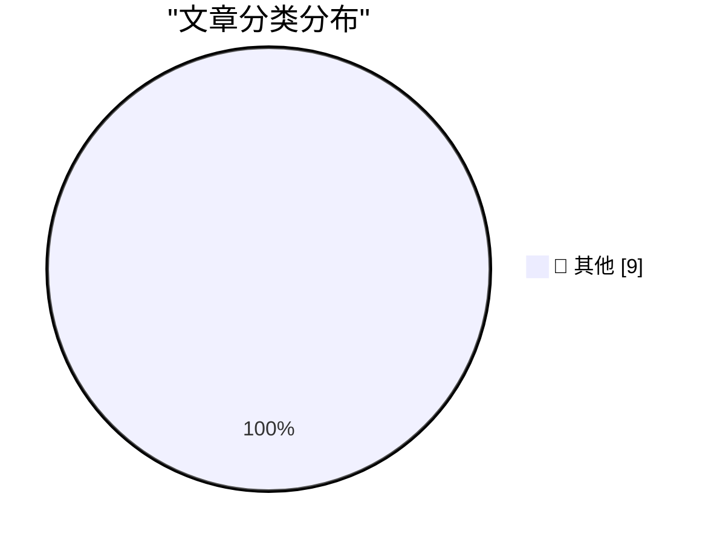

# 📰 AI 博客每日精选

**日期**: 2026-07-05 &nbsp;|&nbsp; **精选**: 9 篇 &nbsp;|&nbsp; **时间范围**: 24 小时

> 📚 来自 Karpathy 推荐的 **92** 个顶级技术博客，经 AI 智能评分筛选

## 📑 目录

- [📝 今日看点](#-今日看点)
- [🏆 今日必读](#-今日必读)
- [📊 数据概览](#-数据概览)
- [📝 其他](#-其他) (9篇)

---

## 🏆 今日必读

### 🥇 [Building a World Map with only 500 bytes](https://simonwillison.net/2026/Jul/4/building-a-world-map-with-only-500-bytes/#atom-everything)

📁 📝 其他
⏰ 57 分钟前
⭐ 评分 15/30

Building a World Map with only 500 bytes

---

### 🥈 [Better Models: Worse Tools](https://simonwillison.net/2026/Jul/4/better-models-worse-tools/#atom-everything)

📁 📝 其他
⏰ 1 小时前
⭐ 评分 15/30

Better Models: Worse Tools

---

### 🥉 [Day One Journal](https://dayoneapp.com/blog/introducing-daily-chat/)

📁 📝 其他
⏰ 3 小时前
⭐ 评分 15/30

Day One Journal

---

## 📊 数据概览

87/92

扫描源

2578

抓取文章

9

时间范围内

9

AI 精选

### 🥧 分类分布

---

## 📝 其他 9篇

### 1. [Building a World Map with only 500 bytes](https://simonwillison.net/2026/Jul/4/building-a-world-map-with-only-500-bytes/#atom-everything)

⭐ 综合评分
15/30

📁 simonwillison.net
⏰ 57 分钟前
🔖 R:5 Q:5 T:5

Building a World Map with only 500 bytes

---

### 2. [Better Models: Worse Tools](https://simonwillison.net/2026/Jul/4/better-models-worse-tools/#atom-everything)

⭐ 综合评分
15/30

📁 simonwillison.net
⏰ 1 小时前
🔖 R:5 Q:5 T:5

Better Models: Worse Tools

---

### 3. [Day One Journal](https://dayoneapp.com/blog/introducing-daily-chat/)

⭐ 综合评分
15/30

📁 daringfireball.net
⏰ 3 小时前
🔖 R:5 Q:5 T:5

Day One Journal

---

### 4. [From the DF Archive: ‘Electron and the Decline of Native Apps’](https://daringfireball.net/2018/12/electron_and_the_decline_of_native_apps)

⭐ 综合评分
15/30

📁 daringfireball.net
⏰ 4 小时前
🔖 R:5 Q:5 T:5

From the DF Archive: ‘Electron and the Decline of Native Apps’

---

### 5. [Fantastical 4.1.15 Adds Calendar Mirroring](https://flexibits.com/blog/2026/06/double-booked-never-heard-of-it-meet-calendar-mirroring-in-fantastical/)

⭐ 综合评分
15/30

📁 daringfireball.net
⏰ 7 小时前
🔖 R:5 Q:5 T:5

Fantastical 4.1.15 Adds Calendar Mirroring

---

### 6. [Combined 1D and 2D Barcodes](https://shkspr.mobi/blog/2026/07/combined-1d-and-2d-barcodes/)

⭐ 综合评分
15/30

📁 shkspr.mobi
⏰ 12 小时前
🔖 R:5 Q:5 T:5

Combined 1D and 2D Barcodes

---

### 7. [Does additional data always reduce posterior variance?](https://www.johndcook.com/blog/2026/07/03/does-additional-data-always-reduce-posterior-variance/)

⭐ 综合评分
15/30

📁 johndcook.com
⏰ 21 小时前
🔖 R:5 Q:5 T:5

Does additional data always reduce posterior variance?

---

### 8. [This Week in Package Management: 4 July 2026](https://nesbitt.io/2026/07/04/this-week-in-package-management.html)

⭐ 综合评分
15/30

📁 nesbitt.io
⏰ 14 小时前
🔖 R:5 Q:5 T:5

This Week in Package Management: 4 July 2026

---

### 9. [Reading List 07/04/26](https://www.construction-physics.com/p/reading-list-070426)

⭐ 综合评分
15/30

📁 construction-physics.com
⏰ 12 小时前
🔖 R:5 Q:5 T:5

Reading List 07/04/26

---

生成于 2026-07-05 00:07 | 扫描 <strong>87</strong> 源 → 获取 <strong>2578</strong> 篇 → 精选 <strong>9</strong> 篇
 
基于 <a href="https://refactoringenglish.com/tools/hn-popularity/" style="color: #667eea;">Hacker News Popularity Contest 2025</a> RSS 源列表，由 <a href="https://x.com/karpathy" style="color: #667eea;">Andrej Karpathy</a> 推荐
 
由「懂点儿 AI」制作，欢迎关注同名微信公众号获取更多 AI 实用技巧 💡

