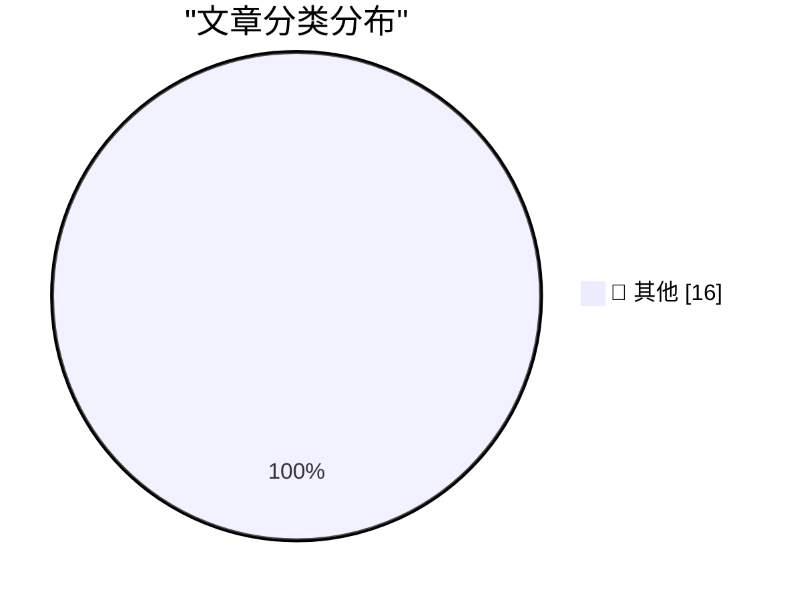

# 📰 AI 博客每日精选

**日期**: 2026-09-02 &nbsp;|&nbsp; **精选**: 16 篇 &nbsp;|&nbsp; **时间范围**: 24 小时

> 📚 来自 Karpathy 推荐的 **92** 个顶级技术博客，经 AI 智能评分筛选

## 📑 目录

- [📝 今日看点](#-今日看点)
- [🏆 今日必读](#-今日必读)
- [📊 数据概览](#-数据概览)
- [📝 其他](#-其他) (16篇)

---

## 🏆 今日必读

### 🥇 [Claude Fable 5.1 made me a really nice animated pelican](https://simonwillison.net/2026/Sep/1/claude-fable-5-1/)

📁 📝 其他
⏰ 4 分钟前
⭐ 评分 15/30

Claude Fable 5.1 made me a really nice animated pelican

---

### 🥈 [Codex bundles LibreOffice](https://simonwillison.net/2026/Sep/1/codex-libreoffice/)

📁 📝 其他
⏰ 4 小时前
⭐ 评分 15/30

Codex bundles LibreOffice

---

### 🥉 [Quoting Tarn Adams](https://simonwillison.net/2026/Sep/1/tarn-adams/)

📁 📝 其他
⏰ 7 小时前
⭐ 评分 15/30

Quoting Tarn Adams

---

## 📊 数据概览

86/92

扫描源

2592

抓取文章

16

时间范围内

16

AI 精选

### 🥧 分类分布

---

## 📝 其他 16篇

### 1. [Claude Fable 5.1 made me a really nice animated pelican](https://simonwillison.net/2026/Sep/1/claude-fable-5-1/)

⭐ 综合评分
15/30

📁 simonwillison.net
⏰ 4 分钟前
🔖 R:5 Q:5 T:5

Claude Fable 5.1 made me a really nice animated pelican

---

### 2. [Codex bundles LibreOffice](https://simonwillison.net/2026/Sep/1/codex-libreoffice/)

⭐ 综合评分
15/30

📁 simonwillison.net
⏰ 4 小时前
🔖 R:5 Q:5 T:5

Codex bundles LibreOffice

---

### 3. [Quoting Tarn Adams](https://simonwillison.net/2026/Sep/1/tarn-adams/)

⭐ 综合评分
15/30

📁 simonwillison.net
⏰ 7 小时前
🔖 R:5 Q:5 T:5

Quoting Tarn Adams

---

### 4. [Python 3.15.0 candidate 2 is here!](https://simonwillison.net/2026/Sep/1/python-315-rc-2/)

⭐ 综合评分
15/30

📁 simonwillison.net
⏰ 9 小时前
🔖 R:5 Q:5 T:5

Python 3.15.0 candidate 2 is here!

---

### 5. [FBI Probes Service Selling 153M+ Drivers Licenses](https://krebsonsecurity.com/2026/09/fbi-probes-service-selling-153m-drivers-licenses/)

⭐ 综合评分
15/30

📁 krebsonsecurity.com
⏰ 1 小时前
🔖 R:5 Q:5 T:5

FBI Probes Service Selling 153M+ Drivers Licenses

---

### 6. [Tim Cook’s Departure Memo on His Last Day as CEO](https://9to5mac.com/2026/08/31/read-tim-cooks-full-memo-to-apple-employees-on-his-last-day-as-ceo/)

⭐ 综合评分
15/30

📁 daringfireball.net
⏰ 5 小时前
🔖 R:5 Q:5 T:5

Tim Cook’s Departure Memo on His Last Day as CEO

---

### 7. [Apple Reveals Forensic Evidence From Chang Liu’s MacBook in OpenAI Lawsuit](https://9to5mac.com/2026/08/31/apple-openai-forensic-macbook-evidence/)

⭐ 综合评分
15/30

📁 daringfireball.net
⏰ 6 小时前
🔖 R:5 Q:5 T:5

Apple Reveals Forensic Evidence From Chang Liu’s MacBook in OpenAI Lawsuit

---

### 8. [[Sponsor] WorkOS: How to Give an Agent a Task Instead of a Token](https://workos.com/blog/delegated-access-for-ai-agents?utm_source=daringfireball&amp;utm_medium=newsletter&amp;utm_campaign=q32026)

⭐ 综合评分
15/30

📁 daringfireball.net
⏰ 16 小时前
🔖 R:5 Q:5 T:5

[Sponsor] WorkOS: How to Give an Agent a Task Instead of a Token

---

### 9. [Book Review: ActivityPub by Evan Prodromou ★★★★⯪](https://shkspr.mobi/blog/2026/09/book-review-activitypub-by-evan-prodromou/)

⭐ 综合评分
15/30

📁 shkspr.mobi
⏰ 12 小时前
🔖 R:5 Q:5 T:5

Book Review: ActivityPub by Evan Prodromou ★★★★⯪

---

### 10. [Fluorescent lamps (don’t) have ears](https://blog.coredump.cx/p/fluorescent-lamps-dont-have-ears)

⭐ 综合评分
15/30

📁 lcamtuf.substack.com
⏰ 16 小时前
🔖 R:5 Q:5 T:5

Fluorescent lamps (don’t) have ears

---

### 11. [Git Submodules as a Package Manager](https://nesbitt.io/2026/09/01/git-submodules-as-a-package-manager.html)

⭐ 综合评分
15/30

📁 nesbitt.io
⏰ 15 小时前
🔖 R:5 Q:5 T:5

Git Submodules as a Package Manager

---

### 12. [New Post: A Crash Course in Predicate Logic](https://buttondown.com/hillelwayne/archive/new-post-a-crash-course-in-predicate-logic/)

⭐ 综合评分
15/30

📁 buttondown.com/hillelwayne
⏰ 5 小时前
🔖 R:5 Q:5 T:5

New Post: A Crash Course in Predicate Logic

---

### 13. [Ajeya Cotra – Inside the OpenAI agent swarm that hacked Hugging Face](https://www.dwarkesh.com/p/ajeya-cotra)

⭐ 综合评分
15/30

📁 dwarkesh.com
⏰ 8 小时前
🔖 R:5 Q:5 T:5

Ajeya Cotra – Inside the OpenAI agent swarm that hacked Hugging Face

---

### 14. [Hyperscale Normalization](https://www.wheresyoured.at/hyperscale-normalization/)

⭐ 综合评分
15/30

📁 wheresyoured.at
⏰ 6 小时前
🔖 R:5 Q:5 T:5

Hyperscale Normalization

---

### 15. [Commodore 64 released September 1, 1982](https://dfarq.homeip.net/commodore-64-released-september-1-1982/?utm_source=rss&#038;utm_medium=rss&#038;utm_campaign=commodore-64-released-september-1-1982)

⭐ 综合评分
15/30

📁 dfarq.homeip.net
⏰ 13 小时前
🔖 R:5 Q:5 T:5

Commodore 64 released September 1, 1982

---

### 16. [Weekly Update 519: Breaches & Data Integrity](https://www.troyhunt.com/weekly-update-519/)

⭐ 综合评分
15/30

📁 troyhunt.com
⏰ 1 小时前
🔖 R:5 Q:5 T:5

Weekly Update 519: Breaches & Data Integrity

---

生成于 2026-09-02 00:01 | 扫描 <strong>86</strong> 源 → 获取 <strong>2592</strong> 篇 → 精选 <strong>16</strong> 篇
 
基于 <a href="https://refactoringenglish.com/tools/hn-popularity/" style="color: #667eea;">Hacker News Popularity Contest 2025</a> RSS 源列表，由 <a href="https://x.com/karpathy" style="color: #667eea;">Andrej Karpathy</a> 推荐
 
由「懂点儿 AI」制作，欢迎关注同名微信公众号获取更多 AI 实用技巧 💡

