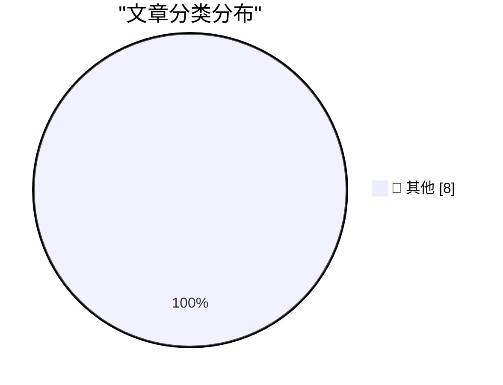

# 📰 AI 博客每日精选

**日期**: 2026-09-03 &nbsp;|&nbsp; **精选**: 8 篇 &nbsp;|&nbsp; **时间范围**: 24 小时

> 📚 来自 Karpathy 推荐的 **92** 个顶级技术博客，经 AI 智能评分筛选

## 📑 目录

- [📝 今日看点](#-今日看点)
- [🏆 今日必读](#-今日必读)
- [📊 数据概览](#-数据概览)
- [📝 其他](#-其他) (8篇)

---

## 🏆 今日必读

### 🥇 [llm-gemini 0.34](https://simonwillison.net/2026/Sep/2/llm-gemini/)

📁 📝 其他
⏰ 7 小时前
⭐ 评分 15/30

llm-gemini 0.34

---

### 🥈 [Claude's new system prompt really doesn't want to reproduce song lyrics](https://simonwillison.net/2026/Sep/2/claudes-new-system-prompt/)

📁 📝 其他
⏰ 9 小时前
⭐ 评分 15/30

Claude's new system prompt really doesn't want to reproduce song lyrics

---

### 🥉 [Quoting Rick Brewster](https://simonwillison.net/2026/Sep/2/rick-brewster/)

📁 📝 其他
⏰ 18 小时前
⭐ 评分 15/30

Quoting Rick Brewster

---

## 📊 数据概览

87/92

扫描源

2612

抓取文章

8

时间范围内

8

AI 精选

### 🥧 分类分布

---

## 📝 其他 8篇

### 1. [llm-gemini 0.34](https://simonwillison.net/2026/Sep/2/llm-gemini/)

⭐ 综合评分
15/30

📁 simonwillison.net
⏰ 7 小时前
🔖 R:5 Q:5 T:5

llm-gemini 0.34

---

### 2. [Claude's new system prompt really doesn't want to reproduce song lyrics](https://simonwillison.net/2026/Sep/2/claudes-new-system-prompt/)

⭐ 综合评分
15/30

📁 simonwillison.net
⏰ 9 小时前
🔖 R:5 Q:5 T:5

Claude's new system prompt really doesn't want to reproduce song lyrics

---

### 3. [Quoting Rick Brewster](https://simonwillison.net/2026/Sep/2/rick-brewster/)

⭐ 综合评分
15/30

📁 simonwillison.net
⏰ 18 小时前
🔖 R:5 Q:5 T:5

Quoting Rick Brewster

---

### 4. [iOS 27 Introduces New ‘iPhone Handoff’ Feature](https://www.macrumors.com/2026/09/02/ios-27-iphone-handoff-feature/)

⭐ 综合评分
15/30

📁 daringfireball.net
⏰ 3 小时前
🔖 R:5 Q:5 T:5

iOS 27 Introduces New ‘iPhone Handoff’ Feature

---

### 5. [Pluralistic: Unpermissioned research (02 Sep 2026)](https://pluralistic.net/2026/09/02/scrape-scrope-scrap/)

⭐ 综合评分
15/30

📁 pluralistic.net
⏰ 13 小时前
🔖 R:5 Q:5 T:5

Pluralistic: Unpermissioned research (02 Sep 2026)

---

### 6. [Elon Musk is on a prediction rampage, and most of the media can’t seem to figure out what to do about it.](https://garymarcus.substack.com/p/elon-musk-is-on-a-prediction-rampage)

⭐ 综合评分
15/30

📁 garymarcus.substack.com
⏰ 3 小时前
🔖 R:5 Q:5 T:5

Elon Musk is on a prediction rampage, and most of the media can’t seem to figure out what to do about it.

---

### 7. [Red Alert: OpenAI is poised to cross an AI safety redline.](https://garymarcus.substack.com/p/red-alert-openai-is-poised-to-cross)

⭐ 综合评分
15/30

📁 garymarcus.substack.com
⏰ 20 小时前
🔖 R:5 Q:5 T:5

Red Alert: OpenAI is poised to cross an AI safety redline.

---

### 8. [Atari Lynx: The first color handheld game console](https://dfarq.homeip.net/atari-lynx-the-first-color-handheld-game-console/?utm_source=rss&#038;utm_medium=rss&#038;utm_campaign=atari-lynx-the-first-color-handheld-game-console)

⭐ 综合评分
15/30

📁 dfarq.homeip.net
⏰ 13 小时前
🔖 R:5 Q:5 T:5

Atari Lynx: The first color handheld game console

---

生成于 2026-09-03 00:03 | 扫描 <strong>87</strong> 源 → 获取 <strong>2612</strong> 篇 → 精选 <strong>8</strong> 篇
 
基于 <a href="https://refactoringenglish.com/tools/hn-popularity/" style="color: #667eea;">Hacker News Popularity Contest 2025</a> RSS 源列表，由 <a href="https://x.com/karpathy" style="color: #667eea;">Andrej Karpathy</a> 推荐
 
由「懂点儿 AI」制作，欢迎关注同名微信公众号获取更多 AI 实用技巧 💡

