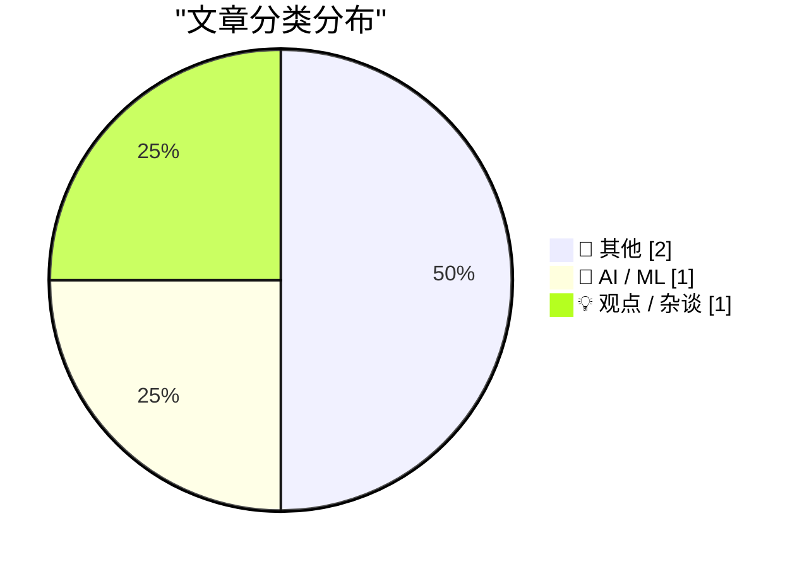
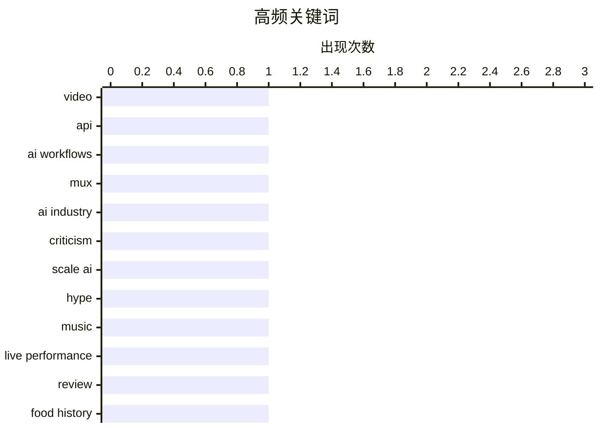

# 📰 AI 博客每日精选

**日期**: 2026-09-28 &nbsp;|&nbsp; **精选**: 4 篇 &nbsp;|&nbsp; **时间范围**: 24 小时

> 📚 来自 Karpathy 推荐的 **92** 个顶级技术博客，经 AI 智能评分筛选

## 📑 目录

- [📝 今日看点](#-今日看点)
- [🏆 今日必读](#-今日必读)
- [📊 数据概览](#-数据概览)
- [📝 其他](#-其他) (2篇)
- [🤖 AI / ML](#-ai---ml) (1篇)
- [💡 观点 / 杂谈](#-观点---杂谈) (1篇)

---

## 📝 今日看点

<div style="background: linear-gradient(135deg, #667eea 0%, #764ba2 100%); padding: 16px 20px; border-radius: 12px; color: white; margin: 20px 0;">

今日技术圈看点：AI 应用正从通用能力走向垂直场景的深度整合，Mux 推出托管式视频 AI 工作流，将视频转化为结构化数据，降低了模型维护门槛。与此同时，围绕 AI 创业叙事的争议升温，Alexandr Wang 的公开信被批为“伪标志性废话”，折射出业界对 AI 领袖话术的审视与疲劳。整体来看，AI 落地更务实，而对其文化包装的反思也在同步加深。

</div>

---

## 🏆 今日必读

### 🥇 [Mux：将视频转化为上下文](https://www.mux.com/?utm_campaign=fireball&amp;utm_source=DF)

<div style="display: flex; gap: 16px; flex-wrap: wrap; margin: 12px 0; font-size: 14px; color: #666;">
<span>📁 🤖 AI / ML</span>
<span>⏰ 3 小时前</span>
<span>⭐ 评分 20/30</span>
</div>

<div style="background: #f8f9fa; border-left: 4px solid #667eea; padding: 16px 20px; border-radius: 8px; margin: 16px 0;">

Mux 推出 Robots 托管式 AI 工作流，将视频从单纯的流媒体内容转变为可构建的结构化数据。通过单次 API 调用即可生成章节、定位关键时刻、翻译音频等，无需自行维护模型托管。每个工作流都基于真实视频而非通用基准进行评估，配置一次后所有新上传视频自动运行。Mux 是 Patreon 等公司信赖的视频基础设施。

</div>

**💡 为什么值得读**: 如果你正在寻找无需自建模型即可将 AI 视频处理能力集成到产品中的方案，这篇文章展示了 Mux 的一站式 API 工作流如何大幅降低开发门槛。

**🏷️ 标签**: <span style="display:inline-block;background:#e3f2fd;color:#1976D2;padding:4px 12px;border-radius:16px;font-size:12px;margin-right:6px;">video</span><span style="display:inline-block;background:#e3f2fd;color:#1976D2;padding:4px 12px;border-radius:16px;font-size:12px;margin-right:6px;">API</span><span style="display:inline-block;background:#e3f2fd;color:#1976D2;padding:4px 12px;border-radius:16px;font-size:12px;margin-right:6px;">AI workflows</span><span style="display:inline-block;background:#e3f2fd;color:#1976D2;padding:4px 12px;border-radius:16px;font-size:12px;margin-right:6px;">Mux</span>

---

### 🥈 [Katie Notopoulos 评 Alexandr Wang 的“伪标志性废话”](https://x.com/katienotopoulos/status/2103993429659386026)

<div style="display: flex; gap: 16px; flex-wrap: wrap; margin: 12px 0; font-size: 14px; color: #666;">
<span>📁 💡 观点 / 杂谈</span>
<span>⏰ 3 小时前</span>
<span>⭐ 评分 18/30</span>
</div>

<div style="background: #f8f9fa; border-left: 4px solid #667eea; padding: 16px 20px; border-radius: 8px; margin: 16px 0;">

Katie Notopoulos 在推文中猛烈批评 Alexandr Wang 的《为什么我们要构建 Muse》一文，称其为“伪标志性废话”，认为 Wang 声称关心人们“花更多时间陪家人”或“开面包店”的说法完全不可信。作者 John Gruber 表示自己的看法更接近 Notopoulos 而非 Manton Reece，并指出 Wang 的文章听起来很值得玩味。

</div>

**💡 为什么值得读**: 这篇文章捕捉了科技圈对 AI 创业者宏大叙事的一次尖锐质疑，适合关注 AI 伦理与公关话术的读者快速了解争议焦点。

**🏷️ 标签**: <span style="display:inline-block;background:#e3f2fd;color:#1976D2;padding:4px 12px;border-radius:16px;font-size:12px;margin-right:6px;">AI industry</span><span style="display:inline-block;background:#e3f2fd;color:#1976D2;padding:4px 12px;border-radius:16px;font-size:12px;margin-right:6px;">criticism</span><span style="display:inline-block;background:#e3f2fd;color:#1976D2;padding:4px 12px;border-radius:16px;font-size:12px;margin-right:6px;">Scale AI</span><span style="display:inline-block;background:#e3f2fd;color:#1976D2;padding:4px 12px;border-radius:16px;font-size:12px;margin-right:6px;">hype</span>

---

### 🥉 [演出评论：Public Service Broadcasting 的《Race For Space》在 Alexandra Palace 演出 ★★★★⯪](https://shkspr.mobi/blog/2026/09/gig-review-public-service-broadcastings-race-for-space-at-alexandra-palace/)

<div style="display: flex; gap: 16px; flex-wrap: wrap; margin: 12px 0; font-size: 14px; color: #666;">
<span>📁 📝 其他</span>
<span>⏰ 12 小时前</span>
<span>⭐ 评分 12/30</span>
</div>

<div style="background: #f8f9fa; border-left: 4px solid #667eea; padding: 16px 20px; border-radius: 8px; margin: 16px 0;">

PSB 的《Race For Space》专辑十周年纪念演出在 Alexandra Palace 举行，呈现了一场旋律优美的沉浸式音景体验。尽管专辑以采样为基础，乐队并未敷衍了事地播放 CD，而是以完整乐队编制加嘉宾阵容现场演绎。

</div>

**💡 为什么值得读**: 如果你喜欢电子采样音乐与现场演出的结合，这篇评论能让你感受到 PSB 如何将一张采样专辑转化为有血有肉的现场体验。

**🏷️ 标签**: <span style="display:inline-block;background:#e3f2fd;color:#1976D2;padding:4px 12px;border-radius:16px;font-size:12px;margin-right:6px;">music</span><span style="display:inline-block;background:#e3f2fd;color:#1976D2;padding:4px 12px;border-radius:16px;font-size:12px;margin-right:6px;">live performance</span><span style="display:inline-block;background:#e3f2fd;color:#1976D2;padding:4px 12px;border-radius:16px;font-size:12px;margin-right:6px;">review</span>

---

## 📊 数据概览

<div style="display: grid; grid-template-columns: repeat(auto-fit, minmax(120px, 1fr)); gap: 12px; margin: 20px 0;">
<div style="background: #e8f4f8; padding: 16px; border-radius: 10px; text-align: center;">
<div style="font-size: 24px; font-weight: bold; color: #2196F3;">85/92</div>
<div style="font-size: 13px; color: #666; margin-top: 4px;">扫描源</div>
</div>
<div style="background: #fff3e0; padding: 16px; border-radius: 10px; text-align: center;">
<div style="font-size: 24px; font-weight: bold; color: #FF9800;">2583</div>
<div style="font-size: 13px; color: #666; margin-top: 4px;">抓取文章</div>
</div>
<div style="background: #f3e5f5; padding: 16px; border-radius: 10px; text-align: center;">
<div style="font-size: 24px; font-weight: bold; color: #9C27B0;">4</div>
<div style="font-size: 13px; color: #666; margin-top: 4px;">时间范围内</div>
</div>
<div style="background: #e8f5e9; padding: 16px; border-radius: 10px; text-align: center;">
<div style="font-size: 24px; font-weight: bold; color: #4CAF50;">4</div>
<div style="font-size: 13px; color: #666; margin-top: 4px;">AI 精选</div>
</div>
</div>

### 🥧 分类分布



### 📈 高频关键词



<details style="margin: 16px 0; padding: 12px; background: #f5f5f5; border-radius: 8px;">
<summary style="cursor: pointer; font-weight: 500;">📊 纯文本关键词图（终端友好）</summary>

```
video            │ ████████████████████ 1
api              │ ████████████████████ 1
ai workflows     │ ████████████████████ 1
mux              │ ████████████████████ 1
ai industry      │ ████████████████████ 1
criticism        │ ████████████████████ 1
scale ai         │ ████████████████████ 1
hype             │ ████████████████████ 1
music            │ ████████████████████ 1
live performance │ ████████████████████ 1
```

</details>

### 🏷️ 话题标签

<div style="line-height: 2; margin: 16px 0;">
**video**(1) · **api**(1) · **ai workflows**(1) · mux(1) · ai industry(1) · criticism(1) · scale ai(1) · hype(1) · music(1) · live performance(1) · review(1) · food history(1) · snacks(1) · manufacturing(1)
</div>

---

<a id="-其他"></a>
## 📝 其他 <span style="background: #e0e0e0; padding: 2px 10px; border-radius: 12px; font-size: 13px; margin-left: 8px;">2篇</span>

### 1. [演出评论：Public Service Broadcasting 的《Race For Space》在 Alexandra Palace 演出 ★★★★⯪](https://shkspr.mobi/blog/2026/09/gig-review-public-service-broadcastings-race-for-space-at-alexandra-palace/)

<div style="margin: 10px 0;">
<div style="display: flex; justify-content: space-between; font-size: 13px; margin-bottom: 4px;">
<span>⭐ 综合评分</span>
<span style="font-weight: bold; color: #f44336;">12/30</span>
</div>
<div style="background: #e0e0e0; height: 8px; border-radius: 4px; overflow: hidden;">
<div style="background: #f44336; width: 40%; height: 100%; border-radius: 4px;"></div>
</div>
</div>

<div style="display: flex; gap: 12px; flex-wrap: wrap; font-size: 13px; color: #666; margin: 12px 0;">
<span>📁 shkspr.mobi</span>
<span>⏰ 12 小时前</span>
<span>🔖 R:2 Q:6 T:4</span>
</div>

<div style="background: #fafafa; border-radius: 8px; padding: 16px; margin: 12px 0; line-height: 1.7;">
PSB 的《Race For Space》专辑十周年纪念演出在 Alexandra Palace 举行，呈现了一场旋律优美的沉浸式音景体验。尽管专辑以采样为基础，乐队并未敷衍了事地播放 CD，而是以完整乐队编制加嘉宾阵容现场演绎。
</div>

<div style="margin: 12px 0;">
<span style="display: inline-block; background: #e3f2fd; color: #1976D2; padding: 4px 12px; border-radius: 16px; font-size: 12px; margin-right: 6px; margin-bottom: 4px;">music</span><span style="display: inline-block; background: #e3f2fd; color: #1976D2; padding: 4px 12px; border-radius: 16px; font-size: 12px; margin-right: 6px; margin-bottom: 4px;">live performance</span><span style="display: inline-block; background: #e3f2fd; color: #1976D2; padding: 4px 12px; border-radius: 16px; font-size: 12px; margin-right: 6px; margin-bottom: 4px;">review</span>
</div>

---

### 2. [组合拼盘](https://feed.tedium.co/link/15204/17475461/combos-snack-food-history)

<div style="margin: 10px 0;">
<div style="display: flex; justify-content: space-between; font-size: 13px; margin-bottom: 4px;">
<span>⭐ 综合评分</span>
<span style="font-weight: bold; color: #f44336;">11/30</span>
</div>
<div style="background: #e0e0e0; height: 8px; border-radius: 4px; overflow: hidden;">
<div style="background: #f44336; width: 37%; height: 100%; border-radius: 4px;"></div>
</div>
</div>

<div style="display: flex; gap: 12px; flex-wrap: wrap; font-size: 13px; color: #666; margin: 12px 0;">
<span>📁 tedium.co</span>
<span>⏰ 7 小时前</span>
<span>🔖 R:2 Q:6 T:3</span>
</div>

<div style="background: #fafafa; border-radius: 8px; padding: 16px; margin: 12px 0; line-height: 1.7;">
文章探究了加油站常见零食 Combos 的起源，作者发现其诞生过程中竟然涉及一台钻机。
</div>

<div style="margin: 12px 0;">
<span style="display: inline-block; background: #e3f2fd; color: #1976D2; padding: 4px 12px; border-radius: 16px; font-size: 12px; margin-right: 6px; margin-bottom: 4px;">food history</span><span style="display: inline-block; background: #e3f2fd; color: #1976D2; padding: 4px 12px; border-radius: 16px; font-size: 12px; margin-right: 6px; margin-bottom: 4px;">snacks</span><span style="display: inline-block; background: #e3f2fd; color: #1976D2; padding: 4px 12px; border-radius: 16px; font-size: 12px; margin-right: 6px; margin-bottom: 4px;">manufacturing</span>
</div>

---

<a id="-ai---ml"></a>
## 🤖 AI / ML <span style="background: #e0e0e0; padding: 2px 10px; border-radius: 12px; font-size: 13px; margin-left: 8px;">1篇</span>

### 3. [Mux：将视频转化为上下文](https://www.mux.com/?utm_campaign=fireball&amp;utm_source=DF)

<div style="margin: 10px 0;">
<div style="display: flex; justify-content: space-between; font-size: 13px; margin-bottom: 4px;">
<span>⭐ 综合评分</span>
<span style="font-weight: bold; color: #FF9800;">20/30</span>
</div>
<div style="background: #e0e0e0; height: 8px; border-radius: 4px; overflow: hidden;">
<div style="background: #FF9800; width: 67%; height: 100%; border-radius: 4px;"></div>
</div>
</div>

<div style="display: flex; gap: 12px; flex-wrap: wrap; font-size: 13px; color: #666; margin: 12px 0;">
<span>📁 daringfireball.net</span>
<span>⏰ 3 小时前</span>
<span>🔖 R:7 Q:5 T:8</span>
</div>

<div style="background: #fafafa; border-radius: 8px; padding: 16px; margin: 12px 0; line-height: 1.7;">
Mux 推出 Robots 托管式 AI 工作流，将视频从单纯的流媒体内容转变为可构建的结构化数据。通过单次 API 调用即可生成章节、定位关键时刻、翻译音频等，无需自行维护模型托管。每个工作流都基于真实视频而非通用基准进行评估，配置一次后所有新上传视频自动运行。Mux 是 Patreon 等公司信赖的视频基础设施。
</div>

<div style="margin: 12px 0;">
<span style="display: inline-block; background: #e3f2fd; color: #1976D2; padding: 4px 12px; border-radius: 16px; font-size: 12px; margin-right: 6px; margin-bottom: 4px;">video</span><span style="display: inline-block; background: #e3f2fd; color: #1976D2; padding: 4px 12px; border-radius: 16px; font-size: 12px; margin-right: 6px; margin-bottom: 4px;">API</span><span style="display: inline-block; background: #e3f2fd; color: #1976D2; padding: 4px 12px; border-radius: 16px; font-size: 12px; margin-right: 6px; margin-bottom: 4px;">AI workflows</span><span style="display: inline-block; background: #e3f2fd; color: #1976D2; padding: 4px 12px; border-radius: 16px; font-size: 12px; margin-right: 6px; margin-bottom: 4px;">Mux</span>
</div>

---

<a id="-观点---杂谈"></a>
## 💡 观点 / 杂谈 <span style="background: #e0e0e0; padding: 2px 10px; border-radius: 12px; font-size: 13px; margin-left: 8px;">1篇</span>

### 4. [Katie Notopoulos 评 Alexandr Wang 的“伪标志性废话”](https://x.com/katienotopoulos/status/2103993429659386026)

<div style="margin: 10px 0;">
<div style="display: flex; justify-content: space-between; font-size: 13px; margin-bottom: 4px;">
<span>⭐ 综合评分</span>
<span style="font-weight: bold; color: #FF9800;">18/30</span>
</div>
<div style="background: #e0e0e0; height: 8px; border-radius: 4px; overflow: hidden;">
<div style="background: #FF9800; width: 60%; height: 100%; border-radius: 4px;"></div>
</div>
</div>

<div style="display: flex; gap: 12px; flex-wrap: wrap; font-size: 13px; color: #666; margin: 12px 0;">
<span>📁 daringfireball.net</span>
<span>⏰ 3 小时前</span>
<span>🔖 R:6 Q:5 T:7</span>
</div>

<div style="background: #fafafa; border-radius: 8px; padding: 16px; margin: 12px 0; line-height: 1.7;">
Katie Notopoulos 在推文中猛烈批评 Alexandr Wang 的《为什么我们要构建 Muse》一文，称其为“伪标志性废话”，认为 Wang 声称关心人们“花更多时间陪家人”或“开面包店”的说法完全不可信。作者 John Gruber 表示自己的看法更接近 Notopoulos 而非 Manton Reece，并指出 Wang 的文章听起来很值得玩味。
</div>

<div style="margin: 12px 0;">
<span style="display: inline-block; background: #e3f2fd; color: #1976D2; padding: 4px 12px; border-radius: 16px; font-size: 12px; margin-right: 6px; margin-bottom: 4px;">AI industry</span><span style="display: inline-block; background: #e3f2fd; color: #1976D2; padding: 4px 12px; border-radius: 16px; font-size: 12px; margin-right: 6px; margin-bottom: 4px;">criticism</span><span style="display: inline-block; background: #e3f2fd; color: #1976D2; padding: 4px 12px; border-radius: 16px; font-size: 12px; margin-right: 6px; margin-bottom: 4px;">Scale AI</span><span style="display: inline-block; background: #e3f2fd; color: #1976D2; padding: 4px 12px; border-radius: 16px; font-size: 12px; margin-right: 6px; margin-bottom: 4px;">hype</span>
</div>

---


<div style="text-align: center; color: #888; font-size: 13px; padding: 20px; border-top: 1px solid #e0e0e0; margin-top: 30px;">
生成于 2026-09-28 00:02 | 扫描 <strong>85</strong> 源 → 获取 <strong>2583</strong> 篇 → 精选 <strong>4</strong> 篇
<br>
基于 <a href="https://refactoringenglish.com/tools/hn-popularity/" style="color: #667eea;">Hacker News Popularity Contest 2025</a> RSS 源列表，由 <a href="https://x.com/karpathy" style="color: #667eea;">Andrej Karpathy</a> 推荐
<br>
由「懂点儿 AI」制作，欢迎关注同名微信公众号获取更多 AI 实用技巧 💡
</div>
