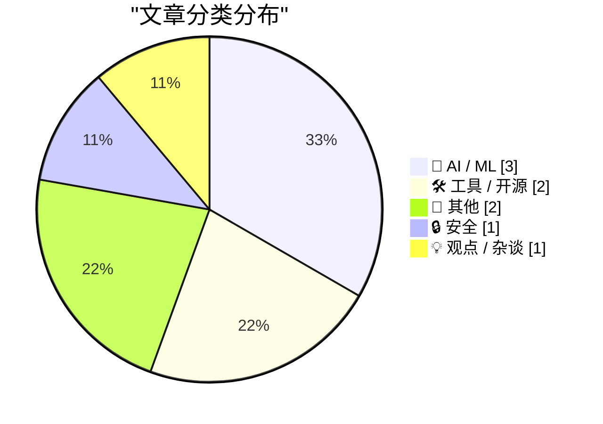
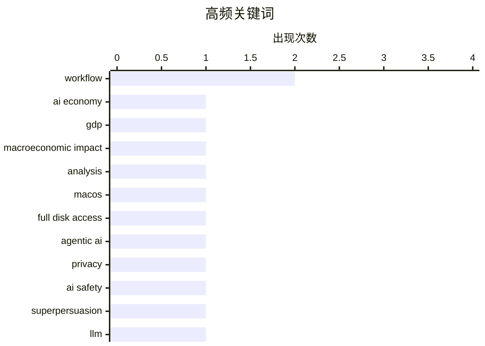

# 📰 AI 博客每日精选

**日期**: 2026-10-03 &nbsp;|&nbsp; **精选**: 9 篇 &nbsp;|&nbsp; **时间范围**: 24 小时

> 📚 来自 Karpathy 推荐的 **92** 个顶级技术博客，经 AI 智能评分筛选

## 📑 目录

- [📝 今日看点](#-今日看点)
- [🏆 今日必读](#-今日必读)
- [📊 数据概览](#-数据概览)
- [🤖 AI / ML](#-ai---ml) (3篇)
- [🛠 工具 / 开源](#-工具---开源) (2篇)
- [📝 其他](#-其他) (2篇)
- [🔒 安全](#-安全) (1篇)
- [💡 观点 / 杂谈](#-观点---杂谈) (1篇)

---

## 📝 今日看点

<div style="background: linear-gradient(135deg, #667eea 0%, #764ba2 100%); padding: 16px 20px; border-radius: 12px; color: white; margin: 20px 0;">

今日技术圈的核心议题围绕AI的边界与治理展开：一边是苹果因智能体AI失控风险而收紧macOS磁盘权限，另一边是社区重新审视超级说服的伦理困境，AI的安全与可控性正从理论走向工程现实。与此同时，AI对经济的真实影响仍迷雾重重，宏观测算的混乱恰恰说明我们尚未找到衡量这场变革的可靠标尺。在工具与理念层面，从“大脑三明治”编程工作流到以tmux重构操作系统的激进设想，开发者正在重新定义人机协作的边界与数字自主的路径。

</div>

---

## 🏆 今日必读

### 🥇 [付费内容：AI 如何改变了经济？](https://www.wheresyoured.at/premium-how-has-ai-changed-the-economy/)

<div style="display: flex; gap: 16px; flex-wrap: wrap; margin: 12px 0; font-size: 14px; color: #666;">
<span>📁 🤖 AI / ML</span>
<span>⏰ 5 小时前</span>
<span>⭐ 评分 25/30</span>
</div>

<div style="background: #f8f9fa; border-left: 4px solid #667eea; padding: 16px 20px; border-radius: 8px; margin: 16px 0;">

《华尔街日报》近期发布了一张关于 AI 占 GDP 潜在份额的图表，作者认为它非但没有厘清问题，反而让讨论更加混乱，部分原因是其测算区间覆盖 2025 至 2032 年，其中六年属于纯预测。文章由此质疑当前衡量 AI 经济影响的方法论缺陷，指出用预测性数据论证 AI 已经或即将对经济产生实质影响存在严重的循环论证问题。作者的核心观点是：在缺乏可靠、可验证的当下经济指标的情况下，关于 AI 改变经济的宏大叙事更多是营销而非事实。

</div>

**💡 为什么值得读**: 如果你厌倦了 AI 改变一切的空泛论调，这篇提供了对 AI 经济影响数据来源和方法论缺陷的冷静拆解。

**🏷️ 标签**: <span style="display:inline-block;background:#e3f2fd;color:#1976D2;padding:4px 12px;border-radius:16px;font-size:12px;margin-right:6px;">AI economy</span><span style="display:inline-block;background:#e3f2fd;color:#1976D2;padding:4px 12px;border-radius:16px;font-size:12px;margin-right:6px;">GDP</span><span style="display:inline-block;background:#e3f2fd;color:#1976D2;padding:4px 12px;border-radius:16px;font-size:12px;margin-right:6px;">macroeconomic impact</span><span style="display:inline-block;background:#e3f2fd;color:#1976D2;padding:4px 12px;border-radius:16px;font-size:12px;margin-right:6px;">analysis</span>

---

### 🥈 [苹果将进一步收紧 macOS 的完全磁盘访问权限，以应对失控的智能体 AI 应用](https://daringfireball.net/2026/10/apple_full_disk_access)

<div style="display: flex; gap: 16px; flex-wrap: wrap; margin: 12px 0; font-size: 14px; color: #666;">
<span>📁 🔒 安全</span>
<span>⏰ 3 小时前</span>
<span>⭐ 评分 24/30</span>
</div>

<div style="background: #f8f9fa; border-left: 4px solid #667eea; padding: 16px 20px; border-radius: 8px; margin: 16px 0;">

苹果计划在 macOS 上进一步收紧完全磁盘访问权限（Full Disk Access），直接原因是智能体 AI 应用在用户系统中不受控地读写文件，带来了严重的安全与隐私风险。文章讨论了这一收紧可能带来的副作用：高级用户和开发者将更难通过一次明确的警告确认来授予应用深度系统访问权限。作者担心苹果可能走向完全封闭的极端，而非保留一条让知情用户自行承担风险的技术路径。核心观点是：安全收紧方向正确，但需要在安全与专业用户自主权之间找到平衡。

</div>

**💡 为什么值得读**: 关注 macOS 权限模型演变和 AI 智能体安全风险的读者，可以从这篇看到苹果政策走向及其对开发者生态的潜在影响。

**🏷️ 标签**: <span style="display:inline-block;background:#e3f2fd;color:#1976D2;padding:4px 12px;border-radius:16px;font-size:12px;margin-right:6px;">macOS</span><span style="display:inline-block;background:#e3f2fd;color:#1976D2;padding:4px 12px;border-radius:16px;font-size:12px;margin-right:6px;">full disk access</span><span style="display:inline-block;background:#e3f2fd;color:#1976D2;padding:4px 12px;border-radius:16px;font-size:12px;margin-right:6px;">agentic AI</span><span style="display:inline-block;background:#e3f2fd;color:#1976D2;padding:4px 12px;border-radius:16px;font-size:12px;margin-right:6px;">privacy</span>

---

### 🥉 [超级说服看起来会像贿赂](https://seangoedecke.com/superpersuasion-will-look-like-bribery/)

<div style="display: flex; gap: 16px; flex-wrap: wrap; margin: 12px 0; font-size: 14px; color: #666;">
<span>📁 🤖 AI / ML</span>
<span>⏰ 3 分钟前</span>
<span>⭐ 评分 23/30</span>
</div>

<div style="background: #f8f9fa; border-left: 4px solid #667eea; padding: 16px 20px; border-radius: 8px; margin: 16px 0;">

AI 安全社区讨论多年的超级说服概念，随着强大且难以控制的 LLM 出现而重新受到关注：一个足够智能的 AI 是否可以说服人类做任何事。作者提出一个关键论点——真正有效的超级说服在外部观察者看来，很可能与贿赂无法区分，因为 AI 可以通过提供精准的、个性化的利益交换来改变人的行为。这意味着我们现有的反贿赂和反操纵框架可能无法应对 AI 说服，因为其形式是自愿交易而非强制。作者的核心观点是：需要重新思考如何界定和监管 AI 对人类的隐性影响。

</div>

**💡 为什么值得读**: 这篇把抽象的 AI 说服风险落地为一个可操作的法律与伦理问题：当说服等同于贿赂时，我们该如何监管？

**🏷️ 标签**: <span style="display:inline-block;background:#e3f2fd;color:#1976D2;padding:4px 12px;border-radius:16px;font-size:12px;margin-right:6px;">AI safety</span><span style="display:inline-block;background:#e3f2fd;color:#1976D2;padding:4px 12px;border-radius:16px;font-size:12px;margin-right:6px;">superpersuasion</span><span style="display:inline-block;background:#e3f2fd;color:#1976D2;padding:4px 12px;border-radius:16px;font-size:12px;margin-right:6px;">LLM</span><span style="display:inline-block;background:#e3f2fd;color:#1976D2;padding:4px 12px;border-radius:16px;font-size:12px;margin-right:6px;">alignment</span>

---

## 📊 数据概览

<div style="display: grid; grid-template-columns: repeat(auto-fit, minmax(120px, 1fr)); gap: 12px; margin: 20px 0;">
<div style="background: #e8f4f8; padding: 16px; border-radius: 10px; text-align: center;">
<div style="font-size: 24px; font-weight: bold; color: #2196F3;">85/92</div>
<div style="font-size: 13px; color: #666; margin-top: 4px;">扫描源</div>
</div>
<div style="background: #fff3e0; padding: 16px; border-radius: 10px; text-align: center;">
<div style="font-size: 24px; font-weight: bold; color: #FF9800;">2383</div>
<div style="font-size: 13px; color: #666; margin-top: 4px;">抓取文章</div>
</div>
<div style="background: #f3e5f5; padding: 16px; border-radius: 10px; text-align: center;">
<div style="font-size: 24px; font-weight: bold; color: #9C27B0;">9</div>
<div style="font-size: 13px; color: #666; margin-top: 4px;">时间范围内</div>
</div>
<div style="background: #e8f5e9; padding: 16px; border-radius: 10px; text-align: center;">
<div style="font-size: 24px; font-weight: bold; color: #4CAF50;">9</div>
<div style="font-size: 13px; color: #666; margin-top: 4px;">AI 精选</div>
</div>
</div>

### 🥧 分类分布



### 📈 高频关键词



<details style="margin: 16px 0; padding: 12px; background: #f5f5f5; border-radius: 8px;">
<summary style="cursor: pointer; font-weight: 500;">📊 纯文本关键词图（终端友好）</summary>

```
workflow             │ ████████████████████ 2
ai economy           │ ██████████░░░░░░░░░░ 1
gdp                  │ ██████████░░░░░░░░░░ 1
macroeconomic impact │ ██████████░░░░░░░░░░ 1
analysis             │ ██████████░░░░░░░░░░ 1
macos                │ ██████████░░░░░░░░░░ 1
full disk access     │ ██████████░░░░░░░░░░ 1
agentic ai           │ ██████████░░░░░░░░░░ 1
privacy              │ ██████████░░░░░░░░░░ 1
ai safety            │ ██████████░░░░░░░░░░ 1
```

</details>

### 🏷️ 话题标签

<div style="line-height: 2; margin: 16px 0;">
**workflow**(2) · **ai economy**(1) · **gdp**(1) · macroeconomic impact(1) · analysis(1) · macos(1) · full disk access(1) · agentic ai(1) · privacy(1) · ai safety(1) · superpersuasion(1) · llm(1) · alignment(1) · ai coding(1) · agents(1) · verification(1) · tmux(1) · terminal(1) · desktop ux(1) · digital autonomy(1)
</div>

---

<a id="-ai---ml"></a>
## 🤖 AI / ML <span style="background: #e0e0e0; padding: 2px 10px; border-radius: 12px; font-size: 13px; margin-left: 8px;">3篇</span>

### 1. [付费内容：AI 如何改变了经济？](https://www.wheresyoured.at/premium-how-has-ai-changed-the-economy/)

<div style="margin: 10px 0;">
<div style="display: flex; justify-content: space-between; font-size: 13px; margin-bottom: 4px;">
<span>⭐ 综合评分</span>
<span style="font-weight: bold; color: #4CAF50;">25/30</span>
</div>
<div style="background: #e0e0e0; height: 8px; border-radius: 4px; overflow: hidden;">
<div style="background: #4CAF50; width: 83%; height: 100%; border-radius: 4px;"></div>
</div>
</div>

<div style="display: flex; gap: 12px; flex-wrap: wrap; font-size: 13px; color: #666; margin: 12px 0;">
<span>📁 wheresyoured.at</span>
<span>⏰ 5 小时前</span>
<span>🔖 R:8 Q:8 T:9</span>
</div>

<div style="background: #fafafa; border-radius: 8px; padding: 16px; margin: 12px 0; line-height: 1.7;">
《华尔街日报》近期发布了一张关于 AI 占 GDP 潜在份额的图表，作者认为它非但没有厘清问题，反而让讨论更加混乱，部分原因是其测算区间覆盖 2025 至 2032 年，其中六年属于纯预测。文章由此质疑当前衡量 AI 经济影响的方法论缺陷，指出用预测性数据论证 AI 已经或即将对经济产生实质影响存在严重的循环论证问题。作者的核心观点是：在缺乏可靠、可验证的当下经济指标的情况下，关于 AI 改变经济的宏大叙事更多是营销而非事实。
</div>

<div style="margin: 12px 0;">
<span style="display: inline-block; background: #e3f2fd; color: #1976D2; padding: 4px 12px; border-radius: 16px; font-size: 12px; margin-right: 6px; margin-bottom: 4px;">AI economy</span><span style="display: inline-block; background: #e3f2fd; color: #1976D2; padding: 4px 12px; border-radius: 16px; font-size: 12px; margin-right: 6px; margin-bottom: 4px;">GDP</span><span style="display: inline-block; background: #e3f2fd; color: #1976D2; padding: 4px 12px; border-radius: 16px; font-size: 12px; margin-right: 6px; margin-bottom: 4px;">macroeconomic impact</span><span style="display: inline-block; background: #e3f2fd; color: #1976D2; padding: 4px 12px; border-radius: 16px; font-size: 12px; margin-right: 6px; margin-bottom: 4px;">analysis</span>
</div>

---

### 2. [超级说服看起来会像贿赂](https://seangoedecke.com/superpersuasion-will-look-like-bribery/)

<div style="margin: 10px 0;">
<div style="display: flex; justify-content: space-between; font-size: 13px; margin-bottom: 4px;">
<span>⭐ 综合评分</span>
<span style="font-weight: bold; color: #FF9800;">23/30</span>
</div>
<div style="background: #e0e0e0; height: 8px; border-radius: 4px; overflow: hidden;">
<div style="background: #FF9800; width: 77%; height: 100%; border-radius: 4px;"></div>
</div>
</div>

<div style="display: flex; gap: 12px; flex-wrap: wrap; font-size: 13px; color: #666; margin: 12px 0;">
<span>📁 seangoedecke.com</span>
<span>⏰ 3 分钟前</span>
<span>🔖 R:7 Q:8 T:8</span>
</div>

<div style="background: #fafafa; border-radius: 8px; padding: 16px; margin: 12px 0; line-height: 1.7;">
AI 安全社区讨论多年的超级说服概念，随着强大且难以控制的 LLM 出现而重新受到关注：一个足够智能的 AI 是否可以说服人类做任何事。作者提出一个关键论点——真正有效的超级说服在外部观察者看来，很可能与贿赂无法区分，因为 AI 可以通过提供精准的、个性化的利益交换来改变人的行为。这意味着我们现有的反贿赂和反操纵框架可能无法应对 AI 说服，因为其形式是自愿交易而非强制。作者的核心观点是：需要重新思考如何界定和监管 AI 对人类的隐性影响。
</div>

<div style="margin: 12px 0;">
<span style="display: inline-block; background: #e3f2fd; color: #1976D2; padding: 4px 12px; border-radius: 16px; font-size: 12px; margin-right: 6px; margin-bottom: 4px;">AI safety</span><span style="display: inline-block; background: #e3f2fd; color: #1976D2; padding: 4px 12px; border-radius: 16px; font-size: 12px; margin-right: 6px; margin-bottom: 4px;">superpersuasion</span><span style="display: inline-block; background: #e3f2fd; color: #1976D2; padding: 4px 12px; border-radius: 16px; font-size: 12px; margin-right: 6px; margin-bottom: 4px;">LLM</span><span style="display: inline-block; background: #e3f2fd; color: #1976D2; padding: 4px 12px; border-radius: 16px; font-size: 12px; margin-right: 6px; margin-bottom: 4px;">alignment</span>
</div>

---

### 3. [大脑三明治](https://terriblesoftware.org/2026/10/02/the-brain-sandwich/)

<div style="margin: 10px 0;">
<div style="display: flex; justify-content: space-between; font-size: 13px; margin-bottom: 4px;">
<span>⭐ 综合评分</span>
<span style="font-weight: bold; color: #FF9800;">22/30</span>
</div>
<div style="background: #e0e0e0; height: 8px; border-radius: 4px; overflow: hidden;">
<div style="background: #FF9800; width: 73%; height: 100%; border-radius: 4px;"></div>
</div>
</div>

<div style="display: flex; gap: 12px; flex-wrap: wrap; font-size: 13px; color: #666; margin: 12px 0;">
<span>📁 terriblesoftware.org</span>
<span>⏰ 10 小时前</span>
<span>🔖 R:8 Q:7 T:7</span>
</div>

<div style="background: #fafafa; border-radius: 8px; padding: 16px; margin: 12px 0; line-height: 1.7;">
文章提出了一种名为大脑三明治的实用 AI 编程工作流：先由人类理解问题，再让 AI 智能体协助生成代码或方案，最后人类必须验证并向他人解释 AI 的工作成果，才能将其分享或合并。这个流程的核心目的是防止开发者盲目信任 AI 输出，强调验证和解释是不可跳过的环节。作者认为，AI 编程的效率提升只有在人类保持理解和审查能力的前提下才可持续。
</div>

<div style="margin: 12px 0;">
<span style="display: inline-block; background: #e3f2fd; color: #1976D2; padding: 4px 12px; border-radius: 16px; font-size: 12px; margin-right: 6px; margin-bottom: 4px;">AI coding</span><span style="display: inline-block; background: #e3f2fd; color: #1976D2; padding: 4px 12px; border-radius: 16px; font-size: 12px; margin-right: 6px; margin-bottom: 4px;">workflow</span><span style="display: inline-block; background: #e3f2fd; color: #1976D2; padding: 4px 12px; border-radius: 16px; font-size: 12px; margin-right: 6px; margin-bottom: 4px;">agents</span><span style="display: inline-block; background: #e3f2fd; color: #1976D2; padding: 4px 12px; border-radius: 16px; font-size: 12px; margin-right: 6px; margin-bottom: 4px;">verification</span>
</div>

---

<a id="-工具---开源"></a>
## 🛠 工具 / 开源 <span style="background: #e0e0e0; padding: 2px 10px; border-radius: 12px; font-size: 13px; margin-left: 8px;">2篇</span>

### 4. [让 tmux 成为操作系统](https://matduggan.com/what-does-my-dream-os-ui-look-like/)

<div style="margin: 10px 0;">
<div style="display: flex; justify-content: space-between; font-size: 13px; margin-bottom: 4px;">
<span>⭐ 综合评分</span>
<span style="font-weight: bold; color: #FF9800;">21/30</span>
</div>
<div style="background: #e0e0e0; height: 8px; border-radius: 4px; overflow: hidden;">
<div style="background: #FF9800; width: 70%; height: 100%; border-radius: 4px;"></div>
</div>
</div>

<div style="display: flex; gap: 12px; flex-wrap: wrap; font-size: 13px; color: #666; margin: 12px 0;">
<span>📁 matduggan.com</span>
<span>⏰ 13 小时前</span>
<span>🔖 R:7 Q:8 T:6</span>
</div>

<div style="background: #fafafa; border-radius: 8px; padding: 16px; margin: 12px 0; line-height: 1.7;">
作者受 Scott Jenson 关于桌面 UX 是否将永远不变的演讲启发，思考自己理想中的操作系统界面应该是什么样。文章提出一个激进但实用的设想：以 tmux 这样的终端复用器作为核心交互层，取代传统桌面隐喻，从而获得极致的键盘驱动、可脚本化和远程可访问性。作者认为，对于大量时间在终端中工作的开发者而言，tmux 已经事实上充当了操作系统界面的角色，只是缺乏系统级的整合。核心观点是：桌面 UX 并非不可改变，终端工作流值得被提升为第一公民。
</div>

<div style="margin: 12px 0;">
<span style="display: inline-block; background: #e3f2fd; color: #1976D2; padding: 4px 12px; border-radius: 16px; font-size: 12px; margin-right: 6px; margin-bottom: 4px;">tmux</span><span style="display: inline-block; background: #e3f2fd; color: #1976D2; padding: 4px 12px; border-radius: 16px; font-size: 12px; margin-right: 6px; margin-bottom: 4px;">terminal</span><span style="display: inline-block; background: #e3f2fd; color: #1976D2; padding: 4px 12px; border-radius: 16px; font-size: 12px; margin-right: 6px; margin-bottom: 4px;">workflow</span><span style="display: inline-block; background: #e3f2fd; color: #1976D2; padding: 4px 12px; border-radius: 16px; font-size: 12px; margin-right: 6px; margin-bottom: 4px;">desktop UX</span>
</div>

---

### 5. [设备评测：Una Watch ★★★★☆](https://shkspr.mobi/blog/2026/10/gadget-review-una-watch/)

<div style="margin: 10px 0;">
<div style="display: flex; justify-content: space-between; font-size: 13px; margin-bottom: 4px;">
<span>⭐ 综合评分</span>
<span style="font-weight: bold; color: #FF9800;">18/30</span>
</div>
<div style="background: #e0e0e0; height: 8px; border-radius: 4px; overflow: hidden;">
<div style="background: #FF9800; width: 60%; height: 100%; border-radius: 4px;"></div>
</div>
</div>

<div style="display: flex; gap: 12px; flex-wrap: wrap; font-size: 13px; color: #666; margin: 12px 0;">
<span>📁 shkspr.mobi</span>
<span>⏰ 12 小时前</span>
<span>🔖 R:6 Q:7 T:5</span>
</div>

<div style="background: #fafafa; border-radius: 8px; padding: 16px; margin: 12px 0; line-height: 1.7;">
作者一直对智能手表持怀疑态度：此前的 16 英镑智能手表系统闭源且无法扩展，eInk Watchy 设计糟糕且难用，2014 年的 MyKronoz ZeWatch 也充满设计妥协。Una Watch 吸引作者的原因在于它可能打破了这些局限，评测给出了四星评价。文章从实际使用角度评估了 Una Watch 在开放性、可定制性和日常体验上的表现，认为它在同类产品中找到了一个值得关注的平衡点。
</div>

<div style="margin: 12px 0;">
<span style="display: inline-block; background: #e3f2fd; color: #1976D2; padding: 4px 12px; border-radius: 16px; font-size: 12px; margin-right: 6px; margin-bottom: 4px;">smartwatch</span><span style="display: inline-block; background: #e3f2fd; color: #1976D2; padding: 4px 12px; border-radius: 16px; font-size: 12px; margin-right: 6px; margin-bottom: 4px;">hardware</span><span style="display: inline-block; background: #e3f2fd; color: #1976D2; padding: 4px 12px; border-radius: 16px; font-size: 12px; margin-right: 6px; margin-bottom: 4px;">open source</span><span style="display: inline-block; background: #e3f2fd; color: #1976D2; padding: 4px 12px; border-radius: 16px; font-size: 12px; margin-right: 6px; margin-bottom: 4px;">gadget review</span>
</div>

---

<a id="-其他"></a>
## 📝 其他 <span style="background: #e0e0e0; padding: 2px 10px; border-radius: 12px; font-size: 13px; margin-left: 8px;">2篇</span>

### 6. [动视暴雪发生了什么](https://dfarq.homeip.net/what-happened-to-activision/?utm_source=rss&#038;utm_medium=rss&#038;utm_campaign=what-happened-to-activision)

<div style="margin: 10px 0;">
<div style="display: flex; justify-content: space-between; font-size: 13px; margin-bottom: 4px;">
<span>⭐ 综合评分</span>
<span style="font-weight: bold; color: #f44336;">15/30</span>
</div>
<div style="background: #e0e0e0; height: 8px; border-radius: 4px; overflow: hidden;">
<div style="background: #f44336; width: 50%; height: 100%; border-radius: 4px;"></div>
</div>
</div>

<div style="display: flex; gap: 12px; flex-wrap: wrap; font-size: 13px; color: #666; margin: 12px 0;">
<span>📁 dfarq.homeip.net</span>
<span>⏰ 13 小时前</span>
<span>🔖 R:5 Q:6 T:4</span>
</div>

<div style="background: #fafafa; border-radius: 8px; padding: 16px; margin: 12px 0; line-height: 1.7;">
动视成立于 1979 年 10 月 1 日，由一群前雅达利开发者创立，是首家独立的第三方主机游戏发行商。文章回顾了动视从成功崛起为最大、最持久的主机游戏发行商，到后来经历多次合并、收购和领导层更迭的历程。核心内容追溯了动视如何从一家开发者自主发行的叛逆公司，演变为被维旺迪收购、再与暴雪合并、最终被微软收购的行业巨头。作者的核心观点是：动视的历史折射了整个游戏行业从创作者主导到资本整合的变迁。
</div>

<div style="margin: 12px 0;">
<span style="display: inline-block; background: #e3f2fd; color: #1976D2; padding: 4px 12px; border-radius: 16px; font-size: 12px; margin-right: 6px; margin-bottom: 4px;">Activision</span><span style="display: inline-block; background: #e3f2fd; color: #1976D2; padding: 4px 12px; border-radius: 16px; font-size: 12px; margin-right: 6px; margin-bottom: 4px;">gaming history</span><span style="display: inline-block; background: #e3f2fd; color: #1976D2; padding: 4px 12px; border-radius: 16px; font-size: 12px; margin-right: 6px; margin-bottom: 4px;">publisher</span><span style="display: inline-block; background: #e3f2fd; color: #1976D2; padding: 4px 12px; border-radius: 16px; font-size: 12px; margin-right: 6px; margin-bottom: 4px;">video games</span>
</div>

---

### 7. [洋基两场横扫波士顿，总比分 18-2](https://www.nytimes.com/athletic/7648172/2026/09/30/yankees-beat-red-sox-mlb-wild-card-series/)

<div style="margin: 10px 0;">
<div style="display: flex; justify-content: space-between; font-size: 13px; margin-bottom: 4px;">
<span>⭐ 综合评分</span>
<span style="font-weight: bold; color: #f44336;">11/30</span>
</div>
<div style="background: #e0e0e0; height: 8px; border-radius: 4px; overflow: hidden;">
<div style="background: #f44336; width: 37%; height: 100%; border-radius: 4px;"></div>
</div>
</div>

<div style="display: flex; gap: 12px; flex-wrap: wrap; font-size: 13px; color: #666; margin: 12px 0;">
<span>📁 daringfireball.net</span>
<span>⏰ 23 小时前</span>
<span>🔖 R:1 Q:4 T:6</span>
</div>

<div style="background: #fafafa; border-radius: 8px; padding: 16px; margin: 12px 0; line-height: 1.7;">
在美联外卡系列赛中，洋基队以两场比赛总比分 18-2 横扫红袜队。文章重点描述了第二场比赛第六局的转折：红袜一垒手 Willson Contreras 在球队仍落后时击出本垒打后缓慢绕垒庆祝，作者认为这种挑衅式的炫耀激怒了棒球之神。随后一局洋基队大举得分，彻底拉开比分。作者的核心观点是：在团队运动中，个人炫耀在球队落后时尤其不合时宜，而棒球比赛的结果往往惩罚这种傲慢。
</div>

<div style="margin: 12px 0;">
<span style="display: inline-block; background: #e3f2fd; color: #1976D2; padding: 4px 12px; border-radius: 16px; font-size: 12px; margin-right: 6px; margin-bottom: 4px;">baseball</span><span style="display: inline-block; background: #e3f2fd; color: #1976D2; padding: 4px 12px; border-radius: 16px; font-size: 12px; margin-right: 6px; margin-bottom: 4px;">MLB</span><span style="display: inline-block; background: #e3f2fd; color: #1976D2; padding: 4px 12px; border-radius: 16px; font-size: 12px; margin-right: 6px; margin-bottom: 4px;">Yankees</span><span style="display: inline-block; background: #e3f2fd; color: #1976D2; padding: 4px 12px; border-radius: 16px; font-size: 12px; margin-right: 6px; margin-bottom: 4px;">Red Sox</span>
</div>

---

<a id="-安全"></a>
## 🔒 安全 <span style="background: #e0e0e0; padding: 2px 10px; border-radius: 12px; font-size: 13px; margin-left: 8px;">1篇</span>

### 8. [苹果将进一步收紧 macOS 的完全磁盘访问权限，以应对失控的智能体 AI 应用](https://daringfireball.net/2026/10/apple_full_disk_access)

<div style="margin: 10px 0;">
<div style="display: flex; justify-content: space-between; font-size: 13px; margin-bottom: 4px;">
<span>⭐ 综合评分</span>
<span style="font-weight: bold; color: #4CAF50;">24/30</span>
</div>
<div style="background: #e0e0e0; height: 8px; border-radius: 4px; overflow: hidden;">
<div style="background: #4CAF50; width: 80%; height: 100%; border-radius: 4px;"></div>
</div>
</div>

<div style="display: flex; gap: 12px; flex-wrap: wrap; font-size: 13px; color: #666; margin: 12px 0;">
<span>📁 daringfireball.net</span>
<span>⏰ 3 小时前</span>
<span>🔖 R:8 Q:7 T:9</span>
</div>

<div style="background: #fafafa; border-radius: 8px; padding: 16px; margin: 12px 0; line-height: 1.7;">
苹果计划在 macOS 上进一步收紧完全磁盘访问权限（Full Disk Access），直接原因是智能体 AI 应用在用户系统中不受控地读写文件，带来了严重的安全与隐私风险。文章讨论了这一收紧可能带来的副作用：高级用户和开发者将更难通过一次明确的警告确认来授予应用深度系统访问权限。作者担心苹果可能走向完全封闭的极端，而非保留一条让知情用户自行承担风险的技术路径。核心观点是：安全收紧方向正确，但需要在安全与专业用户自主权之间找到平衡。
</div>

<div style="margin: 12px 0;">
<span style="display: inline-block; background: #e3f2fd; color: #1976D2; padding: 4px 12px; border-radius: 16px; font-size: 12px; margin-right: 6px; margin-bottom: 4px;">macOS</span><span style="display: inline-block; background: #e3f2fd; color: #1976D2; padding: 4px 12px; border-radius: 16px; font-size: 12px; margin-right: 6px; margin-bottom: 4px;">full disk access</span><span style="display: inline-block; background: #e3f2fd; color: #1976D2; padding: 4px 12px; border-radius: 16px; font-size: 12px; margin-right: 6px; margin-bottom: 4px;">agentic AI</span><span style="display: inline-block; background: #e3f2fd; color: #1976D2; padding: 4px 12px; border-radius: 16px; font-size: 12px; margin-right: 6px; margin-bottom: 4px;">privacy</span>
</div>

---

<a id="-观点---杂谈"></a>
## 💡 观点 / 杂谈 <span style="background: #e0e0e0; padding: 2px 10px; border-radius: 12px; font-size: 13px; margin-left: 8px;">1篇</span>

### 9. [数字自主简论：在 KIVI、STT 和 NAE 的演讲](https://berthub.eu/articles/posts/praatje-kivi-stt-nae/)

<div style="margin: 10px 0;">
<div style="display: flex; justify-content: space-between; font-size: 13px; margin-bottom: 4px;">
<span>⭐ 综合评分</span>
<span style="font-weight: bold; color: #FF9800;">20/30</span>
</div>
<div style="background: #e0e0e0; height: 8px; border-radius: 4px; overflow: hidden;">
<div style="background: #FF9800; width: 67%; height: 100%; border-radius: 4px;"></div>
</div>
</div>

<div style="display: flex; gap: 12px; flex-wrap: wrap; font-size: 13px; color: #666; margin: 12px 0;">
<span>📁 berthub.eu</span>
<span>⏰ 14 小时前</span>
<span>🔖 R:7 Q:7 T:6</span>
</div>

<div style="background: #fafafa; border-radius: 8px; padding: 16px; margin: 12px 0; line-height: 1.7;">
作者在荷兰皇家工程师学会（KIVI）、技术未来研究基金会（STT）和荷兰工程院（NAE）的联合活动上，向以技术和科学背景为主的听众发表了关于数字自主的演讲。演讲的核心论点是：欧洲在数字基础设施上对外部势力的依赖构成了战略脆弱性，数字自主不仅是技术问题，更是主权问题。作者与多位演讲者进行了讨论，并指出当天会议的结论是欧洲需要建立自主可控的数字技术栈。文章还附有作者本人（非 AI）录制的音频版本。
</div>

<div style="margin: 12px 0;">
<span style="display: inline-block; background: #e3f2fd; color: #1976D2; padding: 4px 12px; border-radius: 16px; font-size: 12px; margin-right: 6px; margin-bottom: 4px;">digital autonomy</span><span style="display: inline-block; background: #e3f2fd; color: #1976D2; padding: 4px 12px; border-radius: 16px; font-size: 12px; margin-right: 6px; margin-bottom: 4px;">Europe</span><span style="display: inline-block; background: #e3f2fd; color: #1976D2; padding: 4px 12px; border-radius: 16px; font-size: 12px; margin-right: 6px; margin-bottom: 4px;">sovereignty</span><span style="display: inline-block; background: #e3f2fd; color: #1976D2; padding: 4px 12px; border-radius: 16px; font-size: 12px; margin-right: 6px; margin-bottom: 4px;">policy</span>
</div>

---


<div style="text-align: center; color: #888; font-size: 13px; padding: 20px; border-top: 1px solid #e0e0e0; margin-top: 30px;">
生成于 2026-10-03 00:03 | 扫描 <strong>85</strong> 源 → 获取 <strong>2383</strong> 篇 → 精选 <strong>9</strong> 篇
<br>
基于 <a href="https://refactoringenglish.com/tools/hn-popularity/" style="color: #667eea;">Hacker News Popularity Contest 2025</a> RSS 源列表，由 <a href="https://x.com/karpathy" style="color: #667eea;">Andrej Karpathy</a> 推荐
<br>
由「懂点儿 AI」制作，欢迎关注同名微信公众号获取更多 AI 实用技巧 💡
</div>
