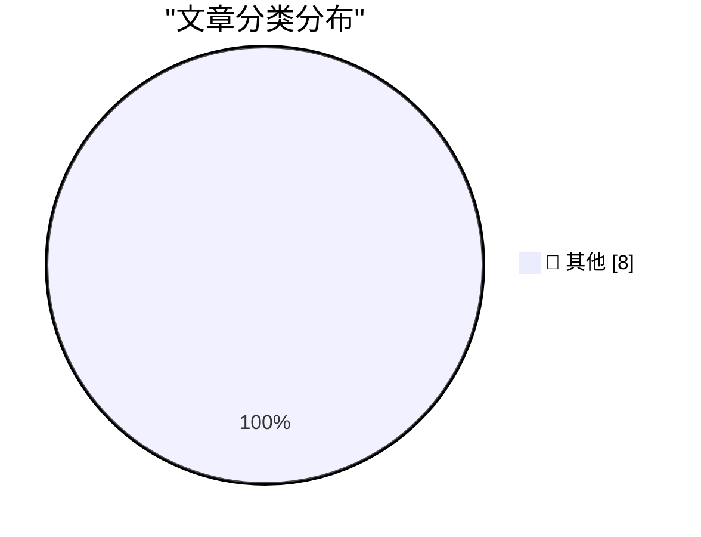

# 📰 AI 博客每日精选

**日期**: 2026-10-05 &nbsp;|&nbsp; **精选**: 8 篇 &nbsp;|&nbsp; **时间范围**: 24 小时

> 📚 来自 Karpathy 推荐的 **92** 个顶级技术博客，经 AI 智能评分筛选

## 📑 目录

- [📝 今日看点](#-今日看点)
- [🏆 今日必读](#-今日必读)
- [📊 数据概览](#-数据概览)
- [📝 其他](#-其他) (8篇)

---

## 🏆 今日必读

### 🥇 [Why My Asus Laptop Kept Rebooting After Sleep and How to Fix it](https://idiallo.com/blog/asus-laptop-keeps-rebooting-after-sleep)

📁 📝 其他
⏰ 21 小时前
⭐ 评分 15/30

Why My Asus Laptop Kept Rebooting After Sleep and How to Fix it

---

### 🥈 [My Pitch for the New Season of Doctor Who](https://shkspr.mobi/blog/2026/10/my-pitch-for-the-new-season-of-doctor-who/)

📁 📝 其他
⏰ 12 小时前
⭐ 评分 15/30

My Pitch for the New Season of Doctor Who

---

### 🥉 [Miquel’s pentagon theorem](https://www.johndcook.com/blog/2026/10/04/miquels-pentagon-theorem/)

📁 📝 其他
⏰ 11 小时前
⭐ 评分 15/30

Miquel’s pentagon theorem

---

## 📊 数据概览

85/92

扫描源

2398

抓取文章

8

时间范围内

8

AI 精选

### 🥧 分类分布

---

## 📝 其他 8篇

### 1. [Why My Asus Laptop Kept Rebooting After Sleep and How to Fix it](https://idiallo.com/blog/asus-laptop-keeps-rebooting-after-sleep)

⭐ 综合评分
15/30

📁 idiallo.com
⏰ 21 小时前
🔖 R:5 Q:5 T:5

Why My Asus Laptop Kept Rebooting After Sleep and How to Fix it

---

### 2. [My Pitch for the New Season of Doctor Who](https://shkspr.mobi/blog/2026/10/my-pitch-for-the-new-season-of-doctor-who/)

⭐ 综合评分
15/30

📁 shkspr.mobi
⏰ 12 小时前
🔖 R:5 Q:5 T:5

My Pitch for the New Season of Doctor Who

---

### 3. [Miquel’s pentagon theorem](https://www.johndcook.com/blog/2026/10/04/miquels-pentagon-theorem/)

⭐ 综合评分
15/30

📁 johndcook.com
⏰ 11 小时前
🔖 R:5 Q:5 T:5

Miquel’s pentagon theorem

---

### 4. [Topological models of modal logic](https://www.johndcook.com/blog/2026/10/04/topological-models-of-modal-logic/)

⭐ 综合评分
15/30

📁 johndcook.com
⏰ 11 小时前
🔖 R:5 Q:5 T:5

Topological models of modal logic

---

### 5. [Modal logic and topology](https://www.johndcook.com/blog/2026/10/04/modal-topology/)

⭐ 综合评分
15/30

📁 johndcook.com
⏰ 11 小时前
🔖 R:5 Q:5 T:5

Modal logic and topology

---

### 6. [Weekend content through the end of 2026](https://dfarq.homeip.net/weekend-content-through-the-end-of-2026/?utm_source=rss&#038;utm_medium=rss&#038;utm_campaign=weekend-content-through-the-end-of-2026)

⭐ 综合评分
15/30

📁 dfarq.homeip.net
⏰ 11 小时前
🔖 R:5 Q:5 T:5

Weekend content through the end of 2026

---

### 7. [Zenith Data Systems, Part I](https://www.abortretry.fail/p/zenith-data-systems-part-i)

⭐ 综合评分
15/30

📁 abortretry.fail
⏰ 1 小时前
🔖 R:5 Q:5 T:5

Zenith Data Systems, Part I

---

### 8. [Weekly Update 524: Live From Copenhagen](https://www.troyhunt.com/weekly-update-524/)

⭐ 综合评分
15/30

📁 troyhunt.com
⏰ 12 小时前
🔖 R:5 Q:5 T:5

Weekly Update 524: Live From Copenhagen

---

生成于 2026-10-05 00:04 | 扫描 <strong>85</strong> 源 → 获取 <strong>2398</strong> 篇 → 精选 <strong>8</strong> 篇
 
基于 <a href="https://refactoringenglish.com/tools/hn-popularity/" style="color: #667eea;">Hacker News Popularity Contest 2025</a> RSS 源列表，由 <a href="https://x.com/karpathy" style="color: #667eea;">Andrej Karpathy</a> 推荐
 
由「懂点儿 AI」制作，欢迎关注同名微信公众号获取更多 AI 实用技巧 💡

