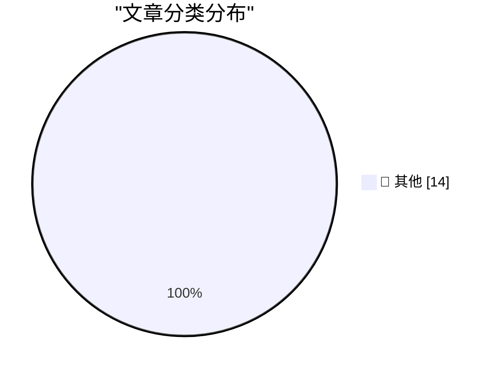

# 📰 AI 博客每日精选

**日期**: 2026-10-10 &nbsp;|&nbsp; **精选**: 14 篇 &nbsp;|&nbsp; **时间范围**: 24 小时

> 📚 来自 Karpathy 推荐的 **92** 个顶级技术博客，经 AI 智能评分筛选

## 📑 目录

- [📝 今日看点](#-今日看点)
- [🏆 今日必读](#-今日必读)
- [📊 数据概览](#-数据概览)
- [📝 其他](#-其他) (14篇)

---

## 🏆 今日必读

### 🥇 [Deno is joining Cloudflare](https://simonwillison.net/2026/Oct/9/deno-is-joining-cloudflare/)

📁 📝 其他
⏰ 1 小时前
⭐ 评分 15/30

Deno is joining Cloudflare

---

### 🥈 [Quoting Matthew Green](https://simonwillison.net/2026/Oct/9/matthew-green/)

📁 📝 其他
⏰ 8 小时前
⭐ 评分 15/30

Quoting Matthew Green

---

### 🥉 [A new feature for my blog, built using my voice](https://simonwillison.net/2026/Oct/9/built-using-my-voice/)

📁 📝 其他
⏰ 11 小时前
⭐ 评分 15/30

A new feature for my blog, built using my voice

---

## 📊 数据概览

85/92

扫描源

2391

抓取文章

14

时间范围内

14

AI 精选

### 🥧 分类分布

---

## 📝 其他 14篇

### 1. [Deno is joining Cloudflare](https://simonwillison.net/2026/Oct/9/deno-is-joining-cloudflare/)

⭐ 综合评分
15/30

📁 simonwillison.net
⏰ 1 小时前
🔖 R:5 Q:5 T:5

Deno is joining Cloudflare

---

### 2. [Quoting Matthew Green](https://simonwillison.net/2026/Oct/9/matthew-green/)

⭐ 综合评分
15/30

📁 simonwillison.net
⏰ 8 小时前
🔖 R:5 Q:5 T:5

Quoting Matthew Green

---

### 3. [A new feature for my blog, built using my voice](https://simonwillison.net/2026/Oct/9/built-using-my-voice/)

⭐ 综合评分
15/30

📁 simonwillison.net
⏰ 11 小时前
🔖 R:5 Q:5 T:5

A new feature for my blog, built using my voice

---

### 4. [ttok 1.0](https://simonwillison.net/2026/Oct/9/ttok/)

⭐ 综合评分
15/30

📁 simonwillison.net
⏰ 23 小时前
🔖 R:5 Q:5 T:5

ttok 1.0

---

### 5. [Radxa's Q8B has 2x the performance and expansion of the Pi 5](https://www.jeffgeerling.com/blog/2026/radxa-q8b-double-pi-5/)

⭐ 综合评分
15/30

📁 jeffgeerling.com
⏰ 4 小时前
🔖 R:5 Q:5 T:5

Radxa's Q8B has 2x the performance and expansion of the Pi 5

---

### 6. [Software's centaur age may last decades](https://seangoedecke.com/softwares-centaur-age-may-last-decades/)

⭐ 综合评分
15/30

📁 seangoedecke.com
⏰ 2 分钟前
🔖 R:5 Q:5 T:5

Software's centaur age may last decades

---

### 7. [20 Minutes of Political Debate, Brought to You by Commercial Breaks](https://idiallo.com/byte-size/20-minutes-of-political-debate)

⭐ 综合评分
15/30

📁 idiallo.com
⏰ 19 小时前
🔖 R:5 Q:5 T:5

20 Minutes of Political Debate, Brought to You by Commercial Breaks

---

### 8. [Pluralistic: Thwarted (09 Oct 2026)](https://pluralistic.net/2026/10/09/impunitism/)

⭐ 综合评分
15/30

📁 pluralistic.net
⏰ 4 小时前
🔖 R:5 Q:5 T:5

Pluralistic: Thwarted (09 Oct 2026)

---

### 9. [Concert Review: London Voices - Video Games Go Choral ★★★★☆](https://shkspr.mobi/blog/2026/10/concert-review-london-voices-video-games-go-choral/)

⭐ 综合评分
15/30

📁 shkspr.mobi
⏰ 12 小时前
🔖 R:5 Q:5 T:5

Concert Review: London Voices - Video Games Go Choral ★★★★☆

---

### 10. [Fun with low-rank vocab matrices (and a bonus test loss reduction?)](https://www.gilesthomas.com/2026/10/low-rank-vocab-matrices)

⭐ 综合评分
15/30

📁 gilesthomas.com
⏰ 8 小时前
🔖 R:5 Q:5 T:5

Fun with low-rank vocab matrices (and a bonus test loss reduction?)

---

### 11. [Name Shame](https://feed.tedium.co/link/15204/17493045/nominative-antideterminism-history)

⭐ 综合评分
15/30

📁 tedium.co
⏰ 5 小时前
🔖 R:5 Q:5 T:5

Name Shame

---

### 12. [Premium: The Hater's Guide To Junk](https://www.wheresyoured.at/premium-the-haters-guide-to-junk/)

⭐ 综合评分
15/30

📁 wheresyoured.at
⏰ 8 小时前
🔖 R:5 Q:5 T:5

Premium: The Hater's Guide To Junk

---

### 13. [An Ion Storm!, Part 1: The Ascent to Gamer Paradise](https://www.filfre.net/2026/10/an-ion-storm-part-1-the-gamers-penthouse/)

⭐ 综合评分
15/30

📁 filfre.net
⏰ 7 小时前
🔖 R:5 Q:5 T:5

An Ion Storm!, Part 1: The Ascent to Gamer Paradise

---

### 14. [Commodore’s knockoff Atari joystick from 1982](https://dfarq.homeip.net/commodores-knockoff-atari-joystick-from-1982/?utm_source=rss&#038;utm_medium=rss&#038;utm_campaign=commodores-knockoff-atari-joystick-from-1982)

⭐ 综合评分
15/30

📁 dfarq.homeip.net
⏰ 13 小时前
🔖 R:5 Q:5 T:5

Commodore’s knockoff Atari joystick from 1982

---

生成于 2026-10-10 00:02 | 扫描 <strong>85</strong> 源 → 获取 <strong>2391</strong> 篇 → 精选 <strong>14</strong> 篇
 
基于 <a href="https://refactoringenglish.com/tools/hn-popularity/" style="color: #667eea;">Hacker News Popularity Contest 2025</a> RSS 源列表，由 <a href="https://x.com/karpathy" style="color: #667eea;">Andrej Karpathy</a> 推荐
 
由「懂点儿 AI」制作，欢迎关注同名微信公众号获取更多 AI 实用技巧 💡

